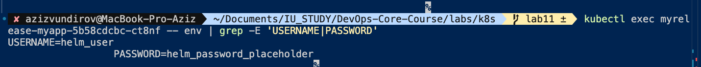
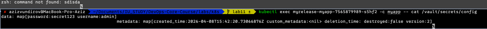

# Lab 11 — Kubernetes Secrets & HashiCorp Vault

## 1. Kubernetes Secrets

### 1.1 Creating a Secret with kubectl

Example command (not executed as part of this documentation):

```bash
kubectl create secret generic app-credentials \
  --from-literal=username=demo_user \
  --from-literal=password=demo_password
```

### 1.2 Viewing the Secret in YAML

Example command:

```bash
kubectl get secret app-credentials -o yaml
```

Example expected output fragment:

```yaml
apiVersion: v1
kind: Secret
metadata:
  name: app-credentials
type: Opaque
data:
  username: ZGVtb191c2Vy
  password: ZGVtb19wYXNzd29yZA==
```

### 1.3 Decoding Values

Example commands:

```bash
echo "ZGVtb191c2Vy" | base64 -d
echo "ZGVtb19wYXNzd29yZA==" | base64 -d
```

Expected result:
- `demo_user`
- `demo_password`

### 1.4 Base64 vs Encryption

- Base64 is encoding, not encryption.
- Any user with Kubernetes API access and permission to read a Secret can decode it.
- Real protection requires access control (RBAC) and storage-level encryption.

### 1.5 etcd Encryption

- By default, Kubernetes Secrets are not encrypted in etcd (they are stored as base64 strings).
- For production, enable Encryption at Rest in kube-apiserver using `EncryptionConfiguration`.
- When to enable it: always, if your cluster stores sensitive data (passwords, tokens, keys).

---

## 2. Helm-Managed Secrets

### 2.1 Chart Structure

This project uses a Helm chart in the `myapp` directory.

Key files:
- `myapp/templates/secrets.yaml`
- `myapp/templates/deployment.yaml`
- `myapp/values.yaml`

### 2.2 Secret Template

The secret is defined with `stringData` (Helm/Kubernetes automatically convert values to base64):

```yaml
apiVersion: v1
kind: Secret
metadata:
  name: {{ include "myapp.fullname" . }}-secret
type: Opaque
stringData:
  USERNAME: {{ .Values.appSecrets.username | quote }}
  PASSWORD: {{ .Values.appSecrets.password | quote }}
```

Secrets are defined in `values.yaml`:

```yaml
appSecrets:
  username: "helm_user"
  password: "helm_password_placeholder"
```

Important: only placeholder values should be stored in Git.

### 2.3 Injecting the Secret into the Container

The deployment uses `envFrom` + `secretRef`:

```yaml
envFrom:
  - secretRef:
      name: {{ include "myapp.fullname" . }}-secret
```

This loads all secret keys as container environment variables.

### 2.4 Injection Verification (Example)

Example command to verify environment variables in a pod:

```bash
kubectl exec -it <pod-name> -- env | grep -E 'USERNAME|PASSWORD'
```

Expected:
- variables are present;
- real values are not shown in reports/screenshots;
- `kubectl describe pod` should not expose plaintext secret values.

---

## 3. Resource Management

Requests/limits are already configured in the chart:

```yaml
resources:
  requests:
    memory: "128Mi"
    cpu: "100m"
  limits:
    memory: "256Mi"
    cpu: "200m"
```

### 3.1 Difference Between requests and limits

- `requests` is the guaranteed minimum used by the scheduler.
- `limits` is the maximum amount the container can use.

### 3.2 How to Choose Values

Sizing approach:
- start with moderate values;
- collect real usage metrics (CPU/RAM);
- increase `requests` if there is recurring resource pressure;
- cap `limits` so one container does not starve neighboring workloads.

---

## 4. HashiCorp Vault Integration

### 4.1 Installing Vault (dev mode)

Example commands (for a learning environment):

```bash
helm repo add hashicorp https://helm.releases.hashicorp.com
helm repo update
helm install vault hashicorp/vault \
  --set "server.dev.enabled=true" \
  --set "injector.enabled=true"
```

Status check:

```bash
kubectl get pods
```

Vault server and Vault injector pods are expected to be Running.

### 4.2 KV, Policy, and Role Configuration (sanitized)

Examples:

```bash
vault secrets enable -path=secret kv-v2
vault kv put secret/myapp/config username="admin" password="secret123"
vault auth enable kubernetes
```

Policy example (sanitized):

```hcl
path "secret/data/myapp/config" {
  capabilities = ["read"]
}
```

Role example:

```bash
vault write auth/kubernetes/role/myapp-role \
  bound_service_account_names=myapp \
  bound_service_account_namespaces=default \
  policies=myapp-policy \
  ttl=1h
```

### 4.3 Injection via Vault Agent Sidecar

The following annotations are already present in the deployment:

```yaml
vault.hashicorp.com/agent-inject: "true"
vault.hashicorp.com/role: "myapp-role"
vault.hashicorp.com/agent-inject-secret-config: "secret/data/myapp/config"
```

What this provides:
- the injector mutating webhook adds the sidecar/agent;
- the agent authenticates to Vault using Kubernetes auth;
- the secret is rendered as a file inside the pod (usually under `/vault/secrets`).

Verification (example):

```bash
kubectl exec -it <pod-name> -- ls -la /vault/secrets
kubectl exec -it <pod-name> -- cat /vault/secrets/config
```

---

## 5. Security Analysis

### 5.1 Kubernetes Secrets vs Vault

Kubernetes Secrets:
- simple and native;
- well-integrated with the Kubernetes API;
- still requires hardening (RBAC + etcd encryption).

Vault:
- centralized secret storage;
- flexible access policies and audit capabilities;
- support for dynamic secrets and rotation;
- better suited for production and multi-service environments.

### 5.2 When to Use Each Approach

- Kubernetes Secrets only: learning labs, simple services, low-risk environments.
- Vault + Kubernetes: production, multiple teams/services, higher security and audit requirements.

### 5.3 Production Recommendations

- Enable etcd encryption at rest.
- Restrict Secret access with RBAC based on least privilege.
- Never store real secrets in Git.
- Use Vault, short-lived tokens, and rotation.
- Enable Vault audit logging and centralized access monitoring.

---
