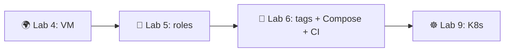

# Lab 5 — Ansible Fundamentals


> Configure the VM you provisioned in Lab 4 by building reusable Ansible roles. Install Docker, deploy your Lab 2 container image, and prove the whole thing is idempotent.

## Overview

Lab 4 *created* a box (Terraform/Pulumi gave it an IP and opened ports). It's empty — no Docker, no app. **Ansible configures what's inside.** In this lab you write three roles (`common`, `docker`, `app_deploy`), wire them into playbooks, deploy your containerized Python app from Lab 2, and demonstrate that a second run changes nothing.

**What You'll Learn:**
- Agentless, push-based configuration management
- Role-based project structure (`tasks/`, `handlers/`, `defaults/`, `templates/`)
- Idempotent tasks with FQCN modules (`ansible.builtin.*`, `community.docker.*`)
- Handlers that restart a service *only* when its config actually changed
- Ansible Vault for credentials committed safely to Git
- Static vs dynamic inventory

**Tech Stack:** `ansible-core` **2.21** (community package `ansible` 13.6.0) | Python **3.11+** control node | `ansible-galaxy` collections | Docker | YAML + Jinja2

> **A note on "LTS":** `ansible-core` has **no formal LTS label**. The open-source engine commits to ~6 months of security fixes per minor release; the currently-supported versions are **2.18, 2.19, 2.20, 2.21**. Use **2.21**. (Red Hat's *Ansible Automation Platform* offers extended support, but that is a separate commercial product.)

**Connection to Other Labs:**
- **Lab 4** — provides the target VM (cloud or local).
- **Lab 2** — provides the Docker image this lab deploys.
- **Lab 6** — extends these roles with tags, blocks, Compose, and CI.

---

## Prerequisites

A reachable target VM from Lab 4:
- Ubuntu 24.04 LTS (or 22.04 LTS)
- SSH access with your key; passwordless `sudo` recommended for automation
- Python 3 present (default on Ubuntu)

Control node (your laptop or a CI runner): Python **3.11+** and `ansible-core` **2.21**.

---

## Tasks

> All examples below are **skeletons with `YOUR-TASK` markers** — you write the actual tasks. Sample terminal output is **illustrative**; your hostnames, IPs, and counts will differ.

### Task 1 — Ansible Setup, Inventory & Role Structure (2 pts)

**Objective:** Install `ansible-core` 2.21, scaffold a role-based project, and confirm connectivity to your VM.

#### 1.1 Install ansible-core 2.21

A pinned `pip` install in a virtualenv gives you an exact version on any OS (preferred over distro packages, which lag):

```bash
python3 -m venv .venv && source .venv/bin/activate
pip install "ansible-core==2.21.*"
ansible --version          # expect: ansible [core 2.21.x] / python 3.11+
```

Install the collections you'll need from Ansible Galaxy:

```bash
ansible-galaxy collection install community.docker community.general
```

#### 1.2 Scaffold the Project Structure

```
ansible/
├── ansible.cfg
├── inventory/
│   └── hosts.ini                 # static inventory
├── group_vars/
│   └── all/
│       └── vault.yml             # encrypted credentials (Task 3)
├── roles/
│   ├── common/
│   │   ├── tasks/main.yml
│   │   └── defaults/main.yml
│   ├── docker/
│   │   ├── tasks/main.yml
│   │   ├── handlers/main.yml
│   │   ├── defaults/main.yml
│   │   └── templates/daemon.json.j2
│   └── app_deploy/
│       ├── tasks/main.yml
│       ├── handlers/main.yml
│       └── defaults/main.yml
├── playbooks/
│   ├── provision.yml             # common + docker
│   └── deploy.yml                # app_deploy
└── docs/
    └── LAB05.md
```

> **Only create the directories you actually use.** A role with no handlers needs no `handlers/`.

#### 1.3 Configure the Inventory

`inventory/hosts.ini` — point it at your Lab 4 VM:

```ini
[webservers]
lab-vm ansible_host=<VM-IP> ansible_user=ubuntu

[webservers:vars]
ansible_ssh_private_key_file=~/.ssh/lab4_id_ed25519
ansible_python_interpreter=/usr/bin/python3
```

#### 1.4 Configure `ansible.cfg`

```ini
[defaults]
inventory = inventory/hosts.ini
roles_path = roles
host_key_checking = False
retry_files_enabled = False

[privilege_escalation]
become = True
become_method = sudo
become_user = root
```

#### 1.5 Test Connectivity

```bash
cd ansible/
ansible all -m ansible.builtin.ping
ansible webservers -a "uname -a"
```

Both should return SUCCESS / a `pong`. (Output is illustrative.)

```text
lab-vm | SUCCESS => { "changed": false, "ping": "pong" }
```

<details>
<summary>💡 Inventory & FQCN reference</summary>

- `ansible_host`, `ansible_user`, `ansible_port`, `ansible_ssh_private_key_file`, `ansible_python_interpreter` are the common connection vars.
- Since the 2021 `ansible-core`/`ansible` split, modules are referenced by **Fully-Qualified Collection Name**: `ansible.builtin.ping`, not bare `ping`. Use FQCN everywhere — it is the canonical, future-proof form.
- Docs: [Inventory](https://docs.ansible.com/ansible-core/2.21/inventory_guide/intro_inventory.html) · [FQCN](https://docs.ansible.com/ansible-core/2.21/reference_appendices/glossary.html#term-FQCN)

</details>

---

### Task 2 — System Provisioning Roles (3 pts)

**Objective:** Write the `common` and `docker` roles, then a thin playbook that applies them.

#### 2.1 `common` role

`roles/common/defaults/main.yml` — list the packages to install:

```yaml
---
common_packages:
  - curl
  - git
  - vim
  - htop
common_timezone: Etc/UTC
```

`roles/common/tasks/main.yml`:

```yaml
---
# YOUR-TASK: update the apt cache (use cache_valid_time to avoid hammering mirrors)
# YOUR-TASK: install {{ common_packages }} with ansible.builtin.apt (state: present)
# YOUR-TASK: set the system timezone to {{ common_timezone }}
#            (community.general.timezone)
```

#### 2.2 `docker` role

`roles/docker/defaults/main.yml`:

```yaml
---
docker_user: ubuntu
docker_log_max_size: "10m"
```

`roles/docker/templates/daemon.json.j2` — rendered to `/etc/docker/daemon.json`:

```json
{
  "log-driver": "json-file",
  "log-opts": { "max-size": "{{ docker_log_max_size }}" }
}
```

`roles/docker/handlers/main.yml`:

```yaml
---
- name: restart docker
  ansible.builtin.service:
    name: docker
    state: restarted
```

`roles/docker/tasks/main.yml`:

```yaml
---
# YOUR-TASK: install prerequisites (ca-certificates, curl, gnupg)
# YOUR-TASK: add Docker's official APT key
#            (ansible.builtin.get_url into /etc/apt/keyrings, or ansible.builtin.deb822_repository)
# YOUR-TASK: add the Docker APT repository for "{{ ansible_distribution_release }}"
# YOUR-TASK: install docker-ce, docker-ce-cli, containerd.io
# YOUR-TASK: render templates/daemon.json.j2 to /etc/docker/daemon.json
#            -> notify: restart docker     (fires ONLY if the file changed)
# YOUR-TASK: ensure the docker service is started and enabled
# YOUR-TASK: add {{ docker_user }} to the docker group (append: true)
# YOUR-TASK: install the Docker SDK for Python so the community.docker modules work
#            (ansible.builtin.pip name: docker)
```

> **`{{ ansible_distribution_release }}`** resolves to `noble` on Ubuntu 24.04, `jammy` on 22.04 — one role, both distros. It comes from fact gathering, so keep `gather_facts: true`.

#### 2.3 Provisioning playbook

`playbooks/provision.yml` — thin by design, all logic lives in roles:

```yaml
---
- name: Provision web servers
  hosts: webservers
  become: true
  gather_facts: true
  roles:
    - common
    - docker
```

Run it:

```bash
ansible-playbook playbooks/provision.yml
```

First run should be mostly **changed** (yellow). (Output illustrative.)

```text
PLAY RECAP **********************************************************
lab-vm : ok=11  changed=8  unreachable=0  failed=0
```

<details>
<summary>💡 Modules & docs</summary>

| Job | Module |
|---|---|
| Packages | `ansible.builtin.apt` |
| APT key / repo | `ansible.builtin.get_url`, `ansible.builtin.deb822_repository` |
| Services | `ansible.builtin.service` |
| Users/groups | `ansible.builtin.user` |
| Render template | `ansible.builtin.template` |
| Timezone | `community.general.timezone` |

- Use `state: present`, **not** `state: latest`, for reproducible runs.
- Official Docker-on-Ubuntu steps: <https://docs.docker.com/engine/install/ubuntu/>
- [apt](https://docs.ansible.com/ansible-core/2.21/collections/ansible/builtin/apt_module.html) · [Handlers](https://docs.ansible.com/ansible-core/2.21/playbook_guide/playbooks_handlers.html)

</details>

---

### Task 3 — Application Deployment Role (3 pts)

**Objective:** Pull your Lab 2 image from Docker Hub using Vault-encrypted credentials and run it as a container on port 5000.

#### 3.1 Encrypt credentials with Ansible Vault

```bash
ansible-vault create group_vars/all/vault.yml
```

Put your Docker Hub credentials and app config inside (the file is AES-256 encrypted at rest, safe to commit):

```yaml
---
dockerhub_username: your-username
dockerhub_password: dckr_pat_xxxxxxxxxxxxxxxxxxxx   # access token, not your login password
docker_image: "{{ dockerhub_username }}/devops-info-service"
docker_image_tag: latest
app_port: 5000
app_container_name: devops-info-service
```

```bash
ansible-vault view group_vars/all/vault.yml   # confirm it decrypts
```

#### 3.2 `app_deploy` role

`roles/app_deploy/defaults/main.yml`:

```yaml
---
app_restart_policy: unless-stopped
app_health_path: /health
```

`roles/app_deploy/handlers/main.yml`:

```yaml
---
- name: restart app
  community.docker.docker_container:
    name: "{{ app_container_name }}"
    state: started
    restart: true
```

`roles/app_deploy/tasks/main.yml`:

```yaml
---
# YOUR-TASK: log in to Docker Hub with {{ dockerhub_username }}/{{ dockerhub_password }}
#            (community.docker.docker_login) -> set no_log: true
# YOUR-TASK: pull {{ docker_image }}:{{ docker_image_tag }}
#            (community.docker.docker_image, source: pull)
# YOUR-TASK: run the container (community.docker.docker_container):
#              name: "{{ app_container_name }}"
#              ports: "{{ app_port }}:5000"
#              restart_policy: "{{ app_restart_policy }}"
#              state: started
# YOUR-TASK: wait for the port to accept connections
#            (ansible.builtin.wait_for, port: "{{ app_port }}")
# YOUR-TASK: verify the health endpoint returns HTTP 200
#            (ansible.builtin.uri, url ending in {{ app_health_path }}, status_code: 200)
```

> **`no_log: true`** on the login task keeps your token out of CI logs. The handler restarts the container only when something `notify:`s it.

#### 3.3 Deployment playbook

`playbooks/deploy.yml`:

```yaml
---
- name: Deploy application
  hosts: webservers
  become: true
  gather_facts: true
  roles:
    - app_deploy
```

#### 3.4 Run and verify

```bash
ansible-playbook playbooks/deploy.yml --ask-vault-pass
curl http://<VM-IP>:5000/health        # expect HTTP 200 + JSON
```

<details>
<summary>💡 Docker modules & Vault usage</summary>

- [docker_login](https://docs.ansible.com/ansible/latest/collections/community/docker/docker_login_module.html) · [docker_image](https://docs.ansible.com/ansible/latest/collections/community/docker/docker_image_module.html) · [docker_container](https://docs.ansible.com/ansible/latest/collections/community/docker/docker_container_module.html)
- [wait_for](https://docs.ansible.com/ansible-core/2.21/collections/ansible/builtin/wait_for_module.html) · [uri](https://docs.ansible.com/ansible-core/2.21/collections/ansible/builtin/uri_module.html)

**Supplying the vault password (pick one):**
```bash
ansible-playbook playbooks/deploy.yml --ask-vault-pass                 # prompt
ansible-playbook playbooks/deploy.yml --vault-password-file .vault_pass  # gitignored file
```
Never commit `.vault_pass`. Encrypted `vault.yml` is fine to commit.

</details>

---

### Task 4 — Idempotency Proof (1 pt)

**Objective:** Show that a second run is a no-op — the core promise of configuration management.

Run the provisioning playbook **twice in a row** and capture both PLAY RECAPs:

```bash
ansible-playbook playbooks/provision.yml          # run 1
ansible-playbook playbooks/provision.yml          # run 2
ansible-playbook playbooks/provision.yml --check --diff   # dry-run, confirms no drift
```

The **second run must report `changed=0`**. (Illustrative.)

```text
# run 1
lab-vm : ok=11  changed=8  unreachable=0  failed=0
# run 2
lab-vm : ok=11  changed=0  unreachable=0  failed=0
```

If anything still changes on run 2, fix it — the usual culprit is a stray `ansible.builtin.shell`/`command` (no state model) or a template that renders a timestamp. Wrap unavoidable commands with `creates:`/`removes:`.

**Document:** both PLAY RECAPs, which tasks changed on run 1, and *why* run 2 changed nothing.

---

### Task 5 — Documentation (1 pt)

Create `ansible/docs/LAB05.md`:

1. **Architecture** — ansible-core version, target OS, why roles over a monolithic playbook.
2. **Roles** — for each of `common`, `docker`, `app_deploy`: purpose, key variables, handlers.
3. **Idempotency proof** — both PLAY RECAPs (Task 4) with a one-paragraph analysis.
4. **Vault** — how credentials are stored, password-handling strategy, proof the file is encrypted.
5. **Deployment verification** — `docker ps` and the `/health` `curl` output.
6. **Key decisions** (2-3 sentences each): Why roles? What makes a task idempotent? How do handlers avoid needless restarts? Why Vault over plaintext?

---

## Bonus Task — Dynamic Inventory (2 pts)

**Objective:** Discover your Lab 4 VM(s) automatically via a cloud inventory plugin instead of hardcoding the IP. A static list rots the moment a VM is recreated and gets a new address.

**Requirements:**

1. Install the collection for your Lab 4 cloud:
   ```bash
   ansible-galaxy collection install amazon.aws      # or google.cloud / azure.azcollection / yandex.cloud
   ```
2. Create `inventory/<cloud>.yml` that:
   - declares `plugin: <fqcn>` (e.g. `amazon.aws.aws_ec2`)
   - filters to **running** instances tagged for this course
   - sets `ansible_host` to the public IP via `compose:`
   - builds groups via `keyed_groups:` (e.g. `webservers` from a tag)
3. Point `ansible.cfg` (or `-i`) at the new inventory.
4. Verify and run a playbook against it:
   ```bash
   ansible-inventory -i inventory/<cloud>.yml --graph
   ansible all -i inventory/<cloud>.yml -m ansible.builtin.ping
   ```

Reference skeleton (AWS — adapt field names for your cloud):

```yaml
# inventory/aws.yml
plugin: amazon.aws.aws_ec2
regions:
  - eu-central-1
filters:
  tag:Project: devops-core
  instance-state-name: running
keyed_groups:
  - key: tags.Role
    prefix: role
compose:
  ansible_host: public_ip_address
```

<details>
<summary>💡 Per-cloud field hints</summary>

| Cloud | Collection | Plugin | Public-IP field |
|---|---|---|---|
| AWS | `amazon.aws` | `aws_ec2` | `public_ip_address` |
| GCP | `google.cloud` | `gcp_compute` | `networkInterfaces[0].accessConfigs[0].natIP` |
| Azure | `azure.azcollection` | `azure_rm` | `public_ipv4_addresses[0]` |
| Yandex | `yandex.cloud` | `yandex_compute` | nested under `network_interfaces[0]` |

Docs: [Inventory plugins](https://docs.ansible.com/ansible-core/2.21/plugins/inventory.html) · [aws_ec2](https://docs.ansible.com/ansible/latest/collections/amazon/aws/aws_ec2_inventory.html)

</details>

**Document:** which plugin and why, how you authenticated, the `--graph` output showing auto-discovered hosts, and what happens when a VM's IP changes (nothing — no manual edits).

---

## How to Submit

1. **Create a branch:**
   ```bash
   git checkout -b lab05
   ```
2. **Add `.gitignore` entries** (keep secrets out of Git):
   ```gitignore
   # Ansible
   *.retry
   .vault_pass
   __pycache__/
   ```
3. **Commit** the `ansible/` project and docs:
   ```bash
   git add ansible/
   git commit -m "feat: complete lab05 - ansible fundamentals"
   git push -u origin lab05
   ```
4. **Verify no secrets:** `.vault_pass` absent, SSH private keys absent, only the *encrypted* `vault.yml` committed.
5. **Open Pull Requests:**
   - **PR #1:** `your-fork:lab05` → `course-repo:master`
   - **PR #2:** `your-fork:lab05` → `your-fork:master`

---

## Acceptance Criteria

### Main Tasks (10 points)

**Setup, Inventory & Structure (2 pts):**
- [ ] `ansible-core` 2.21 installed; `ansible --version` confirms it
- [ ] Role-based directory structure created (three roles)
- [ ] `ansible.cfg` and static inventory configured
- [ ] `ansible -m ansible.builtin.ping` succeeds against the VM

**System Provisioning (3 pts):**
- [ ] `common` role installs packages and sets timezone
- [ ] `docker` role installs Docker, renders `daemon.json`, manages the service
- [ ] All tasks use FQCN modules
- [ ] Handler restarts Docker only on config change (`notify:`)
- [ ] `provision.yml` applies roles cleanly

**Application Deployment (3 pts):**
- [ ] Credentials stored in an encrypted Vault file (`ansible-vault view` confirms)
- [ ] `app_deploy` role pulls the Lab 2 image and runs it on port 5000
- [ ] `no_log: true` on the login task
- [ ] `/health` returns HTTP 200; verified

**Idempotency (1 pt):**
- [ ] Two consecutive runs documented; second reports `changed=0`

**Documentation (1 pt):**
- [ ] `ansible/docs/LAB05.md` covers all six sections

### Bonus Task (2 points)

- [ ] Cloud inventory plugin configured for the Lab 4 provider
- [ ] `ansible-inventory --graph` shows auto-discovered hosts
- [ ] A playbook runs successfully against the dynamic inventory
- [ ] Benefits over static inventory documented

---

## Rubric

| Criteria | Points | Description |
|----------|--------|-------------|
| **Setup, Inventory & Structure** | 2 pts | ansible-core 2.21, role architecture, working `ping` |
| **System Provisioning** | 3 pts | `common` + `docker` roles, FQCN, handler |
| **Application Deployment** | 3 pts | Vault, Lab 2 image running, `/health` verified |
| **Idempotency** | 1 pt | Second run `changed=0`, analysis |
| **Documentation** | 1 pt | All six sections complete |
| **Bonus: Dynamic Inventory** | 2 pts | Cloud plugin auto-discovers hosts |
| **Total** | 12 pts | 10 required + 2 bonus |

**Grading:**
- **10/10:** Clean roles, deep understanding, flawless idempotency demo
- **8-9/10:** Working roles, good practices, solid understanding
- **6-7/10:** Roles work, missing some best practices
- **<6/10:** Roles broken, no idempotency, poor structure

**Critical Requirements:**
- MUST use role-based structure (not a monolithic playbook)
- MUST use FQCN modules
- MUST demonstrate idempotency (two runs documented)
- MUST use Ansible Vault; MUST NOT commit the vault password or plaintext secrets

---

## Resources

<details>
<summary>📚 Ansible Core</summary>

- [ansible-core 2.21 docs](https://docs.ansible.com/ansible-core/2.21/)
- [Roles](https://docs.ansible.com/ansible-core/2.21/playbook_guide/playbooks_reuse_roles.html)
- [Handlers](https://docs.ansible.com/ansible-core/2.21/playbook_guide/playbooks_handlers.html)
- *Ansible for DevOps* — Jeff Geerling (2024 ed.)

</details>

<details>
<summary>🔒 Vault & Security</summary>

- [Ansible Vault](https://docs.ansible.com/ansible-core/2.21/vault_guide/index.html)
- [no_log](https://docs.ansible.com/ansible-core/2.21/reference_appendices/logging.html)

</details>

<details>
<summary>🐳 Docker & Dynamic Inventory</summary>

- [community.docker collection](https://docs.ansible.com/ansible/latest/collections/community/docker/index.html)
- [Install Docker on Ubuntu](https://docs.docker.com/engine/install/ubuntu/)
- [Inventory plugins](https://docs.ansible.com/ansible-core/2.21/plugins/inventory.html)

</details>

---

## Looking Ahead

**Lab 6 — Advanced Ansible & Continuous Deployment** picks up these exact roles and pushes them to production-grade:
- Tags (`--tags docker`) and blocks (`rescue:`/`always:`)
- Docker Compose rendered by Ansible
- Rolling deployment strategies
- Running Ansible from GitHub Actions on every push to `main`



---

**Good luck!** 🚀

> **Remember:** Tell the server *where to end up*, not *how* to get there. Idempotency (`changed=0` on the second run) is the acceptance test. Keep credentials in Vault, keep roles small, and document your decisions — not just your code.
