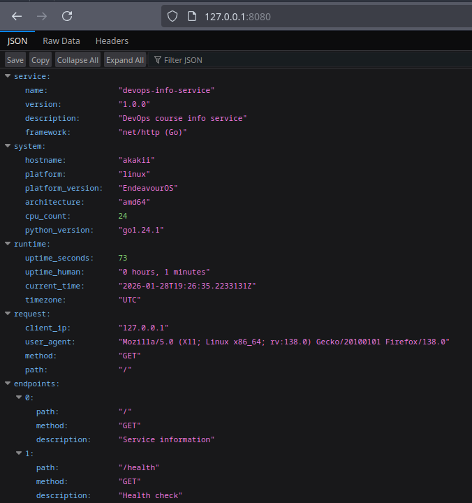
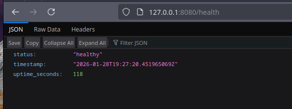
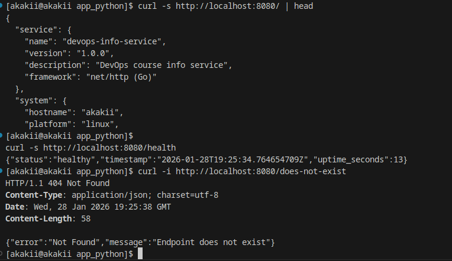
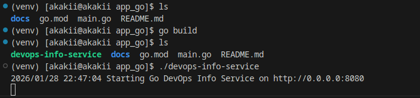

# Lab 1 Report — DevOps Info Service (Go Bonus)

## Student Information
- **Name:** Alexander Rozanov
- **Group:** CBS-02
- **Email:** al.rozanov@innopolis.university

## Host / Environment
- **Host (uname -a):**
  ```
  Linux akakii 6.13.8-arch1-1 #1 SMP PREEMPT_DYNAMIC Sun, 23 Mar 2025 17:17:30 +0000 x86_64 GNU/Linux
  ```

---

## 1. Project Structure

```
app_go/
├── main.go
├── go.mod
├── README.md
├── .gitignore
└── docs/
    ├── LAB01.md
    ├── GO.md
    └── screenshots/
        ├── go_build.png
        ├── main_page.png
        ├── healthcheck.png
        └── terminal_curl.png
```

---

## 2. Implementation Notes

### 2.1 Endpoints
The Go service implements the same endpoints as the Python version:
- `GET /`
- `GET /health`

### 2.2 Same JSON Structure as Python
Per course requirement, JSON structure matches the Python service:
- `service`
- `system`
- `runtime`
- `request`
- `endpoints`

**Important note:** the Python version includes key `python_version` inside `system`.  
To preserve the exact JSON schema, the Go version keeps the same key name and stores the Go runtime version there.

---

## 3. Configuration via Environment Variables
The Go service supports:
- `HOST` (default `0.0.0.0`)
- `PORT` (default `8080`)

Example:
```bash
HOST=127.0.0.1 PORT=8080 go run .
```

---

## 4. Testing Evidence

### 4.1 Curl tests (from provided logs)
Main endpoint:
```bash
curl -s http://localhost:8080/ | head
```

Health check:
```bash
curl -s http://localhost:8080/health
```

404 behavior:
```bash
curl -i http://localhost:8080/does-not-exist
```

Example 404 response (from logs):
```http
HTTP/1.1 404 Not Found
Content-Type: application/json; charset=utf-8

{"error":"Not Found","message":"Endpoint does not exist"}
```

### 4.2 Screenshots
Stored in `app_go/docs/screenshots/`:
- `main_page.png` — proof of `GET /`
- `healthcheck.png` — proof of `GET /health`
- `terminal_curl.png` — proof of curl tests (including 404)
- `go_build.png` - proof of go build

Embedded screenshots:







---

## Conclusion
The Go implementation satisfies the bonus requirements:
- Implements both endpoints
- Preserves the same JSON structure as the Python version
- Includes run/build instructions (README)
- Includes language justification (GO.md)
- Includes screenshots proving execution
