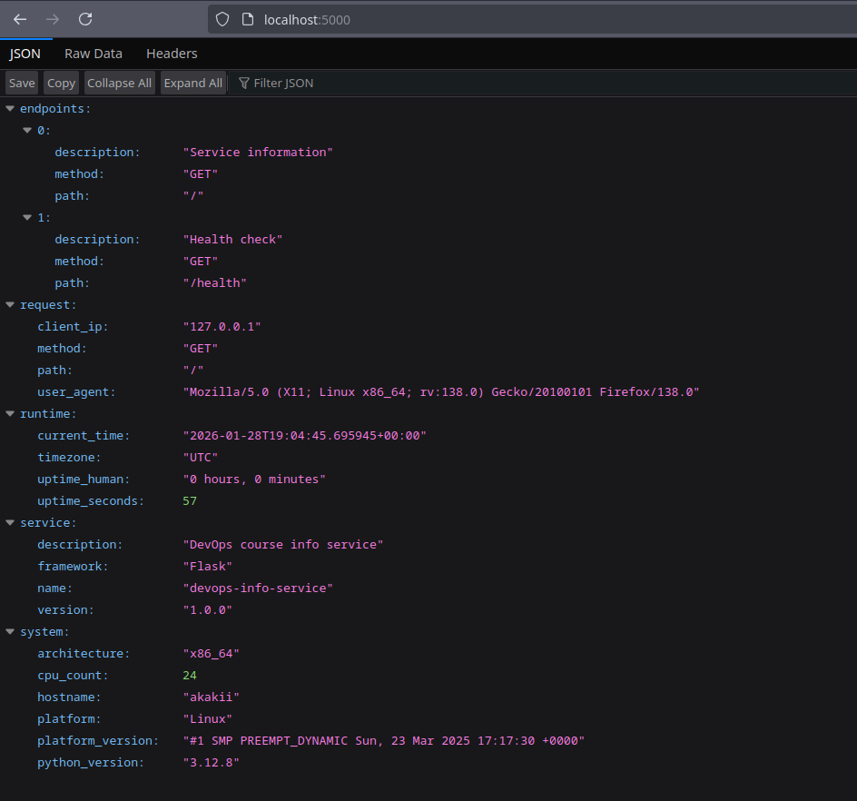
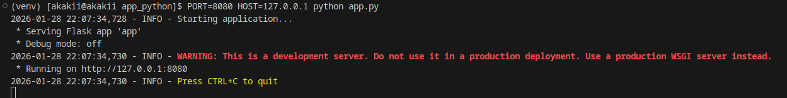
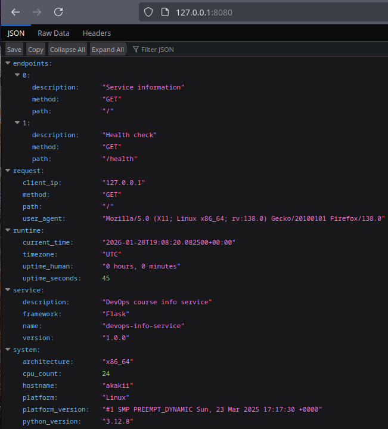

# Lab 1 Report — DevOps Info Service (Python)

## Student Information
- **Name:** Alexander Rozanov
- **Group:** CBS-02
- **Email:** al.rozanov@innopolis.university

## Host / Environment
- **Host (uname -a):**
  ```
  Linux akakii 6.13.8-arch1-1 #1 SMP PREEMPT_DYNAMIC Sun, 23 Mar 2025 17:17:30 +0000 x86_64 GNU/Linux
  ```
- **OS:** Arch Linux (based on kernel output)
- **Python:** 3.12.8
- **Framework:** Flask (pinned in `requirements.txt`)

---

## 1. Project Structure
Implemented according to the course structure requirement:

```
app_python/
├── app.py
├── requirements.txt
├── README.md
├── .gitignore
├── tests/
└── docs/
    ├── LAB01.md
    └── screenshots/
        ├── 01-main-endpoint.png
        ├── 02-health-check.png
        ├── 03-formatted-output.png
        └── web_custom_port.png
```

---

## 2. Framework Selection

### Chosen Framework: Flask
I selected **Flask** because it is:
- Lightweight and easy to start with for a small API
- Requires minimal boilerplate
- Fits the scope of Lab 1 (simple endpoints, JSON responses)
- Easy to extend in later labs (Docker, CI/CD, monitoring)

### Comparison (as required by the course)

| Framework | Pros | Cons | Fit for Lab 1 |
|---|---|---|---|
| **Flask** | Minimal, simple routing, easy JSON APIs | Fewer “out-of-the-box” features | **Excellent** |
| FastAPI | Async support, OpenAPI docs, type hints | Slightly more setup, ASGI server often needed | Good |
| Django | Full-stack, ORM, admin panel | Heavy for 2 endpoints, more boilerplate | Overkill |

---

## 3. Best Practices Applied

### 3.1 Pinned Dependencies
Dependencies are pinned in `requirements.txt`:
```txt
Flask==3.1.0
```
This ensures reproducible installs.

### 3.2 Configuration via Environment Variables
The application supports:
- `HOST`
- `PORT`
- `DEBUG`

Example run:
```bash
PORT=8080 HOST=127.0.0.1 python app.py
```

### 3.3 Logging
Logging is configured using Python’s `logging` module and produces runtime messages for requests:
- “Starting application…”
- “Handling main endpoint request”
- Access logs from Flask dev server

### 3.4 Error Handling (JSON)
Custom handlers return JSON for:
- 404 Not Found
- 500 Internal Server Error

This keeps API output consistent.

### 3.5 UTC Time
Timestamps are returned in UTC to avoid timezone ambiguity.

---

## 4. API Documentation

### 4.1 `GET /` — Main Endpoint
Returns JSON with:
- `service` (name, version, description, framework)
- `system` (hostname, platform, architecture, CPU count, python version)
- `runtime` (uptime, current time, timezone)
- `request` (client ip, user agent, method, path)
- `endpoints` list

Test command:
```bash
curl http://localhost:5000/
```

Example output (from testing logs):
```json
{
  "endpoints":[{"description":"Service information","method":"GET","path":"/"},{"description":"Health check","method":"GET","path":"/health"}],
  "request":{"client_ip":"127.0.0.1","method":"GET","path":"/","user_agent":"curl/8.12.1"},
  "runtime":{"current_time":"2026-01-28T19:04:08.260765+00:00","timezone":"UTC","uptime_human":"0 hours, 0 minutes","uptime_seconds":20},
  "service":{"description":"DevOps course info service","framework":"Flask","name":"devops-info-service","version":"1.0.0"},
  "system":{"architecture":"x86_64","cpu_count":24,"hostname":"akakii","platform":"Linux","platform_version":"#1 SMP PREEMPT_DYNAMIC Sun, 23 Mar 2025 17:17:30 +0000","python_version":"3.12.8"}
}
```

### 4.2 `GET /health` — Health Check
Test command:
```bash
curl http://localhost:5000/health
```

Example output:
```json
{"status":"healthy","timestamp":"2026-01-28T19:04:13.364005+00:00","uptime_seconds":25}
```

---

## 5. Testing Evidence

### 5.1 Screenshots
Stored in `app_python/docs/screenshots/`:
- `01-main-endpoint.png` — proof of `GET /`
- `02-health-check.png` — proof of `GET /health`
- `03-formatted-output.png` — proof of env vars usage (HOST/PORT)
- `web_custom_port.png` — proof the app works on custom port

(Embedded screenshots for convenience)






### 5.2 Environment Variables Evidence
Terminal log shows the app is started with a custom port:
```bash
PORT=8080 HOST=127.0.0.1 python app.py
```

---

## 6. Challenges Solved / Notes
- Ensured JSON output includes all required sections for the rubric.
- Kept timestamps in UTC.
- Ensured errors are returned as JSON.

**Note:** Flask dev server may request `/favicon.ico` when opened in a browser; it returns 404 and is expected.

---

## 7. GitHub Community Engagement (Course Requirement)
These steps are required by the course and must be completed manually:
- Star the course repository
- Star https://github.com/simple-container-com/api
- Follow professor/TAs: @Cre-eD, @marat-biriushev, @pierrepicaud
- Follow at least 3 classmates

---

## Conclusion
The Python/Flask implementation satisfies the core Lab 1 requirements:
- Both endpoints work and return required data
- Environment variables are supported
- Logging and error handling are implemented
- Testing evidence (screenshots + curl outputs) is provided
