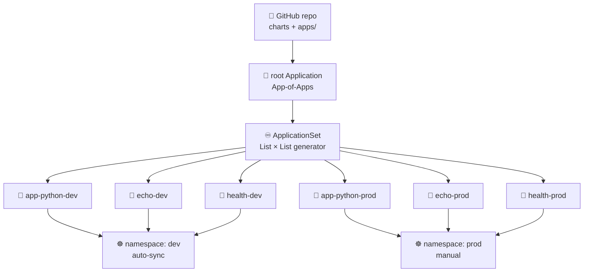

# Lab 13 — GitOps with ArgoCD


> Make Git the single source of truth for your cluster. Install **ArgoCD 3.4**, declare `Application` manifests for **three** services across **two** environments, then collapse them into one **ApplicationSet** that the cluster reconciles continuously — no more `helm upgrade` from your laptop.

## Overview

Through Lab 12 you deployed by typing `helm upgrade` from a laptop (or a CI runner). That is the **push** model: a human or pipeline reaches *into* the cluster with cluster-admin credentials. **GitOps** inverts this — an agent *inside* the cluster watches Git, pulls the desired state, and reconciles it continuously. The cluster reaches out to Git; nothing reaches into the cluster.

This lab wires **ArgoCD 3.4** into your Lab 9–12 cluster. You will deploy the **third** course-provided service (`health`) so that — with `app-python` + `echo` + `health` — multi-service patterns like `ApplicationSet` and App-of-Apps finally earn their keep. (One service is `kubectl apply` with extra steps; three services across two environments is six Applications generated from a single template.)

**What You'll Learn:**
- The four OpenGitOps principles and why pull beats push
- Installing and operating ArgoCD 3.4 via Helm 4
- The `Application` CRD: `source`, `destination`, `syncPolicy`
- Multi-environment deployment (dev auto-sync vs prod manual)
- Self-healing, auto-sync, and prune — and when each is dangerous
- Generating many Applications from one `ApplicationSet` template

**Building On:** Your Helm chart from Labs 10–12 is what ArgoCD will deploy and manage.

**Tech Stack:** ArgoCD **3.4.x** | Kubernetes **1.36** "Haru" | Helm **4.1** | GitHub

> ⚠️ **Version note:** ArgoCD **2.x is EOL** (the 3.2 release in November 2025 ended 2.x support). This lab uses **3.4**. If a tutorial you find online uses 2.x manifests, the `Application`/`ApplicationSet` CRDs are compatible, but always cross-check against the 3.x docs linked at the end.

---

## The Three Services

| Service | Origin | Image | Port | You build it? |
|---------|--------|-------|------|---------------|
| 🐍 **app-python** | Your Lab 1 → Lab 12 service | from your CI | 5000 | ✅ Yes — your code |
| 🦫 **echo** | Course plumbing (Lab 9+) | `ghcr.io/inno-devops-labs/echo:v1` | 8081 | ❌ No — pre-built |
| 💚 **health** | Course plumbing — **new this lab** | `ghcr.io/inno-devops-labs/health:v1` | 8082 | ❌ No — pre-built |

The `health` service is shipped in `plumbing/health/` (see its `README.md`). You **do not build it** — reference the published image `ghcr.io/inno-devops-labs/health:v1` directly. It exposes `GET /`, `GET /healthz` (probes), and `GET /metrics`. Its only job in this lab is to be a third deployment target so `ApplicationSet` becomes genuinely useful.



---

## Tasks

### Task 1 — ArgoCD 3.4 Installation & Setup (2 pts)

**Objective:** Install ArgoCD 3.4 and reach the UI + CLI. This task is **standalone** — it does not depend on your application repo and can be done first on any cluster.

**Requirements:**

1. **Install ArgoCD 3.4 via Helm**
   - Add the `argo` Helm repository and update
   - Create a dedicated `argocd` namespace
   - Install the `argo/argo-cd` chart, **pinning a chart version whose `appVersion` is in the 3.4.x line**
   - Wait for all components to become ready

2. **Access the ArgoCD UI**
   - Port-forward to `argocd-server`
   - Retrieve the initial admin password
   - Log in as `admin` and explore the UI

3. **Install & log in with the `argocd` CLI**
   - Install the CLI matching the server (3.4.x)
   - Log in and run a basic command to confirm the connection

**Verify the version** — capture both server and CLI reporting 3.4.x; you will reference this in your `ARGOCD.md`.

<details>
<summary>💡 Hints</summary>

**Find the right chart version (do this first):**
```bash
helm repo add argo https://argoproj.github.io/argo-helm
helm repo update
# List chart versions and their bundled ArgoCD appVersion; pick one with appVersion 3.4.x
helm search repo argo/argo-cd --versions | head
```

**Install (pin the chart version you found):**
```bash
kubectl create namespace argocd
helm install argocd argo/argo-cd \
  --namespace argocd \
  --version <CHART_VERSION_WITH_APPVERSION_3.4.x>
# Wait for the server
kubectl rollout status deploy/argocd-server -n argocd --timeout=180s
```

**Access the UI:**
```bash
# keep this running in another terminal
kubectl port-forward svc/argocd-server -n argocd 8080:443

# initial admin password
kubectl -n argocd get secret argocd-initial-admin-secret \
  -o jsonpath="{.data.password}" | base64 -d ; echo
# Browse https://localhost:8080  (accept the self-signed cert), user: admin
```

**CLI install & login** (Linux example — see docs for macOS/brew):
```bash
# Download the CLI release that matches your server's 3.4.x
curl -sSL -o argocd \
  https://github.com/argoproj/argo-cd/releases/download/<v3.4.x>/argocd-linux-amd64
chmod +x argocd && sudo mv argocd /usr/local/bin/

argocd login localhost:8080 --insecure   # user admin + the password above
argocd version                            # confirm client AND server are 3.4.x
```

> Output above is **illustrative** — exact chart/CLI version strings change; verify against `helm search` and the releases page.

</details>

---

### Task 2 — Application CRDs for Three Services (3 pts)

**Objective:** Declare one ArgoCD `Application` per service and deploy them via GitOps — no `helm install` by hand.

**Requirements:**

1. **Lay out a GitOps repo path**
   - Create `k8s/argocd/apps/` in your repo
   - You need a chart/path per service. For `app-python`, reuse your Lab 10–12 chart. For `echo` and `health`, point at a small chart (or rendered manifests) that deploys the **pre-built** images `ghcr.io/inno-devops-labs/echo:v1` and `ghcr.io/inno-devops-labs/health:v1`.

2. **Write three `Application` manifests** (start with **manual** sync):
   - `app-python.yaml`, `echo.yaml`, `health.yaml`
   - Each points at its chart/path, deploys to a single namespace to start (e.g. `default` or `dev`), and includes a finalizer.

3. **Deploy & sync**
   - `kubectl apply -f k8s/argocd/apps/`
   - Observe all three Applications in the UI; trigger the first sync **manually**
   - Confirm pods for all three services come up and the health/echo endpoints respond

4. **Prove the GitOps loop**
   - Change something in Git (e.g. `replicaCount` for `app-python`), commit, push
   - Watch ArgoCD flip the app to **OutOfSync**, then sync it

**Skeleton — fill in every `YOUR-TASK`:**

```yaml
# k8s/argocd/apps/app-python.yaml
apiVersion: argoproj.io/v1alpha1
kind: Application
metadata:
  name: app-python
  namespace: argocd
  finalizers:
    - resources-finalizer.argocd.argoproj.io   # cascade-delete K8s resources on app delete
spec:
  project: default
  source:
    repoURL: https://github.com/YOUR-TASK/YOUR-REPO.git
    targetRevision: YOUR-TASK            # branch (dev) or tag/SHA (prod)
    path: YOUR-TASK                      # e.g. k8s/charts/app-python
    helm:
      valueFiles:
        - YOUR-TASK                      # e.g. values.yaml
  destination:
    server: https://kubernetes.default.svc
    namespace: YOUR-TASK                 # e.g. dev
  syncPolicy:
    syncOptions:
      - CreateNamespace=true
    # No `automated:` block yet → manual sync (you click SYNC / run `argocd app sync`)
```

```yaml
# k8s/argocd/apps/health.yaml  (echo.yaml is analogous, image echo:v1, port 8081)
apiVersion: argoproj.io/v1alpha1
kind: Application
metadata:
  name: health
  namespace: argocd
  finalizers:
    - resources-finalizer.argocd.argoproj.io
spec:
  project: default
  source:
    repoURL: https://github.com/YOUR-TASK/YOUR-REPO.git
    targetRevision: YOUR-TASK
    path: YOUR-TASK                      # chart/manifests deploying ghcr.io/inno-devops-labs/health:v1
    # If you template the image via Helm values, set it here:
    helm:
      parameters:
        - name: YOUR-TASK                # e.g. image.repository
          value: ghcr.io/inno-devops-labs/health
        - name: YOUR-TASK                # e.g. image.tag
          value: v1
  destination:
    server: https://kubernetes.default.svc
    namespace: YOUR-TASK
  syncPolicy:
    syncOptions:
      - CreateNamespace=true
```

<details>
<summary>💡 Hints</summary>

```bash
kubectl apply -f k8s/argocd/apps/
argocd app list
argocd app sync app-python            # manual first sync
argocd app sync echo
argocd app sync health
argocd app get health
```

- `health` listens on `8082` and serves `/healthz` for probes (see `plumbing/health/README.md`). `echo` listens on `8081`, `/healthz`.
- Keep app **code** and **GitOps manifests** logically separate — the `Application` CRDs reference charts; they don't contain image-build logic.
- Forgetting the `finalizers:` block leaves orphaned K8s resources when you `kubectl delete app`.

> All command output is **illustrative**.

</details>

---

### Task 3 — Multi-Environment: dev (auto) vs prod (manual) (3 pts)

**Objective:** Run all three services in **two** environments with different config and different sync discipline.

**Requirements:**

1. **Two namespaces, two value sets**
   - Create `dev` and `prod` namespaces (let `CreateNamespace=true` do it, or make them explicitly)
   - Provide `values-dev.yaml` and `values-prod.yaml` per chart with **different** replica counts / resource limits

2. **Six Applications** (3 services × 2 envs) — for now, as **separate** manifests:
   - `app-python-dev`, `echo-dev`, `health-dev` → namespace `dev`, **auto-sync** with `selfHeal` + `prune`
   - `app-python-prod`, `echo-prod`, `health-prod` → namespace `prod`, **manual** sync

3. **Sync discipline**
   - **Dev:** `automated: { prune: true, selfHeal: true }`
   - **Prod:** no `automated:` block → a human reviews and clicks SYNC

4. **Verify** all six in the UI; confirm dev pods differ from prod pods per your values.

**Dev (auto-sync) skeleton:**

```yaml
apiVersion: argoproj.io/v1alpha1
kind: Application
metadata:
  name: app-python-dev
  namespace: argocd
  finalizers:
    - resources-finalizer.argocd.argoproj.io
spec:
  project: default
  source:
    repoURL: https://github.com/YOUR-TASK/YOUR-REPO.git
    targetRevision: main                 # dev tracks a moving branch
    path: YOUR-TASK
    helm:
      valueFiles:
        - values-dev.yaml
  destination:
    server: https://kubernetes.default.svc
    namespace: dev
  syncPolicy:
    automated:
      prune: true                        # delete resources removed from Git
      selfHeal: true                     # revert manual cluster edits
      allowEmpty: false                  # refuse to apply 0 manifests
    syncOptions:
      - CreateNamespace=true
      - ServerSideApply=true             # plays nice with HPA/VPA
```

**Prod (manual) skeleton — note `targetRevision` is pinned and there is no `automated:` block:**

```yaml
spec:
  source:
    targetRevision: YOUR-TASK            # a TAG or release SHA, NOT a moving branch
    helm:
      valueFiles:
        - values-prod.yaml
  destination:
    namespace: prod
  syncPolicy:
    syncOptions:
      - CreateNamespace=true
    # intentionally no automated: — prod is manual sync
```

<details>
<summary>💡 Hints</summary>

```bash
kubectl get applications -n argocd
kubectl get pods -n dev
kubectl get pods -n prod
argocd app sync app-python-prod          # prod requires an explicit human sync
```

**Why manual for prod?** Change review, controlled release timing, compliance, and rollback planning. Dev optimizes for speed; prod optimizes for safety.

**Why pin prod's `targetRevision`?** Pointing prod at `main`/`HEAD` means every merge silently rolls out to production. Use a tag or `release/*` branch.

</details>

---

### Task 4 — ApplicationSet + Self-Healing (2 pts)

**Objective:** Replace the six hand-written manifests with **one** `ApplicationSet` that generates all 3 services × 2 environments, then prove self-healing works.

**Requirements:**

1. **Write one `ApplicationSet`** using a **Matrix(List, List)** generator (a single List generator is acceptable if you prefer, but Matrix is cleaner here):
   - List A enumerates the **three services** (svc name + chart path)
   - List B enumerates the **two environments** (env + namespace + auto-sync flag)
   - The matrix cross-joins them → **6 Applications** from one template
   - Adding a 4th service later must be a **one-line** change

2. **Delete the six standalone manifests** from Task 3 once the ApplicationSet reproduces them (the generated app names should match, e.g. `app-python-dev`).

3. **Prove self-healing on dev:**
   - `kubectl scale deployment <name> -n dev --replicas=5`
   - Observe ArgoCD revert it to the Git-defined count (selfHeal)
   - `kubectl edit` a label on a dev resource → watch the diff and the revert
   - Note the difference between **Kubernetes** self-healing (ReplicaSet recreates a deleted pod) and **ArgoCD** self-healing (reverts config drift to match Git)

4. **Document sync behavior:** what triggers an ArgoCD sync, and the default reconcile interval (3 minutes).

**ApplicationSet skeleton — fill every `YOUR-TASK`:**

```yaml
apiVersion: argoproj.io/v1alpha1
kind: ApplicationSet
metadata:
  name: all-apps
  namespace: argocd
spec:
  generators:
    - matrix:
        generators:
          - list:                        # 1️⃣ which services
              elements:
                - { svc: app-python, path: YOUR-TASK }   # your chart
                - { svc: echo,       path: YOUR-TASK }   # echo:v1 chart
                - { svc: health,     path: YOUR-TASK }   # health:v1 chart
          - list:                        # 2️⃣ which environments
              elements:
                - { env: dev,  autoSync: "true" }
                - { env: prod, autoSync: "false" }
  template:
    metadata:
      name: '{{svc}}-{{env}}'
      finalizers:
        - resources-finalizer.argocd.argoproj.io
    spec:
      project: default
      source:
        repoURL: https://github.com/YOUR-TASK/YOUR-REPO.git
        targetRevision: YOUR-TASK
        path: '{{path}}'
        helm:
          valueFiles:
            - 'values-{{env}}.yaml'
      destination:
        server: https://kubernetes.default.svc
        namespace: '{{env}}'
      syncPolicy:
        # YOUR-TASK: only dev should auto-sync. ArgoCD has no `if` in templates —
        # achieve this with one of:
        #   (a) two separate ApplicationSets (dev with automated:, prod without), or
        #   (b) a goTemplate-enabled ApplicationSet using {{- if eq .autoSync "true"}}.
        syncOptions:
          - CreateNamespace=true
          - ServerSideApply=true
```

<details>
<summary>💡 Hints</summary>

```bash
# After applying the ApplicationSet, confirm it generated six apps:
kubectl get applications -n argocd
# Expect: app-python-dev, echo-dev, health-dev, app-python-prod, echo-prod, health-prod

# Self-heal test (dev):
kubectl scale deployment app-python-dev -n dev --replicas=5
kubectl get pods -n dev -w        # watch ArgoCD revert the count
argocd app diff app-python-dev    # inspect drift before the revert lands
```

- To enable per-env sync policy in **one** ApplicationSet, set `spec.goTemplate: true` and use a Go-template `if`; otherwise split into two ApplicationSets. Either approach earns the point — just explain which you chose.
- `allowEmpty: false` on dev guards against a bad `path:` wiping everything via `prune`.
- On **first** rollout, consider `prune: false` until you've confirmed paths are correct, then enable it.

> Command output is **illustrative**.

</details>

**Documentation required in `k8s/ARGOCD.md`:**

1. **ArgoCD setup** — install method, **verified 3.4.x version** (server + CLI), UI access
2. **The three Applications** — source/destination/values per service, including how `echo`/`health` reference the pre-built `ghcr.io/inno-devops-labs/*:v1` images
3. **Multi-environment** — dev vs prod config and sync-policy rationale
4. **ApplicationSet** — your generator (List or Matrix), how it produces 6 apps, and how per-env sync was handled
5. **Self-healing evidence** — scale test (before/after), label-drift test, Kubernetes-vs-ArgoCD healing explanation
6. **Screenshots** — UI showing all six apps, sync status, and one app's detail/diff view

---

## Bonus Task — ArgoCD Notifications on Sync Failure (2 pts)

> ApplicationSet is now a **graded main task**, so the bonus is a different, genuinely challenging Day-2 capability: wire **ArgoCD Notifications** so a failed or degraded sync alerts you out-of-band.

**Objective:** Configure the ArgoCD Notifications controller to send an alert when an Application's sync **fails** or becomes **degraded**.

**Requirements:**

1. **Configure a trigger + template**
   - Use the built-in `on-sync-failed` / `on-health-degraded` triggers (or define your own)
   - Define a notification template with a useful message (app name, sync status, revision)

2. **Configure a delivery service** — pick one:
   - A **webhook** to a request-bin / your own endpoint (simplest to demo offline), **or**
   - Telegram/Slack/email if you have a sandbox channel

3. **Subscribe an Application** to the trigger via annotation

4. **Force a failure and capture the alert**
   - Break a sync deliberately (e.g. push an invalid image tag or bad manifest to dev)
   - Show the notification firing (webhook payload screenshot / channel message)

5. **Document** the trigger → template → service → subscription chain and one real alert.

<details>
<summary>💡 Hints</summary>

The notifications controller ships with the ArgoCD Helm chart. Configuration lives in two ConfigMaps and one Secret in the `argocd` namespace:

```yaml
# argocd-notifications-cm  (triggers, templates, services)
apiVersion: v1
kind: ConfigMap
metadata:
  name: argocd-notifications-cm
  namespace: argocd
data:
  service.webhook.YOUR-TASK: |
    url: YOUR-TASK                       # your request-bin / endpoint
    headers:
      - name: Content-Type
        value: application/json
  template.app-sync-failed: |
    message: "App {{.app.metadata.name}} sync FAILED at {{.app.status.sync.revision}}"
  trigger.on-sync-failed: |
    - when: app.status.operationState.phase in ['Error', 'Failed']
      send: [app-sync-failed]
```

```yaml
# Subscribe an Application:
metadata:
  annotations:
    notifications.argoproj.io/subscribe.on-sync-failed.YOUR-TASK: ""
```

```bash
kubectl logs deploy/argocd-notifications-controller -n argocd | tail
```

**Other 2-pt-worthy bonus alternatives** (pick ONE; Notifications is the reference path):
- **Sync waves + a PreSync hook** — order a namespace/ConfigMap (wave -1) before Deployments (wave 0) and run a PreSync `Job` with `hook-delete-policy: HookSucceeded`.
- **Multi-cluster** — register a second cluster with `argocd cluster add`, deploy `health` to it via the ApplicationSet **Cluster** generator.

> All payloads/output are **illustrative** — verify field names against the 3.4 notifications docs.

</details>

**Bonus documentation:** the notification config (or chosen alternative), a forced-failure walkthrough, and a screenshot of the alert actually firing.

---

## How to Submit

1. **Create Branch:**
   ```bash
   git checkout -b lab13
   ```

2. **Commit Work:**
   ```bash
   git add k8s/argocd/ k8s/ARGOCD.md
   git commit -m "feat: lab13 GitOps with ArgoCD 3.4 (three services, ApplicationSet)"
   git push -u origin lab13
   ```

3. **Create Pull Requests:**
   - **PR #1:** `your-fork:lab13` → `course-repo:master`
   - **PR #2:** `your-fork:lab13` → `your-fork:master`

4. **Verify:**
   - All `Application`/`ApplicationSet` manifests present under `k8s/argocd/`
   - `k8s/ARGOCD.md` complete with screenshots
   - All six apps reconcile in the UI

---

## Acceptance Criteria

### Task 1 — ArgoCD 3.4 Installation & Setup (2 pts)
- [ ] ArgoCD installed via Helm with **appVersion 3.4.x** (pinned chart)
- [ ] All pods Running in the `argocd` namespace
- [ ] UI reachable via port-forward; admin password retrieved
- [ ] `argocd` CLI installed; `argocd version` shows **client + server 3.4.x**

### Task 2 — Application CRDs for Three Services (3 pts)
- [ ] `k8s/argocd/apps/` created with `app-python`, `echo`, `health` manifests
- [ ] `echo` and `health` reference the pre-built `ghcr.io/inno-devops-labs/*:v1` images (not built by student)
- [ ] All three Applications visible in the UI; manual first sync completed
- [ ] All three services' pods Running and endpoints responding
- [ ] GitOps loop proven (push to Git → OutOfSync → sync)

### Task 3 — Multi-Environment (3 pts)
- [ ] `dev` and `prod` namespaces with distinct `values-dev`/`values-prod`
- [ ] Six Applications (3 svc × 2 env) deployed
- [ ] Dev auto-syncs with `selfHeal` + `prune`; prod is manual
- [ ] Prod `targetRevision` pinned to a tag/SHA (not a moving branch)
- [ ] Both environments verified, configs differ

### Task 4 — ApplicationSet + Self-Healing (2 pts)
- [ ] One `ApplicationSet` (List or Matrix) generates all six apps
- [ ] Standalone Task-3 manifests removed in favor of the ApplicationSet
- [ ] Per-env sync policy handled (goTemplate `if` or two ApplicationSets) and explained
- [ ] Self-heal demonstrated (scale + label drift) with before/after
- [ ] K8s-vs-ArgoCD self-healing distinction documented in `k8s/ARGOCD.md`

### Bonus — ArgoCD Notifications (2 pts)
- [ ] Trigger + template + delivery service configured
- [ ] An Application subscribed to the trigger
- [ ] A deliberate failure captured as a real alert (screenshot)
- [ ] The trigger → template → service → subscription chain documented

---

## Rubric

| Criteria | Points | Description |
|----------|--------|-------------|
| **Installation** | 2 pts | ArgoCD **3.4.x** running; UI + CLI verified |
| **Three Applications** | 3 pts | app-python + echo + health declared and synced via GitOps |
| **Multi-Environment** | 3 pts | dev (auto) vs prod (manual), distinct configs, pinned prod revision |
| **ApplicationSet + Self-Heal** | 2 pts | One template generates 6 apps; self-healing proven & documented |
| **Bonus** | 2 pts | ArgoCD Notifications (or sync-waves/multi-cluster) demonstrated |
| **Total** | 12 pts | 10 pts required + 2 pts bonus |

**Grading:**
- **10/10:** Three services across two envs, one ApplicationSet, self-healing & multi-env rationale documented
- **8–9/10:** ArgoCD works end-to-end; minor gaps in ApplicationSet or docs
- **6–7/10:** Apps deploy via ArgoCD but multi-env or ApplicationSet incomplete
- **<6/10:** ArgoCD not properly installed or apps not syncing

---

## Resources

<details>
<summary>📚 Official Documentation (ArgoCD 3.x)</summary>

- [ArgoCD Documentation](https://argo-cd.readthedocs.io/en/stable/)
- [ArgoCD Operator Manual](https://argo-cd.readthedocs.io/en/stable/operator-manual/)
- [Application CRD / Declarative Setup](https://argo-cd.readthedocs.io/en/stable/operator-manual/declarative-setup/)
- [Automated Sync & Self-Heal](https://argo-cd.readthedocs.io/en/stable/user-guide/auto_sync/)
- [argo-helm chart (versions / appVersion mapping)](https://github.com/argoproj/argo-helm/tree/main/charts/argo-cd)

</details>

<details>
<summary>🎓 GitOps Concepts</summary>

- [OpenGitOps — the four principles](https://opengitops.dev/)
- [GitOps Working Group](https://github.com/open-gitops/documents)
- [ArgoCD Best Practices](https://argo-cd.readthedocs.io/en/stable/user-guide/best_practices/)

</details>

<details>
<summary>🛠️ ApplicationSet, Hooks & Notifications</summary>

- [ApplicationSet](https://argo-cd.readthedocs.io/en/stable/operator-manual/applicationset/)
- [ApplicationSet Generators (List, Matrix, Cluster, Git)](https://argo-cd.readthedocs.io/en/stable/operator-manual/applicationset/Generators/)
- [Sync Waves](https://argo-cd.readthedocs.io/en/stable/user-guide/sync-waves/)
- [Resource Hooks](https://argo-cd.readthedocs.io/en/stable/user-guide/resource_hooks/)
- [Notifications](https://argo-cd.readthedocs.io/en/stable/operator-manual/notifications/)

</details>

<details>
<summary>📦 Course plumbing</summary>

- `plumbing/health/README.md` — the **third** service (port 8082, `ghcr.io/inno-devops-labs/health:v1`)
- `plumbing/echo/README.md` — the second service (port 8081, `ghcr.io/inno-devops-labs/echo:v1`)

</details>

---

## Looking Ahead

- **Lab 14:** Progressive delivery with Argo Rollouts — canary & blue-green for these same services
- **Lab 15:** StatefulSets for stateful workloads
- **Lab 16:** Monitoring your GitOps deployments (scrape `health`/`echo` `/metrics`)

---

**Good luck!** 🔄

> **Remember:** GitOps means Git is the source of truth. Make changes in Git, not with `kubectl` — self-heal reverts out-of-band edits within 3 minutes. The cluster reaches out to Git; nothing reaches in.
