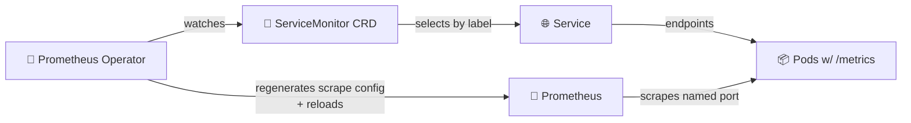

# Lab 16 — Kubernetes Monitoring & Init Containers


> Capstone of the Kubernetes track. Stand up cluster-wide monitoring with the **kube-prometheus-stack** Helm chart, scrape every service you've built (`app-python` + `echo` + `health`), explore Grafana, and learn the **init container** patterns that make pods start in the right order.

## Overview

In Lab 8 you ran one `prom/prometheus` container in Docker Compose and hand-wrote `scrape_configs`. That doesn't scale on Kubernetes — pods come and go, IPs churn, and you can't edit `prometheus.yml` every time the scheduler reschedules a pod. The **Prometheus Operator** solves this: targets are discovered through **`ServiceMonitor`** and **`PodMonitor`** custom resources (CRDs), and the operator regenerates Prometheus config automatically.

The **kube-prometheus-stack** Helm chart bundles the whole observability plane — Prometheus Operator, a Prometheus server, Alertmanager, Grafana (pre-loaded with cluster dashboards), `kube-state-metrics`, and `node-exporter` — in one `helm install`. This lab deploys it onto the cluster from Labs 9–15, points it at your three services, and proves the metrics flow end to end.

You'll also learn **init containers**: short-lived containers that run *to completion, in order, before* the main app container starts. They're the Kubernetes-native way to do "wait for the database", "fetch a config file", or "run a migration" without baking that logic into your app image.

**What You'll Learn:**
- The Prometheus Operator model: `ServiceMonitor` / `PodMonitor` vs hand-written scrape configs
- kube-prometheus-stack architecture and what each component does
- Navigating Grafana's bundled Kubernetes dashboards and the Prometheus target UI
- The USE method (resources) and RED method (services) applied to a live cluster
- Init container patterns: download-then-run and wait-for-dependency

**Tech Stack:** kube-prometheus-stack (Helm) | Prometheus Operator | Prometheus 3.x | Grafana 13 | Alertmanager | kube-state-metrics | node-exporter | Init Containers

**Tested Versions:** Kubernetes **1.36 "Haru"** (k3d) | Helm 4.1+ (Helm 3 also works) | kube-prometheus-stack chart **~v85** (May 2026) | Prometheus 3.x | Grafana 13

> 📦 **Course plumbing recap:** `app-python` is **your** app (built in Labs 1–12). `echo` (`ghcr.io/inno-devops-labs/echo:v1`, container port **8081**) and `health` (`ghcr.io/inno-devops-labs/health:v1`, container port **8082**) are pre-built course services — **you do not build them**. All three expose `GET /metrics` in Prometheus text format, which is exactly what makes them scrape targets here.

---

## Tasks

### Task 1 — Deploy the kube-prometheus-stack (2 pts)

**Objective:** Install the operator-based monitoring stack and understand what each piece does.

**Requirements:**

1. **Document the architecture** — in your own words, the role of each component the chart installs:

   | Component | Role |
   |-----------|------|
   | **Prometheus Operator** | Watches `Prometheus`/`ServiceMonitor`/`PodMonitor`/`PrometheusRule` CRDs and regenerates Prometheus config |
   | **Prometheus** (server) | Scrapes targets, stores the TSDB, evaluates rules, serves PromQL |
   | **Alertmanager** | Deduplicates, groups, routes, and silences alerts |
   | **Grafana** | Dashboards over Prometheus (pre-loaded with cluster dashboards) |
   | **kube-state-metrics** | Exposes Kubernetes object state (deployment replicas, pod phase, …) as metrics |
   | **node-exporter** | DaemonSet exposing per-node host metrics (CPU, RAM, disk, network) |

2. **Install via Helm** into a `monitoring` namespace, with a values override that lets ServiceMonitors in *any* namespace be discovered (you'll need this in Task 2 / Bonus).

3. **Verify** every pod in `monitoring` reaches `Running`/`Ready`, and that the operator created the CRDs.

<details>
<summary>💡 Hints — installation & verification</summary>

**Add the repo and pin the chart:**
```bash
helm repo add prometheus-community https://prometheus-community.github.io/helm-charts
helm repo update
helm search repo prometheus-community/kube-prometheus-stack --versions | head
# Pin a recent chart version explicitly (~85.x as of May 2026); don't float on "latest".
```

**`monitoring-values.yaml` — let Prometheus discover ServiceMonitors cluster-wide:**
```yaml
prometheus:
  prometheusSpec:
    # By default the operator only picks up ServiceMonitors carrying the chart's
    # release label. These two settings widen discovery so your app's monitor
    # (Bonus task) is found wherever it lives.
    serviceMonitorSelectorNilUsesHelmValues: false
    podMonitorSelectorNilUsesHelmValues: false
grafana:
  adminPassword: prom-operator   # lab only — never hardcode a prod password
```

**Install (pin the version you found above):**
```bash
helm install monitoring prometheus-community/kube-prometheus-stack \
  --namespace monitoring --create-namespace \
  --version 85.X.Y \
  -f monitoring-values.yaml

kubectl get pods -n monitoring
kubectl get crd | grep monitoring.coreos.com   # servicemonitors, podmonitors, prometheuses, ...
```

**Resources:**
- [kube-prometheus-stack chart](https://github.com/prometheus-community/helm-charts/tree/main/charts/kube-prometheus-stack)
- [Prometheus Operator design](https://prometheus-operator.dev/docs/getting-started/design/)

</details>

> 🧠 **Key idea:** with the operator you *never* edit `prometheus.yml`. You declare *intent* with a `ServiceMonitor`, the operator reconciles the actual config. Same GitOps philosophy as Labs 13–14, applied to scrape configuration.

**How target discovery actually works** (you'll lean on this in Task 2 and the Bonus):



- A **`ServiceMonitor`** selects `Service`s by label; Prometheus then scrapes the pods behind that Service on a **named** port. Use this for anything fronted by a Service (your `app-python`, `echo`, `health`).
- A **`PodMonitor`** selects pods *directly* by label — for workloads with no Service (e.g. a `Job` or a sidecar). Same idea, no Service in the middle.
- The operator only adopts monitors that match its configured selector. The Task-1 values (`serviceMonitorSelectorNilUsesHelmValues: false`) widen that to "any ServiceMonitor in any namespace", which is why your Bonus monitor will be picked up without the chart's release label.

---

### Task 2 — Explore Grafana & Verify Scrape Targets (3 pts)

**Objective:** Use the bundled dashboards and the Prometheus UI to read the health of *your* cluster, and confirm your three services are being scraped.

#### 2.1 Access the UIs

```bash
# Grafana (login: admin / prom-operator unless you changed it)
kubectl port-forward svc/monitoring-grafana -n monitoring 3000:80

# Prometheus
kubectl port-forward svc/monitoring-kube-prometheus-prometheus -n monitoring 9090:9090

# Alertmanager
kubectl port-forward svc/monitoring-kube-prometheus-alertmanager -n monitoring 9093:9093
```

> Service names follow the Helm release name (`monitoring-*`). If you named the release differently, run `kubectl get svc -n monitoring` to find the exact names.

#### 2.2 Read the cluster with the bundled dashboards

Answer each question with a screenshot and a one-line explanation. Values below are **illustrative** — yours will differ.

1. **Node resources (USE method):** node CPU utilisation and memory used (% and bytes). *Dashboard: "Node Exporter / Nodes".*
2. **Namespace compute:** which pods in your app's namespace use the most/least CPU and memory? *Dashboard: "Kubernetes / Compute Resources / Namespace (Pods)".*
3. **Per-pod detail:** CPU throttling and memory working-set for one of your `app-python` pods. *Dashboard: "Kubernetes / Compute Resources / Pod".*
4. **Kubelet:** how many pods and running containers does the kubelet manage on the node? *Dashboard: "Kubernetes / Kubelet".*
5. **Cluster state (kube-state-metrics):** count of pods per phase (`Running`/`Pending`/`Failed`) — find a panel or write the query `sum by (phase) (kube_pod_status_phase)`.
6. **Alerts:** how many alerts are currently firing? Cross-check the Alertmanager UI. (A fresh cluster usually has `Watchdog` always-firing plus a few `*InfoInhibitor` rules — explain what `Watchdog` is for.)

#### 2.3 Confirm your services are scraped

In the **Prometheus UI → Status → Targets**, you must see your services as `UP`. They are discovered via `ServiceMonitor`/annotations, *not* hand-written config.

```promql
# Are the plumbing services and your app being scraped? (1 = up)
up{job=~"app-python|echo|health"}

# Request rate across your three services (RED — Rate), if they emit http_requests_total
sum by (job) (rate(http_requests_total[5m]))
```

> ⚠️ If a target is missing, it's almost always a **label/selector mismatch** between the `ServiceMonitor` and the `Service`, or the `Service` has no named `port`. The Bonus task wires `app-python` explicitly; `echo`/`health` are scraped via their published `/metrics` once a monitor selects them.

#### 2.4 PromQL reference (RED + USE on a live cluster)

The bundled dashboards are just saved PromQL. These are the queries behind the questions above — paste them into Prometheus → Graph to see the raw series. From Lecture 8: **RED** (Rate/Errors/Duration) for *services*, **USE** (Utilisation/Saturation/Errors) for *resources*. Output below is **illustrative**.

```promql
# USE — node CPU utilisation (1 - idle), per node
1 - avg by (instance) (rate(node_cpu_seconds_total{mode="idle"}[5m]))

# USE — node memory used as a fraction
1 - (node_memory_MemAvailable_bytes / node_memory_MemTotal_bytes)

# kube-state-metrics — pods by phase across the cluster
sum by (phase) (kube_pod_status_phase)

# Per-pod memory working set (the panel behind question 3)
sum by (pod) (container_memory_working_set_bytes{namespace="<ns>", pod=~"app-python.*"})

# RED — request rate per service (needs your apps' http_requests_total)
sum by (job) (rate(http_requests_total[5m]))

# RED — error ratio per service (5xx as a fraction of total)
sum by (job) (rate(http_requests_total{status=~"5.."}[5m]))
  / sum by (job) (rate(http_requests_total[5m]))
```

<details>
<summary>💡 Hints — generate traffic & find dashboards</summary>

**Generate some traffic so the RED panels aren't flat:**
```bash
kubectl port-forward svc/echo -n <ns> 8081:80 &
for i in $(seq 1 200); do curl -s localhost:8081/ >/dev/null; done
```

**Browsing dashboards:** Grafana → Dashboards → look under the "Kubernetes /" and "Node Exporter /" folders the chart provisioned. Use the `$namespace` / `$pod` template dropdowns at the top of each dashboard to scope to your workloads.

**Alertmanager active alerts:** open `localhost:9093` → the firing alerts list, or query Prometheus: `ALERTS{alertstate="firing"}`.

</details>

---

### Task 3 — Init Containers (3 pts)

**Objective:** Use init containers to do setup work *before* the main container starts. Init containers run sequentially, each must exit `0` before the next runs, and **all** must succeed before the app container starts.

**Requirements:**

1. **Download-then-serve pattern** — an init container fetches a file into a shared `emptyDir` volume; the main container reads it. Prove the file the app serves came from the init step.

2. **Wait-for-dependency pattern** — an init container blocks until the `echo` Service resolves and responds, *then* the main container starts. Prove the pod sits in the `Init:N/2` states until the dependency is reachable, then transitions to `Running`.

Add these to a small demo pod/deployment in `k8s/` (e.g. `k8s/init-demo.yaml`). Capture `kubectl get pods -w` showing the `Init:` → `Running` transition and the init container logs.

<details>
<summary>💡 Manifest skeleton — fill in the YOUR-TASK markers</summary>

```yaml
apiVersion: apps/v1
kind: Deployment
metadata:
  name: init-demo
spec:
  replicas: 1
  selector: { matchLabels: { app: init-demo } }
  template:
    metadata: { labels: { app: init-demo } }
    spec:
      initContainers:
        # 1) Download-then-serve: write a file the main container will serve
        - name: fetch-content
          image: busybox:1.37          # check the current 1.x patch on Docker Hub
          command: ['sh', '-c', 'YOUR-TASK']   # wget/echo a file into /work-dir
          volumeMounts:
            - { name: workdir, mountPath: /work-dir }

        # 2) Wait-for-dependency: block until echo's Service answers
        - name: wait-for-echo
          image: busybox:1.37
          command:
            - sh
            - -c
            - |
              # YOUR-TASK: loop until the echo Service resolves AND responds.
              # Hint: nslookup echo.<ns>.svc.cluster.local ; wget -qO- http://echo:80/healthz
              until YOUR-TASK; do echo "waiting for echo..."; sleep 2; done

      containers:
        - name: app
          image: YOUR-TASK              # e.g. nginx:1.27-alpine serving /usr/share/nginx/html
          volumeMounts:
            - { name: workdir, mountPath: YOUR-TASK }   # where the app reads the file
      volumes:
        - name: workdir
          emptyDir: {}
```

**Verification:**
```bash
kubectl apply -f k8s/init-demo.yaml
kubectl get pods -w                       # watch Init:0/2 → Init:1/2 → Running
kubectl logs <pod> -c fetch-content       # download step output
kubectl logs <pod> -c wait-for-echo       # the "waiting..." loop, then exit
kubectl exec <pod> -c app -- cat <path>   # prove the app sees the fetched file

# Prove the WAIT actually blocks: scale echo to 0, recreate the pod, observe it stick in Init
kubectl scale deploy echo --replicas=0
kubectl delete pod -l app=init-demo       # new pod stays Init:1/2 until you scale echo back up
kubectl scale deploy echo --replicas=2
```

</details>

> 💡 **Why init containers and not a shell in the main container?** Separation of concerns + ordering guarantees. The app image stays minimal (no `wget`/`curl` baked in), and Kubernetes — not your `ENTRYPOINT` — enforces "don't start until the dependency is ready". This is the same pattern operators use under the hood.

---

### Task 4 — Documentation (2 pts)

**Objective:** Make the work reproducible and prove it ran.

**Create `k8s/MONITORING.md` with:**

1. **Stack components** — each component's role *in your own words* (not copy-pasted from the table).
2. **Install evidence** — your `monitoring-values.yaml`, the pinned chart version, and `kubectl get po,svc -n monitoring`.
3. **Dashboard answers** — all six Task 2 questions, each with a screenshot and a one-line reading.
4. **Scrape proof** — a screenshot of Prometheus → Targets showing `app-python`, `echo`, `health` as `UP`, plus the `up{...}` query result.
5. **Init containers** — both manifests, the `Init:` → `Running` watch output, and the proof the wait pattern actually blocked (echo scaled to 0).

> 📸 Screenshots are graded. "It works on my machine" with no evidence scores zero for that item.

---

## Bonus Task — Custom Metrics & ServiceMonitor (2 pts)

**Objective:** Expose a *custom application metric* from `app-python` and wire Prometheus to scrape it through a `ServiceMonitor` CRD — the operator-native replacement for the hand-written `scrape_config` you used in Lab 8.

**Requirements:**

1. **Add a business metric** to `app-python` using `prometheus_client` (you already have `/metrics` from Lab 8). Add at least one *new* metric beyond the RED basics — e.g. a `Counter` `devops_info_requests_total{endpoint=...}` or a `Gauge` for something meaningful. Keep label cardinality bounded (no user IDs / request IDs).

2. **Ensure the Service has a named port** — the `ServiceMonitor` selects an `endpoints[].port` by **name**, not number.

3. **Create a `ServiceMonitor`** so the operator discovers and scrapes `app-python`.

4. **Verify** the custom metric appears in the Prometheus UI (Status → Targets shows `app-python` UP; the metric is queryable) and graph it in Grafana.

<details>
<summary>💡 Skeleton — ServiceMonitor + named-port Service</summary>

```yaml
# Service MUST expose a NAMED port — the ServiceMonitor matches on the name.
apiVersion: v1
kind: Service
metadata:
  name: app-python
  labels:
    app.kubernetes.io/name: app-python   # the ServiceMonitor selector matches this
spec:
  selector: { app: app-python }
  ports:
    - name: http            # 🔑 named — referenced by the ServiceMonitor below
      port: 80
      targetPort: YOUR-TASK # the container port your app's /metrics listens on
---
apiVersion: monitoring.coreos.com/v1
kind: ServiceMonitor
metadata:
  name: app-python
  # If you set serviceMonitorSelectorNilUsesHelmValues=false (Task 1) you don't
  # strictly need the release label, but adding it is the conventional belt-and-braces.
  labels:
    release: monitoring
spec:
  selector:
    matchLabels:
      app.kubernetes.io/name: app-python   # must match the Service's labels
  endpoints:
    - port: http            # 🔑 matches the Service's NAMED port
      path: /metrics
      interval: 15s
```

**Add a business metric (Python, `prometheus_client`):**
```python
from prometheus_client import Counter
# bounded labels only — endpoint is a small enumeration, never a user_id
INFO_REQS = Counter("devops_info_requests_total", "Info endpoint hits", ["endpoint"])

@app.route("/")
def index():
    INFO_REQS.labels(endpoint="/").inc()
    ...
```

**Verify:**
```bash
kubectl apply -f k8s/app-python-servicemonitor.yaml
# Prometheus UI → Status → Targets: app-python should be UP within ~30s.
# Then query:  devops_info_requests_total   and   rate(devops_info_requests_total[5m])
```

</details>

> 🧠 **Operator vs Lab 8:** in Lab 8 you added a `- job_name: app` block to `prometheus.yml`. Here you add a `ServiceMonitor` object and the operator writes that block for you — declaratively, reconciled, and surviving pod churn. Same outcome, Kubernetes-native plumbing.

---

## How to Submit

1. **Create Branch:**
   ```bash
   git checkout -b lab16
   ```

2. **Commit Work:**
   ```bash
   git add k8s/ monitoring-values.yaml
   git commit -m "feat: lab16 kube-prometheus-stack monitoring + init containers"
   git push -u origin lab16
   ```

3. **Create Pull Requests:**
   - **PR #1:** `your-fork:lab16` → `course-repo:master`
   - **PR #2:** `your-fork:lab16` → `your-fork:master`

4. **Verify:**
   - `k8s/MONITORING.md` complete with all screenshots
   - `monitoring-values.yaml` and the init-container manifest committed
   - All `monitoring` pods Running; the three services show `UP` in Prometheus targets

---

## Acceptance Criteria

### Task 1 — Deploy the kube-prometheus-stack (2 pts)
- [ ] Chart **version pinned** (not `latest`); installed into the `monitoring` namespace
- [ ] All `monitoring` pods reach `Running`/`Ready`; operator CRDs present (`servicemonitors`, `podmonitors`, …)
- [ ] `serviceMonitorSelectorNilUsesHelmValues: false` (or equivalent) set so monitors are discovered cluster-wide
- [ ] Each component's role documented in your own words

### Task 2 — Explore Grafana & Verify Scrape Targets (3 pts)
- [ ] Grafana, Prometheus, and Alertmanager reachable via port-forward
- [ ] All six dashboard questions answered, each with a screenshot
- [ ] Prometheus → Targets shows `app-python`, `echo`, `health` as `UP`
- [ ] `up{job=~"app-python|echo|health"}` returns `1` for all three
- [ ] `Watchdog` always-firing alert explained

### Task 3 — Init Containers (3 pts)
- [ ] Download-then-serve init container: file fetched into a shared `emptyDir`, main container reads it
- [ ] Wait-for-dependency init container blocks until `echo` responds
- [ ] `kubectl get pods -w` evidence of `Init:` → `Running` transition
- [ ] Proof the wait actually blocks (echo scaled to 0 → pod stuck in Init)
- [ ] Init container logs captured

### Task 4 — Documentation (2 pts)
- [ ] `k8s/MONITORING.md` covers components, install evidence, dashboard answers, scrape proof, init containers
- [ ] Chart version and `monitoring-values.yaml` recorded
- [ ] All screenshots present and legible

### Bonus — Custom Metrics & ServiceMonitor (2 pts)
- [ ] New bounded-cardinality business metric added to `app-python`
- [ ] Service exposes a **named** port; `ServiceMonitor` selector matches the Service labels
- [ ] `app-python` shows `UP` in Prometheus targets via the ServiceMonitor
- [ ] Custom metric queryable in Prometheus and graphed in Grafana

---

## Rubric

| Criteria | Points | Description |
|----------|--------|-------------|
| **Stack Deployment** | 2 pts | kube-prometheus-stack installed (pinned chart), all pods healthy, CRDs present |
| **Grafana & Targets** | 3 pts | Six dashboard questions answered; three services verified `UP` in Prometheus |
| **Init Containers** | 3 pts | Download + wait-for-dependency patterns working, transitions proven |
| **Documentation** | 2 pts | `MONITORING.md` complete with evidence and screenshots |
| **Bonus** | 2 pts | Custom metric + ServiceMonitor scraped and visualised |
| **Total** | 12 pts | 10 pts required + 2 pts bonus |

**Grading:**
- **10/10:** Stack healthy, all three services scraped, both init patterns proven, thorough docs
- **8–9/10:** Monitoring works end-to-end; minor gaps in dashboard answers or init evidence
- **6–7/10:** Stack installs and Grafana works, but targets unverified or an init pattern incomplete
- **<6/10:** Stack not healthy, services not scraped, or documentation missing

---

## Resources

<details>
<summary>📚 Documentation</summary>

- [kube-prometheus-stack chart](https://github.com/prometheus-community/helm-charts/tree/main/charts/kube-prometheus-stack)
- [Prometheus Operator — design](https://prometheus-operator.dev/docs/getting-started/design/)
- [ServiceMonitor & PodMonitor](https://prometheus-operator.dev/docs/developer/getting-started/)
- [Prometheus 3.x docs](https://prometheus.io/docs/)
- [Grafana docs](https://grafana.com/docs/)
- [Init Containers](https://kubernetes.io/docs/concepts/workloads/pods/init-containers/)
- [USE method (Brendan Gregg)](https://www.brendangregg.com/usemethod.html) · [RED method (Tom Wilkie)](https://grafana.com/blog/the-red-method-how-to-instrument-your-services/)

</details>

---

## Looking Ahead

You've now built the full DevOps lifecycle on Kubernetes: an app (Labs 1–3), containers (Lab 2), CI/CD (Labs 3–5), config + logs + metrics (Labs 6–8), a cluster (Labs 9–12), GitOps and progressive delivery (Labs 13–14), stateful workloads (Lab 15), and cluster-wide monitoring (this lab). The observability stack you ran locally in Compose for Labs 7–8 is now operator-managed and Kubernetes-native — the same metrics, the same PromQL, discovered automatically.

**Optional electives (exam alternatives):**
- **Lab 17:** Deploy your Lab 1 service to **Cloudflare Workers** (V8 isolates on the edge)
- **Lab 18:** Package it reproducibly with **Nix** flakes

---

**Good luck!** 📊

> **Remember:** Monitoring is not optional in production. With the operator, you declare *what* to scrape; the platform handles *how*. If you can't measure it, you can't improve it.
