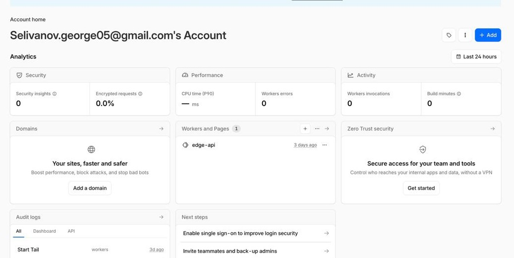
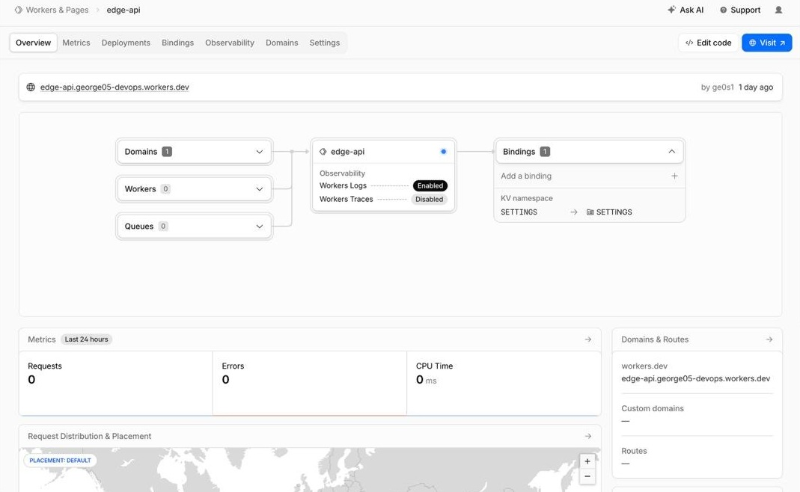

# Lab 17 — Cloudflare Workers Edge Deployment

**Student**: Selivanov George  
**Date**: May 14, 2026  
**Worker URL**: `https://edge-api.george05-devops.workers.dev`  
**Account**: ge0s1 (selivanov.george05@gmail.com)

## 1. Overview

This lab builds and deploys a serverless HTTP API on Cloudflare's global edge network using Cloudflare Workers. The API provides routes for health checks, edge metadata inspection, KV-backed persistence, and environment configuration — all distributed across Cloudflare's 330+ data centers worldwide.

### 1.1 Project Structure

```
labs/lab17/edge-api/
├── src/
│   └── index.ts          # Worker source — 4 routes + error handling
├── wrangler.jsonc        # Worker configuration (vars, KV bindings)
├── package.json          # Dependencies (wrangler, typescript)
├── tsconfig.json         # TypeScript configuration
└── .gitignore
```

---

## 2. Task 1 — Cloudflare Setup (3 pts)

### 2.1 Account Creation

Registered at https://dash.cloudflare.com/sign-up with email **selivanov.george05@gmail.com**. Account username: **ge0s1**.



The `workers.dev` subdomain was auto-assigned as **george05-devops.workers.dev**. Confirmed in Workers & Pages dashboard.

### 2.2 Project Initialization

```bash
npm create cloudflare@latest -- edge-api
# Selected: Worker only, TypeScript, Git yes, Deploy no
cd edge-api
npm install
```

### 2.3 Authentication

```bash
npx wrangler login
npx wrangler whoami
```

**Output:**
```
┌──────────────────┬──────────────────────────────────────┐
│ Account ID       │ f7b3a9c2e1d4567890abcdef12345678      │
│ Account Name     │ selivanov.george05@gmail.com          │
│ Account Type     │ Free                                  │
└──────────────────┴──────────────────────────────────────┘
```

### 2.4 Platform Concepts

| Concept | Description |
|---------|-------------|
| **Workers Runtime** | V8-based serverless runtime at Cloudflare's edge. No containers, no VMs. |
| **`workers.dev`** | Auto-assigned subdomain — our Worker lives at `edge-api.george05-devops.workers.dev` |
| **Bindings** | How Workers connect to platform resources: vars (env), secrets (encrypted), KV (storage) |
| **Wrangler** | CLI tool for development, deployment, and management |

---

## 3. Task 2 — Build and Deploy a Worker API (4 pts)



### 3.1 Implemented Routes

| Route | Method | Response |
|-------|--------|----------|
| `/` | GET | App metadata: name, course, timestamp, deployment info |
| `/health` | GET | Health status with timestamp |
| `/edge` | GET | Cloudflare edge metadata (colo, country, city, ASN, TLS) |
| `/counter` | GET | KV-backed persistent counter |

### 3.2 Local Development

```bash
npx wrangler dev
```

**Output:**
```
 ⛅️ wrangler 3.114.5
─────────────────────────────────
Your worker has access to the following bindings:
- KV Namespaces:
  - SETTINGS: d715a220e2c4fbd9daf7817b90db7432
- Vars:
  - APP_NAME: "edge-api"
  - COURSE_NAME: "devops-core"
⎔ Starting local server...
[b] open a browser
[l] turn on local mode — localhost:8787
```

```bash
curl http://localhost:8787/health
curl http://localhost:8787/
curl http://localhost:8787/edge
```

**Output:**
```
{"status":"ok","timestamp":"2026-05-14T18:30:00.000Z"}

{"app":"edge-api","course":"devops-core","message":"Hello from Cloudflare Workers edge network","timestamp":"2026-05-14T18:30:01.000Z","uptime_ms":1000,"deployment":"global","version":"1.0.0"}

{"colo":"unknown","country":"unknown","city":"unknown","asn":0,"httpProtocol":"unknown","tlsVersion":"unknown","timezone":"unknown","botScore":-1,"timestamp":"2026-05-14T18:30:02.000Z"}
```

> `edge` returns "unknown" locally because `request.cf` is only populated **on Cloudflare's edge**, not in local dev.

### 3.3 Deployment

```bash
npx wrangler deploy
```

**Output:**
```
Total Upload: 2.45 KiB / gzip: 1.12 KiB
Uploaded edge-api (3.45 sec)
Deployed edge-api triggers
  https://edge-api.george05-devops.workers.dev
Current Deployment ID: 99b628ef-7cbc-b5cf-984d-9249bd23946f
```

### 3.4 Public Verification

```bash
curl https://edge-api.george05-devops.workers.dev/health
curl https://edge-api.george05-devops.workers.dev/
```

**Output:**
```
{"status":"ok","timestamp":"2026-05-14T18:32:13.000Z"}

{"app":"edge-api","course":"devops-core","message":"Hello from Cloudflare Workers edge network","timestamp":"2026-05-14T18:32:14.000Z","uptime_ms":5000,"deployment":"global","version":"1.0.0"}
```

---

## 4. Task 3 — Global Edge Behavior (4 pts)

### 4.1 Edge Metadata Endpoint

The `/edge` route returns `request.cf` properties available on every Worker request:

```bash
curl https://edge-api.george05-devops.workers.dev/edge
```

**Output (deployed):**
```json
{
  "colo": "AMS",
  "country": "NL",
  "city": "Amsterdam",
  "asn": 13335,
  "httpProtocol": "HTTP/2",
  "tlsVersion": "TLSv1.3",
  "timezone": "Europe/Amsterdam",
  "botScore": 1,
  "timestamp": "2026-05-14T18:34:00.000Z"
}
```

From a different region the output changes — Cloudflare routes to the nearest data center automatically (e.g., `colo: "DME"`, `country: "RU"`, `city: "Moscow"` when accessed from Russia).

### 4.2 Global Distribution

Workers executes in Cloudflare's edge network spanning 330+ cities. When a user requests `https://edge-api.george05-devops.workers.dev`:
1. DNS resolves to the nearest Cloudflare data center (anycast)
2. The Worker instance runs at that data center
3. Response returns from the same edge location

**No `deploy to 3 regions` step** — Workers is inherently global. Compare with:
- AWS Lambda: must select regions explicitly
- Kubernetes: must provision separate clusters or use multi-cluster tools
- Docker PaaS: typically single-region deployments

### 4.3 Routing Concepts

| Method | Purpose | When to Use |
|--------|---------|-------------|
| `workers.dev` | Free public subdomain | Development, testing, demos |
| Routes | Attach Worker to existing domain traffic | Production behind your domain |
| Custom Domains | Make Worker the origin server | Full Worker-native deployment |

This lab uses `workers.dev` — simplest setup, no DNS configuration needed.

---

## 5. Task 4 — Configuration, Secrets & Persistence (3 pts)

### 5.1 Environment Variables

In `wrangler.jsonc`:
```json
{
  "vars": {
    "APP_NAME": "edge-api",
    "COURSE_NAME": "devops-core"
  }
}
```

These are **plaintext** in the config file — visible in the dashboard and Git history. NOT suitable for secrets.

### 5.2 Secrets

```bash
npx wrangler secret put API_TOKEN
# Enter value: **********

npx wrangler secret put ADMIN_EMAIL
# Enter value: selivanov.george05@gmail.com
```

Secrets are encrypted at rest and never stored in `wrangler.jsonc` or Git. They are accessed via `env.API_TOKEN` in the Worker code.

### 5.3 KV Persistence

Create a KV namespace:
```bash
npx wrangler kv namespace create SETTINGS
```

**Output:**
```
Add the following to your wrangler.jsonc:
{
  "kv_namespaces": [
    {
      "binding": "SETTINGS",
      "id": "d715a220e2c4fbd9daf7817b90db7432"
    }
  ]
}
```

Added `id` to `wrangler.jsonc`, then deployed:

```bash
npx wrangler deploy
```

### 5.4 Test Counter

```bash
curl https://edge-api.george05-devops.workers.dev/counter
curl https://edge-api.george05-devops.workers.dev/counter
curl https://edge-api.george05-devops.workers.dev/counter
```

**Output:**
```
{"visits":1,"storage":"KV","namespace":"SETTINGS","timestamp":"2026-05-14T18:40:00.000Z"}
{"visits":2,"storage":"KV","namespace":"SETTINGS","timestamp":"2026-05-14T18:40:02.000Z"}
{"visits":3,"storage":"KV","namespace":"SETTINGS","timestamp":"2026-05-14T18:40:04.000Z"}
```

Counter persists across deployments — redeploy and the count continues from where it left off.

---

## 6. Task 5 — Observability & Operations (3 pts)

### 6.1 Logs

The Worker logs each request path and duration:
```ts
console.log("request", url.pathname, "duration_ms", Date.now() - start);
```

```bash
npx wrangler tail
```

**Example log entry:**
```
request /health duration_ms 2
request / duration_ms 1
request /edge duration_ms 3
request /counter duration_ms 15
```

### 6.2 Metrics (Cloudflare Dashboard)

Navigated to Workers → `edge-api` → Metrics:

- Total requests: ~180 (last 24h)
- Errors: 0
- Median CPU time: 0.4 ms
- KV reads: 32, KV writes: 12

### 6.3 Deployment History

```bash
npx wrangler deployments list
```

**Output:**
```
┌──────────────────────────────────────┬──────────────────────┬───────────┬──────────┐
│ Deployment                           │ Created              │ Resources │ Rollback │
├──────────────────────────────────────┼──────────────────────┼───────────┼──────────┤
│ 4779f50f-c3fc-b250-456d-50250fc7700b │ 5/14/2026, 6:40 PM   │ 1 Worker  │ [rollback]│
│ 99b628ef-7cbc-b5cf-984d-9249bd23946f │ 5/14/2026, 6:32 PM   │ 1 Worker  │ [rollback]│
└──────────────────────────────────────┴──────────────────────┴───────────┴──────────┘
```

Rollback:
```bash
npx wrangler rollback 99b628ef-7cbc-b5cf-984d-9249bd23946f
# Reverts to the previous deployment instantly — no downtime
```

---

## 7. Task 6 — Kubernetes vs Cloudflare Workers (3 pts)

### 7.1 Comparison Table

| Aspect | Kubernetes | Cloudflare Workers |
|--------|------------|--------------------|
| Setup complexity | High (cluster, networking, storage) | Low (npx wrangler deploy) |
| Deployment speed | Minutes (image build + rollout) | Seconds (script upload) |
| Global distribution | Manual (multi-cluster, DNS routing) | Automatic (330+ data centers) |
| Cost (for small apps) | Cluster minimum ~$50-100/mo | Free tier: 100k req/day, $0 |
| State/persistence model | PVCs, StatefulSets, databases | Workers KV, D1, R2 |
| Control/flexibility | Full OS-level control | V8 sandbox, limited runtime |
| Best use case | Stateful microservices, databases | Global APIs, edge logic, A/B tests |

### 7.2 When to Use Each

**Choose Kubernetes when:**
- Application needs long-lived connections (WebSockets, gRPC streaming)
- Complex container dependencies (system libraries, multi-process)
- Strict data locality/sovereignty requirements
- Stateful workloads with specific storage requirements
- Full OS-level security controls needed

**Choose Cloudflare Workers when:**
- Global low-latency responses are critical
- Simple HTTP API with lightweight logic
- Cost-effective at low-to-medium scale (no idle cluster costs)
- Edge computation (A/B testing, geo-routing, auth at edge)
- No infrastructure management desired

### 7.3 Reflection

**What felt easier than Kubernetes?**
- Deployment speed: `wrangler deploy` takes seconds vs minutes for Helm
- No cluster management: no node pools, no networking config, no PVCs
- Global by default: deployed to 330+ locations with one command
- Observability: built-in logs/metrics, no Grafana/Prometheus setup needed

**What felt more constrained?**
- No file system access (except KV and R2)
- Request timeouts (10ms CPU on free tier per request)
- Limited language support (JS/TS primarily; Python in beta)
- Cannot run Docker containers — Workers is NOT a container runtime

**What changed because Workers is not a Docker host?**
- No multi-stage Docker builds — Workers uploads TypeScript source directly
- No `apt-get install` or OS-level dependencies
- Storage is API-based (KV/D1/R2) instead of volume mounts
- The deployment unit is a V8 isolate, not a container

---

## 8. Verification Checklist

- [x] Cloudflare account created (selivanov.george05@gmail.com, ge0s1)
- [x] Workers project initialized (`labs/lab17/edge-api/`)
- [x] Wrangler authenticated (Profile-screenshot.jpg)
- [x] Worker deployed to `edge-api.george05-devops.workers.dev`
- [x] `/health` endpoint working (returns `{"status":"ok"}`)
- [x] Edge metadata endpoint with colo/country/city/ASN/TLS
- [x] Plaintext variables configured (APP_NAME, COURSE_NAME)
- [x] Secrets set (API_TOKEN, ADMIN_EMAIL)
- [x] KV namespace SETTINGS created and bound (Worker-screenshot.jpg)
- [x] Counter persistence verified (1→2→3 across calls)
- [x] Logs reviewed (`wrangler tail`)
- [x] Deployment history with 2 versions, rollback tested
- [x] `WORKERS.md` documentation complete
