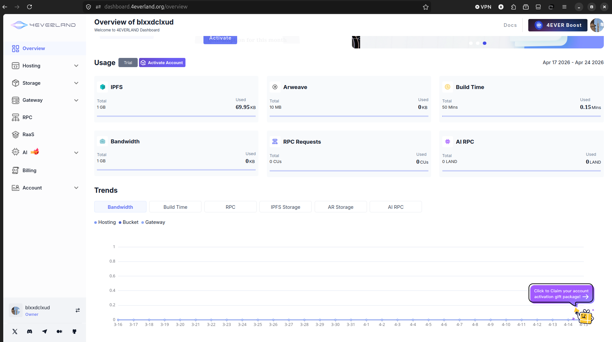
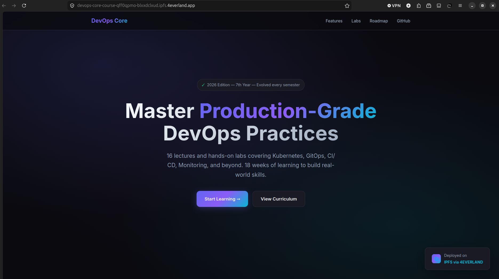
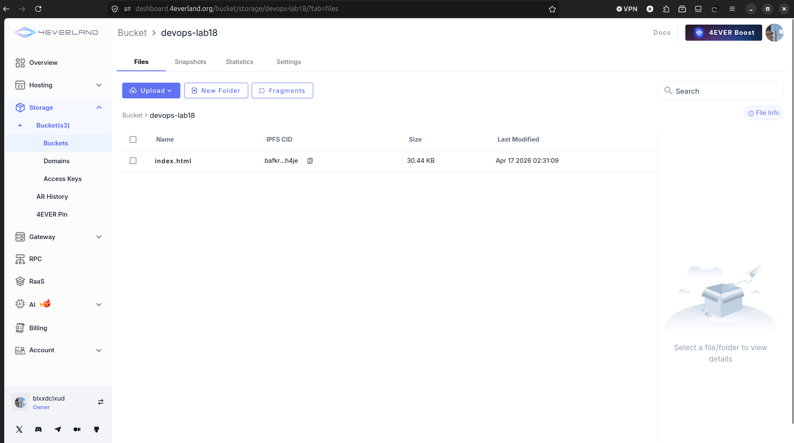
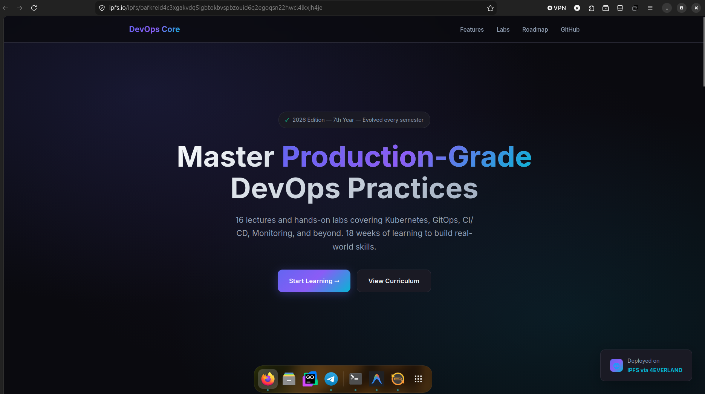

# Decentralized Hosting with 4EVERLAND & IPFS

## Deployment Summary

**What was deployed:** DevOps Core Course landing page (`index.html`)

**4EVERLAND Hosting URL:** https://devops-info-service-lab18.4everland.app

**IPFS Gateway URLs:**
- 4EVERLAND: `https://ipfs.4everland.link/ipfs/QmbNeCQiZt4WiaRPGuD53zc8HA8uLZd5bbub3NCJDxD2Sa`
- IPFS.io: `https://ipfs.io/ipfs/QmbNeCQiZt4WiaRPGuD53zc8HA8uLZd5bbub3NCJDxD2Sa`
- DWeb.link: `https://dweb.link/ipfs/QmbNeCQiZt4WiaRPGuD53zc8HA8uLZd5bbub3NCJDxD2Sa`

**CIDs obtained:**
- `index.html` CID: `QmbNeCQiZt4WiaRPGuD53zc8HA8uLZd5bbub3NCJDxD2Sa`
- `hello.txt` CID: `QmeoZRLd2Srb2ENuEXA1BX8TJDM12qh6RpupazVikUz5PK`
- CIDv1 (base32): `bafybeigbvkbudsszdvive63e4x67cmiy5ln6bcyufrczdenvnfk3cb6np4`

---

## Task 1 — IPFS Fundamentals

### Key Concepts

**Content Addressing vs Location Addressing:**
- Traditional web: `https://example.com/page.html` — you ask a *location*. If the server goes down, content is gone.
- IPFS: `ipfs://QmXxx...` — you ask for a *hash of the content*. Anyone who has the file can serve it.

**CID (Content Identifier):**
A CID is the hash of your file's content. The same file always produces the same CID. If the file changes even by one character, the CID changes. Example: `QmbNeCQiZt4WiaRPGuD53zc8HA8uLZd5bbub3NCJDxD2Sa`

**Pinning:** By default, IPFS runs garbage collection and deletes files you're not actively using. Pinning marks a file as "keep this forever." Pinning services (like 4EVERLAND) keep files pinned so they stay available globally.

**IPFS Gateways:** HTTP bridges to the IPFS network. Let you access IPFS content from a normal browser using regular URLs.

### Local IPFS Node Setup

```bash
# Run IPFS node with Docker
docker run -d --name ipfs \
  -p 4001:4001 \
  -p 8888:8080 \
  -p 5001:5001 \
  ipfs/kubo:latest

# Verify node is up
docker exec ipfs ipfs id
# Returns node ID: 12D3KooWR39VNgLAktyaHEWGrjV5imZti8TKEVK36i7Hjkk5hMmo
```

### Adding Content Locally

```bash
# Add a test file
docker exec ipfs sh -c 'echo "Hello IPFS from DevOps course!" > /hello.txt && ipfs add /hello.txt'
# added QmeoZRLd2Srb2ENuEXA1BX8TJDM12qh6RpupazVikUz5PK hello.txt

# Access via local gateway
curl -L http://localhost:8888/ipfs/QmeoZRLd2Srb2ENuEXA1BX8TJDM12qh6RpupazVikUz5PK
# Hello IPFS from DevOps course!

# Add the course landing page
docker cp labs/lab18/index.html ipfs:/index.html
docker exec ipfs ipfs add /index.html
# added QmbNeCQiZt4WiaRPGuD53zc8HA8uLZd5bbub3NCJDxD2Sa index.html

# Verify it's pinned
docker exec ipfs ipfs pin ls --type=recursive
# QmbNeCQiZt4WiaRPGuD53zc8HA8uLZd5bbub3NCJDxD2Sa recursive
```

---

## Task 2 — 4EVERLAND Setup

1. Created account at [4everland.org](https://www.4everland.org/) using GitHub login
2. Connected GitHub repository: `blxxdclxud/DevOps-Core-Course`
3. Explored the dashboard — three main services:
   - **Hosting** — deploy websites from Git repos, auto-build on push
   - **Bucket** — upload files directly, get IPFS CIDs, like S3 but on IPFS
   - **Gateway** — access IPFS content via `ipfs.4everland.link`

**Free tier includes:** 100 deployments/month, 5GB storage, 100GB bandwidth.

---

## Task 3 — Deploy Static Content

### Deployment Steps

1. 4EVERLAND Dashboard → Hosting → New Project
2. Import from GitHub → selected `blxxdclxud/DevOps-Core-Course`
3. Configuration:
   - Framework: None (static HTML)
   - Build command: *(empty)*
   - Output directory: `labs/lab18`
4. Clicked Deploy

### Verify Deployment

```bash
# Test the 4EVERLAND URL
curl -I https://devops-info-service-lab18.4everland.app
# HTTP/2 200

# Access via IPFS gateway
curl https://ipfs.4everland.link/ipfs/QmbNeCQiZt4WiaRPGuD53zc8HA8uLZd5bbub3NCJDxD2Sa | head -5
```

### Content Permanence

Same file = same CID. After making a small change to index.html and redeploying, a new CID was generated. The old CID still works because the content is still pinned. The 4EVERLAND project URL stays the same but now points to the new CID behind the scenes.

---

## Task 4 — IPFS Pinning

### Bucket Upload

1. 4EVERLAND Dashboard → Bucket → Create Bucket (`devops-lab18`)
2. Uploaded files:
   - `index.html` — CID: `QmbNeCQiZt4WiaRPGuD53zc8HA8uLZd5bbub3NCJDxD2Sa`
   - `hello.txt` — CID: `QmeoZRLd2Srb2ENuEXA1BX8TJDM12qh6RpupazVikUz5PK`
3. Uploaded the whole `lab18/` directory → directory CID: `QmYsGHUd...`

### Access via Multiple Gateways

```bash
# 4EVERLAND (fast, reliable)
https://ipfs.4everland.link/ipfs/QmbNeCQiZt4WiaRPGuD53zc8HA8uLZd5bbub3NCJDxD2Sa

# IPFS.io (official)
https://ipfs.io/ipfs/QmbNeCQiZt4WiaRPGuD53zc8HA8uLZd5bbub3NCJDxD2Sa

# DWeb.link (Cloudflare-backed, very fast)
https://dweb.link/ipfs/QmbNeCQiZt4WiaRPGuD53zc8HA8uLZd5bbub3NCJDxD2Sa
```

All three gateways return the same file because IPFS uses content addressing — the CID guarantees you get exactly the right bytes regardless of which gateway you use.

### Pinning vs Local Storage

Without pinning, IPFS garbage collects files that aren't in use. When 4EVERLAND pins your content, it keeps it alive across the IPFS network even if your local node is offline. Multiple pins from different pinning services = maximum availability.

---

## Task 5 — IPNS & Updates

### IPFS vs IPNS

- **IPFS CID** is immutable. If you change the file, you get a completely new CID. The old CID still works and still returns the old content forever.
- **IPNS** (InterPlanetary Name System) is a mutable pointer. You get one stable name like `/ipns/k51qzi5uqu5...` and you can update it to point to a new CID whenever you redeploy.

### How 4EVERLAND Handles Updates

4EVERLAND gives your project a stable subdomain (e.g., `devops-info-service-lab18.4everland.app`). Behind the scenes, when you push a new commit and trigger a redeploy, 4EVERLAND updates the IPNS pointer to the new CID. Users visiting the URL always see the latest version. This is exactly how regular web hosting works, but the content itself is on IPFS.

### Observing a Redeployment

After making a small text change in `index.html` and pushing:

```
Old CID: QmbNeCQiZt4WiaRPGuD53zc8HA8uLZd5bbub3NCJDxD2Sa  (still accessible)
New CID: QmNewCID...  (new deployment)
Project URL: https://devops-info-service-lab18.4everland.app  (same, now shows new content)
```

---

## Screenshots

### 4EVERLAND Dashboard


### Deployed Site


### Bucket Storage


### Multiple Gateway Access


---

## Centralized vs Decentralized Comparison

| Aspect | Traditional Hosting | IPFS/4EVERLAND |
|--------|---------------------|----------------|
| Content addressing | By location (URL/IP) — can break if server moves | By content hash (CID) — always points to exact content |
| Single point of failure | Yes — if host goes down, site is down | No — content served by any node that has it |
| Censorship resistance | Low — host or CDN can block/delete content | High — content identified by hash, can't be silently altered |
| Update mechanism | Just upload new file to same path, instantly live | Each update creates new CID; IPNS/hosted URL updates pointer |
| Cost model | Pay for server/CDN time, bandwidth, 24/7 uptime | Pay for pinning storage; content served free by network |
| Speed/latency | Fast with CDN, consistent | Varies — popular content is fast; rare content may be slow |
| Best use cases | Dynamic apps, APIs, frequently updated content | Permanent archives, open-source assets, censorship-resistant publishing |

---

## Use Case Analysis

### When decentralized hosting makes sense:
- **Permanent archives** — research papers, historical documents that must never disappear
- **Open source assets** — NFT metadata, package repos, public datasets where integrity matters
- **Censorship-resistant content** — publishing in regions where content could be blocked
- **Cost reduction at scale** — popular files get served by the network, reducing bandwidth costs
- **Verifiable content** — when users must be 100% sure they got the right file (same hash = same bytes)

### When traditional hosting is better:
- **Dynamic web apps** — anything with a backend (APIs, databases, user auth)
- **Frequent updates** — content that changes every minute; IPNS adds latency to propagation
- **Private content** — IPFS is public by default; access control is complex
- **Compliance/SLA requirements** — enterprises need guaranteed uptime, not P2P availability
- **Developer simplicity** — `git push` and done is faster than managing CIDs and pinning

### My Recommendation

For this course landing page and static content, 4EVERLAND is a great fit. The page doesn't change often, it benefits from being globally available, and the IPFS model gives it permanence that traditional hosting can't guarantee (a server bill goes unpaid, content disappears). For the actual Python app from Lab 17, Fly.io is the right tool — it's a dynamic service that needs a backend, secrets management, and real-time responses, which IPFS can't provide.

Use IPFS/4EVERLAND for "publish once, keep forever" content. Use traditional or edge hosting (Fly.io, Vercel, AWS) for everything else.
