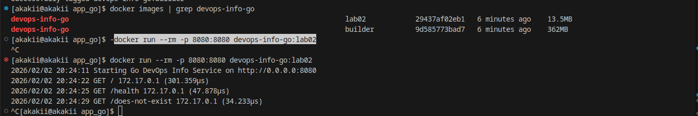
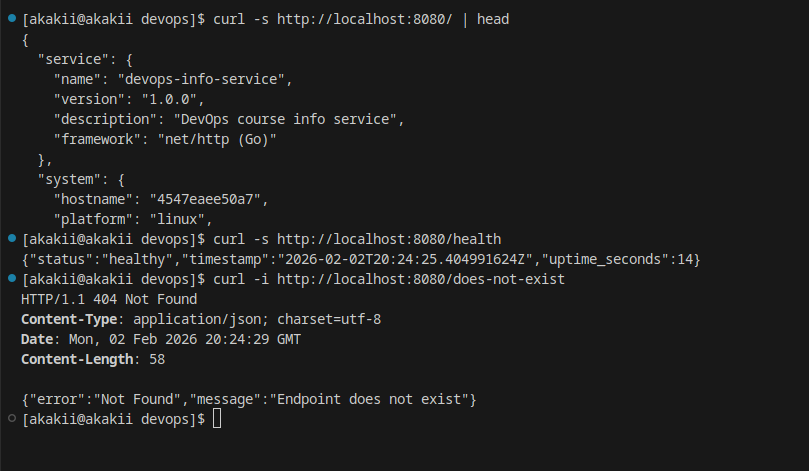

# Lab 2 Report — Docker Containerization (Go Bonus)

- **Name:** Alexander Rozanov
- **Group:** CBS-02
- **Email:** al.rozanov@innopolis.university

## Host / Environment
- **Host (uname -a):**
  ```
  Linux akakii 6.13.8-arch1-1 #1 SMP PREEMPT_DYNAMIC Sun, 23 Mar 2025 17:17:30 +0000 x86_64 GNU/Linux
  ```

---

## 1. Goal of the Bonus Task
The goal of the bonus part of Lab 2 is to containerize the Go implementation using a **multi-stage Docker build**:
- Stage 1 compiles the Go binary
- Stage 2 runs a minimal runtime image
- Demonstrate that multi-stage build reduces final image size

---

## 2. Multi-Stage Docker Build

### 2.1 Builder Stage
The builder stage:
- Uses `golang:*-alpine` as a build environment
- Downloads dependencies using `go mod download`
- Builds a static binary (`CGO_ENABLED=0`) with stripped symbols (`-s -w`)
- Outputs the binary to `/out/devops-info-service`

### 2.2 Runtime Stage
The runtime stage:
- Uses minimal `alpine:3.20`
- Creates and runs as a **non-root** user
- Copies only the compiled binary from the builder stage
- Exposes port `8080`

---

## 3. Size Comparison
Two images were built:
- `devops-info-go:builder` (builder stage) — **362MB**
- `devops-info-go:lab02` (final runtime image) — **13.5MB**

**Evidence:** `screenshots/image_size_compare_with_successful_starting.png`  


---

## 4. Run & Verification

### 4.1 Run container
```bash
docker run --rm -p 8080:8080 devops-info-go:lab02
```

### 4.2 Verify endpoints
Main endpoint:
```bash
curl -s http://localhost:8080/ | head
```

Health check:
```bash
curl -s http://localhost:8080/health
```

404 behavior:
```bash
curl -i http://localhost:8080/does-not-exist
```

**Evidence:** `screenshots/curl_to_custom_image.png`  


---

## 5. Conclusion
The Go application was successfully containerized using a multi-stage Docker build:
- The final image is significantly smaller than the builder image
- The container runs correctly and exposes the required endpoints
- Best practices were applied (minimal runtime, non-root user, multi-stage build)
