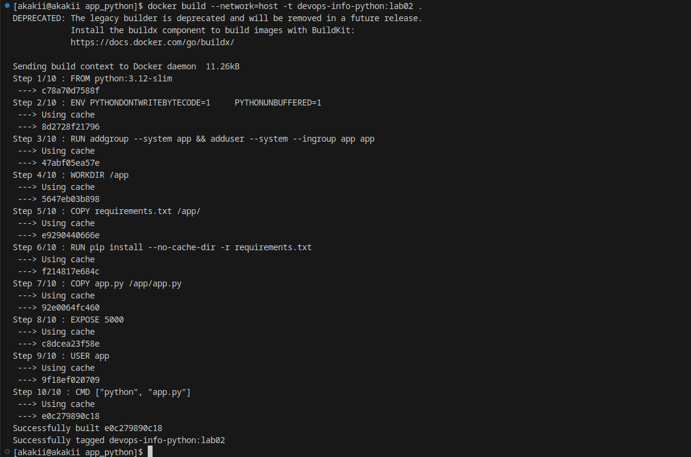
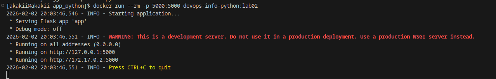
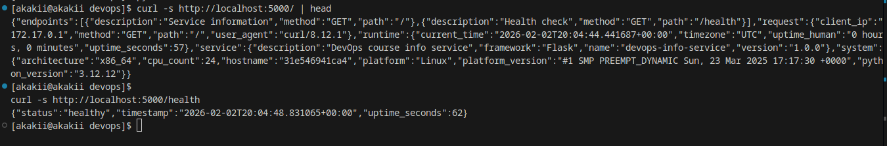
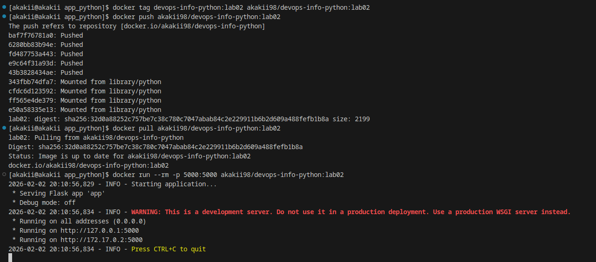
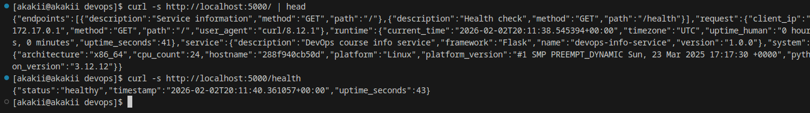

# Lab 2 Report — Docker Containerization (Python)

## Student Information
- **Name:** Alexander Rozanov
- **Group:** CBS-02
- **Email:** al.rozanov@innopolis.university

## Host / Environment
- **Host (uname -a):**
  ```
  Linux akakii 6.13.8-arch1-1 #1 SMP PREEMPT_DYNAMIC Sun, 23 Mar 2025 17:17:30 +0000 x86_64 GNU/Linux
  ```

---

## 1. Goal of the Lab
The goal of Lab 2 is to containerize the Lab 1 application using Docker and:
1. Build a Docker image using a proper `Dockerfile`
2. Run the container and verify endpoints work
3. Push the built image to Docker Hub
4. Pull the image from Docker Hub and verify it runs correctly
5. Follow Docker best practices (pinned base image, non-root user, `.dockerignore`, small context)

---

## 2. Implementation (Python / Flask)

### 2.1 Dockerfile Overview
The `app_python/Dockerfile` follows common best practices:
- Uses a pinned base image: `python:3.12-slim`
- Sets environment variables for better container behavior:
  - `PYTHONDONTWRITEBYTECODE=1`
  - `PYTHONUNBUFFERED=1`
- Creates and uses a **non-root** user (`app`)
- Uses layer caching by copying `requirements.txt` first
- Installs dependencies with `pip --no-cache-dir`
- Copies only runtime files (`app.py`, `requirements.txt`)
- Exposes port `5000`

### 2.2 `.dockerignore`
A `.dockerignore` file was added to reduce build context and avoid shipping unnecessary files:
- Git metadata
- `venv/` folders
- caches and logs
- IDE folders
- documentation and tests (not required for runtime)

---

## 3. Build & Run

### 3.1 Build the Image
Local build command:
```bash
docker build -t devops-info-python:lab02 .
```

During build, the network option `--network=host` was used to avoid DNS resolution issues during dependency installation:
```bash
docker build --network=host -t devops-info-python:lab02 .
```

**Evidence:** `screenshots/successful_docker_build.png`  


### 3.2 Run the Container
Command:
```bash
docker run --rm -p 5000:5000 devops-info-python:lab02
```

**Evidence:** `screenshots/run_shell_custom_image.png`  


---

## 4. Verification (Endpoints)

### 4.1 Test `GET /`
```bash
curl -s http://localhost:5000/ | head
```

### 4.2 Test `GET /health`
```bash
curl -s http://localhost:5000/health
```

**Evidence:** `screenshots/curl_to_custom_image.png`  


---

## 5. Docker Hub Push & Pull

### 5.1 Tag and Push
Image was tagged and pushed to Docker Hub:
```bash
docker tag devops-info-python:lab02 akakii98/devops-info-python:lab02
docker push akakii98/devops-info-python:lab02
```

### 5.2 Pull and Run From Docker Hub
```bash
docker pull akakii98/devops-info-python:lab02
docker run --rm -p 5000:5000 akakii98/devops-info-python:lab02
```

**Evidence (push + pull + run):** `screenshots/successful_pushing_custom_image.png`  


**Evidence (curl tests after pull):** `screenshots/curl_to_pulled_custom_image.png`  


---

## 6. Conclusion
The Python application was successfully containerized and published:
- The Docker image builds and runs correctly
- Both endpoints (`/` and `/health`) work inside the container
- The image was pushed to Docker Hub and verified by pulling and running it again
- Best practices were applied (pinned image, non-root user, `.dockerignore`, minimal context)
