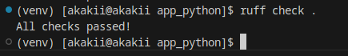
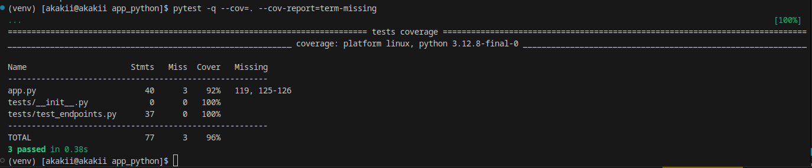
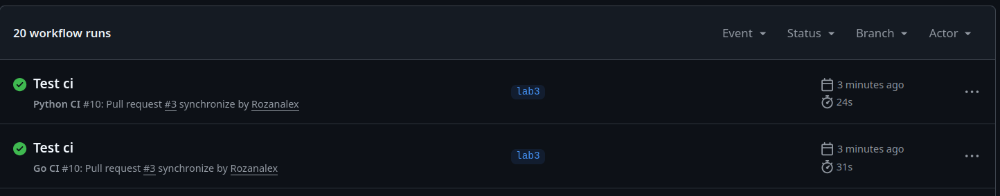
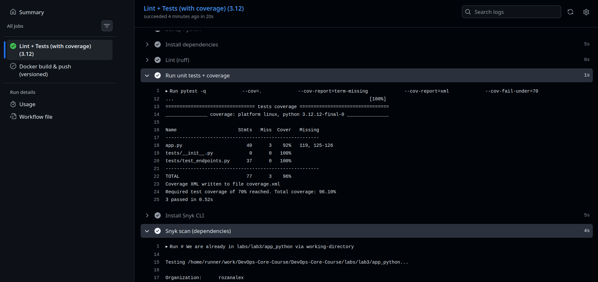
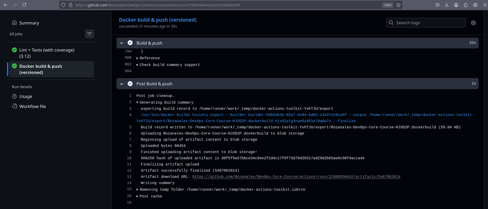

# Lab 3 — Continuous Integration (CI/CD)

**Student:** Alexander Rozanov  
**Email:** al.rozanov@innopolis.university  
**Group:** CBS-02  

---

## Repository Layout (Lab 3)

This lab is implemented inside the course repository under:

- `labs/lab3/app_python` — Python (Flask) application + tests
- `labs/lab3/app_go` — Go application (bonus / multi-app CI)
- `.github/workflows/python-ci.yml` — Python CI workflow
- `.github/workflows/go-ci.yml` — Go CI workflow (bonus)

---

## Task 1 — Unit Testing (Python)

### Testing framework
- **Framework:** `pytest`
- **Why:** concise syntax, fixtures, good ecosystem, easy HTTP endpoint testing for Flask.

### Test structure
- Tests are located in: `labs/lab3/app_python/tests/`
- Main test file: `tests/test_endpoints.py`

### What is covered
The unit tests verify:

- `GET /`
  - returns **200**
  - response is valid JSON
  - required top-level keys exist (service/system/runtime/request/endpoints)
- `GET /health`
  - returns **200**
  - response contains `"status": "healthy"` and timestamps/uptime
- `GET /does-not-exist`
  - returns **404** (error case)

### Local execution
From `labs/lab3/app_python`:

```bash
python -m venv venv
source venv/bin/activate
pip install -r requirements.txt
ruff check .
pytest -q --cov=. --cov-report=term-missing --cov-report=xml
```

### Evidence (screenshots)
- Ruff success: `screenshots/ruff_check_successful.png`

  

- Pytest success: `screenshots/pytest_successful.png`

  

---

## Task 2 — GitHub Actions CI Workflow (Python)

### Workflow file
- `.github/workflows/python-ci.yml`

### Triggers
The workflow runs on:
- `pull_request` to `main/master` (only when `labs/lab3/app_python/**` changes)
- `push` to `main/master` (only when `labs/lab3/app_python/**` changes)
- `workflow_dispatch` (manual run)

This is implemented via **path filters** to avoid unnecessary runs.

### Pipeline stages

#### Job 1: Lint + Tests (with coverage)
Runs on `ubuntu-latest` with **Python 3.12** and includes:
- install dependencies (`pip install -r requirements.txt`)
- lint: `ruff check .`
- tests + coverage: `pytest ... --cov-fail-under=70`
- security scan: `snyk test` (installed via `npm`)

**Result from runner logs (example run):**
- Ruff: `All checks passed!`
- Tests: `3 passed`, total coverage **~96%** (threshold 70% reached)
- Snyk: `Tested 15 dependencies ... no vulnerable paths found`

#### Job 2: Docker build & push (versioned)
Runs **only on push** to `main/master` and only if tests passed.

Versioning strategy:
- **CalVer**: `YYYY.MM.DD-<GITHUB_RUN_NUMBER>`
- Plus additional tags:
  - `latest`
  - `sha-<commit>`

Docker image name:
- `${DOCKERHUB_USERNAME}/devops-info-python:<tag>`

Example tags observed in logs:
- `.../devops-info-python:2026.02.11-11`
- `.../devops-info-python:latest`
- `.../devops-info-python:sha-<commit>`

### Evidence (screenshots)
- Workflow triggered on PR: `screenshots/successful_trigger_actions_on_pr.png`

  

- PR checks example: `screenshots/example_of_python_pr_action.png`

  

- Docker push in Actions: `screenshots/successful_docker_push_in_actions.png`

  

---

## Task 3 — CI Best Practices & Security

### 3.1 Dependency caching
Implemented via `actions/setup-python@v5` with `cache: pip` and cache key based on:
- `labs/lab3/app_python/requirements.txt`

### 3.2 Security scanning (Snyk)
Implemented inside the CI job:
- install CLI: `npm install -g snyk`
- scan: `snyk test --file=requirements.txt --package-manager=pip --severity-threshold=high --skip-unresolved`
- Result (runner logs): **no vulnerable paths found** for the dependency set.

### 3.3 Additional CI best practices applied
- **Concurrency**: cancels previous runs for the same branch/ref (`cancel-in-progress: true`)
- **Path filters**: run only when relevant paths change
- **Separate jobs + gating**: Docker push runs only after tests succeed
- **Conditional deployment**: Docker push only on `main/master` pushes
- **Least privileges**: workflow uses `permissions: contents: read`
- **Docker layer caching**: `cache-from/cache-to type=gha` to speed builds

---

## Go CI (Multi-App Pipeline)

### Workflow file
- `.github/workflows/go-ci.yml`

### What it does
- Runs on PR/push with path filters: `labs/lab3/app_go/**`
- Lint stage: `gofmt` check (must be clean)
- Static analysis: `go vet ./...`
- Tests + coverage output: `go test ./... -coverprofile=coverage.out -covermode=atomic`
- Docker build & push on `main/master` pushes with the same CalVer + `latest` + `sha-...` tags:
  - `${DOCKERHUB_USERNAME}/devops-info-go:<tag>`

### Note about Go coverage
If no unit tests are present, Go will report coverage like `0.0% of statements`.  
(Adding `httptest`-based handler tests will increase coverage.)

---

## Appendix — Required Secrets (GitHub Actions)

Configure these repository secrets:

- `DOCKERHUB_USERNAME`
- `DOCKERHUB_TOKEN`
- `SNYK_TOKEN`

---y