# Lab 4 — Infrastructure as Code (Terraform & Pulumi)
## Local VM Alternative + Terraform Bonus Tasks

**Student:** Alexander Rozanov  
**Email:** al.rozanov@innopolis.university  
**Group:** CBS-02  

---

## 1. Lab Scope and Selected Approach

This lab allows a **Local VM Alternative** (VirtualBox/VMware) if a cloud provider is not used (as stated in `labs/lab04.md`).

For a local VM setup:
- **Task 1 (Terraform VM Creation)** can be replaced with **documented local VM setup**
- **Task 2 (Pulumi VM Recreation)** can be **skipped** (allowed by the course local alternative)
- The VM must still be prepared for **Lab 5 (Ansible)**

### Selected approach for this submission
- **Local VM Alternative (Option 1): VMware VM**
- **Network mode:** NAT with port forwarding
- **Pulumi task:** skipped (allowed by course note for local VM alternative)
- **Bonus tasks completed:**
  - Terraform CI/CD validation workflow (GitHub Actions)
  - Terraform import of existing GitHub repository (`github_repository`)

---

## 2. Local VM Setup (Task 1 replacement for Local VM Alternative)

### 2.1 VMware VM configuration
A local VM was prepared in **VMware** and configured as the target environment for future labs (especially Lab 5 / Ansible).

**Implemented configuration:**
- Ubuntu Linux VM (course-acceptable local VM option)
- SSH server installed and enabled
- SSH public key authentication configured
- NAT networking with port forwarding
- Predictable connection method documented (`ssh -p 2222 ...`)
- Firewall rules prepared for future app deployment (ports 22, 80, 5000)

**Evidence — VM configuration**
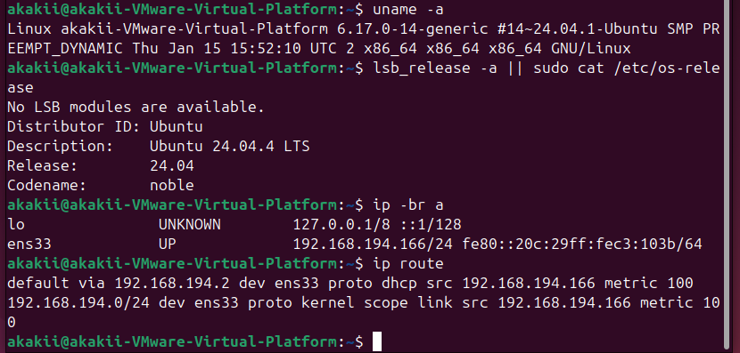

### 2.2 VM network verification (NAT)
The VM network interface was verified successfully in NAT mode.

- Interface: `ens33`
- VM IP observed in the setup: `192.168.194.166/24` (NAT network)

**Evidence — Netplan/IP setup**
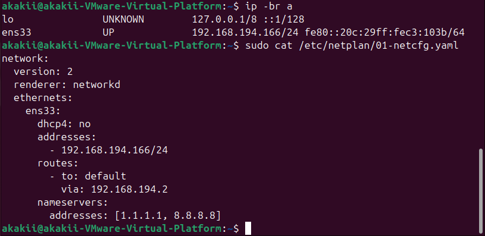

### 2.3 SSH setup and Lab 5 readiness
The VM was prepared for Ansible usage in Lab 5:

- `openssh-server` installed
- SSH service enabled and running
- SSH key-based authentication configured
- Ansible-ready user (`devops`) created
- Remote connection from the host verified
- Required firewall ports opened:
  - `22/tcp`
  - `80/tcp`
  - `5000/tcp`

**Evidence — SSH service running**
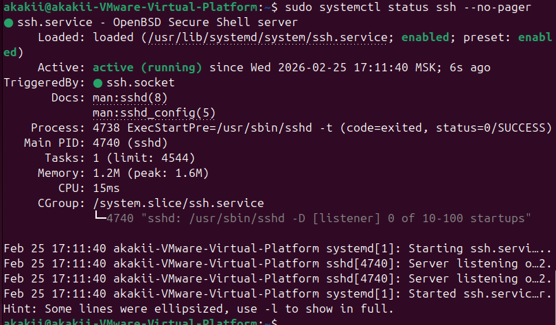

**Evidence — Ansible user (`devops`)**


**Evidence — SSH key added**
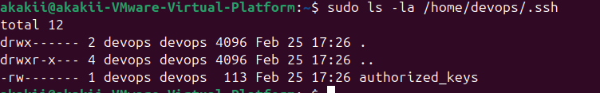

### 2.4 NAT port forwarding (predictable connection method)
Because the VM uses NAT mode, port forwarding was configured in VMware NAT settings.

**Configured mappings (host → guest):**
- `2222 -> 22` (SSH)
- `8080 -> 80` (HTTP)
- `5000 -> 5000` (custom app port)

This provides a stable and predictable access method even if the guest IP changes.

**Evidence — VMware NAT Port Forwarding**
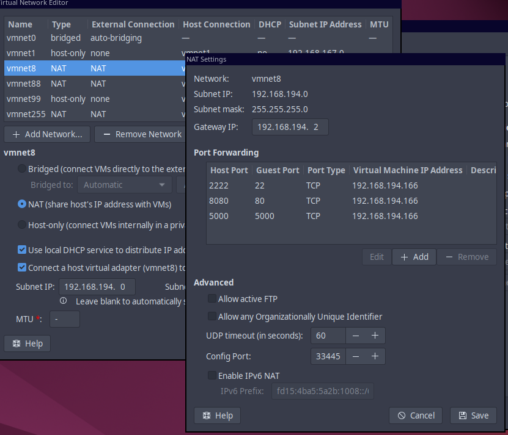

### 2.5 Firewall rules
Firewall rules were configured to allow ports required by the course and upcoming labs.

**Evidence — UFW rules**
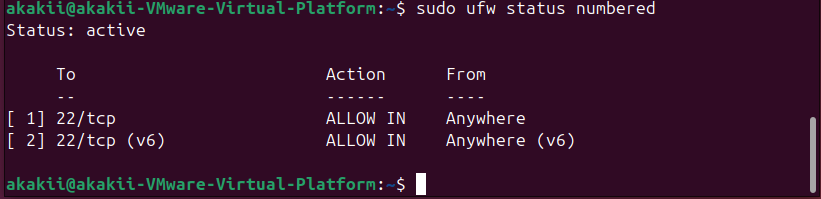

### 2.6 SSH access proof (host → VM)
The VM is accessible from the host machine using NAT port forwarding.

```bash
ssh -p 2222 devops@127.0.0.1
```

This satisfies the course requirement for SSH accessibility proof and confirms readiness for Lab 5 (Ansible).

**Evidence — Successful SSH connection from host**
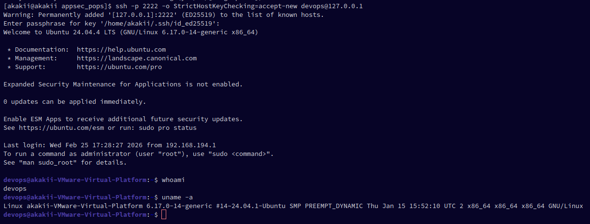

---

## 3. Pulumi Task (Task 2)

### Status: Skipped (Allowed by Local VM Alternative)
The course explicitly allows skipping Pulumi cloud-provider recreation when using a local VM alternative.

**Reasoning:**
- A local VMware VM was prepared and documented as the runtime environment for Lab 5
- The goal of having a VM ready for configuration management is fully satisfied
- Bonus Terraform tasks were completed to demonstrate IaC automation and validation practices

---

## 4. Terraform Bonus Task — Part 1: IaC CI/CD Validation (GitHub Actions)

### 4.1 Terraform project structure
A Terraform project was created under `terraform/` with split configuration files:
- `main.tf`
- `providers.tf`
- `variables.tf`
- `repository.tf`
- `outputs.tf`
- `version.tf`
- `terraform.tfvars.example`

Sensitive/local-only files (`terraform.tfvars`, state files, `.terraform/`) were excluded from Git.

**Evidence — Terraform directory tree**
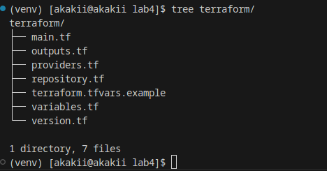

### 4.2 Terraform validation workflow
A GitHub Actions workflow was implemented:
- **File:** `.github/workflows/terraform-ci.yml`

It runs:
- `terraform fmt -check -recursive`
- `terraform init -backend=false`
- `terraform validate`
- `tflint --recursive`

### 4.3 Path filters and specific triggering
Path-based triggers were configured so Terraform CI runs only for relevant Terraform/workflow changes.

**Evidence — specific trigger / path filters**
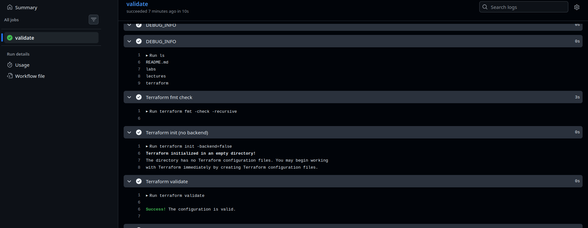

### 4.4 Validation results
Terraform initialization and validation were executed successfully (locally and in CI after path fix).

**Evidence — successful Terraform validate**
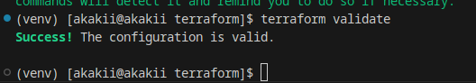

**Evidence — successful Terraform CI result**
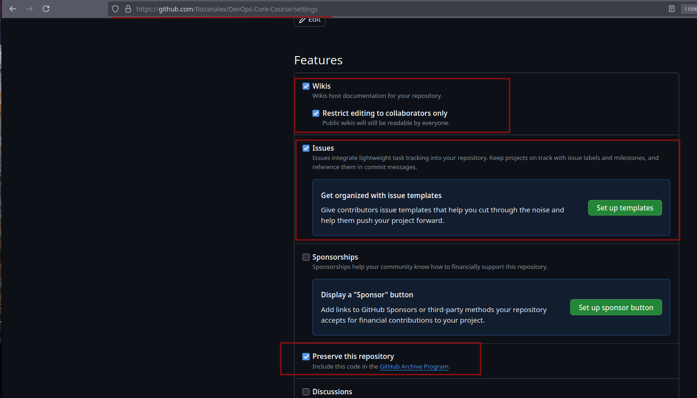

---

## 5. Terraform Bonus Task — Part 2: Import Existing GitHub Repository

### 5.1 Objective
The bonus task requires importing an existing GitHub repository into Terraform state and then managing it through IaC.

### 5.2 GitHub provider configuration and token handling
The GitHub provider (`integrations/github`) was configured with:
- `owner` from Terraform variable (`github_owner`)
- authentication via `GITHUB_TOKEN` environment variable (not committed)

**Evidence — exporting GitHub PAT**
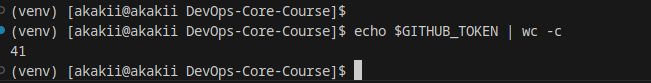

### 5.3 Import execution
Terraform was initialized and the existing repository was imported into state.

**Important implementation note:**  
After troubleshooting, the import command was corrected to use the repository identifier format expected by the configured provider behavior (provider already had the owner configured).

**Evidence — successful Terraform import**
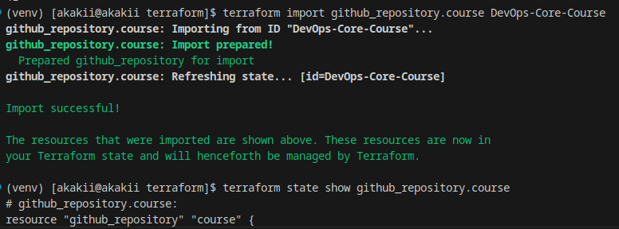

### 5.4 Plan review after import
After import:
- `terraform state show github_repository.course` was used to inspect imported state
- `terraform plan` was run to compare Terraform config with the current repository configuration
- Any differences can be aligned in code or handled through `lifecycle.ignore_changes`

**Evidence — Terraform plan after import**
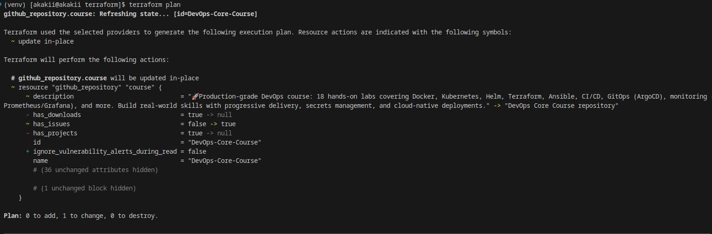

### 5.5 Apply (repository settings management)
Terraform apply was executed to manage repository settings according to the Terraform configuration.

**Evidence — Terraform apply**
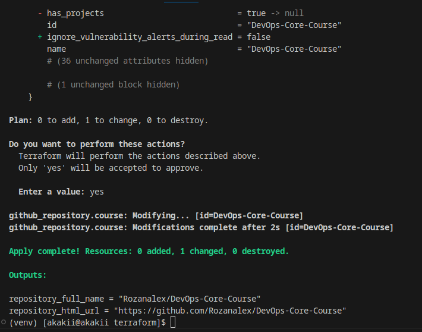

---

## 6. Security and Repository Hygiene

### 6.1 Sensitive files excluded from Git
The repository was configured to avoid committing secrets and local state:
- `terraform.tfvars`
- `*.tfstate`
- `*.tfstate.*`
- `.terraform/`

### 6.2 Secrets handling
Sensitive values were handled through environment variables and local-only files:
- `GITHUB_TOKEN` exported locally
- no tokens/secrets committed to the repository

---

## 7. Lab 5 Preparation Status (Required by Lab 4)

The VM prepared in this lab is ready to be used as an Ansible target in Lab 5.

### Planned connection method for Lab 5
```bash
ssh -p 2222 devops@127.0.0.1
```

### Readiness summary
- Local VMware VM prepared
- SSH enabled and verified
- SSH key authentication configured
- NAT port forwarding configured (2222/8080/5000)
- Firewall rules configured (22/80/5000)

---

## 8. What Was Completed (Checklist Summary)

### Main lab (Local VM Alternative path)
- [x] Local VM created in VMware (allowed alternative)
- [x] VM network configured (NAT)
- [x] SSH server installed and enabled
- [x] SSH public key authentication configured
- [x] Predictable access method configured (NAT port forwarding)
- [x] SSH access from host verified
- [x] Firewall ports 22/80/5000 configured
- [x] Lab 5 VM plan documented
- [x] Pulumi skipped per local VM alternative note (documented)

### Bonus tasks
- [x] Terraform project created (`terraform/`)
- [x] Terraform CI workflow added (`.github/workflows/terraform-ci.yml`)
- [x] Workflow includes `fmt`, `validate`, and `tflint`
- [x] Path filters configured
- [x] GitHub provider configured
- [x] Existing GitHub repository imported into Terraform state
- [x] `terraform plan` reviewed after import
- [x] `terraform apply` executed
- [x] Import purpose/benefits documented

---

## 9. Conclusion

This lab was completed using the **Local VM Alternative** explicitly allowed by the course instructions. The local VMware VM was correctly prepared for Lab 5 (Ansible), including SSH access, key authentication, firewall rules, and a predictable NAT port-forwarded connection method.

In addition, both **bonus Terraform tasks** were completed:
- Infrastructure validation CI workflow in GitHub Actions
- Terraform import and management of an existing GitHub repository

The submission demonstrates practical IaC concepts (validation, CI automation, state import, plan/apply workflow) while using a local VM as the runtime target for upcoming configuration management tasks.