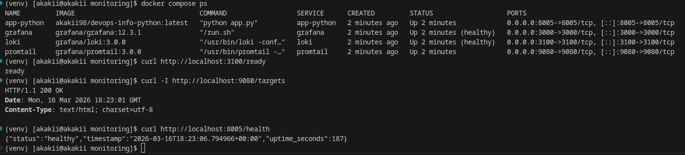
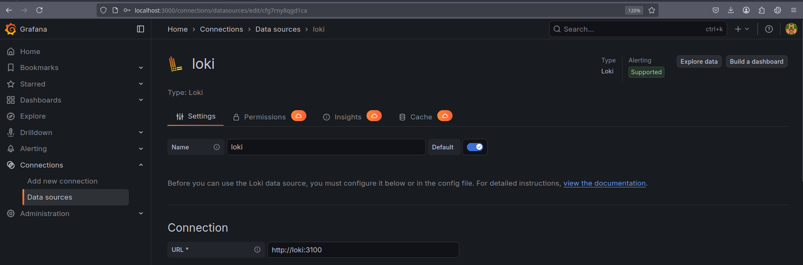
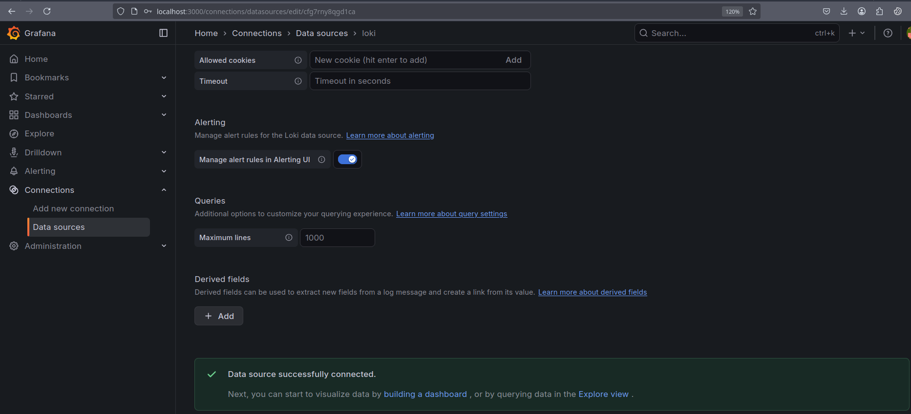
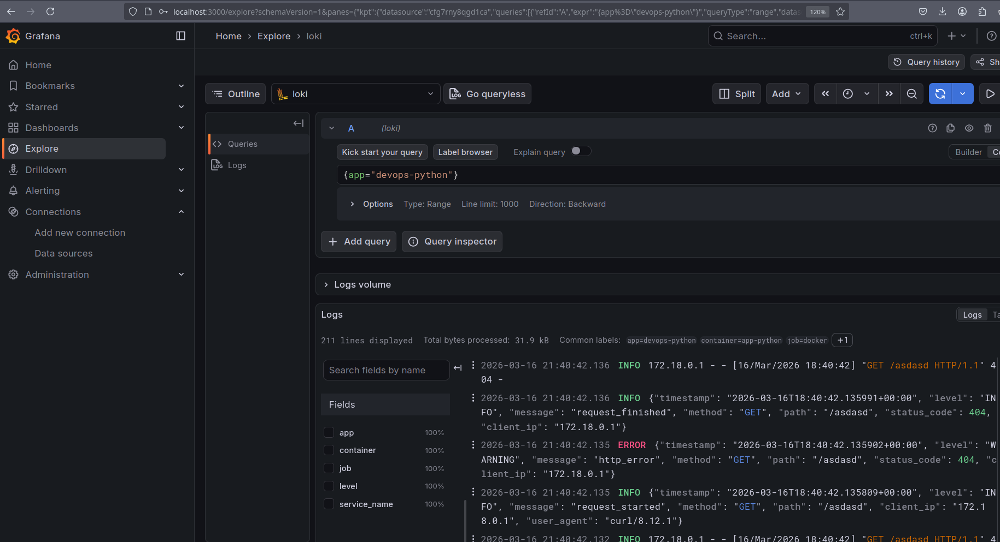
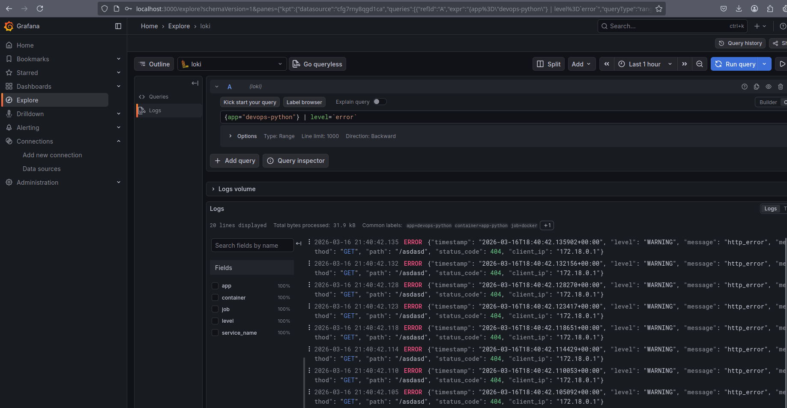
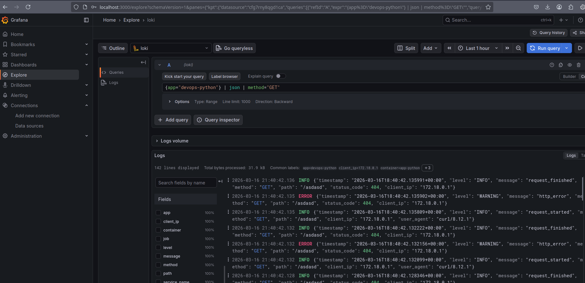
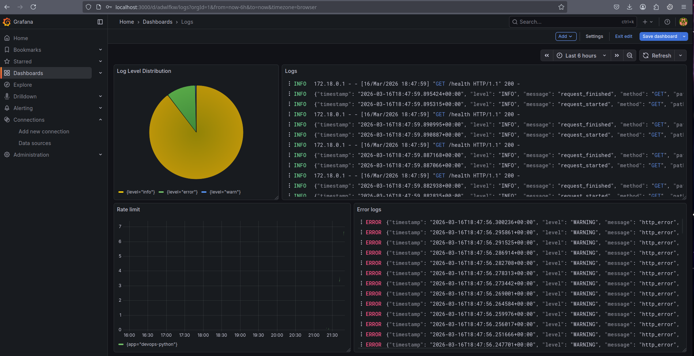
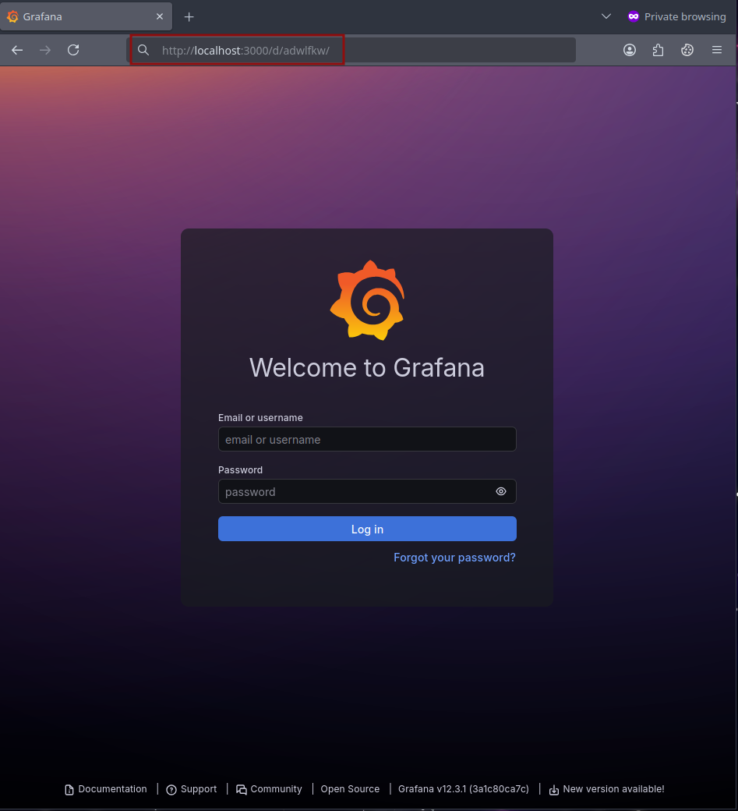
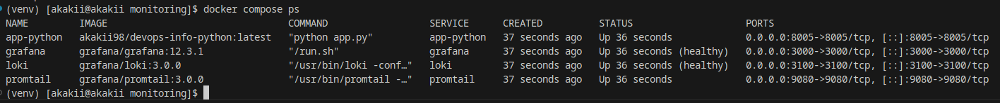

# Lab 7 — Observability & Logging with Loki Stack

**Student:** Alexander Rozanov  
**Email:** al.rozanov@innopolis.university  
**Group:** CBS-02  

---

## 1. Architecture

```mermaid
flowchart LR
  A[App containers (Docker logs)] --> P[Promtail]
  P --> L[Loki (TSDB)]
  L --> G[Grafana (LogQL / Dashboards)]
```

- **Promtail** discovers Docker containers and ships logs to **Loki**.
- **Grafana** queries Loki using **LogQL** and displays logs/dashboards.

---

## 2. Setup Guide

### 2.1 Project structure
```
monitoring/
├── docker-compose.yml
├── .env.example
├── loki/
│   └── config.yml
├── promtail/
│   └── config.yml
└── docs/
    ├── LAB07.md
    └── screenshots/
```

### 2.2 Start the stack
From `monitoring/`:
```bash
docker compose up -d
docker compose ps
```

### 2.3 Health checks required by the task
```bash
curl http://localhost:3100/ready
curl -I http://localhost:9080/targets
```

**Evidence — stack running + checks**


---

## 3. Loki Configuration (TSDB + retention)

### 3.1 Key requirements implemented
- Loki image: `grafana/loki:3.0.0`
- Storage: **TSDB + filesystem**
- Schema: **v13**
- Retention: **168h**
- Compactor enabled for retention cleanup

**File:** `monitoring/loki/config.yml`
```yaml
auth_enabled: false

server:
  http_listen_port: 3100

common:
  path_prefix: /loki
  replication_factor: 1
  ring:
    kvstore:
      store: inmemory
  storage:
    filesystem:
      chunks_directory: /loki/chunks
      rules_directory: /loki/rules

schema_config:
  configs:
    - from: "2020-10-24"
      store: tsdb
      object_store: filesystem
      schema: v13
      index:
        prefix: index_
        period: 24h

storage_config:
  tsdb_shipper:
    active_index_directory: /loki/tsdb-index
    cache_location: /loki/tsdb-cache

limits_config:
  retention_period: 168h

compactor:
  working_directory: /loki/compactor
  retention_enabled: true
  delete_request_store: filesystem
```

---

## 4. Promtail Configuration (Docker discovery + labels)

### 4.1 Key requirements implemented
- Promtail image: `grafana/promtail:3.0.0`
- Docker service discovery via `docker_sd_configs`
- Filter only containers with label: `logging=promtail`
- Relabel Docker container name into label `container`
- Copy Docker label `app` into Loki label `app`

**File:** `monitoring/promtail/config.yml`
```yaml
server:
  http_listen_port: 9080
  grpc_listen_port: 0

positions:
  filename: /tmp/positions.yaml

clients:
  - url: http://loki:3100/loki/api/v1/push

scrape_configs:
  - job_name: docker
    docker_sd_configs:
      - host: unix:///var/run/docker.sock
        refresh_interval: 5s
        filters:
          - name: label
            values: ["logging=promtail"]

    relabel_configs:
      # container name -> label "container" (strip leading '/')
      - source_labels: [__meta_docker_container_name]
        regex: "/(.*)"
        target_label: container
        replacement: "$1"

      # copy label "app" -> Loki label "app"
      - source_labels: [__meta_docker_container_label_app]
        target_label: app

      - target_label: job
        replacement: docker

      # log path
      - source_labels: [__meta_docker_container_log_path]
        target_label: __path__
```

---

## 5. Docker Compose Stack

### 5.1 Services and versions
- Loki: `grafana/loki:3.0.0` (port 3100)
- Promtail: `grafana/promtail:3.0.0` (port 9080)
- Grafana: `grafana/grafana:12.3.1` (port 3000)
- Application container: `app-python`

> Note: the application is exposed on **port 8005** (host and container) because other ports were already occupied.

**File:** `monitoring/docker-compose.yml`
```yaml
services:
  loki:
    image: grafana/loki:3.0.0
    container_name: loki
    command: -config.file=/etc/loki/config.yml
    ports:
      - "3100:3100"
    volumes:
      - ./loki/config.yml:/etc/loki/config.yml:ro
      - loki-data:/loki
    networks: [logging]
    restart: unless-stopped
    labels:
      logging: "promtail"
      app: "loki"
    healthcheck:
      test: ["CMD-SHELL", "wget -qO- http://localhost:3100/ready >/dev/null 2>&1 || exit 1"]
      interval: 10s
      timeout: 5s
      retries: 5
      start_period: 10s
    deploy:
      resources:
        limits:
          cpus: "1.0"
          memory: 1G
        reservations:
          cpus: "0.5"
          memory: 512M

  promtail:
    image: grafana/promtail:3.0.0
    container_name: promtail
    command: -config.file=/etc/promtail/config.yml
    volumes:
      - ./promtail/config.yml:/etc/promtail/config.yml:ro
      - /var/run/docker.sock:/var/run/docker.sock:ro
      - /var/lib/docker/containers:/var/lib/docker/containers:ro
    ports:
      - "9080:9080"
    networks: [logging]
    depends_on: [loki]
    restart: unless-stopped
    labels:
      logging: "promtail"
      app: "promtail"
    deploy:
      resources:
        limits:
          cpus: "0.5"
          memory: 512M
        reservations:
          cpus: "0.25"
          memory: 256M

  grafana:
    image: grafana/grafana:12.3.1
    container_name: grafana
    ports:
      - "3000:3000"
    env_file:
      - .env
    networks: [logging]
    depends_on: [loki]
    volumes:
      - grafana-data:/var/lib/grafana
    restart: unless-stopped
    labels:
      logging: "promtail"
      app: "grafana"
    healthcheck:
      test: ["CMD-SHELL", "wget -qO- http://localhost:3000/api/health >/dev/null 2>&1 || exit 1"]
      interval: 10s
      timeout: 5s
      retries: 10
      start_period: 20s
    deploy:
      resources:
        limits:
          cpus: "1.0"
          memory: 1G
        reservations:
          cpus: "0.5"
          memory: 512M

  app-python:
    image: akakii98/devops-info-python:latest
    container_name: app-python
    environment:
      HOST: "0.0.0.0"
      PORT: "8005"
    ports:
      - "8005:8005"
    networks: [logging]
    labels:
      logging: "promtail"
      app: "devops-python"
    restart: unless-stopped
    deploy:
      resources:
        limits:
          cpus: "0.5"
          memory: 512M
        reservations:
          cpus: "0.25"
          memory: 256M

networks:
  logging:
    driver: bridge

volumes:
  loki-data:
  grafana-data:
```

---

## 6. Grafana Data Source (Loki)

Loki data source was added in Grafana with URL `http://loki:3100`.

**Evidence — add Loki data source**


**Evidence — data source connected successfully**


---

## 7. Application Integration and Structured Logs

### 7.1 Container labels for Promtail filtering
The application container includes:
- `logging: "promtail"` (Promtail filter)
- `app: "devops-python"` (used in LogQL queries)

### 7.2 LogQL queries required by the task
1) Logs for the application:
```logql
{app="devops-python"}
```

**Evidence**


2) Error logs:
```logql
{app="devops-python"} |= "ERROR"
```

**Evidence**


3) Parse JSON and filter GET requests:
```logql
{app="devops-python"} | json | method="GET"
```

**Evidence**


---

## 8. Dashboard (4 panels)

A Grafana dashboard was created with four panels:
- **Logs** (table)
- **Request rate / rate graph** (time series)
- **Error logs** (filtered view)
- **Log level distribution** (pie)

**Evidence — dashboard with 4 panels**


---

## 9. Production Readiness

### 9.1 Resource limits
Resource limits (`cpus`, `memory`) were added for core stack services.

### 9.2 Grafana security
Anonymous access is disabled and Grafana uses admin credentials via `.env`.
**File:** `monitoring/.env.example`
```env
GF_AUTH_ANONYMOUS_ENABLED=false
GF_SECURITY_ADMIN_USER=admin
GF_SECURITY_ADMIN_PASSWORD=change_me_strong
```

**Evidence — anonymous disabled (login page)**


### 9.3 Health checks
Health checks were added for:
- Loki: `/ready`
- Grafana: `/api/health`

**Evidence — docker compose ps shows healthy**


---

## 10. Compliance Check vs. Lab Requirements

### Task 1 (Deploy Loki Stack)
- [x] Correct images/ports/stack services
- [x] Persistent volumes + shared network
- [x] `curl /ready` and Promtail `/targets` evidence present
- [x] Grafana Loki data source configured and query executed
- [x] logs from at least 3 containers
### Task 2 (Integrate Applications)
- [x] App container joined `logging` network and uses required labels
- [x] Structured JSON logs are queryable via `| json`
- [!] Port in the task statement is 8000; in this submission the app runs on **8005** due to local port conflicts.  
  This does not affect Loki/Promtail integration, but if the grader checks port numbers strictly, map **host 8005 → container 8000**.

### Task 3 (Dashboard)
- [x] 4 panels created and populated with data (screenshot provided)

### Task 4 (Production readiness)
- [x] Anonymous disabled and admin password via `.env` (example file included)
- [x] Health checks configured and services show healthy
- [x] The task example includes reservations in addition to imits
