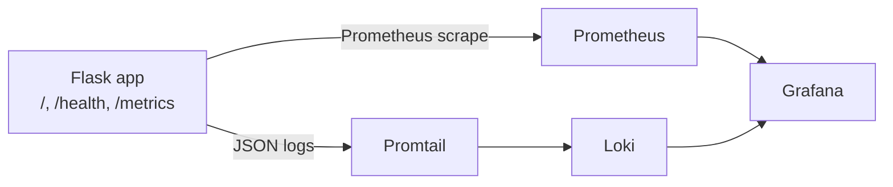
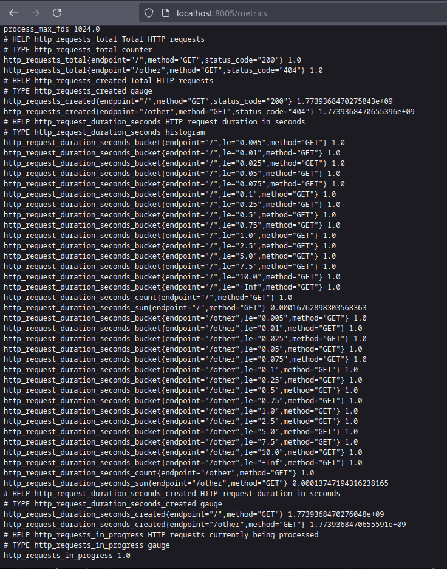
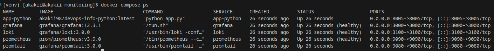
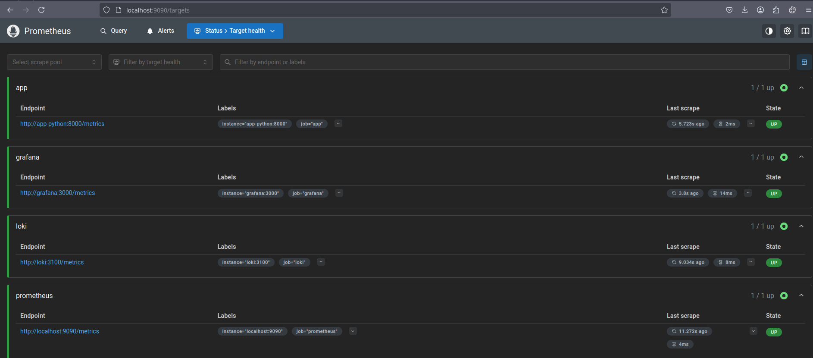
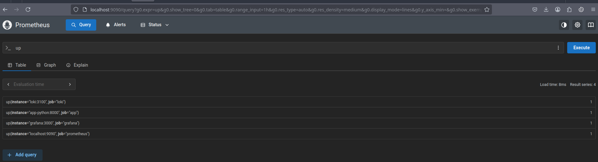
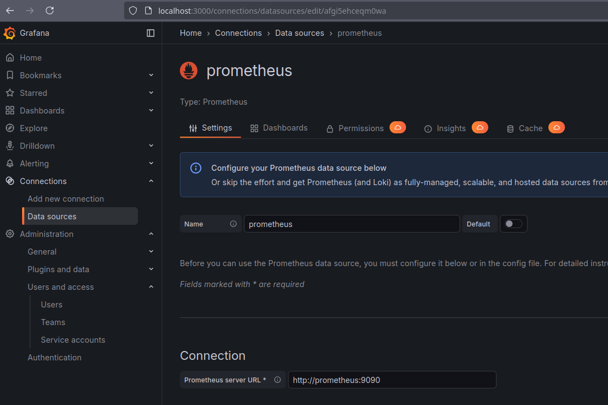
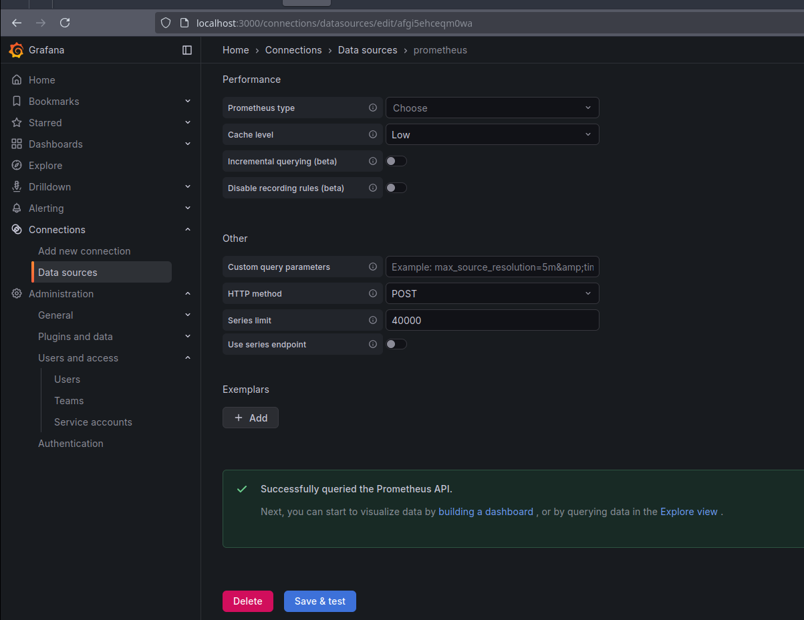
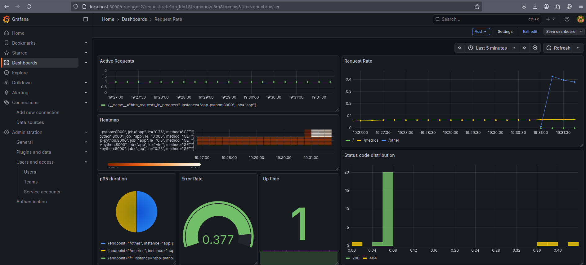
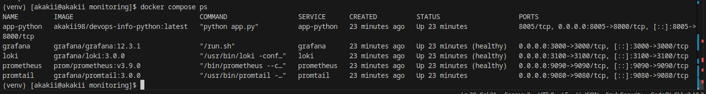

# Lab 8 — Metrics & Monitoring with Prometheus

**Student:** Alexander Rozanov  
**Email:** al.rozanov@innopolis.university  
**Group:** CBS-02  

---

## 1. Repository Layout

This lab is implemented in the following repository locations:

- `labs/lab3/app_python/` — instrumented Python/Flask application
- `labs/lab3/app_python/app.py` — metrics, `/metrics` endpoint, structured logging
- `labs/lab3/app_python/requirements.txt` — includes `prometheus-client`
- `labs/lab7_8/monitoring/docker-compose.yml` — monitoring stack
- `labs/lab7_8/monitoring/prometheus/prometheus.yml` — Prometheus scrape config
- `labs/lab7_8/monitoring/loki/config.yml` — Loki configuration reused from Lab 7
- `labs/lab7_8/monitoring/promtail/config.yml` — Promtail configuration reused from Lab 7
- `labs/lab7_8/monitoring/docs/dashboards/app-metrics-dashboard.json` — exported Grafana dashboard

---

## 2. Architecture

The monitoring flow for this lab is shown below.



### Monitoring flow summary
- The Flask application exposes business and HTTP metrics on `/metrics`.
- Prometheus scrapes the application and infrastructure targets every 15 seconds.
- Promtail continues collecting container logs from Lab 7 and sends them to Loki.
- Grafana is used for both logs and metrics visualization.
- This gives a combined observability setup: **logs for detailed events** and **metrics for trends, rates, and latency**.

### Metrics vs logs
- **Metrics** are better for dashboards, trend analysis, alerting, request rate, error rate, and latency.
- **Logs** are better for debugging individual requests, tracing failures, and viewing exact structured events.
- In this lab both approaches are available in the same stack.

---

## 3. Task 1 — Application Instrumentation

### 3.1 Prometheus client dependency
The application dependencies were extended with:

```txt
prometheus-client==0.23.1
```

This dependency is present in:
- `labs/lab3/app_python/requirements.txt`

### 3.2 Implemented metrics
The Flask application exposes three core Prometheus metrics aligned with the RED method.

#### Counter
```python
http_requests_total = Counter(
    "http_requests_total",
    "Total HTTP requests",
    ["method", "endpoint", "status_code"],
)
```
Used to count total HTTP requests by:
- method
- normalized endpoint
- status code

#### Histogram
```python
http_request_duration_seconds = Histogram(
    "http_request_duration_seconds",
    "HTTP request duration in seconds",
    ["method", "endpoint"],
)
```
Used to measure request latency distribution.

#### Gauge
```python
http_requests_in_progress = Gauge(
    "http_requests_in_progress",
    "HTTP requests currently being processed",
)
```
Used to observe currently active requests.

### 3.3 `/metrics` endpoint
A dedicated metrics endpoint was implemented:

```python
@app.route("/metrics", methods=["GET"])
def metrics():
    return generate_latest(), 200, {"Content-Type": CONTENT_TYPE_LATEST}
```

This endpoint returns Prometheus-formatted output and is scraped by Prometheus.

### 3.4 Request instrumentation logic
The application uses Flask request hooks:
- `before_request` stores request start time and increments in-progress gauge
- `after_request` records:
  - total request count
  - request duration
  - final response status
- endpoint names are normalized to keep label cardinality low

Implemented normalization:
- `/`
- `/health`
- `/metrics`
- any other path becomes `/other`

This avoids exploding label cardinality, which is a key Prometheus best practice.

### 3.5 Structured logging preserved from Lab 7
The application still outputs JSON logs to stdout using a custom formatter. As a result:
- Lab 7 logging stack remains compatible
- Lab 8 adds metrics without removing structured log observability

### 3.6 Evidence — metrics endpoint output
The `/metrics` endpoint was verified and returns Prometheus-formatted metrics.



---

## 4. Task 2 — Prometheus Setup

### 4.1 Docker Compose service
Prometheus was added to the existing monitoring stack in `monitoring/docker-compose.yml`.

Main properties:
- image: `prom/prometheus:v3.9.0`
- published port: `9090:9090`
- mounted config: `./prometheus/prometheus.yml:/etc/prometheus/prometheus.yml:ro`
- persistent volume: `prometheus-data:/prometheus`
- retention settings:
  - `--storage.tsdb.retention.time=15d`
  - `--storage.tsdb.retention.size=10GB`

### 4.2 Prometheus scrape configuration
The file `monitoring/prometheus/prometheus.yml` defines four scrape jobs:

```yaml
global:
  scrape_interval: 15s
  evaluation_interval: 15s

scrape_configs:
  - job_name: "prometheus"
    static_configs:
      - targets: ["localhost:9090"]

  - job_name: "app"
    metrics_path: "/metrics"
    static_configs:
      - targets: ["app-python:8000"]

  - job_name: "loki"
    metrics_path: "/metrics"
    static_configs:
      - targets: ["loki:3100"]

  - job_name: "grafana"
    metrics_path: "/metrics"
    static_configs:
      - targets: ["grafana:3000"]
```

### 4.3 Stack startup
The updated stack was started successfully with Docker Compose.



### 4.4 Prometheus targets status
Prometheus successfully discovered and scraped all configured targets. The `/targets` page shows them as **UP**.



### 4.5 PromQL verification
The basic `up` query was executed successfully to verify that all targets are being scraped.



---

## 5. Task 3 — Grafana Dashboards

### 5.1 Prometheus data source configuration
Grafana was configured to use Prometheus as a data source with the internal Docker Compose URL:

```text
http://prometheus:9090
```

**Evidence — Prometheus data source setup**



**Evidence — successful connection**



### 5.2 Exported dashboard
The custom dashboard was exported to:

- `monitoring/docs/dashboards/app-metrics-dashboard.json`

### 5.3 Dashboard panels
The exported dashboard contains seven working panels:

1. **Active Requests**  
   Query:
   ```promql
   http_requests_in_progress
   ```

2. **Request Rate**  
   Query:
   ```promql
   sum(rate(http_requests_total[5m])) by (endpoint)
   ```

3. **Heatmap**  
   Query:
   ```promql
   rate(http_request_duration_seconds_bucket[5m])
   ```

4. **Status code distribution**  
   Query:
   ```promql
   sum by (status_code) (rate(http_requests_total[5m]))
   ```

5. **p95 duration**  
   Query:
   ```promql
   histogram_quantile(0.95, rate(http_request_duration_seconds_bucket[5m]))
   ```

6. **Error Rate**  
   Query:
   ```promql
   sum(rate(http_requests_total{status_code=~"4.."}[5m]))
   ```

7. **Up time**  
   Query:
   ```promql
   up{job="app"}
   ```

### 5.4 Dashboard walkthrough
The dashboard visualizes the most important parts of service behavior:
- current concurrency through **Active Requests**
- throughput through **Request Rate**
- latency distribution through **Heatmap**
- response classes through **Status code distribution**
- latency percentile through **p95 duration**
- error-like traffic through **Error Rate**
- service availability through **Up time**

### 5.5 Evidence — dashboard working with live data



Additional evidence after the stack was running and scraping data continuously:


---

## 6. PromQL Examples

Below are PromQL queries that were used or are directly applicable to this lab setup.

### 6.1 Check if targets are alive
```promql
up
```
Shows whether each scrape target is reachable.

### 6.2 Request rate per endpoint
```promql
sum(rate(http_requests_total[5m])) by (endpoint)
```
Shows how frequently each endpoint is called.

### 6.3 Status code distribution
```promql
sum by (status_code) (rate(http_requests_total[5m]))
```
Shows the response mix grouped by HTTP status code.

### 6.4 Current in-progress requests
```promql
http_requests_in_progress
```
Shows the number of requests currently being processed.

### 6.5 95th percentile latency
```promql
histogram_quantile(0.95, rate(http_request_duration_seconds_bucket[5m]))
```
Used to visualize tail latency.

### 6.6 Detect client or server error traffic
```promql
sum(rate(http_requests_total{status_code=~"4..|5.."}[5m]))
```
Shows non-success traffic over time.

### 6.7 Check application availability only
```promql
up{job="app"}
```
Shows whether the application target is currently reachable by Prometheus.

---

## 7. Task 4 — Production-Oriented Configuration

### 7.1 Health checks
Health checks were configured in `docker-compose.yml` for the core monitoring services:
- **Loki** — `http://localhost:3100/ready`
- **Grafana** — `http://localhost:3000/api/health`
- **Prometheus** — `http://localhost:9090/-/healthy`

The application also exposes a functional health endpoint:
- `GET /health`

In the current Compose file, the application container is operational and scraped successfully by Prometheus, while the explicit Docker health status is configured for the main monitoring services.

**Evidence — running/healthy services**



### 7.2 Resource limits
Resource limits and reservations were configured for all services in the Compose stack.

Examples:
- **Loki:** up to `1.0 CPU`, `1G RAM`
- **Prometheus:** up to `1.0 CPU`, `1G RAM`
- **Grafana:** up to `1.0 CPU`, `1G RAM`
- **app-python:** up to `0.5 CPU`, `512M RAM`
- **promtail:** up to `0.5 CPU`, `512M RAM`

### 7.3 Retention policies
Two retention configurations are present in the stack:

#### Prometheus
Configured through container command arguments:
- retention time: `15d`
- retention size: `10GB`

#### Loki
Configured in `loki/config.yml`:
- retention period: `168h` (7 days)
- compactor retention enabled

This balances:
- persistence
- disk usage control
- acceptable history for course-scale monitoring

### 7.4 Persistent volumes
Persistent named volumes are configured:

```yaml
volumes:
  loki-data:
  grafana-data:
  prometheus-data:
```

These preserve:
- log data
- Grafana state and dashboards
- Prometheus time-series data

---

## 8. Testing Results

### 8.1 Stack deployment
- Docker Compose stack started successfully
- All required monitoring components were launched
- Prometheus UI was accessible on port `9090`
- Grafana UI was accessible on port `3000`
- Application metrics were available through the `/metrics` endpoint

### 8.2 Scraping verification
- Prometheus successfully scraped:
  - itself
  - the Flask application
  - Loki
  - Grafana
- The `/targets` page showed working targets
- The `up` query confirmed active scraping

### 8.3 Dashboard verification
- Grafana successfully connected to Prometheus
- Dashboard panels were populated with live data
- The exported dashboard JSON is included in the repository

### 8.4 Evidence summary
- `/metrics` output screenshot
- successful Compose startup screenshot
- `/targets` screenshot with all targets UP
- PromQL `up` query screenshot
- Grafana data source screenshots
- dashboard screenshots with live data
- `docker compose ps` screenshot with healthy services

---

## 9. Challenges & Solutions

### 9.1 Keeping metrics labels low-cardinality
**Challenge:** raw paths can create too many unique series.  
**Solution:** a `normalize_endpoint()` function was added so only known endpoints are labeled directly and everything else is mapped to `/other`.

### 9.2 Reusing the Lab 7 stack without breaking logging
**Challenge:** metrics needed to be added without losing the existing Loki/Promtail setup.  
**Solution:** JSON logging was preserved and Prometheus was added as a parallel observability layer.

### 9.3 Internal networking between containers
**Challenge:** Prometheus must scrape containers by internal Docker network name, not host loopback.  
**Solution:** service names such as `app-python:8000`, `loki:3100`, and `grafana:3000` were used in `prometheus.yml`.

### 9.4 Verifying live data end-to-end
**Challenge:** dashboard panels remain empty until metrics are generated and scraped.  
**Solution:** the stack was started, requests were made to the application, then Prometheus and Grafana were verified step by step through `/targets`, `up`, and dashboard panels.

---

## 10. Bonus Task Status

The **Ansible automation bonus** for Lab 8 was **not implemented** in this submission.

The work completed for this lab focuses on:
- application instrumentation
- Prometheus deployment
- Grafana integration
- production-oriented Compose configuration
- exported dashboard

---

## 11. Conclusion

In this lab, the existing observability stack from Lab 7 was extended with Prometheus-based metrics collection and Grafana visualization. The Flask application was instrumented with a counter, histogram, and gauge, and a `/metrics` endpoint was added for scraping. Prometheus successfully collected metrics from the application and infrastructure services, while Grafana visualized them through a custom dashboard with live panels. As a result, the project now has both structured logs and time-series metrics, providing a more complete monitoring solution.