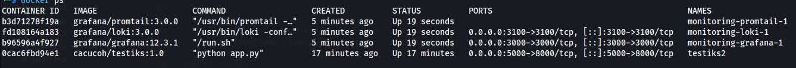
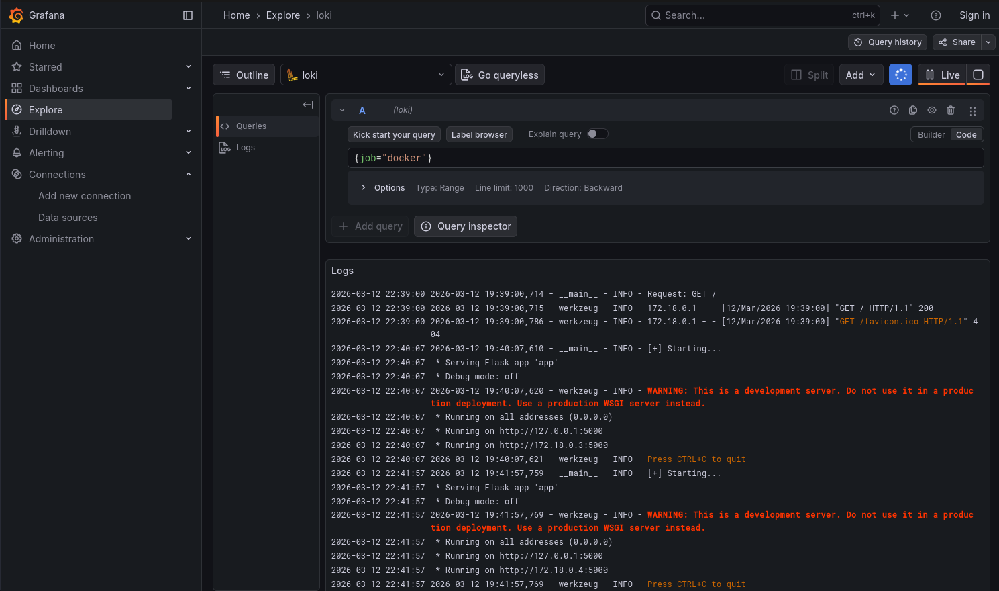
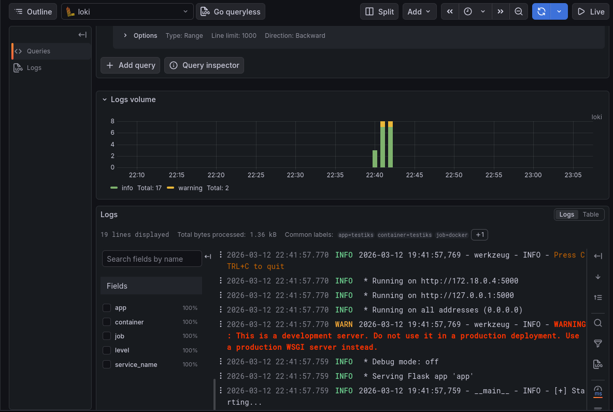
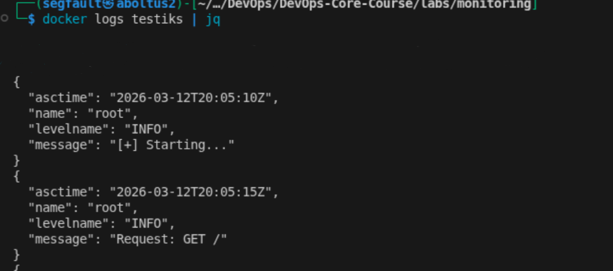
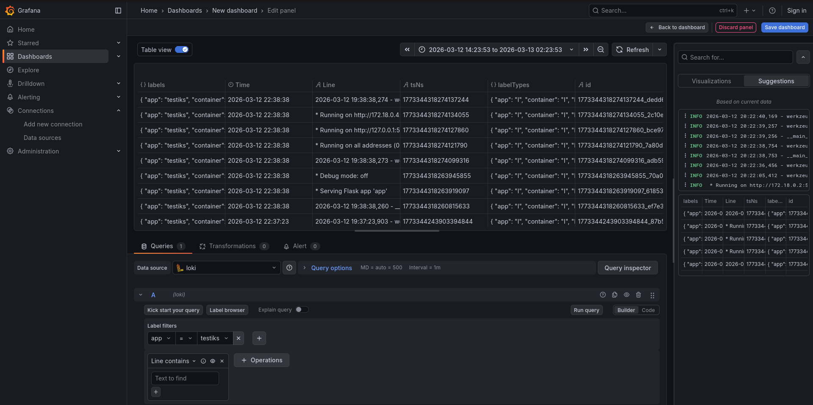
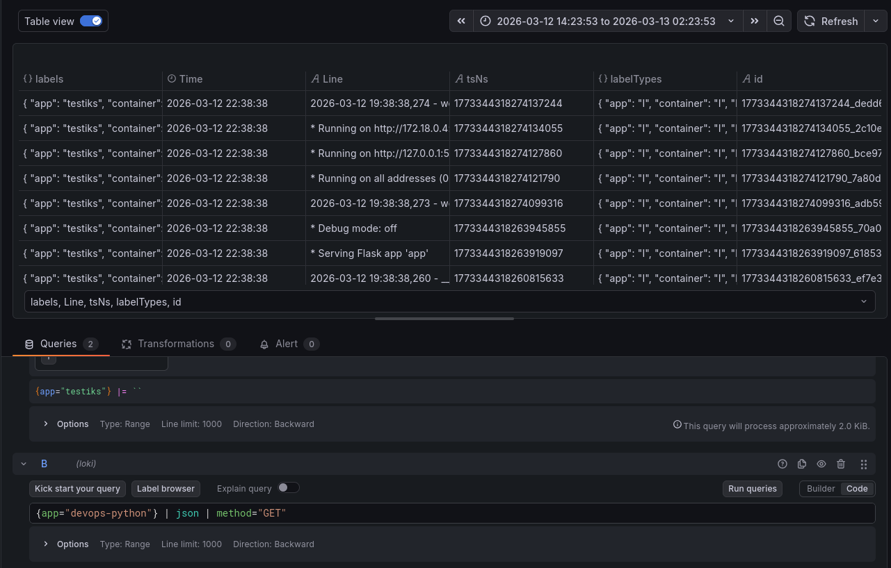
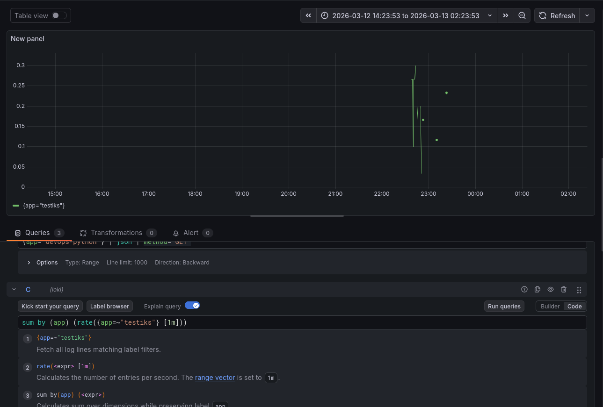
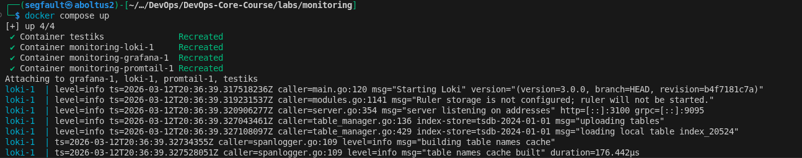
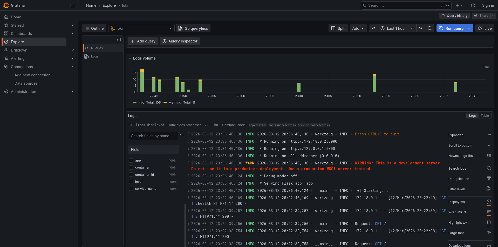

# Centralized Logging with Loki, Promtail, and Grafana

## Architecture

The monitoring system can be described as:
```
Python app (5000) -> Promtail (9800) -> Loki (3100) -> Grafana (3000)
```

This implements full centralized logging logic
- Web app send in JSON format
- Promtail discovers containers via Docker API and reads out logs, pushes to Loki then
- Grafana queries Loki and displays all found logs




## Setup Guide

```
git clone https://github.com/CacucoH/DevOps-Core-Course/tree/lab7
cd monitoring
docker compose up -d
```

Then, go to `http://localhost:3000` and connect Grafana with Loki:
**In Grafana:**
1. Go to **Connections** → **Data sources** → **Add data source** → **Loki**
2. URL: `http://loki:3100`
3. Click **Save & Test** (should show "Data source connected")
4. Navigate to **Explore** → Select **Loki** data source
5. Query: `{job="docker"}` → You should see logs from all containers

Result:






## Configuration
### Promtail configuration 

`auth_enabled`: false
- This disables authentication, so anyone who can access Loki can send or read logs.  
Good for testing or internal networks, but **not secure for production**.

```yml
common:
  replication_factor: 1
  path_prefix: /loki
  ring:
    kvstore:
      store: inmemory
```
- replication_factor: Number of data copies. 1 = no replication
- path_prefix: Base folder for Loki’s internal data
- ring.kvstore.store: inmemory: Metadata (like which chunk is where) is kept in RAM. Simple but not persistent


```yml
docker_sd_configs:
  - host: unix:///var/run/docker.sock
    refresh_interval: 5s
```
- Promtail connects directly to Docker socket to discover any running containers and get logs

```yml
{app="devops-python"}
```
- Labels are efficient filtering mechanism for querying logs in Loki

### Loki configuration 

```yml
server:
  http_listen_port: 3100
```
- Loki listens on port 3100 for HTTP requests

```yml
common:
  replication_factor: 1
  path_prefix: /loki
```
- replication_factor: Number of data copies. 1 = no replication
- path_prefix: Base folder for Loki’s internal data

```yml
filesystem:
  directory: /loki/chunks

tsdb_shipper:
  active_index_directory: /loki/index
  cache_location: /loki/index_cache
```
- filesystem.directory: path for actual log chunks
- tsdb_shipper.active_index_directory: where index files are stored
- cache_location: temporary cache for faster queries

The Loki stack: application logs → Docker files → Promtail → Loki stores/indexes → Grafana displays. It provides centralized logging, label-based queries, and interactive dashboards

## Application Logging

I implemented JSON logging using `logging` module. It outputs JSON messages instead of plain text
Each log entry is a JSON object, for example:




## Dashboard

Several dashboards created:

For app logs


```
{app="testiks"}
```

For GET queries


```
{app="testiks"} | json | method="GET"
```


Request rate graph
```
sum by (app) (rate({app="testiks"}[1m]))
```



## Production Practices

Each container has CPU and memory restrictions:
```yaml
deploy:
  resources:
    limits:
      cpus: '1.0'
      memory: 256M
```

This prevents resource exhaustion

```yml
- GF_SECURITY_ADMIN_PASSWORD=${GRAFANA_ADMIN_PASSWORD}
```

Prevents password leakage (its stored in `.env` file)

## Testing



Logs are present too:



