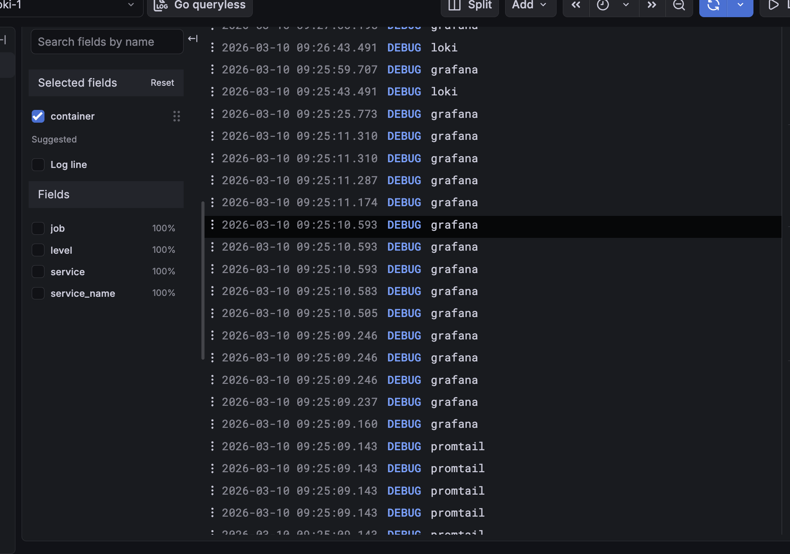
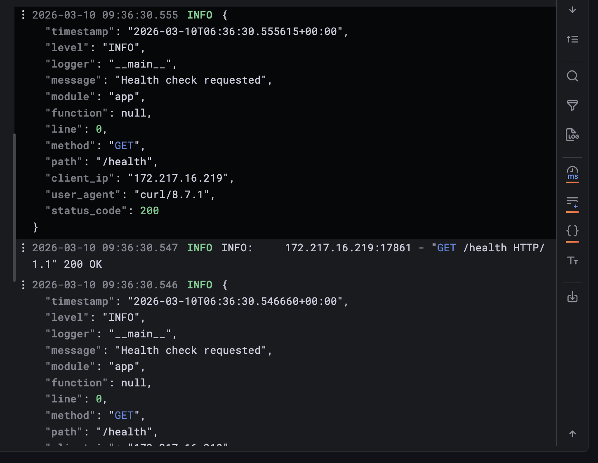
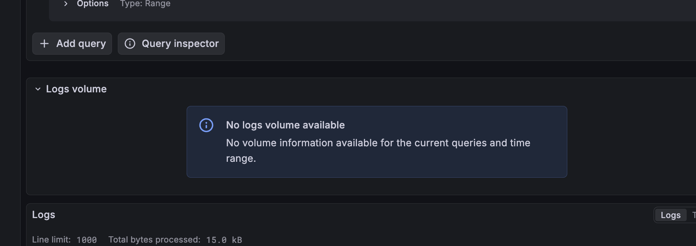
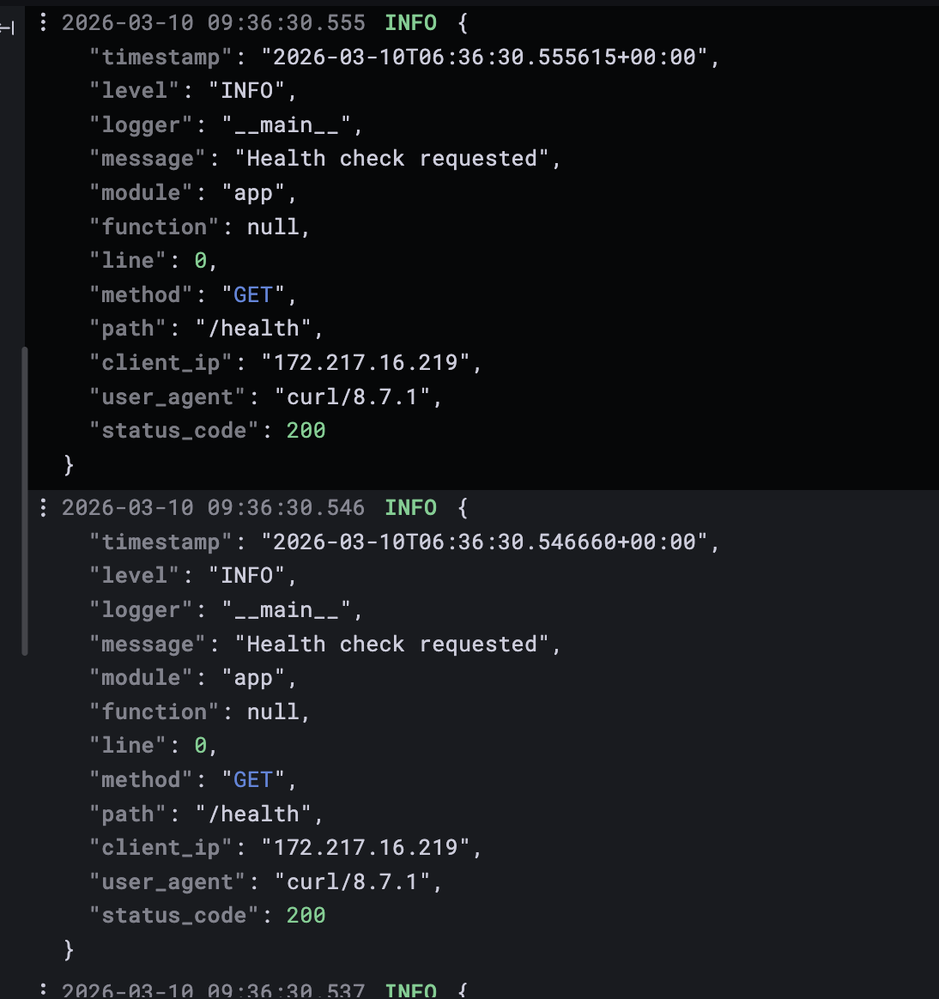
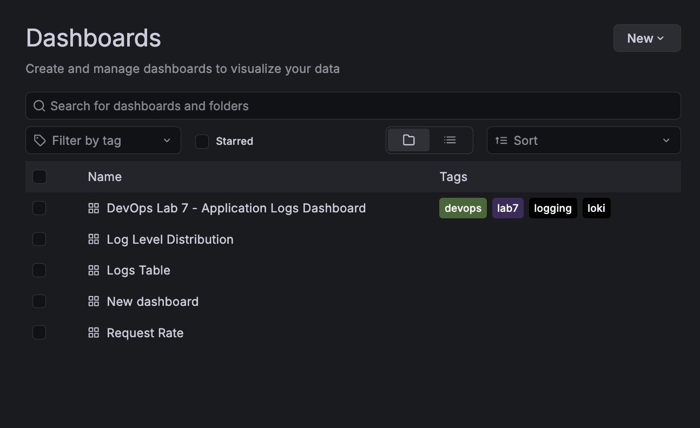
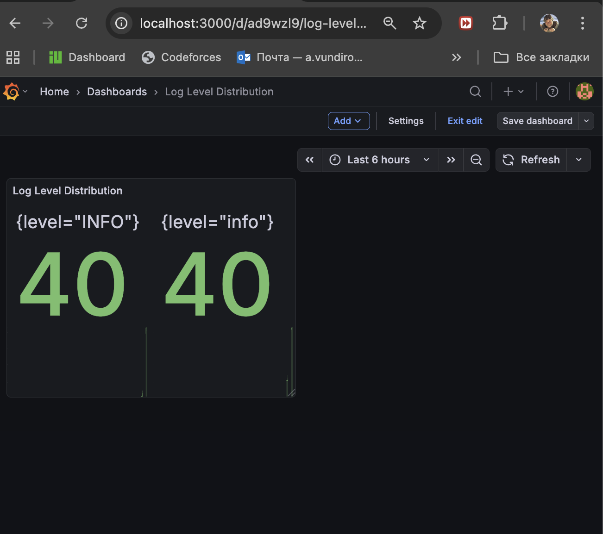
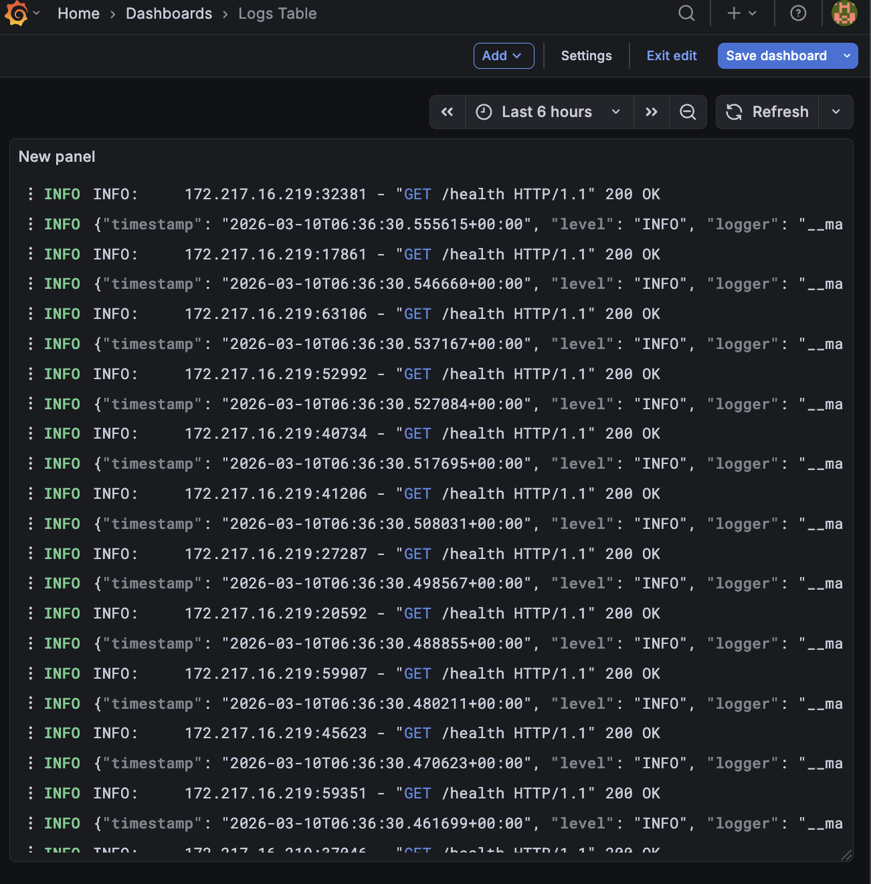
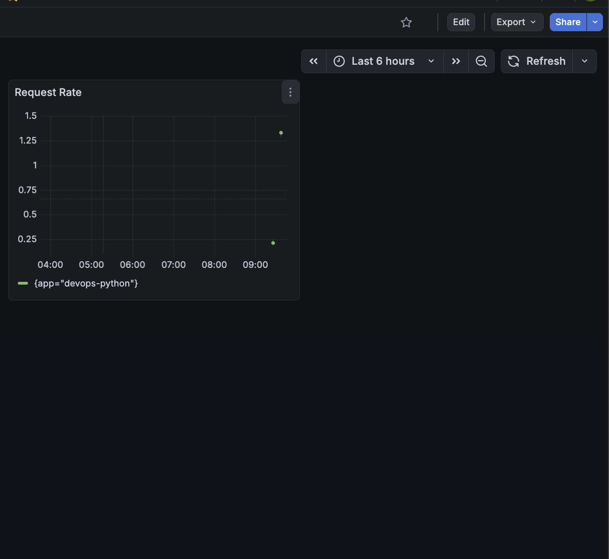
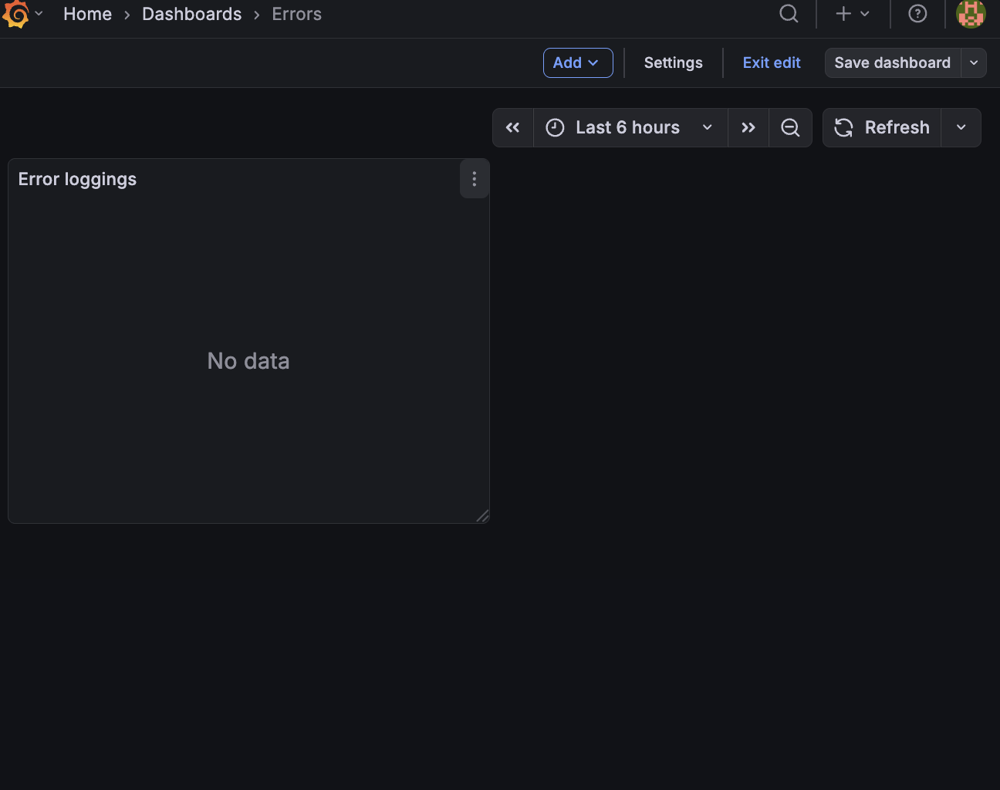
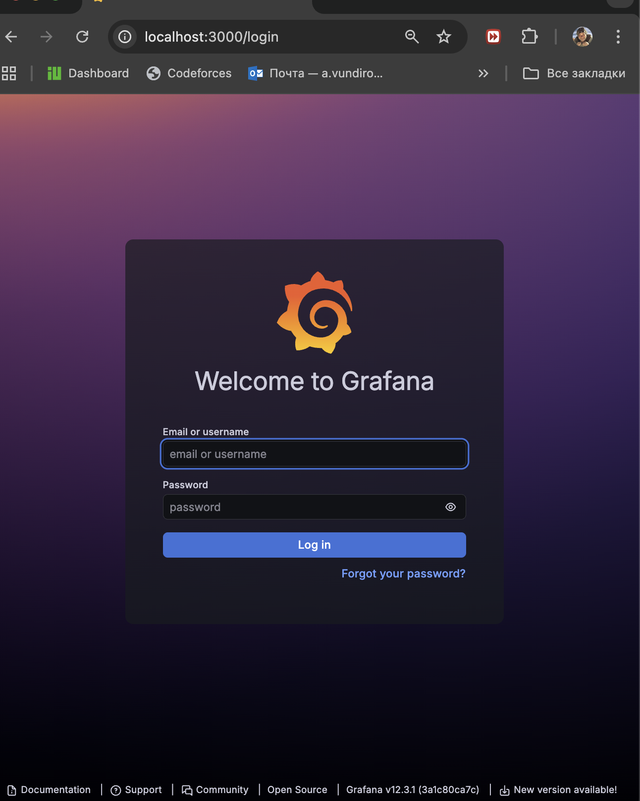

# Lab 7 — Observability & Logging with Loki Stack

## Documentation

---

## 1. Architecture

### System Overview

```
┌─────────────────────────────────────────────────────────────────────────────┐
│                           Docker Network: logging                            │
├─────────────────────────────────────────────────────────────────────────────┤
│                                                                              │
│   ┌──────────────┐     ┌──────────────┐     ┌──────────────────────────┐    │
│   │   Grafana    │────▶│    Loki      │◀────│       Promtail           │    │
│   │  :3000       │     │   :3100      │     │        :9080             │    │
│   │              │     │              │     │                          │    │
│   │ Visualization│     │ Log Storage  │     │ Log Collector            │    │
│   │ + Dashboards │     │ (TSDB)       │     │ (Docker SD)              │    │
│   └──────────────┘     └──────────────┘     └────────────┬─────────────┘    │
│                                                          │                   │
│                                                          │ reads logs        │
│   ┌──────────────────────────────────────────────────────▼────────────────┐ │
│   │                                                                        │ │
│   │                          Docker Containers                             │ │
│   │                                                                        │ │
│   │  ┌─────────────────┐                                                   │ │
│   │  │   app-python    │  JSON logs ──────────────────────────────────────▶│ │
│   │  │     :8080       │                                                   │ │
│   │  └─────────────────┘                                                   │ │
│   │                                                                        │ │
│   └────────────────────────────────────────────────────────────────────────┘ │
│                                                                              │
└─────────────────────────────────────────────────────────────────────────────┘
```

### Component Roles

| Component | Role | Port |
|-----------|------|------|
| **Loki** | Log aggregation and storage (TSDB backend) | 3100 |
| **Promtail** | Log collector with Docker service discovery | 9080 |
| **Grafana** | Visualization, dashboards, alerting | 3000 |
| **app-python** | Python application with JSON structured logging | 8080 |

---

## 2. Setup Guide

### Prerequisites

- Docker and Docker Compose v2 installed
- Git repository cloned
- Terminal access

### Step-by-step Deployment

```bash
# 1. Navigate to the monitoring directory
cd labs/monitoring

# 2. Create .env file with credentials (already provided, edit if needed)
cat .env

# 3. Start all services
docker compose up -d

# 4. Wait for services to be healthy
docker compose ps

# 5. Verify Loki is ready
curl http://localhost:3100/ready

# 6. Check Promtail targets
curl http://localhost:9080/targets

# 7. Access Grafana
open http://localhost:3000
# Login: admin / devops2024secure (or your password from .env)
```

### Verification Commands

```bash
# Check all services are running and healthy
docker compose ps

# View logs from all services
docker compose logs -f

# Check Loki readiness
curl -s http://localhost:3100/ready | head -1

# Test application
curl http://localhost:8080/
curl http://localhost:8080/health
```


---

## 3. Configuration Details

### 3.1 Loki Configuration

**File:** `loki/config.yml`

Key configuration choices:

| Setting | Value | Reason |
|---------|-------|--------|
| `auth_enabled` | false | Single-tenant development setup |
| `schema: v13` | Latest | Best performance with Loki 3.0+ |
| `store: tsdb` | TSDB | 10x faster queries than boltdb-shipper |
| `retention_period` | 168h | 7 days log retention |
| `object_store: filesystem` | Local | Suitable for single-node deployment |

**TSDB Benefits:**
- Faster query performance (up to 10x improvement)
- Lower memory footprint
- Better compression for storage efficiency

### 3.2 Promtail Configuration

**File:** `promtail/config.yml`

Key features:

| Feature | Implementation |
|---------|----------------|
| Docker Service Discovery | Automatic container detection via Docker socket |
| Label Filtering | Only containers with `logging=promtail` label |
| JSON Pipeline | Automatic JSON parsing for structured logs |
| Relabeling | Extracts container name, app label, compose service |

**Pipeline Stages:**
1. **JSON Parser** - Extracts level, message, timestamp from JSON logs
2. **Labels** - Promotes extracted level as indexable label
3. **Timestamp** - Uses log timestamp instead of ingestion time

### 3.3 Docker Compose Structure

**Services defined:**
- `loki` - Log storage with health check
- `promtail` - Log collection, depends on loki health
- `grafana` - Visualization with provisioned datasource
- `app-python` - Application with JSON logging

**Resource Limits:**
| Service | CPU Limit | Memory Limit |
|---------|-----------|--------------|
| Loki | 1.0 | 1GB |
| Promtail | 0.5 | 512MB |
| Grafana | 1.0 | 512MB |
| app-python | 0.5 | 256MB |

---

## 4. Application Logging

### JSON Logging Implementation

The Python application uses a custom `JSONFormatter` class:

```python
class JSONFormatter(logging.Formatter):
    def format(self, record):
        log_data = {
            "timestamp": datetime.now(timezone.utc).isoformat(),
            "level": record.levelname,
            "logger": record.name,
            "message": record.getMessage(),
            "module": record.module,
            "function": record.funcName,
            "line": record.lineno,
        }
        return json.dumps(log_data)
```

### Log Output Example

```json
{
  "timestamp": "2024-01-15T10:30:45.123456+00:00",
  "level": "INFO",
  "logger": "__main__",
  "message": "Info endpoint requested",
  "module": "app",
  "function": "get_info",
  "line": 115,
  "method": "GET",
  "path": "/",
  "client_ip": "172.18.0.1",
  "status_code": 200
}
```

### Environment Variable

Set `LOG_FORMAT=json` to enable JSON logging (default in Docker Compose).

---

## 5. Dashboard

### Dashboard Panels

The pre-provisioned dashboard (`DevOps Lab 7 - Application Logs Dashboard`) includes:

| Panel | Type | LogQL Query | Purpose |
|-------|------|-------------|---------|
| **Application Logs** | Logs | `{app=~"devops-.*"}` | Recent logs from all apps |
| **Request Rate** | Time Series | `sum by (app) (rate({app=~"devops-.*"} [1m]))` | Logs per second |
| **Error Logs** | Logs | `{app=~"devops-.*"} \| json \| level="ERROR"` | Only ERROR level |
| **Log Level Distribution** | Pie Chart | `sum by (level) (count_over_time({app=~"devops-.*"} \| json [5m]))` | Distribution of levels |
| **All Docker Logs** | Logs | `{job="docker"}` | All container logs |

### LogQL Query Examples

```logql
# 1. All logs from Python app
{app="devops-python"}

# 2. Filter by log level
{app="devops-python"} | json | level="ERROR"
{app="devops-python"} | json | level="INFO"

# 3. Search for specific text
{app="devops-python"} |= "health"

# 4. Filter by HTTP method
{app="devops-python"} | json | method="GET"

# 5. Count logs per minute
rate({app="devops-python"}[1m])

# 6. Count by level over time
sum by (level) (count_over_time({app="devops-python"} | json [5m]))

# 7. Filter by status code
{app="devops-python"} | json | status_code="404"

# 8. Regex pattern matching
{app=~"devops-.*"} |~ "error|warning|fail"
```

---

## 6. Production Configuration

### Security Measures

1. **Grafana Authentication:**
   - Anonymous access disabled (`GF_AUTH_ANONYMOUS_ENABLED=false`)
   - Admin credentials via environment variables
   - Sign-up disabled

2. **Secrets Management:**
   - `.env` file for credentials (not committed to git)
   - `.gitignore` excludes sensitive files

3. **Network Isolation:**
   - Services communicate via internal `logging` network
   - Only necessary ports exposed to host

### Resource Limits

All services have CPU and memory limits to prevent resource exhaustion:

```yaml
deploy:
  resources:
    limits:
      cpus: '1.0'
      memory: 1G
```

### Health Checks

Every service has health checks:

```yaml
healthcheck:
  test: ["CMD-SHELL", "wget --no-verbose --tries=1 --spider http://localhost:3100/ready || exit 1"]
  interval: 10s
  timeout: 5s
  retries: 5
  start_period: 20s
```

### Retention Policy

- Log retention: 7 days (168 hours)
- Compactor runs every 10 minutes
- Old logs deleted after 2-hour delay

---

## 7. Testing And Screenshots

Log aggregation evidence


Log quieries for app




Dashboards







Production ready evidence



---
## 8. Challenges & Solutions

### Challenge 1: Promtail Not Collecting Logs

**Problem:** Promtail wasn't seeing Docker containers.

**Solution:** 
- Added Docker socket mount: `/var/run/docker.sock:/var/run/docker.sock:ro`
- Ensured containers had `logging: "promtail"` label

### Challenge 2: JSON Logs Not Parsing

**Problem:** Log level wasn't being extracted as label.

**Solution:** Added pipeline stages in Promtail config:
```yaml
pipeline_stages:
  - json:
      expressions:
        level: level
  - labels:
      level:
```

### Challenge 3: Loki Query Performance

**Problem:** Initial queries were slow.

**Solution:** Upgraded to TSDB storage (Loki 3.0 schema v13) which provides:
- 10x faster queries
- Better compression
- Lower memory usage

### Challenge 4: Grafana Data Source Connection

**Problem:** Manual data source setup was tedious.

**Solution:** Used provisioning:
```yaml
# grafana/provisioning/datasources/loki.yml
datasources:
  - name: Loki
    type: loki
    url: http://loki:3100
    isDefault: true
```
---
## 10. File Structure

```
monitoring/
├── docker-compose.yml          # Main compose file with all services
├── .env                        # Environment variables (not committed)
├── .gitignore                  # Ignores secrets and data dirs
├── loki/
│   └── config.yml             # Loki 3.0 configuration with TSDB
├── promtail/
│   └── config.yml             # Promtail with Docker SD
├── grafana/
│   └── provisioning/
│       ├── datasources/
│       │   └── loki.yml       # Auto-configure Loki datasource
│       └── dashboards/
│           ├── dashboard.yml  # Dashboard provider config
│           └── app-logs.json  # Pre-built dashboard
└── docs/
    └── LAB07.md               # This documentation
```

---

## 11. Quick Commands Reference

| Action | Command |
|--------|---------|
| Start stack | `docker compose up -d` |
| Stop stack | `docker compose down` |
| View logs | `docker compose logs -f` |
| Check status | `docker compose ps` |
| Rebuild app | `docker compose build app-python` |
| Clean volumes | `docker compose down -v` |
| Generate traffic | `for i in {1..20}; do curl localhost:8080/; done` |

---

## 12. URLs

| Service | URL | Credentials |
|---------|-----|-------------|
| Grafana | http://localhost:3000 | admin / (from .env) |
| Loki API | http://localhost:3100 | - |
| Promtail | http://localhost:9080 | - |
| Python App | http://localhost:8080 | - |

---

**Author:** Lab 7 Implementation  
**Date:** 2024  
**Stack:** Loki 3.0 + Promtail 3.0 + Grafana 12.3.1
