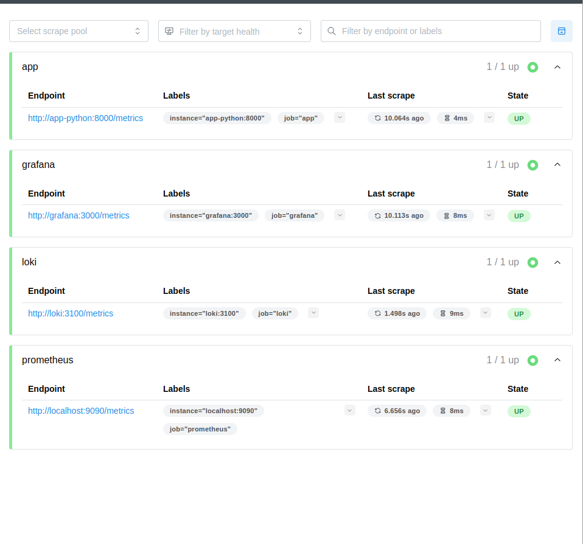
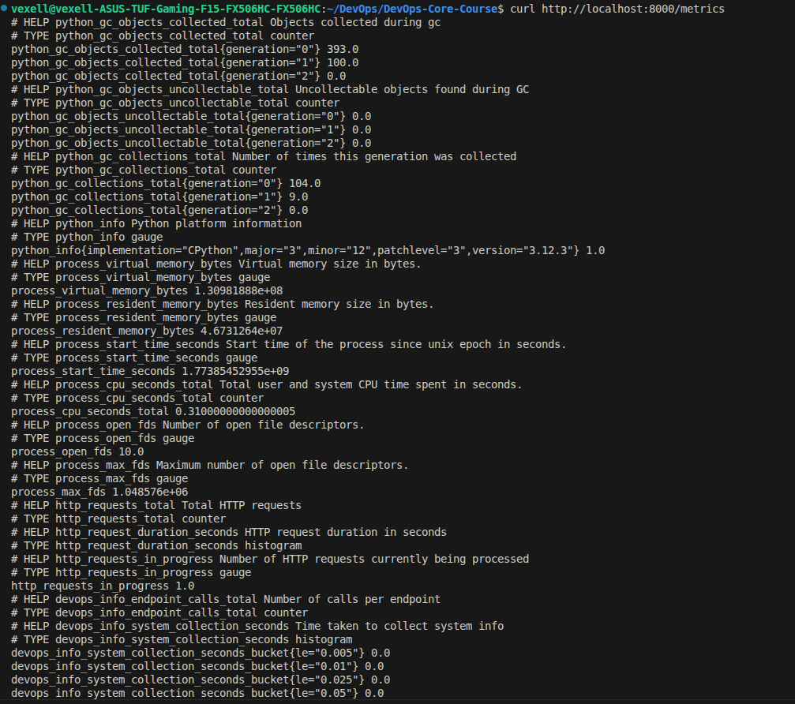
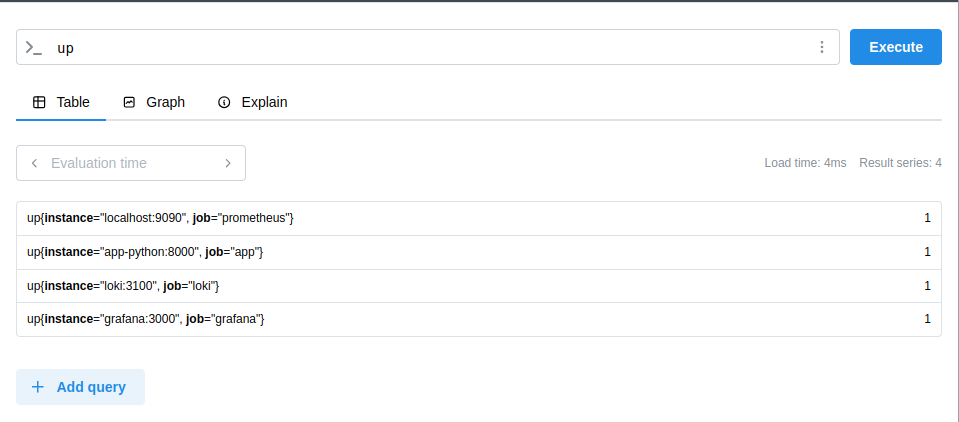
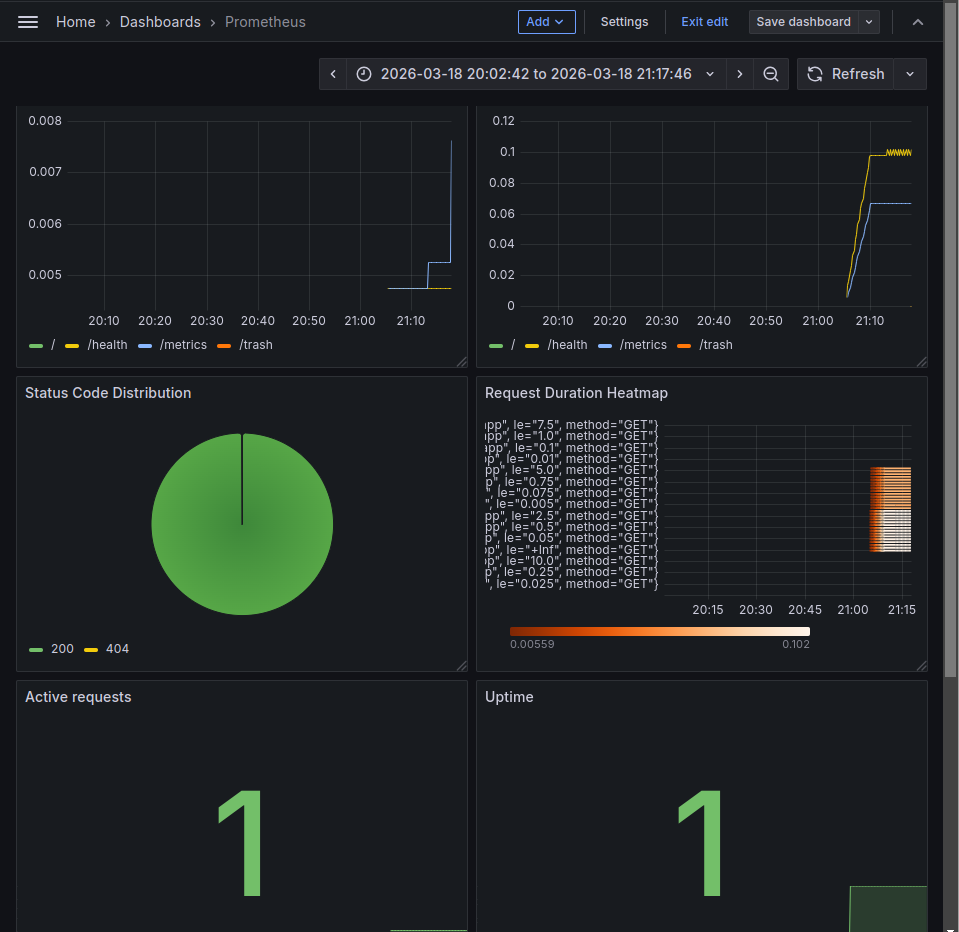
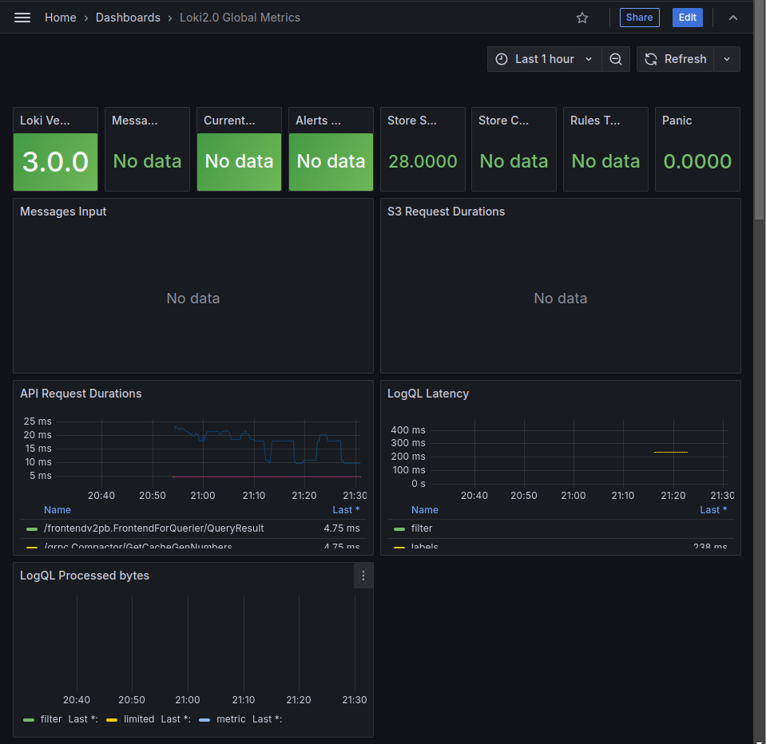

# Lab 08

## Architecture

```bash
┌─────────────┐  scrape (15s)  ┌──────────┐    query    ┌─────────┐
│ Application │ ─────────────> │Prometheus│ <─────────> │ Grafana │
│ (FastAPI)   │   /metrics     │  (TSDB)  │   (PromQL)  │  UI     │
└─────────────┘                └──────────┘             └─────────┘
         │  
         │ logs                     
         ▼                          
 ┌───────────┐ 
 │   Loki    │
 └───────────┘
```

## Application instrumentation

```http_requests_total``` - Counts total requests for rate and error rate calculations.

```http_request_duration_seconds``` - Measures request latency for computing percentiles (e.g., p95).

```http_requests_in_progress``` - Tracks current concurrent requests; helps detect traffic spikes.

```devops_info_endpoint_calls``` - Counts calls per endpoint.

```devops_info_system_collection_seconds``` - Measures time to collect system info for detecting performance regressions.

```bash
sudo docker compose ps
```

## Prometheus Configuration

```yaml
global:
  scrape_interval: 15s
  evaluation_interval: 15s

scrape_configs:
  - job_name: 'prometheus'
    static_configs:
      - targets: ['localhost:9090']

  - job_name: 'app'
    static_configs:
      - targets: ['app-python:8000']
    metrics_path: '/metrics'

  - job_name: 'loki'
    static_configs:
      - targets: ['loki:3100']
    metrics_path: '/metrics'

  - job_name: 'grafana'
    static_configs:
      - targets: ['grafana:3000']
    metrics_path: '/metrics'
```

## Dashboard Walkthrough with PromQL Examples

#### Request Rate by Endpoint

```sum(rate(http_requests_total[5m])) by (endpoint)``` - Shows incoming traffic per endpoint

#### Error Rate

```sum(rate(http_requests_total{status_code=~"5.."}[5m]))``` - Tracks rate of server errors

#### Request Duration p95

```histogram_quantile(0.95, sum(rate(http_request_duration_seconds_bucket[5m])) by (le, endpoint))``` - Shows 95th percentile latency per endpoint

#### Latency Heatmap

```rate(http_request_duration_seconds_bucket[5m])``` - Visualizes latency distribution over time

#### Active Requests

```http_requests_in_progress``` - Shows current concurrent requests

#### Status Code Distribution

```sum by (status_code) (rate(http_requests_total[5m]))``` - Breaks down traffic by response class for quick health check.

#### Uptime

```up{job="app"}``` - Shows whether the app is up (1) or down (0)

## Production Step

Each service in `docker-compose.yml` includes a health check:

Prometheus: `wget --spider http://localhost:9090/-/healthy`

Loki: `wget --spider http://localhost:3100/ready`

Grafana: `wget --spider http://localhost:3000/api/health`

App: `curl -f http://localhost:8000/health`

Promtail: `kill -0 1`

All health checks run every 10s with timeouts and retries.

### Data Retention and Persistence

Prometheus: 15 days time‑based, 10GB size‑based; data stored in named volume prometheus-data.

Loki: data stored in loki-data volume.

Grafana: dashboards and settings stored in grafana-data volume.

### Metrics vs logs

#### Purpose:
Metrics: Numerical time‑series data (counts, latencies, resource usage)	

Logs: Event‑based records (errors, debug info, transactions)

#### Data format:
Metrics: Structured (key‑value labels, numbers)	

Logs: Unstructured or semi‑structured text

#### Storage:

Metrics: TSDB optimized for aggregation and querying

Logs: Object storage (chunks) with indexing

#### Query language:

Metrics: PromQL (aggregation, rate, percentiles)

Logs: LogQL (filtering, pattern matching)

#### Typical use:

Metrics: Alerting on thresholds, trend analysis, capacity planning	

Logs: Debugging specific requests, audit trails, compliance

#### Cardinality:

Metrics: Should be low to avoid performance issues

Logs: Can be high (e.g., user IDs in log lines)

#### Retention:

Metrics: Often shorter (days to weeks) due to volume

Logs: Can be longer (weeks to months) for compliance


## Testing Results










Healthy status:

```bash
sudo docker compose ps
```

```bash
NAME         IMAGE                      COMMAND                  SERVICE      CREATED              STATUS                        PORTS
app-python   thevex/simple-app:latest   "python app.py --hos…"   app-python   About a minute ago   Up About a minute (healthy)   0.0.0.0:8000->8000/tcp, [::]:8000->8000/tcp
grafana      grafana/grafana:11.3.1     "/run.sh"                grafana      About a minute ago   Up About a minute (healthy)   0.0.0.0:3000->3000/tcp, [::]:3000->3000/tcp
loki         grafana/loki:3.0.0         "/usr/bin/loki -conf…"   loki         About a minute ago   Up About a minute (healthy)   0.0.0.0:3100->3100/tcp, [::]:3100->3100/tcp
prometheus   prom/prometheus:v3.9.0     "/bin/prometheus --c…"   prometheus   About a minute ago   Up About a minute (healthy)   0.0.0.0:9090->9090/tcp, [::]:9090->9090/tcp
promtail     grafana/promtail:3.0.0     "/usr/bin/promtail -…"   promtail     About a minute ago   Up About a minute (healthy)   0.0.0.0:9080->9080/tcp, [::]:9080->9080/tcp
```