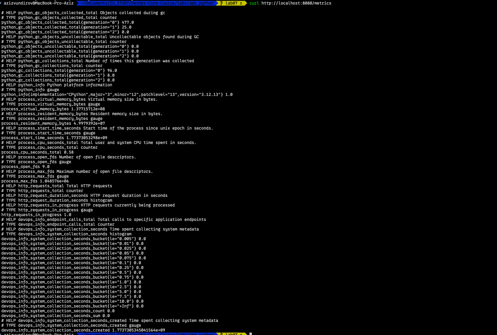
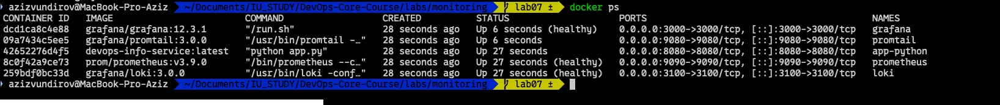
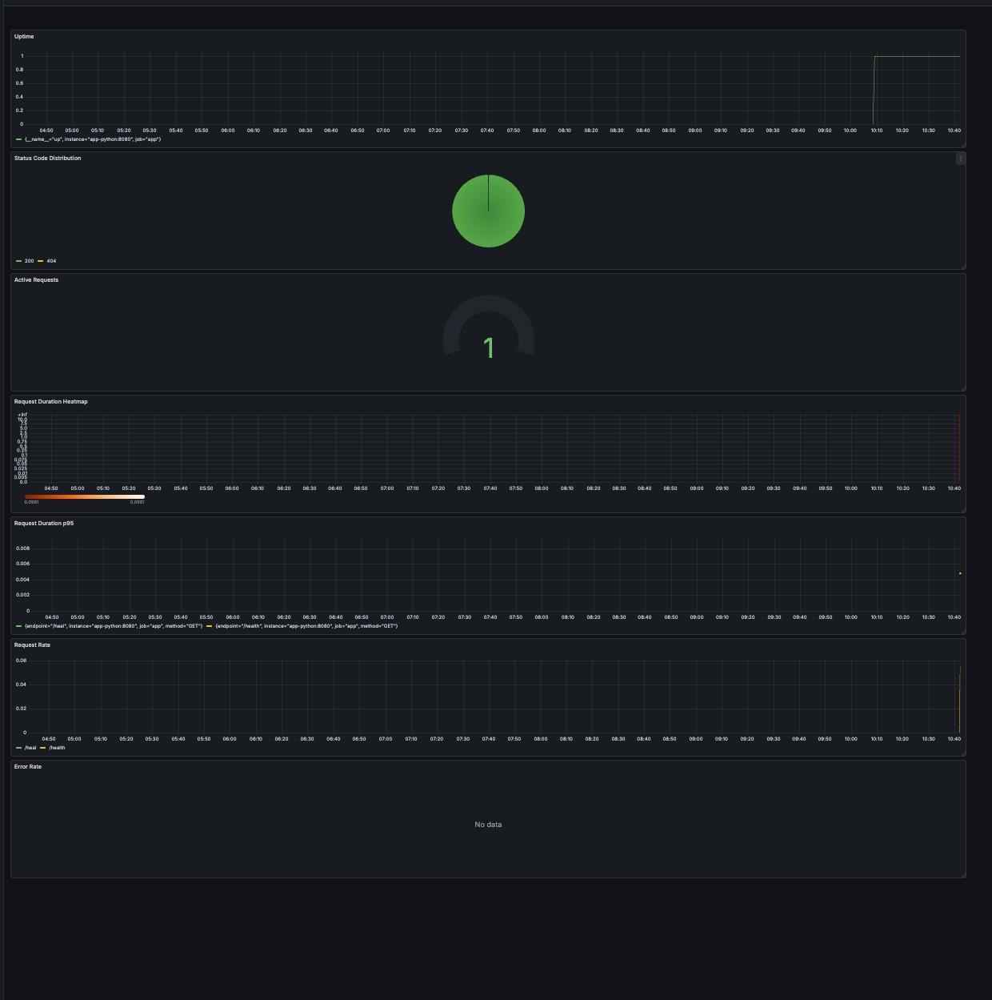
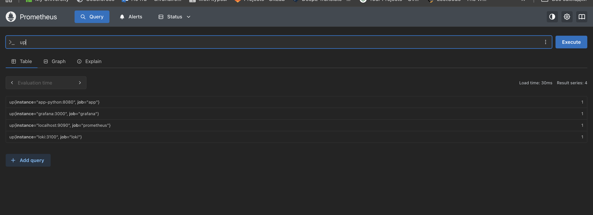
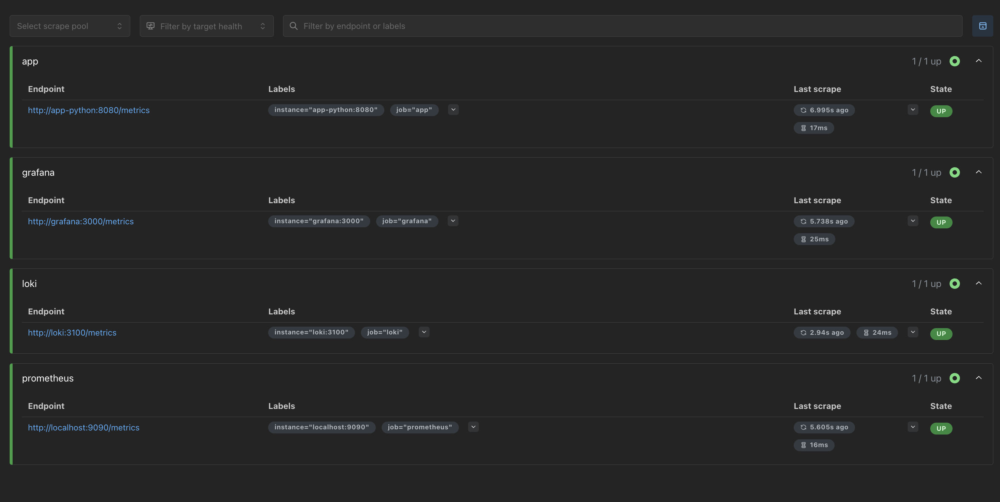

# Lab 8 - Metrics & Monitoring with Prometheus

## 1. Architecture

### Metric flow (app -> Prometheus -> Grafana)

```text
                    +----------------------+
                    |      app-python      |
                    |      (FastAPI)       |
                    |  /metrics on :8080   |
                    +----------+-----------+
                               |
                               | scrape every 15s
                               v
                    +----------------------+
                    |      Prometheus      |
                    |        :9090         |
                    |  TSDB + retention    |
                    +----------+-----------+
                               |
                               | PromQL queries
                               v
                    +----------------------+
                    |       Grafana        |
                    |        :3000         |
                    | dashboards + panels  |
                    +----------------------+
```

### Full observability context

- Logs: app-python -> promtail -> loki -> grafana
- Metrics: app-python -> prometheus -> grafana
- Both pipelines run in docker network `logging`.

---

## 2. Application Instrumentation

### Added dependency

`prometheus-client==0.23.1` in `labs/app_python/requirements.txt`.

### Implemented metrics in application

Metrics are implemented in `labs/app_python/app.py` using `prometheus_client`.

1. Counter: `http_requests_total`
- Purpose: tracks request rate and error counts.
- Labels: `method`, `endpoint`, `status_code`.

2. Histogram: `http_request_duration_seconds`
- Purpose: request duration distribution (for p95/p99 latency).
- Labels: `method`, `endpoint`.

3. Gauge: `http_requests_in_progress`
- Purpose: current concurrent requests in progress.

4. App-specific Counter: `devops_info_endpoint_calls_total`
- Purpose: business-level endpoint usage.
- Labels: `endpoint`.

5. App-specific Histogram: `devops_info_system_collection_seconds`
- Purpose: execution time for system metadata collection.

### Endpoint exposure

- Endpoint `/metrics` is exposed in FastAPI:
- Uses `generate_latest()` and `CONTENT_TYPE_LATEST`.

### Collection logic

- HTTP middleware increments `http_requests_in_progress` at request start.
- Middleware measures duration and updates:
  - `http_requests_total`
  - `http_request_duration_seconds`
- `/metrics` endpoint is excluded from self-instrumentation noise.

### Why these metric choices

- RED method coverage:
  - Rate -> `http_requests_total`
  - Errors -> `http_requests_total{status_code=~"5.."}`
  - Duration -> `http_request_duration_seconds`
- Operational visibility:
  - Saturation proxy -> `http_requests_in_progress`
- Domain visibility:
  - Endpoint usage and metadata collection timing.

---

## 3. Prometheus Configuration

Configuration file: `labs/monitoring/prometheus/prometheus.yml`

### Global settings

- `scrape_interval: 15s`
- `evaluation_interval: 15s`

### Scrape jobs

1. `prometheus`
- Target: `localhost:9090`

2. `app`
- Target: `app-python:8080`
- `metrics_path: /metrics`

3. `loki`
- Target: `loki:3100`
- `metrics_path: /metrics`

4. `grafana`
- Target: `grafana:3000`
- `metrics_path: /metrics`

### Retention and storage

Configured in `labs/monitoring/docker-compose.yml` Prometheus command:

- `--storage.tsdb.path=/prometheus`
- `--storage.tsdb.retention.time=15d`
- `--storage.tsdb.retention.size=10GB`

Persistent volume:

- `prometheus-data:/prometheus`

---

## 4. Dashboard Walkthrough

Grafana endpoint: `http://localhost:3000`

Prometheus datasource for metrics dashboard:

- URL: `http://prometheus:9090`

### Required panel set (6+)

1. Request Rate
- Query:

```promql
sum(rate(http_requests_total[5m])) by (endpoint)
```

2. Error Rate (5xx)
- Query:

```promql
sum(rate(http_requests_total{status_code=~"5.."}[5m]))
```

3. Request Duration p95
- Query:

```promql
histogram_quantile(0.95, sum by (le) (rate(http_request_duration_seconds_bucket[5m])))
```

4. Request Duration Heatmap
- Query:

```promql
sum by (le) (rate(http_request_duration_seconds_bucket[5m]))
```

5. Active Requests
- Query:

```promql
http_requests_in_progress
```

6. Status Code Distribution
- Query:

```promql
sum by (status_code) (rate(http_requests_total[5m]))
```

7. Uptime (App availability)
- Query:

```promql
up{job="app"}
```

---

## 5. PromQL Examples

1. Total request throughput

```promql
sum(rate(http_requests_total[5m]))
```

2. Throughput by endpoint

```promql
sum by (endpoint) (rate(http_requests_total[5m]))
```

3. 5xx error rate

```promql
sum(rate(http_requests_total{status_code=~"5.."}[5m]))
```

4. 4xx error rate

```promql
sum(rate(http_requests_total{status_code=~"4.."}[5m]))
```

5. p95 latency

```promql
histogram_quantile(0.95, sum by (le) (rate(http_request_duration_seconds_bucket[5m])))
```

6. p99 latency

```promql
histogram_quantile(0.99, sum by (le) (rate(http_request_duration_seconds_bucket[5m])))
```

7. Current active requests

```promql
http_requests_in_progress
```

8. Monitored target availability

```promql
up
```

---

## 6. Production Setup

Configuration source: `labs/monitoring/docker-compose.yml`

### Health checks

- `loki`: `http://localhost:3100/ready`
- `prometheus`: `http://localhost:9090/-/healthy`
- `grafana`: `http://localhost:3000/api/health`
- `app-python`: `http://localhost:8080/health`

Health check policy:

- interval: 10s
- timeout: 5s
- retries: 3-5 depending on service

### Resource limits

- `prometheus`: 1 CPU, 1G RAM
- `loki`: 1 CPU, 1G RAM
- `grafana`: 1 CPU, 512M RAM
- `app-python`: 0.5 CPU, 256M RAM
- `promtail`: 0.5 CPU, 512M RAM

### Persistence

Volumes:

- `prometheus-data`
- `loki-data`
- `grafana-data`

These volumes preserve metrics, logs, and dashboards across container restarts.

### Retention policy

- Prometheus metrics: 15 days or up to 10GB
- Loki logs: 168h (7 days)

---

## 7. Testing Results

### Verification commands used

```bash
cd labs/monitoring
docker compose up -d
docker compose ps
curl http://localhost:9090/targets
curl http://localhost:9090/api/v1/query?query=up
curl http://localhost:8080/metrics
```












## 8. Challenges & Solutions

1. Label mismatch in queries
- Issue: using `status` instead of actual label `status_code` returned no results.
- Solution: align PromQL labels with metric definition from app instrumentation.

2. Grafana metrics not visible at first
- Issue: only Loki datasource was pre-provisioned.
- Solution: add Prometheus datasource manually (`http://prometheus:9090`) or provision it in future automation.

3. Cardinality risk
- Issue: raw path labels can explode metric cardinality in larger apps.
- Solution: keep low-cardinality endpoint labels and normalize dynamic paths.

4. Readiness ordering
- Issue: dependent services may start before metrics backend is ready.
- Solution: use `depends_on` with health checks and verify with `docker compose ps`.

---

## Metrics vs Logs (Lab 7 comparison)

- Use metrics when you need trends, rates, latency percentiles, SLI/SLO dashboards, and alerts.
- Use logs when you need root-cause analysis, request context, stack traces, and event details.
- Best practice: use both together. Metrics detect and quantify issues; logs explain why they happened.

---

## Submission Checklist

- [x] `/metrics` endpoint implemented in app
- [x] Counter, Gauge, Histogram metrics present
- [x] Prometheus configured with required jobs
- [x] Retention and persistence configured
- [x] Health checks and resource limits configured
- [x] Documentation completed
- [ ] Evidence screenshots inserted (replace PLACEHOLDER blocks)
