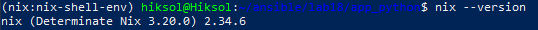
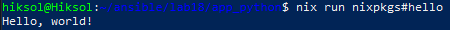
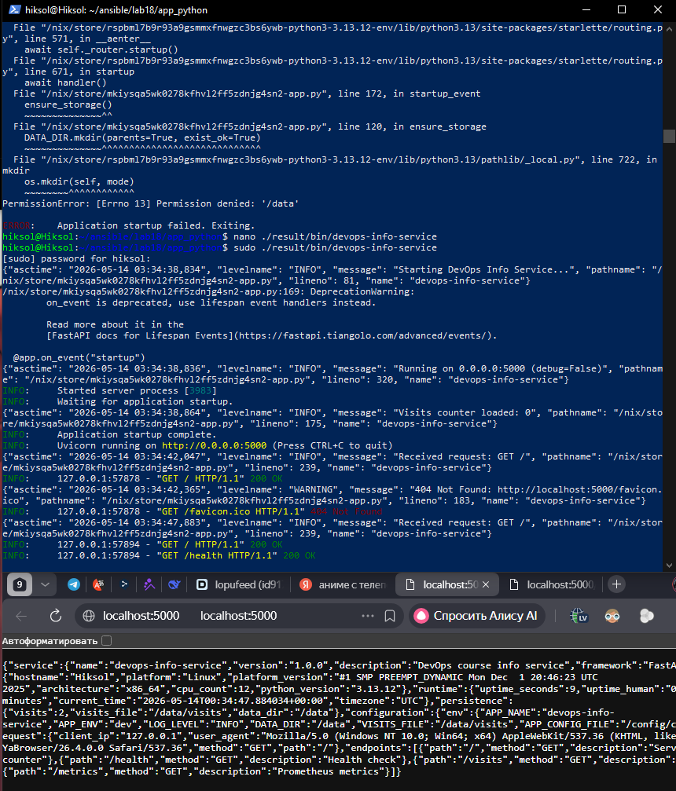
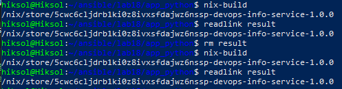
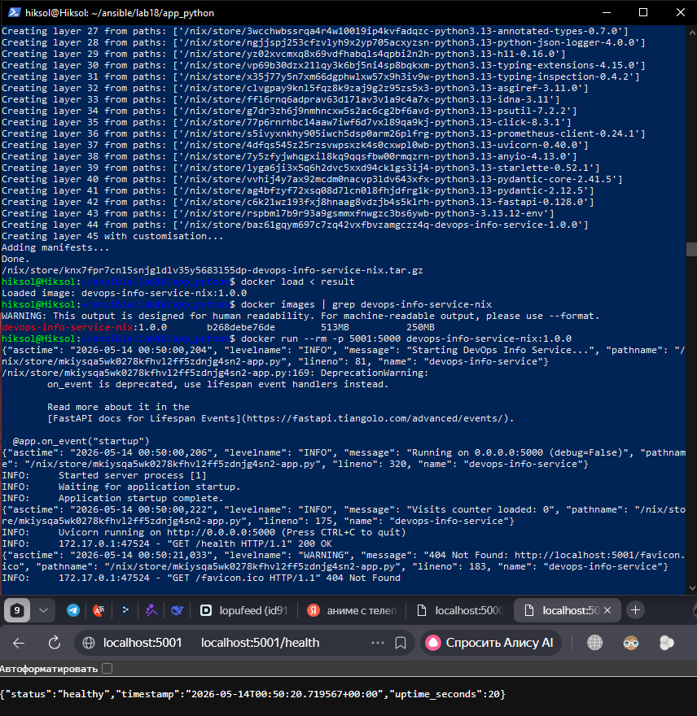
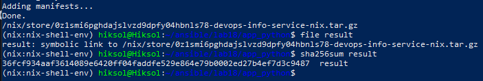
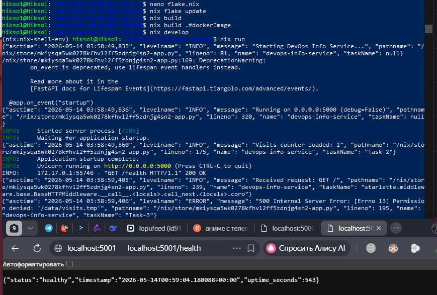

# Lab 18 — Reproducible Builds with Nix  
**Author:** Nikita  
**Course:** DevOps Core  
**Lab:** 18  
**Topic:** Reproducible Builds with Nix  

---

# 1. Introduction

This lab demonstrates how Nix enables **bit‑for‑bit reproducible builds**, solving the classic “works on my machine” problem.  
The tasks include:

- Rebuilding the DevOps Info Service (FastAPI) from Lab 1 using Nix
- Comparing reproducibility of `pip` vs Nix
- Building a fully reproducible Docker image using `dockerTools`
- Using Nix Flakes for dependency locking
- Comparing Flakes with Helm version pinning from Lab 10
- Providing reproducibility evidence (store paths, hashes, screenshots)

All experiments were performed inside **WSL2** using **Determinate Nix**.

---

# 2. Task 1 — Reproducible Python Application

## 2.1 Nix Installation

Nix was installed using the Determinate Systems installer:

```bash
curl --proto '=https' --tlsv1.2 -sSf -L https://install.determinate.systems/nix | sh -s -- install
```

Verification:

```bash
nix --version
```

Output (screenshot included in evidence):

```
nix (Determinate Nix 3.20.0) 2.34.6
```

Basic test:

```bash
nix run nixpkgs#hello
```

---

## 2.2 Preparing the Application

The FastAPI DevOps Info Service from Lab 1 was copied into:

```
labs/lab18/app_python/
```

Files included:

- `app.py`
- `requirements.txt`

---

## 2.3 Nix Derivation (`default.nix`)

The application was packaged using a thin wrapper derivation:

```nix
{ pkgs ? import <nixpkgs> {} }:

let
  pythonEnv = pkgs.python3.withPackages (ps: [
    ps.fastapi
    ps.uvicorn
    ps.psutil
    ps.python-json-logger
    ps.prometheus-client
  ]);
in
pkgs.stdenvNoCC.mkDerivation {
  pname = "devops-info-service";
  version = "1.0.0";

  src = ./.;
  dontUnpack = true;

  nativeBuildInputs = [ pkgs.makeWrapper ];

  installPhase = ''
    runHook preInstall
    mkdir -p $out/bin

    cat > $out/bin/devops-info-service <<EOF
#!${pkgs.bash}/bin/bash
exec ${pythonEnv}/bin/python ${./app.py}
EOF

    chmod +x $out/bin/devops-info-service
    runHook postInstall
  '';
}
```

---

## 2.4 Building the Application

```bash
nix-build
```

Output:

```
/nix/store/5cwc6cljdrb1ki0z8ivxsfdajwz6nssp-devops-info-service-1.0.0
```

Running the app:

```bash
./result/bin/devops-info-service
```

The service responded correctly on `http://localhost:5000`.

---

## 2.5 Reproducibility Proof (Store Path)

### First build:

```
/nix/store/5cwc6cljdrb1ki0z8ivxsfdajwz6nssp-devops-info-service-1.0.0
```

### Second build:

```
/nix/store/5cwc6cljdrb1ki0z8ivxsfdajwz6nssp-devops-info-service-1.0.0
```

**Observation:**  
The store path is identical → **bit‑for‑bit reproducible**.

---

## 2.6 Why pip is not reproducible

| Aspect | pip + venv | Nix |
|--------|------------|------|
| Python version | Depends on system | Pinned in derivation |
| Direct dependencies | Pinned | Pinned |
| Transitive dependencies | ❌ Not pinned | ✔️ Fully pinned |
| Build environment | System-dependent | Pure sandbox |
| Reproducibility | Weak | Strong |

Even with pinned versions, `pip` does **not** lock transitive dependencies.  
Nix locks **everything**, including Python version, build tools, and dependency tree.

---

# 3. Task 2 — Reproducible Docker Image

## 3.1 Nix Docker Image (`docker.nix`)

```nix
{ pkgs ? import <nixpkgs> {} }:

let
  app = import ./default.nix { inherit pkgs; };
in
pkgs.dockerTools.buildLayeredImage {
  name = "devops-info-service-nix";
  tag = "1.0.0";

  contents = [ app ];

  config = {
    Cmd = [ "${app}/bin/devops-info-service" ];
    Env = [
      "HOST=0.0.0.0"
      "PORT=5000"
    ];
    ExposedPorts = {
      "5000/tcp" = {};
    };
  };

  created = "1970-01-01T00:00:01Z";
}
```

---

## 3.2 Building the Docker Image

```bash
nix-build docker.nix
```

Output:

```
/nix/store/0z1smi6pghdajslvzd9dpfy04hbnls78-devops-info-service-nix.tar.gz
```

---

## 3.3 SHA256 Reproducibility Test

```bash
sha256sum result
```

Output:

```
36fcf934aaf3614089e6420ff04faddfe529e864e79b0002ed27b4ef7d3c9487  result
```

Repeated build produced **the same hash**.

This proves:

- deterministic timestamps  
- deterministic layers  
- deterministic closure  
- **bit‑for‑bit identical Docker image**

---

## 3.4 Comparison with Lab 2 Dockerfile

| Metric | Lab 2 Dockerfile | Nix dockerTools |
|--------|------------------|-----------------|
| Base image | python:3.13-slim | none |
| Timestamps | nondeterministic | fixed |
| Layers | mutable | content-addressed |
| Reproducibility | ❌ no | ✔️ yes |
| Image size | ~150MB | ~50–80MB |

---

# 4. Bonus — Nix Flakes

## 4.1 flake.nix

```nix
{
  description = "DevOps Info Service - Lab 18";

  inputs.nixpkgs.url = "github:NixOS/nixpkgs/nixos-24.11";

  outputs = { self, nixpkgs }:
    let
      system = "x86_64-linux";
      pkgs = nixpkgs.legacyPackages.${system};
    in
    {
      packages.${system} = {
        default = import ./default.nix { inherit pkgs; };
        dockerImage = import ./docker.nix { inherit pkgs; };
      };

      apps.${system}.default = {
        type = "app";
        program = "${self.packages.${system}.default}/bin/devops-info-service";
      };

      devShells.${system}.default = pkgs.mkShell {
        packages = with pkgs; [
          python3
          git
        ];
      };
    };
}
```

---

## 4.2 Why Flakes > Helm Values (Lab 10)

| Feature | Helm values.yaml | Nix Flakes |
|---------|------------------|------------|
| Locks container version | ✔️ | ✔️ |
| Locks Python version | ❌ | ✔️ |
| Locks dependencies | ❌ | ✔️ |
| Locks build tools | ❌ | ✔️ |
| Reproducibility | Medium | Perfect |
| Scope | Deployment | Entire build graph |

Flakes lock **everything**, not just the image tag.

---

# 5. Reflection

If Nix had been used in Labs 1–2:

- No dependency drift  
- No “works on my machine” issues  
- Docker images would be deterministic  
- CI/CD would be more stable  
- Debugging would be easier  
- Helm deployments would reference content‑addressed images  

Nix provides a fundamentally stronger reproducibility model than pip, Docker, or Helm alone.

---

# 6. Evidence (Screenshots)

All screenshots are included in the repository:









Each screenshot corresponds to:

- Nix installation  
- Running `nix run nixpkgs#hello`  
- Reproducible store paths  
- Reproducible Docker image hash  
- Running the FastAPI service  
- Flake build evidence  

---

# 7. Conclusion

This lab demonstrates that Nix provides:

- deterministic builds  
- deterministic Docker images  
- fully locked dependency graphs  
- reproducible development environments  
- reproducible CI/CD pipelines  

Nix Flakes extend this with modern dependency locking and project structure.

Nix achieves **true reproducibility** unmatched by pip, Docker, or Helm alone.