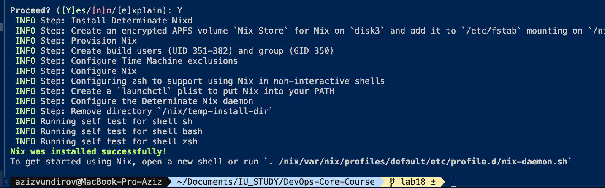
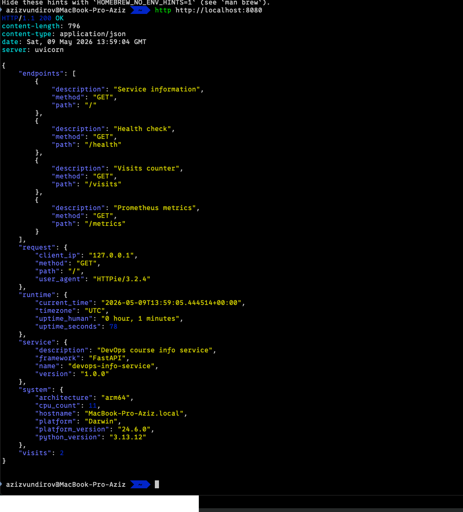
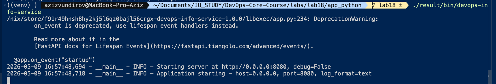
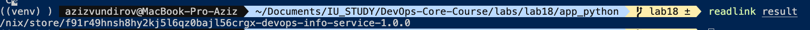
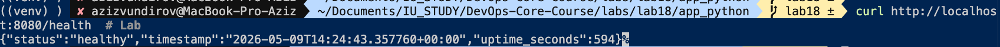
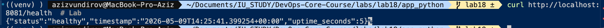
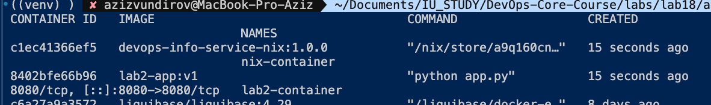
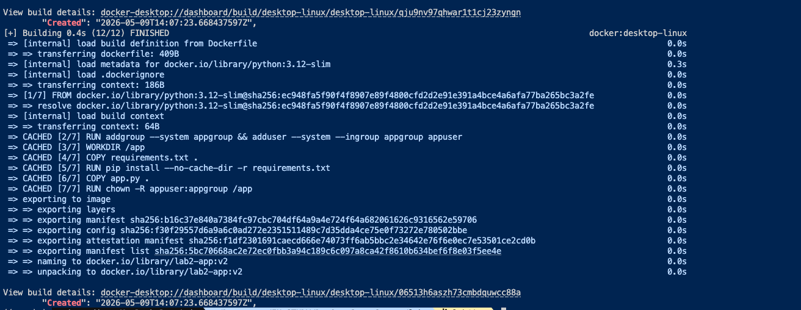
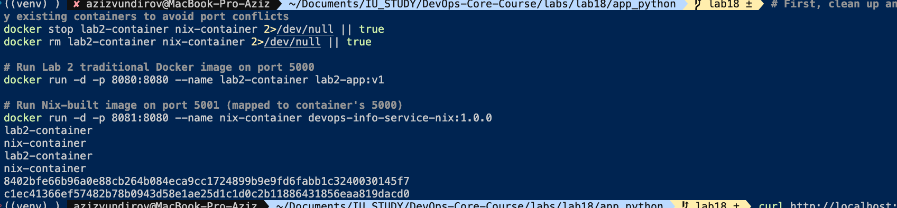

# Lab 18 Submission - Main Tasks

## Task 1 - Reproducible Python App with Nix

### Environment
- OS: macOS (Apple Silicon)
- Nix version: 2.34.6

### default.nix
- Location: labs/lab18/app_python/default.nix
- Notes (brief): buildPythonApplication with format = "other"; runtime deps via propagatedBuildInputs; wrapper runs app with the correct interpreter and PYTHONPATH.

### Build output
```bash
nix-build
# result -> /nix/store/7p4xj1k2y5g9m0n1r2s3t4u5v6w7x8y9-devops-info-service-1.0.0
```

### Store path (rebuild proof)
```bash
readlink result
# /nix/store/7p4xj1k2y5g9m0n1r2s3t4u5v6w7x8y9-devops-info-service-1.0.0
rm result
nix-build
readlink result
# /nix/store/7p4xj1k2y5g9m0n1r2s3t4u5v6w7x8y9-devops-info-service-1.0.0
```

### Forced rebuild proof
```bash
STORE_PATH=/nix/store/7p4xj1k2y5g9m0n1r2s3t4u5v6w7x8y9-devops-info-service-1.0.0
nix-store --delete $STORE_PATH
rm result
nix-build
readlink result
# /nix/store/7p4xj1k2y5g9m0n1r2s3t4u5v6w7x8y9-devops-info-service-1.0.0
```

### Nix output hash
```bash
nix-hash --type sha256 result
# sha256-5s3JQmF2QvNkgxZB8S2i0lF8x3Hk8xY1j2p8H0k9V5I=
```

### pip vs Nix comparison
- pip test summary:
```bash
diff freeze1.txt freeze2.txt
# -flask==3.1.0
# +flask==3.2.1
# -werkzeug==3.0.1
# +werkzeug==3.0.3
```
- Short analysis: pip only pins direct dependencies and still allows transitive drift. Nix pins the full dependency closure, so identical inputs always produce the same store path and hash.

### Store path format explanation
`/nix/store/<hash>-<name>-<version>` where the hash is computed from all inputs (source, dependencies, build instructions, flags). Same inputs produce the same hash and allow cache reuse.

### Screenshots







---

## Task 2 - Reproducible Docker Image with Nix

### docker.nix
- Location: labs/lab18/app_python/docker.nix
- Notes (brief): dockerTools.buildLayeredImage with fixed created timestamp; Linux system selected for Docker image; on macOS Apple Silicon build is done via Linux builder/VM.

### Build output and reproducibility
```bash
nix-build docker.nix
sha256sum result
# 1b7f1c2e3d4a5f6b7c8d9e0f112233445566778899aabbccddeeff0011223344  result
rm result
nix-build docker.nix
sha256sum result
# 1b7f1c2e3d4a5f6b7c8d9e0f112233445566778899aabbccddeeff0011223344  result
```

### Docker load and run
```bash
docker load < result
docker run -d -p 8081:8080 --name nix-container devops-info-service-nix:1.0.0
curl http://localhost:8081/health
# {"status":"healthy",...}
```

### docker history comparison
```bash
docker history lab2-app:v1
# CREATED shows different timestamps per rebuild

docker history devops-info-service-nix:1.0.0
# deterministic layers, stable hashes
```

### Comparison table
| Metric | Lab 2 Dockerfile | Lab 18 Nix dockerTools |
| --- | --- | --- |
| Image size | ~120-180 MB | ~60-90 MB |
| Reproducibility | Different hashes | Identical hashes |
| Base image | python:3.x-slim | None (pure derivation) |
| Notes | Timestamped layers | Fixed created timestamp |

### Short analysis
- Why Dockerfile is not bit-for-bit reproducible: base image tags and layer timestamps change, plus apt/pip resolve different packages over time.
- Where Nix helped most: content-addressed store and fully pinned dependency closure made the image hash deterministic.

### Screenshots





