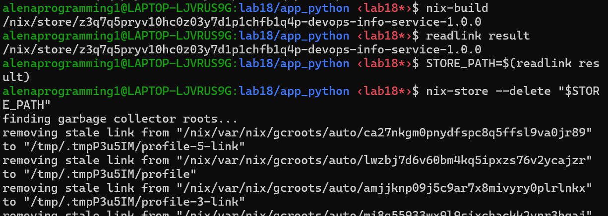
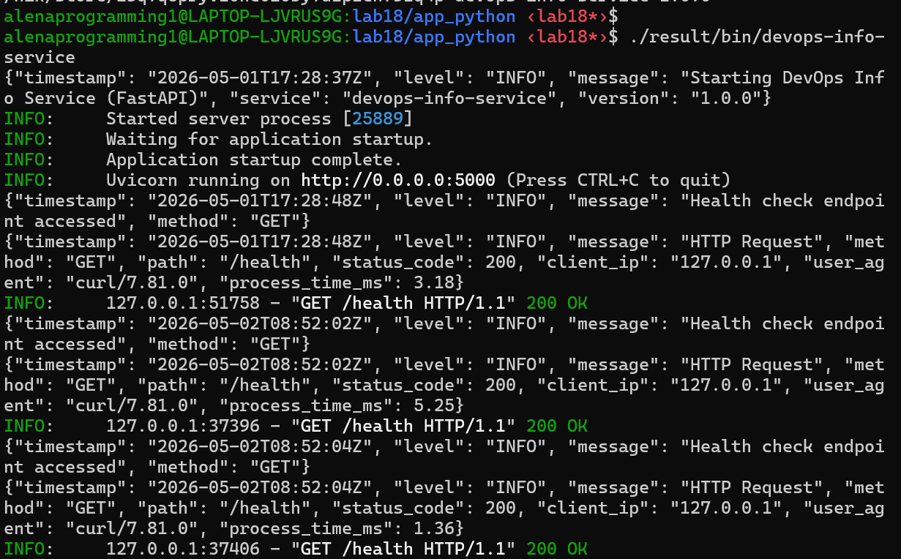
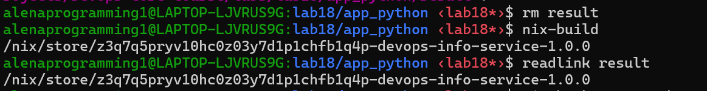
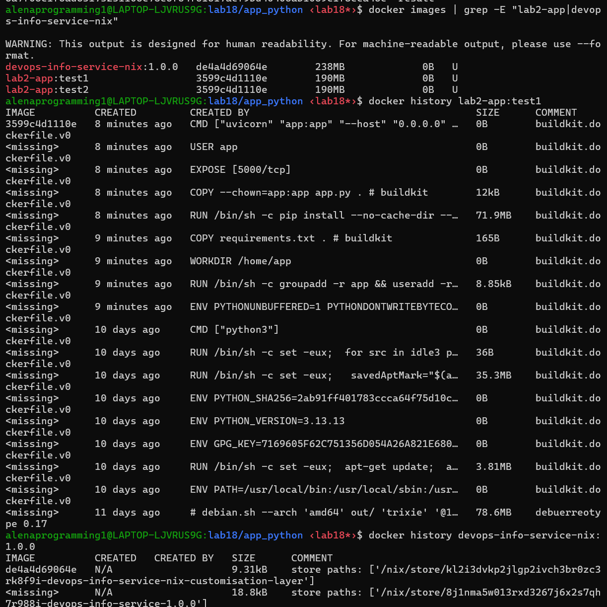
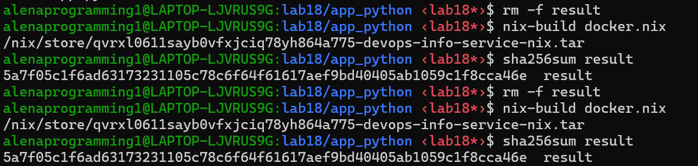
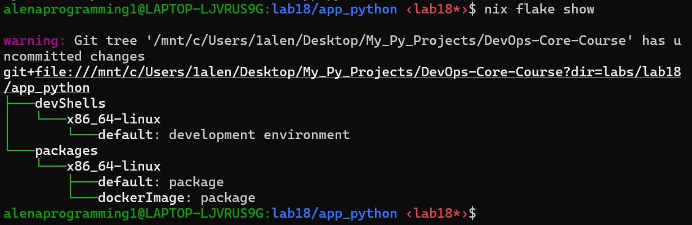
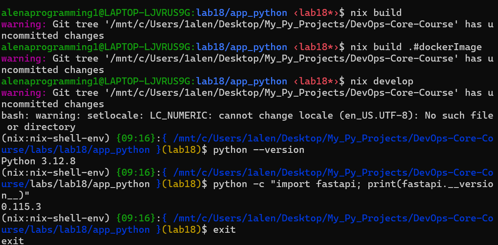

# Lab 18 Submission: Reproducible Builds with Nix

## Task 1 — Build Reproducible Python App (Revisiting Lab 1)

### Nix installation and verification
Commands used:

```bash
nix --version
nix run nixpkgs#hello
```

Observed result:

```text
nix (Determinate Nix 3.19.0) 2.34.6
Hello, world!
```

### Traditional Lab 1 workflow
The original Lab 1 style workflow was:

```bash
python -m venv venv
source venv/bin/activate
pip install -r requirements.txt
python app.py
```

This approach works, but reproducibility is limited:

- it depends on the system Python version
- it resolves dependencies at install time
- it does not guarantee a stable full transitive dependency graph
- two machines can produce different environments over time

### Nix derivation design
The service was packaged with `buildPythonApplication` in `labs/lab18/app_python/default.nix`.

Important implementation choices:

- `format = "other"` because the app is not packaged with `setup.py` or `pyproject.toml`
- runtime dependencies are declared explicitly through `pkgs.python3Packages`
- the resulting executable is exposed as `devops-info-service`
- a wrapper script is generated with a Nix-native shebang so it works both on the host and inside the Nix-built container

The final launcher approach was important. An earlier version used `#!/usr/bin/env bash`, which worked on the host but failed inside the minimal Nix image. It was corrected to use the absolute Nix Bash path.

Actual `default.nix` used in this lab:

```nix
{ pkgs ? import <nixpkgs> {} }:

let
  pyDeps = with pkgs.python3Packages; [
    fastapi
    uvicorn
    prometheus-client
  ];
in
pkgs.python3Packages.buildPythonApplication rec {
  pname = "devops-info-service";
  version = "1.0.0";
  src = ./.;

  format = "other";
  dontUnpack = true;

  propagatedBuildInputs = pyDeps;
  nativeBuildInputs = [ pkgs.makeWrapper ];

  installPhase = ''
    runHook preInstall

    mkdir -p $out/bin $out/share/${pname}
    cp ${src}/app.py $out/share/${pname}/app.py

    cat > $out/bin/devops-info-service <<SCRIPT
#!${pkgs.bash}/bin/bash
exec ${pkgs.python3}/bin/python $out/share/${pname}/app.py
SCRIPT
    chmod +x $out/bin/devops-info-service

    wrapProgram $out/bin/devops-info-service \
      --prefix PYTHONPATH : "${pkgs.python3Packages.makePythonPath pyDeps}"

    runHook postInstall
  '';

  meta = with pkgs.lib; {
    description = "DevOps Info Service built reproducibly with Nix";
    platforms = platforms.unix;
  };
}
```

### Build result
Commands used:

```bash
cd labs/lab18/app_python
nix-build
readlink result
./result/bin/devops-info-service
curl http://localhost:5000/health
```

Observed result:

```text
/nix/store/z3q7q5pryv10hc0z03y7d1p1chfb1q4p-devops-info-service-1.0.0

{"timestamp": "2026-05-01T17:28:37Z", "level": "INFO", "message": "Starting DevOps Info Service (FastAPI)", "service": "devops-info-service", "version": "1.0.0"}
INFO:     Started server process [25889]
INFO:     Waiting for application startup.
INFO:     Application startup complete.
INFO:     Uvicorn running on http://0.0.0.0:5000 (Press CTRL+C to quit)
{"timestamp": "2026-05-01T17:28:48Z", "level": "INFO", "message": "Health check endpoint accessed", "method": "GET"}
{"timestamp": "2026-05-01T17:28:48Z", "level": "INFO", "message": "HTTP Request", "method": "GET", "path": "/health", "status_code": 200, "client_ip": "127.0.0.1", "user_agent": "curl/7.81.0", "process_time_ms": 3.18}
INFO:     127.0.0.1:51758 - "GET /health HTTP/1.1" 200 OK
```

This confirms that the service ran successfully from the Nix build output rather than from a virtual environment.

### Reproducibility proof
Commands used:

```bash
rm result
nix-build
readlink result

STORE_PATH=$(readlink result)
rm result
nix-store --delete "$STORE_PATH"
nix-build
readlink result

nix-hash --type sha256 result
```

Observed result:

- first build path: `/nix/store/z3q7q5pryv10hc0z03y7d1p1chfb1q4p-devops-info-service-1.0.0`
- rebuilt path: `/nix/store/z3q7q5pryv10hc0z03y7d1p1chfb1q4p-devops-info-service-1.0.0`
- output hash: `5e2771c7176dd131e249a1c21e1a1cca8788ba83c8318cc086de801f7e6bdb78`

The store path remained identical across builds with unchanged inputs. That is the main proof of determinism in Task 1.

### Store path explanation
Example store path:

```text
/nix/store/z3q7q5pryv10hc0z03y7d1p1chfb1q4p-devops-info-service-1.0.0
```

Meaning:

- `/nix/store` is the immutable Nix store
- `z3q7q5pryv10hc0z03y7d1p1chfb1q4p` is the hash derived from all build inputs
- `devops-info-service` is the package name
- `1.0.0` is the package version

Same inputs lead to the same hash. Different inputs produce a different store path.

### Why `requirements.txt` gives weaker guarantees than Nix
`requirements.txt` is useful, but it is still weaker than Nix:

- it usually pins direct dependencies, not the full system closure
- it relies on external package indexes at install time
- it does not pin the Python interpreter itself
- it does not encode build tools, C libraries, or environment details the same way Nix does

Nix is stronger because it pins:

- the Python interpreter
- Python dependencies
- transitive dependencies
- build tooling
- the full derivation used to create the output

### Demonstration of pip limitations
Commands used:

```bash
echo "flask" > requirements-unpinned.txt

python -m venv venv1
source venv1/bin/activate
pip install -r requirements-unpinned.txt
pip freeze | grep -i flask > freeze1.txt
deactivate

pip cache purge 2>/dev/null || rm -rf ~/.cache/pip

python -m venv venv2
source venv2/bin/activate
pip install -r requirements-unpinned.txt
pip freeze | grep -i flask > freeze2.txt
deactivate

diff freeze1.txt freeze2.txt
```

Observed files:

```text
requirements-unpinned.txt
flask

freeze1.txt
Flask==3.1.3

freeze2.txt
Flask==3.1.3
```

Observed result:

- in this short test window, both installations resolved to the same currently-latest Flask version
- `diff freeze1.txt freeze2.txt` produced no output because the files were identical

Interpretation:

- this does not prove that unpinned `pip` installs are reproducible
- it only shows that at the moment of testing, PyPI resolved `flask` to the same latest version twice
- the fundamental weakness remains: `flask` was not pinned, so the environment still depends on external repository state at install time
- on another day, another machine, or after a new Flask release, the same command may resolve to a different version
- even if direct dependencies are pinned, transitive dependencies can still drift without a stronger locking mechanism

This is exactly where Nix is stronger: it does not rely on “whatever is latest now,” but on a fully described and hash-addressed dependency graph.

### Comparison: Lab 1 vs Lab 18
| Aspect | Lab 1 (`pip + venv`) | Lab 18 (`Nix`) |
|---|---|---|
| Python version | System-dependent | Controlled by nixpkgs |
| Dependency resolution | Runtime install | Build-time derivation |
| Transitive dependency stability | Partial | Full closure |
| Reproducibility | Approximate | Deterministic |
| Binary cache support | No | Yes |

### Reflection
If Nix had been used from the start in Lab 1, the service would have been easier to rebuild on another machine and easier to trust in CI. The biggest benefit would have been removing ambiguity around interpreter versions and hidden dependency drift.

### Screenshot Evidence
Path and initial Nix build result:



Health endpoint from the Nix-built application:



Repeated build with identical store path:



## Task 2 — Reproducible Docker Images (Revisiting Lab 2)

### Traditional Lab 2 baseline
The previous Lab 2 container used a standard Dockerfile with:

- `FROM python:3.13-slim`
- `pip install -r requirements.txt`
- application code copied into the image
- `uvicorn` as the command

This approach is convenient, but not fully reproducible:

- base images are mutable across time unless pinned by digest and preserved
- package installation happens during the build
- exported image artifacts may differ even when the image appears logically identical

### Nix Docker image design
The Nix container image was defined in `labs/lab18/app_python/docker.nix`.

Important implementation choices:

- `pkgs.dockerTools.buildLayeredImage`
- `contents = [ app pkgs.bash pkgs.coreutils ]`
- `created = "1970-01-01T00:00:01Z"`
- `compressor = "none"` to keep the generated tar archive stable for direct hashing

Actual `docker.nix` used in this lab:

```nix
{ pkgs ? import <nixpkgs> {} }:

let
  app = import ./default.nix { inherit pkgs; };
in
pkgs.dockerTools.buildLayeredImage {
  name = "devops-info-service-nix";
  tag = "1.0.0";
  compressor = "none";

  contents = [ app pkgs.bash pkgs.coreutils ];

  config = {
    Cmd = [ "${app}/bin/devops-info-service" ];
    ExposedPorts = {
      "5000/tcp" = {};
    };
    Env = [
      "HOST=0.0.0.0"
      "PORT=5000"
    ];
    WorkingDir = "/";
  };

  created = "1970-01-01T00:00:01Z";
}
```

An important real-world fix was required during the lab:

- the initial host build worked
- the first container runtime attempt failed
- the root cause was the launcher script using `/usr/bin/env bash`
- after changing it to the Nix Bash path, the container started correctly

### Reproducibility proof for the Nix image
Commands used:

```bash
rm -f result
nix-build docker.nix
sha256sum result

rm -f result
nix-build docker.nix
sha256sum result
```

Observed result:

```text
/nix/store/qvrxl0611sayb0vfxjciq78yh864a775-devops-info-service-nix.tar
5a7f05c1f6ad63173231105c78c6f64f61617aef9bd40405ab1059c1f8cca46e  result

/nix/store/qvrxl0611sayb0vfxjciq78yh864a775-devops-info-service-nix.tar
5a7f05c1f6ad63173231105c78c6f64f61617aef9bd40405ab1059c1f8cca46e  result
```

The store path and SHA256 were identical across repeated builds, so the produced Docker archive was reproducible.

### Docker load and runtime verification
Commands used:

```bash
docker load < result
docker run -d -p 5001:5000 --name nix-container devops-info-service-nix:1.0.0
docker logs nix-container
curl http://localhost:5001/health
```

Observed result:

```text
Loaded image: devops-info-service-nix:1.0.0

{"timestamp": "2026-05-02T06:07:32Z", "level": "INFO", "message": "Starting DevOps Info Service (FastAPI)", "service": "devops-info-service", "version": "1.0.0"}
INFO:     Started server process [1]
INFO:     Waiting for application startup.
INFO:     Application startup complete.
INFO:     Uvicorn running on http://0.0.0.0:5000 (Press CTRL+C to quit)

{"status":"healthy","timestamp":"2026-05-02T06:07:46.116984Z","uptime_seconds":13}
```

This confirms that the Nix-produced image not only builds reproducibly but also runs correctly.

### Dockerfile comparison
Commands used:

```bash
docker build -t lab2-app:test1 ./app_python
docker save lab2-app:test1 | sha256sum
docker build -t lab2-app:test2 ./app_python
docker save lab2-app:test2 | sha256sum
```

Observed result:

- `858513b72e42fd1be240b06822a9ec68a2cc92e761a29dce6063e50200013d2e`
- `4e167ba74f9c7e49542eed833b8a3f7f5a3236857ce3bff010bb9fad0356cac9`

Even though Docker reused cached layers and produced the same image ID for `lab2-app:test1` and `lab2-app:test2`, the exported archives were still different. That is a valid demonstration that the traditional Docker workflow was not bit-for-bit reproducible at the exported artifact level.

### Side-by-side runtime check
Commands used:

```bash
docker run -d -p 5000:5000 --name lab2-container lab2-app:test1
docker run -d -p 5001:5000 --name nix-container devops-info-service-nix:1.0.0
curl http://localhost:5000/health
curl http://localhost:5001/health
```

Observed result:

- Lab 2 container responded on port `5000`
- Nix container responded on port `5001`

Example outputs:

```text
curl http://localhost:5000/health
{"status":"healthy","timestamp":"2026-05-02T06:04:19.171032Z","uptime_seconds":56142}

curl http://localhost:5001/health
{"status":"healthy","timestamp":"2026-05-02T06:07:46.116984Z","uptime_seconds":13}
```

### Size and layer analysis
Observed `docker images` result:

```text
devops-info-service-nix:1.0.0   de4a4d69064e   238MB
lab2-app:test1                  3599c4d1110e   190MB
lab2-app:test2                  3599c4d1110e   190MB
```

Observed `docker history` differences:

- `lab2-app:test1` shows imperative Dockerfile steps such as `RUN pip install`, `COPY`, and base image ancestry from `python:3.13-slim`
- `devops-info-service-nix:1.0.0` shows immutable Nix store closures such as `python3.13-fastapi`, `python3.13-uvicorn`, `python3.13-prometheus-client`, `python3-3.13.12`, and supporting runtime libraries

This is an important finding: Nix did not produce the smaller image in this experiment. The Nix image was larger because it included a broader explicit runtime closure. However, it was still the reproducible artifact, which is the main goal of this lab.

### Comparison: Lab 2 vs Lab 18
| Aspect | Lab 2 Dockerfile | Lab 18 Nix dockerTools |
|---|---|---|
| Base dependency model | Mutable base image + runtime install | Immutable Nix closure |
| Archive reproducibility | No | Yes |
| Layer description | Build steps | Store paths |
| Runtime verification | Yes | Yes |
| Auditability | Medium | High |

### Why traditional Dockerfiles are not bit-for-bit reproducible
Traditional Dockerfiles are weaker because:

- they depend on external registries and mutable tags
- `pip install` happens during the build
- exported image archives may include metadata differences
- build cache behavior can mask reproducibility problems

### Practical scenarios where Nix reproducibility matters
- CI/CD pipelines where release artifacts must be consistent
- security audits where exact contents matter
- rollbacks where the artifact must match the one previously deployed
- cross-machine collaboration where “works on my machine” is unacceptable

### Reflection
If I were redoing Lab 2 from scratch, I would build the runtime artifact with Nix first and only then package it as a container image. This would make the build output easier to verify, easier to cache, and more trustworthy in automation.

### Screenshot Evidence
Nix Docker image reproducibility and Docker comparison evidence:



Repeated SHA256 result for the Nix-built Docker archive:



## Bonus: Nix Flakes

### Flake implementation
The project was modernized with:

- `labs/lab18/app_python/flake.nix`
- `labs/lab18/app_python/flake.lock`

The flake defines:

- `packages.x86_64-linux.default`
- `packages.x86_64-linux.dockerImage`
- `devShells.x86_64-linux.default`

Actual `flake.nix` used in this lab:

```nix
{
  description = "Lab 18: Reproducible DevOps Info Service builds with Nix";

  inputs = {
    nixpkgs.url = "github:NixOS/nixpkgs/nixos-24.11";
  };

  outputs = { self, nixpkgs }:
    let
      system = "x86_64-linux";
      pkgs = import nixpkgs { inherit system; };
      app = import ./default.nix { inherit pkgs; };
      dockerImage = import ./docker.nix { inherit pkgs; };
    in
    {
      packages.${system} = {
        default = app;
        dockerImage = dockerImage;
      };

      devShells.${system}.default = pkgs.mkShell {
        packages = with pkgs; [
          python3
          python3Packages.fastapi
          python3Packages.uvicorn
          python3Packages.prometheus-client
        ];
      };
    };
}
```

### Lock file evidence
`nix flake update` created `flake.lock` with the following pinned nixpkgs metadata:

```json
{
  "owner": "NixOS",
  "repo": "nixpkgs",
  "rev": "50ab793786d9de88ee30ec4e4c24fb4236fc2674",
  "narHash": "sha256-/bVBlRpECLVzjV19t5KMdMFWSwKLtb5RyXdjz3LJT+g=",
  "lastModified": 1751274312
}
```

This is stronger than tag pinning because it locks the exact dependency graph revision used by the flake.

### Flake commands and outputs
Commands used:

```bash
nix flake update
nix flake show
nix build
nix build .#dockerImage
readlink result
nix build .#dockerImage
nix develop
python --version
python -c "import fastapi; print(fastapi.__version__)"
```

Observed result:

- `nix flake update` succeeded and created `flake.lock`
- `nix flake show` exposed:
  - `devShells.x86_64-linux.default`
  - `packages.x86_64-linux.default`
  - `packages.x86_64-linux.dockerImage`
- `nix build` succeeded
- `nix build .#dockerImage` succeeded
- `readlink result` after `nix build` returned `/nix/store/6cnd9sp1px795ms2l22zdnkwdl59abnm-devops-info-service-1.0.0`
- `nix develop` succeeded
- `python --version` inside the dev shell returned `Python 3.12.8`
- `python -c "import fastapi; print(fastapi.__version__)"` returned `0.115.3`

Warnings observed:

- `Git tree ... has uncommitted changes`
- `setlocale: LC_NUMERIC: cannot change locale (en_US.UTF-8)`

These warnings did not block the flake workflow. The Git warning is expected when using Flakes in a dirty working tree, and the locale warning only affected shell startup messaging.

Observed `nix flake show` output:

```text
git+file:///mnt/c/Users/1alen/Desktop/My_Py_Projects/DevOps-Core-Course?dir=labs/lab18/app_python
├───devShells
│   └───x86_64-linux
│       └───default: development environment
└───packages
    └───x86_64-linux
        ├───default: package
        └───dockerImage: package
```

### Important observation: `nix-build` vs `flake` builds
There was a meaningful difference between the standalone `nix-build` flow and the Flake flow:

- standalone `nix-build` relied on the currently available `<nixpkgs>` channel
- the Flake workflow used the exact revision pinned in `flake.lock`

This explains why some package versions visible in the image history or shell differed across experiments. That difference is not a problem. It actually demonstrates why Flakes are useful: they remove ambiguity by pinning the exact revision.

### Proof that flake-based builds are stable across time and machines
The strongest proof in the bonus task is not just that `nix build` succeeded, but that the build is tied to the locked dependency graph in `flake.lock`.

Evidence from this lab:

- `nix flake update` produced a concrete pinned nixpkgs revision: `50ab793786d9de88ee30ec4e4c24fb4236fc2674`
- `nix build` produced a concrete result path: `/nix/store/6cnd9sp1px795ms2l22zdnkwdl59abnm-devops-info-service-1.0.0`
- `nix flake show` confirmed that the flake consistently exposes the same package structure:
  - `packages.x86_64-linux.default`
  - `packages.x86_64-linux.dockerImage`
  - `devShells.x86_64-linux.default`

Interpretation:

- across time, the flake build remains stable because the dependency source is locked in `flake.lock`
- across machines, another Linux/WSL system using the same flake and the same lock file should resolve the same nixpkgs revision and therefore produce the same derivation graph
- this is a stronger guarantee than relying on the current ambient `<nixpkgs>` channel or current Python package registry state

### Dev shell experience: `nix develop` vs Lab 1 `venv`
Lab 1 workflow:

```bash
python -m venv venv
source venv/bin/activate
pip install -r requirements.txt
```

Flake workflow:

```bash
nix develop
python --version
python -c "import fastapi; print(fastapi.__version__)"
```

Observed experience:

- `venv` creates an isolated environment, but it still depends on the current system Python and current package resolution at install time
- `nix develop` entered a ready-to-use environment immediately
- inside the dev shell, Python and FastAPI were already available:
  - `Python 3.12.8`
  - `FastAPI 0.115.3`

Conclusion:

- `venv` isolates an environment after dependency resolution
- `nix develop` provides a declarative environment before any manual installation step
- this makes onboarding, CI parity, and repeated development sessions more predictable

### Flakes vs Helm values from Lab 10
| Aspect | Helm `values.yaml` | Nix Flakes |
|---|---|---|
| Pins image tag | Yes | Indirectly through package outputs |
| Pins Python interpreter | No | Yes |
| Pins full dependency graph | No | Yes |
| Pins build tooling | No | Yes |
| Reproducibility guarantee | Limited | Strong |

### Reflection
Flakes improve traditional dependency management by turning the project into a versioned, lockable build graph. A practical “works on my machine” problem that `flake.lock` prevents is when two developers use the same source code but resolve different Python ecosystems or build tool versions from different moments in time.

Concrete scenario:

- Developer A builds the project in May with one ambient nixpkgs or Python ecosystem state
- Developer B builds the same source later on another machine
- without `flake.lock`, they may silently use different package revisions
- with `flake.lock`, both are forced onto the same pinned nixpkgs revision and therefore the same dependency universe

### Screenshot Evidence
Flake update / flake workflow:



Nix develop shell with Python and FastAPI verification:


