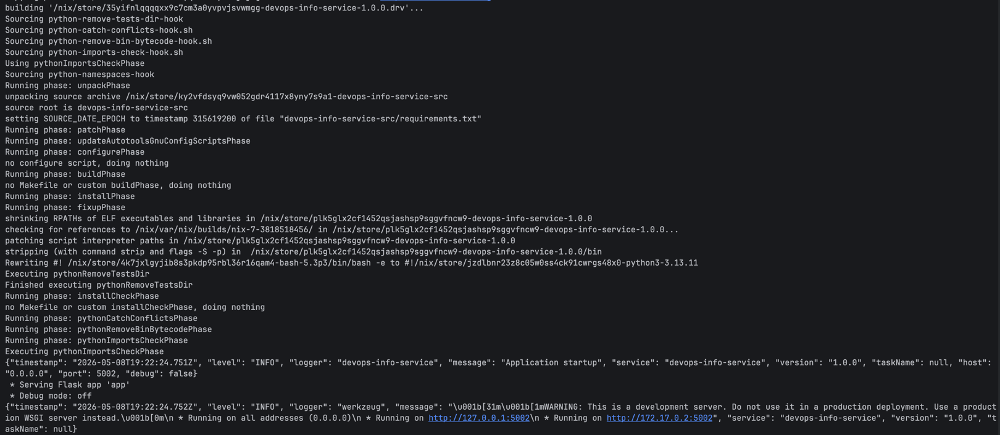
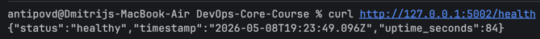
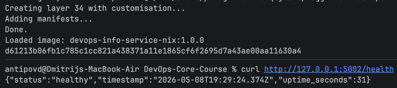
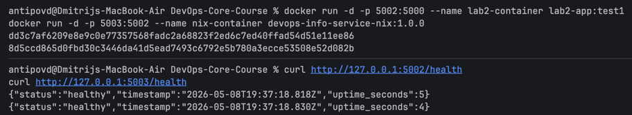

# Lab 18 — Reproducible Builds with Nix

## 1. Nix Setup


---

## 2. Python Application Build

Source copied from the Lab 1 application:

- `labs/lab18/app_python/app.py`
- `labs/lab18/app_python/requirements.txt`
- `labs/lab18/app_python/Dockerfile`

Implemented Nix expression:

```nix
pythonPackages.buildPythonApplication {
  pname = "devops-info-service";
  version = "1.0.0";
  src = source;
  format = "other";

  propagatedBuildInputs = with pythonPackages; [
    flask
    gunicorn
    prometheus-client
  ];

  nativeBuildInputs = [ pkgs.makeWrapper ];
}
```

Important fields:

- `python313`: pins Python through nixpkgs.
- `propagatedBuildInputs`: declares runtime dependencies.
- `source` filter: includes only `app.py` and `requirements.txt`, excluding generated `result` symlinks.
- `makeWrapper`: exposes `devops-info-service` as a runnable command.

Build and run:

```bash
docker run --rm -p 5002:5002 -v "$PWD":/work -w /work/labs/lab18/app_python nixos/nix:latest sh -lc \
  'nix-build >/dev/null && ./result/bin/devops-info-service'
```



Runtime check:



### Lab 1 Comparison


| Aspect                  | Lab 1: pip + venv               | Lab 18: Nix               |
| ----------------------- | ------------------------------- | ------------------------- |
| Python version          | Host dependent                  | Pinned by nixpkgs         |
| Direct dependencies     | `requirements.txt`              | Nix derivation            |
| Transitive dependencies | Resolved by pip at install time | Pinned by nixpkgs closure |
| Build isolation         | Virtualenv only                 | Nix sandbox/store         |
| Output identity         | No stable store hash            | Stable Nix store path     |


`requirements.txt` is weaker because it does not pin the interpreter, build tools, native libraries, or the complete dependency graph by content hash. Nix records the whole closure.

Reflection:

- If Lab 1 used Nix from the start, every teammate and CI runner would use the same Python, Flask, Werkzeug, gunicorn, and Prometheus client closure.

---

## 3. Reproducible Docker Image

Implemented `labs/lab18/app_python/docker.nix`:

```nix
pkgs.dockerTools.buildLayeredImage {
  name = "devops-info-service-nix";
  tag = "1.0.0";
  contents = [ app ];
  config.Cmd = [ "${app}/bin/devops-info-service" ];
  created = "1970-01-01T00:00:01Z";
}
```

Important fields:

- `contents = [ app ]`: includes the exact Nix-built application closure.
- `Cmd`: runs the wrapped app binary from the Nix store.
- `created`: fixed timestamp for reproducible image metadata.
- no mutable base image tag is used.

Build and hash comparison:

```bash
 docker run --rm -p 5002:5002 -v "$PWD":/work -w /work/labs/lab18/app_python nixos/nix:latest sh -lc \
    'nix-build docker.nix &&                                  
    sha256sum result &&
    rm result &&
    nix-build docker.nix &&
    sha256sum result'
```

Evidence:

```text
Done.
/nix/store/4s235p28pnmv3ah9np5ag9m5v9vfp3v0-devops-info-service-nix.tar.gz
f24c52a63006b27fdb5d3bd19a9ab54c9bf9b237b256cecec9baf510ec6bf587  result
/nix/store/4s235p28pnmv3ah9np5ag9m5v9vfp3v0-devops-info-service-nix.tar.gz
f24c52a63006b27fdb5d3bd19a9ab54c9bf9b237b256cecec9baf510ec6bf587  result
```

Load and run:

```bash
docker run --rm -v "$PWD":/work -w /work/labs/lab18/app_python nixos/nix:latest sh -lc \
  'nix-build docker.nix >/dev/null; cat result' | docker load
docker run -d -p 5002:5002 --name nix-container devops-info-service-nix:1.0.0
curl http://127.0.0.1:5002/health
```

Evidence:



### Side-by-Side Runtime

```bash
docker run -d -p 5002:5000 --name lab2-container lab2-app:test1
docker run -d -p 5003:5002 --name nix-container devops-info-service-nix:1.0.0
curl http://127.0.0.1:5002/health
curl http://127.0.0.1:5003/health
```

Evidence:



### Traditional Dockerfile Comparison

```bash
docker build -t lab2-app:test1 ./app_python
docker save lab2-app:test1 | shasum -a 256
sleep 2
docker build -t lab2-app:test2 ./app_python
docker save lab2-app:test2 | shasum -a 256
```

Evidence:

```text
View build details: docker-desktop://dashboard/build/desktop-linux/desktop-linux/mgb7ddn4lxi5ttep2inn7fzaf
85681299a633bde6c04578958bf88aef0c302697ce336f2323311e23f590f8a7  -

View build details: docker-desktop://dashboard/build/desktop-linux/desktop-linux/wb1d5zwhtly8vo7zp952n919o
6201e81ee52898ccc6146bb7d7fbd88bd399a655a79f0362b46ea7f336f326dd  -
```

The saved image hashes differ even with the same Dockerfile and source.

Image size:


Analysis:

- Traditional Docker embeds build metadata and depends on mutable external sources such as `python:3.13-slim` and PyPI resolution.
- Nix dockerTools uses immutable Nix store paths and fixed metadata.
- The Nix image is larger here because it includes the explicit Nix closure instead of relying on a slim Debian Python base layer.

Practical scenarios:

- CI/CD: identical artifacts from the same commit.
- Security audits: exact dependency closure is known.
- Rollbacks: old store paths and image hashes can be reused safely.

Reflection:

- If Lab 2 used Nix, the Dockerfile would become an output format, not the dependency resolver.

---

## 4. Bonus — Flakes

Implemented:

- `labs/lab18/app_python/flake.nix`
- `labs/lab18/app_python/flake.lock`

Build commands:

```bash
nix flake lock --extra-experimental-features "nix-command flakes"
nix build .#default --extra-experimental-features "nix-command flakes"
nix build .#dockerImage --extra-experimental-features "nix-command flakes"
```

Evidence:

```text
/nix/store/nqnh81c0syhp7zbs42c8xlafv1xabkgz-devops-info-service-1.0.0
e7e5bc478ac71f300d289f77d47a5159cc0edef06408fc771ab217de10afd16d  result
```

`flake.lock` pinned nixpkgs:

```json
{
  "lastModified": 1777268161,
  "narHash": "sha256-bxrdOn8SCOv8tN4JbTF/TXq7kjo9ag4M+C8yzzIRYbE=",
  "owner": "NixOS",
  "repo": "nixpkgs",
  "rev": "1c3fe55ad329cbcb28471bb30f05c9827f724c76"
}
```

Dev shell:

```nix
devShells.${system}.default = pkgs.mkShell {
  packages = with pkgs; [
    python313
    python313Packages.flask
    python313Packages.gunicorn
    python313Packages.prometheus-client
  ];
};
```

### Lab 10 Helm Comparison


| Aspect                | Lab 10 Helm values        | Lab 18 Nix Flake                      |
| --------------------- | ------------------------- | ------------------------------------- |
| Locks image tag       | Yes                       | Can output reproducible image         |
| Locks Python version  | No                        | Yes                                   |
| Locks Python packages | No                        | Yes                                   |
| Locks build tools     | No                        | Yes                                   |
| Lock format           | YAML values               | `flake.lock` with Git rev + narHash   |
| Drift risk            | Image tag can be repushed | Content hash changes if inputs change |


Flakes improve traditional dependency management by locking the complete nixpkgs input. That pins the package set used for Python, Flask, transitive packages, compilers, and image tooling.


