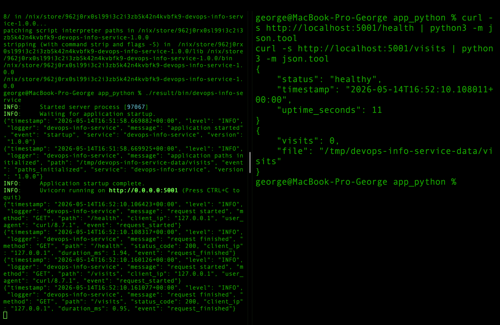
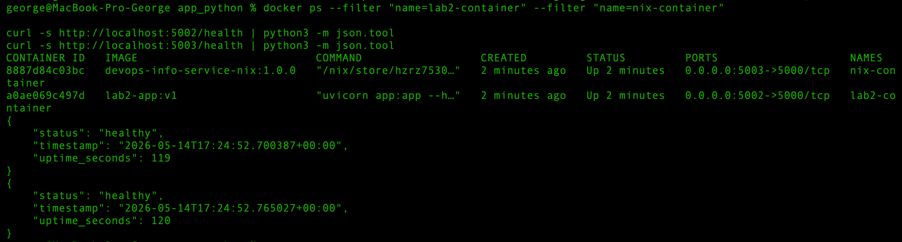
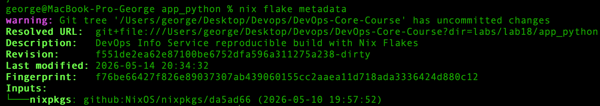

# Lab 18 — Reproducible Builds with Nix

## Task 1 — Build Reproducible Python App

### 1.1 Nix Installation

Nix was installed using the Determinate Systems installer.

Verification commands:

```bash
nix --version
nix run nixpkgs#hello
```

Output:

```text
nix (Determinate Nix 3.20.0) 2.34.6
Hello, world!
```

This confirms that Nix was installed successfully and can run packages from `nixpkgs`.

---

### 1.2 Application Preparation

The Lab 1 Python application was copied to:

```text
labs/lab18/app_python
```

Files copied from the original Lab 1/Lab 2 application:

```text
app.py
requirements.txt
Dockerfile
```

The application is a FastAPI-based DevOps Info Service with the following main dependencies:

```text
fastapi>=0.115.6
uvicorn[standard]==0.32.0
prometheus-client==0.23.1
```

---

### 1.3 Nix Derivation

The Nix derivation was created in:

```text
labs/lab18/app_python/default.nix
```

The derivation builds the FastAPI application and creates a wrapped executable called:

```text
devops-info-service
```

The wrapper starts the application with `uvicorn`.

```nix
{ pkgs ? import <nixpkgs> {} }:

let
  python = pkgs.python313;
  pythonPackages = pkgs.python313Packages;

  pythonPath = pythonPackages.makePythonPath [
    pythonPackages.fastapi
    pythonPackages.uvicorn
    pythonPackages.prometheus-client
  ];
in
pkgs.stdenv.mkDerivation {
  pname = "devops-info-service";
  version = "1.0.0";

  src = ./.;

  nativeBuildInputs = [
    pkgs.makeWrapper
  ];

  installPhase = ''
    mkdir -p $out/lib/devops-info-service
    mkdir -p $out/bin

    cp app.py $out/lib/devops-info-service/app.py

    makeWrapper ${pythonPackages.uvicorn}/bin/uvicorn $out/bin/devops-info-service \
      --add-flags "app:app --host 0.0.0.0 --port 5001 --no-access-log" \
      --set PYTHONPATH "$out/lib/devops-info-service:${pythonPath}" \
      --set DATA_DIR "/tmp/devops-info-service-data" \
      --set CONFIG_PATH "/tmp/devops-info-service-config/config.json" \
      --set APP_ENV "nix" \
      --set LOG_LEVEL "info" \
      --set RELEASE_VERSION "1.0.0"
  '';

  meta = {
    description = "DevOps Info Service built reproducibly with Nix";
    mainProgram = "devops-info-service";
  };
}
```

Field explanation:

| Field               | Meaning                                                                       |
| ------------------- | ----------------------------------------------------------------------------- |
| `pname`             | Package name in the Nix derivation                                            |
| `version`           | Application version                                                           |
| `src = ./.`         | Use the current directory as the source                                       |
| `nativeBuildInputs` | Build-time tools, here `makeWrapper`                                          |
| `pythonPath`        | Python dependency path containing FastAPI, Uvicorn, and Prometheus client     |
| `installPhase`      | Custom installation commands                                                  |
| `makeWrapper`       | Creates an executable script that starts Uvicorn with the correct environment |
| `DATA_DIR`          | Runtime data directory for the visits counter                                 |
| `CONFIG_PATH`       | Runtime config path                                                           |
| `APP_ENV`           | Application environment marker                                                |
| `RELEASE_VERSION`   | Application version exposed at runtime                                        |

The application was run on port `5001` because port `5000` was already used on the macOS machine.

---

### 1.4 Build Output

Command:

```bash
nix-build
```

Output:

```text
/nix/store/dj4mpz4p29ndg8yn00x5n3nf7qgw7flb-devops-info-service-1.0.0
```

Store path check:

```bash
readlink result
```

Output:

```text
/nix/store/dj4mpz4p29ndg8yn00x5n3nf7qgw7flb-devops-info-service-1.0.0
```

This path has the format:

```text
/nix/store/<hash>-<name>-<version>
```

In this build:

| Part         | Value                              |
| ------------ | ---------------------------------- |
| Store root   | `/nix/store`                       |
| Hash         | `dj4mpz4p29ndg8yn00x5n3nf7qgw7flb` |
| Package name | `devops-info-service`              |
| Version      | `1.0.0`                            |

The hash is derived from the build inputs, dependencies, and build instructions.

---

### 1.5 Running the Nix-built Application

Command:

```bash
./result/bin/devops-info-service
```

Output:

```text
INFO:     Started server process [89110]
INFO:     Waiting for application startup.
INFO:     Application startup complete.
INFO:     Uvicorn running on http://0.0.0.0:5001 (Press CTRL+C to quit)
```

Health check:

```bash
curl -s http://localhost:5001/health | python3 -m json.tool
```

Output:

```json
{
    "status": "healthy",
    "timestamp": "2026-05-14T16:36:09.198765+00:00",
    "uptime_seconds": 498
}
```

Visits endpoint:

```bash
curl -s http://localhost:5001/visits | python3 -m json.tool
```

Output:

```json
{
    "visits": 0,
    "file": "/tmp/devops-info-service-data/visits"
}
```

This confirms that the Nix-built version of the Lab 1 application works correctly.

Screenshot of the Nix-built application running locally:



---

### 1.6 Reproducibility Check

First, the current store path was recorded:

```bash
FIRST_PATH=$(readlink result)
echo "First build path: $FIRST_PATH"
```

Output:

```text
First build path: /nix/store/dj4mpz4p29ndg8yn00x5n3nf7qgw7flb-devops-info-service-1.0.0
```

Then the `result` symlink was removed and the app was built again:

```bash
rm result
nix-build

SECOND_PATH=$(readlink result)
echo "Second build path: $SECOND_PATH"
```

Output:

```text
/nix/store/dj4mpz4p29ndg8yn00x5n3nf7qgw7flb-devops-info-service-1.0.0
Second build path: /nix/store/dj4mpz4p29ndg8yn00x5n3nf7qgw7flb-devops-info-service-1.0.0
```

Both paths are identical.

To prove that Nix can reproduce the output after deletion, the store path was deleted and rebuilt:

```bash
STORE_PATH=$(readlink result)
echo "Original store path: $STORE_PATH"

rm result
nix-store --delete "$STORE_PATH"

nix-build

REBUILT_PATH=$(readlink result)
echo "Rebuilt store path: $REBUILT_PATH"
```

Output:

```text
Original store path: /nix/store/dj4mpz4p29ndg8yn00x5n3nf7qgw7flb-devops-info-service-1.0.0
deleting '/nix/store/dj4mpz4p29ndg8yn00x5n3nf7qgw7flb-devops-info-service-1.0.0'
1 store paths deleted, 13.6 KiB freed
/nix/store/dj4mpz4p29ndg8yn00x5n3nf7qgw7flb-devops-info-service-1.0.0
Rebuilt store path: /nix/store/dj4mpz4p29ndg8yn00x5n3nf7qgw7flb-devops-info-service-1.0.0
```

The store path after forced rebuild is identical to the original one.

Output hash:

```bash
nix-hash --type sha256 result
```

Output:

```text
239fe04a9187e8e2697fc55466be15b5cdae5388a947eec191ed89e9993b9f51
```

This confirms that the Nix build is reproducible for the same source code, Nix package set, dependencies, and build instructions.

---

### 1.7 Traditional pip Environment Comparison

To compare the Nix approach with the traditional Lab 1 workflow, a Python virtual environment was created and dependencies were installed with `pip`.

Commands:

```bash
python3 -m venv pip-venv
source pip-venv/bin/activate

pip install -r requirements.txt
pip freeze | sort > pip-freeze.txt

cat requirements.txt
cat pip-freeze.txt

wc -l requirements.txt pip-freeze.txt

deactivate
```

The original `requirements.txt` contains only direct dependency declarations:

```text
fastapi>=0.115.6
uvicorn[standard]==0.32.0
prometheus-client==0.23.1
```

However, `pip freeze` produced the full resolved environment:

```text
PyYAML==6.0.3
annotated-doc==0.0.4
annotated-types==0.7.0
anyio==4.13.0
click==8.3.3
fastapi==0.136.1
h11==0.16.0
httptools==0.7.1
idna==3.15
prometheus_client==0.23.1
pydantic==2.13.4
pydantic_core==2.46.4
python-dotenv==1.2.2
starlette==1.0.0
typing-inspection==0.4.2
typing_extensions==4.15.0
uvicorn==0.32.0
uvloop==0.22.1
watchfiles==1.1.1
websockets==16.0
```

This demonstrates that the traditional `requirements.txt` file only describes the direct dependencies of the application. The actual Python environment contains many transitive dependencies.

For example, `fastapi>=0.115.6` allowed pip to install:

```text
fastapi==0.136.1
```

This means that the exact installed version can change over time if the package index changes and the dependency is not fully pinned.

Nix provides stronger reproducibility guarantees because the Python interpreter, direct dependencies, transitive dependencies, and build instructions are all part of the Nix derivation and its dependency closure.

| Aspect                  | Lab 1 pip + venv                         | Lab 18 Nix                              |
| ----------------------- | ---------------------------------------- | --------------------------------------- |
| Direct dependencies     | Listed in `requirements.txt`             | Declared in `default.nix`               |
| Transitive dependencies | Resolved by pip during install           | Included in the Nix dependency closure  |
| Python version          | Depends on local system                  | Provided by Nix                         |
| Output identity         | No content-addressed output              | Store path in `/nix/store`              |
| Rebuild result          | Can change if package resolution changes | Same inputs produce the same store path |
| Binary cache            | No built-in binary cache                 | Nix can reuse cached store paths        |

---

### 1.8 Reflection

If Nix had been used from the start of Lab 1, the application would have had a reproducible Python runtime, reproducible dependencies, and a consistent startup command. This would reduce "works on my machine" problems because every developer and CI environment could build the same derivation and get the same store path.

---


## Task 2 — Reproducible Docker Images

### 2.1 Lab 2 Dockerfile Review

The original Lab 2 Dockerfile was located at:

```text
app_python/Dockerfile
```

Dockerfile:

```dockerfile
FROM python:3.13-slim

ENV PYTHONDONTWRITEBYTECODE=1 \
    PYTHONUNBUFFERED=1 \
    DATA_DIR=/data \
    CONFIG_PATH=/config/config.json

RUN useradd -m -u 10001 appuser

WORKDIR /app

RUN apt-get update \
    && apt-get install -y --no-install-recommends curl \
    && rm -rf /var/lib/apt/lists/*

COPY requirements.txt .
RUN pip install --no-cache-dir -r requirements.txt

COPY app.py .

RUN mkdir -p /data /config \
    && chown -R appuser:appuser /app /data /config

USER appuser

EXPOSE 5000

CMD ["uvicorn", "app:app", "--host", "0.0.0.0", "--port", "5000", "--no-access-log"]
```

This Dockerfile follows common containerization practices: it uses a Python base image, installs dependencies with `pip`, creates a non-root user, exposes port `5000`, and starts the application with `uvicorn`.

However, it is not fully reproducible because it depends on a mutable base image tag, runtime package installation, `apt-get update`, and build timestamps.

---

### 2.2 Traditional Dockerfile Reproducibility Test

The Lab 2 Docker image was built twice with the same Dockerfile and source code.

Commands:

```bash
docker build --no-cache -t lab2-app:v1 ./app_python
docker inspect -f 'Created={{.Created}} ID={{.Id}}' lab2-app:v1

sleep 5

docker build --no-cache -t lab2-app:v2 ./app_python
docker inspect -f 'Created={{.Created}} ID={{.Id}}' lab2-app:v2
```

Output:

```text
Created=2026-05-14T17:13:15.58579275Z ID=sha256:626c75275bf8499d2fdbb97f74f7a345daf461005491b01c238330233ef26b74

Created=2026-05-14T17:13:54.694386546Z ID=sha256:134244af6e376114c036cfa4995e170a53cdb9c05aeac45b71d2683c27fe8cf6
```

The creation timestamps and image IDs are different.

The saved image hashes were also different:

```bash
docker save lab2-app:v1 | shasum -a 256
docker save lab2-app:v2 | shasum -a 256
```

Output:

```text
76b48ffb1336a6f30d430830eecfbc515e633509c278009dbf7f1fcaeccc05b9  -
73b310959e4f2299c618c0710d5cfaa5b1003e3b375adea89774a2434e9fb4ac  -
```

This confirms that the traditional Dockerfile build was not bit-for-bit reproducible.

---

### 2.3 Nix Docker Image with dockerTools

The Nix Docker image was defined in:

```text
labs/lab18/app_python/docker.nix
```

```nix
{ pkgs ? import <nixpkgs> {} }:

let
  app = import ./default.nix { inherit pkgs; };

  pythonPackages = pkgs.python313Packages;

  pythonPath = pythonPackages.makePythonPath [
    pythonPackages.fastapi
    pythonPackages.uvicorn
    pythonPackages.prometheus-client
  ];
in
pkgs.dockerTools.buildLayeredImage {
  name = "devops-info-service-nix";
  tag = "1.0.0";

  contents = [
    app
    pythonPackages.uvicorn
    pythonPackages.fastapi
    pythonPackages.prometheus-client
    pkgs.bash
    pkgs.coreutils
  ];

  config = {
    Cmd = [
      "${pythonPackages.uvicorn}/bin/uvicorn"
      "app:app"
      "--host"
      "0.0.0.0"
      "--port"
      "5000"
      "--no-access-log"
    ];

    ExposedPorts = {
      "5000/tcp" = {};
    };

    Env = [
      "PYTHONPATH=${app}/lib/devops-info-service:${pythonPath}"
      "DATA_DIR=/tmp/devops-info-service-data"
      "CONFIG_PATH=/tmp/devops-info-service-config/config.json"
      "APP_ENV=nix-docker"
      "LOG_LEVEL=info"
      "RELEASE_VERSION=1.0.0"
    ];

    WorkingDir = "/";
  };

  created = "1970-01-01T00:00:01Z";
}
```

Field explanation:

| Field               | Meaning                                                            |
| ------------------- | ------------------------------------------------------------------ |
| `app`               | Imports the reproducible application derivation from `default.nix` |
| `pythonPackages`    | Provides Python packages from Nix                                  |
| `pythonPath`        | Builds a deterministic Python module path                          |
| `buildLayeredImage` | Creates a Docker image using Nix `dockerTools`                     |
| `name`              | Docker image repository name                                       |
| `tag`               | Docker image tag                                                   |
| `contents`          | Nix store paths included in the image                              |
| `config.Cmd`        | Default command executed when the container starts                 |
| `ExposedPorts`      | Documents port `5000/tcp` as exposed                               |
| `Env`               | Runtime environment variables for the application                  |
| `created`           | Fixed image creation timestamp for reproducibility                 |

The fixed `created` value is important because using the current time would make every image build different.

---

### 2.4 Nix Docker Image Reproducibility Test

First, the image was built directly on macOS. The resulting image had a deterministic hash, but it could not run in Docker because it contained Darwin binaries. The runtime error was:

```text
exec /nix/store/.../bin/uvicorn: exec format error
```

Because Docker containers require Linux executables, the image was rebuilt inside a Linux Nix container:

```bash
docker run --rm -it \
  -v "$PWD":/workspace \
  -w /workspace/labs/lab18/app_python \
  nixos/nix:latest \
  bash
```

Inside the Linux Nix container:

```bash
nix --version

nix-build docker.nix -o result-linux-image-1
sha256sum result-linux-image-1

rm result-linux-image-1

nix-build docker.nix -o result-linux-image-2
sha256sum result-linux-image-2
```

Output:

```text
nix (Nix) 2.34.7

67077f07680e6973e90432977c3bc13c525cbb850f136dc2b03b146bae7c16b1  result-linux-image-1
67077f07680e6973e90432977c3bc13c525cbb850f136dc2b03b146bae7c16b1  result-linux-image-2
```

The SHA256 hashes are identical, so the Nix-built Docker image is reproducible.

The final image tarball was copied back to the host and loaded into Docker:

```bash
docker load < devops-info-service-nix-linux.tar.gz
```

Output:

```text
Loaded image: devops-info-service-nix:1.0.0
```

---

### 2.5 Running Traditional and Nix Containers Side-by-Side

Both containers were started simultaneously:

```bash
docker stop lab2-container nix-container 2>/dev/null || true
docker rm lab2-container nix-container 2>/dev/null || true

docker run -d -p 5002:5000 --name lab2-container lab2-app:v1
docker run -d -p 5003:5000 --name nix-container devops-info-service-nix:1.0.0
```

Container status:

```bash
docker ps --filter "name=lab2-container" --filter "name=nix-container"
```

Output:

```text
CONTAINER ID   IMAGE                           COMMAND                  STATUS         PORTS                    NAMES
8887d84c03bc   devops-info-service-nix:1.0.0   "/nix/store/hzrz7530…"   Up 4 seconds   0.0.0.0:5003->5000/tcp   nix-container
a0ae069c497d   lab2-app:v1                     "uvicorn app:app --h…"   Up 4 seconds   0.0.0.0:5002->5000/tcp   lab2-container
```

Health checks:

```bash
curl -s http://localhost:5002/health | python3 -m json.tool
curl -s http://localhost:5003/health | python3 -m json.tool
```

Output:

```json
{
    "status": "healthy",
    "timestamp": "2026-05-14T17:23:00.204988+00:00",
    "uptime_seconds": 6
}
```

```json
{
    "status": "healthy",
    "timestamp": "2026-05-14T17:23:00.267211+00:00",
    "uptime_seconds": 7
}
```

Both containers run the same application successfully.

Screenshot showing both containers running side-by-side:



---

### 2.6 Image Size Comparison

Command:

```bash
docker images --format 'table {{.Repository}}\t{{.Tag}}\t{{.Size}}\t{{.ID}}' | grep -E "lab2-app|devops-info-service-nix"
```

Output:

```text
lab2-app                            v2              275MB     134244af6e37
lab2-app                            v1              275MB     626c75275bf8
devops-info-service-nix             1.0.0           476MB     e98722270a20
```

| Metric             | Lab 2 Dockerfile                | Lab 18 Nix dockerTools                  |
| ------------------ | ------------------------------- | --------------------------------------- |
| Image size         | `275MB`                         | `476MB`                                 |
| Reproducibility    | Different hashes between builds | Identical hashes between builds         |
| Build caching      | Docker layer cache              | Nix content-addressed store             |
| Base image         | `python:3.13-slim`              | No Docker base image; Nix store closure |
| Timestamp behavior | Build timestamps vary           | Fixed timestamp                         |
| Runtime test       | `/health` works                 | `/health` works                         |

The Nix image was larger in this implementation because it included the full Nix closure required by Python, Uvicorn, FastAPI, Prometheus client, Bash, and Coreutils. The goal of this task was reproducibility, not minimal image size. A more optimized Nix expression could reduce the image size by minimizing `contents`.

---

### 2.7 Docker History Comparison

Traditional Dockerfile image history:

```bash
docker history lab2-app:v1 | head -20
```

Output:

```text
IMAGE          CREATED          CREATED BY                                      SIZE      COMMENT
626c75275bf8   9 minutes ago    CMD ["uvicorn" "app:app" "--host" "0.0.0.0" …   0B        buildkit.dockerfile.v0
<missing>      9 minutes ago    EXPOSE map[5000/tcp:{}]                         0B        buildkit.dockerfile.v0
<missing>      9 minutes ago    USER appuser                                    0B        buildkit.dockerfile.v0
<missing>      9 minutes ago    RUN /bin/sh -c mkdir -p /data /config     &&…   32.8kB    buildkit.dockerfile.v0
<missing>      9 minutes ago    COPY app.py . # buildkit                        20.5kB     buildkit.dockerfile.v0
<missing>      9 minutes ago    RUN /bin/sh -c pip install --no-cache-dir -r…   42.3MB    buildkit.dockerfile.v0
<missing>      10 minutes ago   COPY requirements.txt . # buildkit              12.3kB     buildkit.dockerfile.v0
<missing>      10 minutes ago   RUN /bin/sh -c apt-get update     && apt-get…   14.5MB    buildkit.dockerfile.v0
<missing>      10 minutes ago   WORKDIR /app                                    8.19kB    buildkit.dockerfile.v0
<missing>      10 minutes ago   RUN /bin/sh -c useradd -m -u 10001 appuser #…   69.6kB    buildkit.dockerfile.v0
<missing>      10 minutes ago   ENV PYTHONDONTWRITEBYTECODE=1 PYTHONUNBUFFER…   0B        buildkit.dockerfile.v0
```

The traditional Dockerfile history shows build-time layers with relative creation times such as `9 minutes ago` and `10 minutes ago`.

Nix dockerTools image history:

```bash
docker history devops-info-service-nix:1.0.0 | head -20
```

Output:

```text
IMAGE          CREATED   CREATED BY   SIZE      COMMENT
e98722270a20   N/A                    2.35MB    store paths: ['/nix/store/blk7pmqw9vjp1dqhr4whfabxzwn3q8yk-devops-info-service-nix-customisation-layer']
<missing>      N/A                    45.1kB    store paths: ['/nix/store/ivsnpbddxj6a9nsh1y5m85q102b53gx8-devops-info-service-1.0.0']
<missing>      N/A                    2.06MB    store paths: ['/nix/store/3s53aywfl0dr45462ck13xi3a9pcp836-python3.13-fastapi-0.116.1']
<missing>      N/A                    6.24MB    store paths: ['/nix/store/5pw9qxdf5p3a6mfxfmn72i8yibbk40cx-python3.13-pydantic-2.11.7']
<missing>      N/A                    5.07MB    store paths: ['/nix/store/3gzx32bqnidawxx7pisvig4lwd10j0wh-python3.13-pydantic-core-2.33.2']
<missing>      N/A                    1.23MB    store paths: ['/nix/store/ldis6a9vpmbpswg6bmxrhgwm4dz4pzgf-python3.13-starlette-0.47.2']
<missing>      N/A                    2.05MB    store paths: ['/nix/store/gkfrf6jd44cw7ah3kw2f7dyyvjvfnga9-python3.13-anyio-4.11.0']
<missing>      N/A                    1.23MB    store paths: ['/nix/store/hzrz7530swz537prxl9r3r3hk8qnvbxg-python3.13-uvicorn-0.35.0']
<missing>      N/A                    1.38MB    store paths: ['/nix/store/mv1xhqpfbwimj5v4gfhs1aa79n1dkz7x-python3.13-click-8.2.1']
<missing>      N/A                    1.06MB    store paths: ['/nix/store/x90cc5wyf0l5nnqfkdbb9andwdjisg55-python3.13-idna-3.11']
```

The Nix image history is based on Nix store paths. Each layer corresponds to immutable Nix store content. This makes the image easier to inspect and more deterministic.

---

### 2.8 Analysis

Traditional Dockerfiles cannot easily achieve bit-for-bit reproducibility because several inputs can change between builds:

* base image tags such as `python:3.13-slim` can point to different image digests over time;
* `apt-get update` downloads the current state of package repositories;
* `pip install` resolves Python packages at build time;
* Docker image metadata includes timestamps;
* repeated builds can produce different image IDs and saved image hashes.

Nix `dockerTools` improves this by building the application from Nix store paths. The dependencies are represented as immutable store paths, and the image timestamp was fixed with:

```nix
created = "1970-01-01T00:00:01Z";
```

As a result, rebuilding the Nix image produced identical SHA256 hashes.

---

### 2.9 Reflection

If I could redo Lab 2 with Nix, I would keep the useful Docker concepts from Lab 2, such as exposing the correct port and running the application in an isolated container, but I would build the application and image contents from Nix derivations instead of installing dependencies during the Docker build.

This would make the image more reproducible and easier to audit. It would also make rollbacks safer because the exact build inputs would be represented by Nix store paths.

Practical scenarios where Nix reproducibility matters:

* CI/CD pipelines, where every runner must build the same artifact;
* security audits, where exact dependency versions must be known;
* production rollbacks, where an old version must be rebuilt exactly;
* team development, where different machines should not produce different builds;
* long-term maintenance, where package repositories and base image tags may change over time.

---

# Bonus Task — Modern Nix with Flakes

## Bonus.1 Objective

The goal of this bonus task was to modernize the Lab 18 Nix setup using Nix Flakes.

Nix Flakes improve reproducibility by adding:

- `flake.nix` for a standard project interface
- `flake.lock` for locked dependencies
- reproducible package builds
- reproducible Docker image builds
- isolated development shells with `nix develop`

## Bonus.2 Flake Files

The following files were added:

```text
labs/lab18/app_python/flake.nix
labs/lab18/app_python/flake.lock
```

The flake provides three main outputs:

```bash
nix build
nix build .#dockerImage
nix develop
```

- `nix build` builds the Python application.
- `nix build .#dockerImage` builds the Docker image.
- `nix develop` enters a reproducible development shell.

## Bonus.3.1 flake.nix

The complete flake definition is stored in:

```text
labs/lab18/app_python/flake.nix
```

```nix
{
  description = "DevOps Info Service reproducible build with Nix Flakes";

  inputs = {
    nixpkgs.url = "github:NixOS/nixpkgs/nixos-unstable";
  };

  outputs = { self, nixpkgs }:
    let
      supportedSystems = [
        "aarch64-darwin"
        "x86_64-linux"
        "aarch64-linux"
      ];

      forAllSystems = nixpkgs.lib.genAttrs supportedSystems;
    in
    {
      packages = forAllSystems (system:
        let
          pkgs = import nixpkgs { inherit system; };
        in
        {
          default = import ./default.nix { inherit pkgs; };
          dockerImage = import ./docker.nix { inherit pkgs; };
        });

      apps = forAllSystems (system:
        {
          default = {
            type = "app";
            program = "${self.packages.${system}.default}/bin/devops-info-service";
          };
        });

      devShells = forAllSystems (system:
        let
          pkgs = import nixpkgs { inherit system; };
          python = pkgs.python313;
          pythonPackages = pkgs.python313Packages;
        in
        {
          default = pkgs.mkShell {
            packages = [
              python
              pythonPackages.fastapi
              pythonPackages.uvicorn
              pythonPackages.prometheus-client
              pkgs.curl
            ];

            shellHook = ''
              export DATA_DIR="$PWD/.nix-dev/data"
              export CONFIG_PATH="$PWD/.nix-dev/config/config.json"
              export APP_ENV="nix-flake-dev"
              export LOG_LEVEL="debug"
              export RELEASE_VERSION="1.0.0-flake"

              mkdir -p "$DATA_DIR" "$(dirname "$CONFIG_PATH")"

              echo "Nix flake dev shell ready"
              echo "Python: $(python --version)"
              echo "DATA_DIR=$DATA_DIR"
            '';
          };
        });
    };
}
```

Field explanation:

| Field | Meaning |
|---|---|
| `description` | Human-readable project description shown by `nix flake metadata` |
| `inputs.nixpkgs` | Pinned package source used for Python, build tools, and Docker image creation |
| `outputs` | Defines what the flake exposes |
| `packages.default` | Default application package built by `nix build` |
| `packages.dockerImage` | Docker image artifact built by `nix build .#dockerImage` |
| `devShells.default` | Reproducible development shell entered with `nix develop` |
| `legacyPackages` / `pkgs` | Package set imported from the locked `nixpkgs` input |
| `python` | Python interpreter selected from Nix |
| `pythonPackages` | Python package set used for FastAPI, Uvicorn, and Prometheus client |

## Bonus.3 Locked Dependencies

The lock file was generated with:

```bash
nix flake update
```

This created `flake.lock` and pinned the exact `nixpkgs` revision.

Important `flake.lock` excerpt:

```json
"nixpkgs": {
  "locked": {
    "lastModified": 1778443072,
    "narHash": "sha256-zi7/fsqM/kFdNuED//4WOCUtezGtKKqRNORjMvfwjnA=",
    "owner": "NixOS",
    "repo": "nixpkgs",
    "rev": "da5ad661ba4e5ef59ba743f0d112cbc30e474f32",
    "type": "github"
  },
  "original": {
    "owner": "NixOS",
    "ref": "nixos-unstable",
    "repo": "nixpkgs",
    "type": "github"
  }
}
```

Flake metadata was checked with:

```bash
nix flake metadata
```

Output:

```text
Resolved URL:  git+file:///Users/george/Desktop/Devops/DevOps-Core-Course?dir=labs/lab18/app_python
Description:   DevOps Info Service reproducible build with Nix Flakes
Revision:      f551de2ea62e87100be6752dfa596a311275a238-dirty
Last modified: 2026-05-14 20:34:32
Fingerprint:   f76be66427f826e89037307ab439060155cc2aaea11d718ada3336424d880c12
Inputs:
└───nixpkgs: github:NixOS/nixpkgs/da5ad66 (2026-05-10 19:57:52)
```

The `-dirty` suffix is expected here because the flake files had not been committed yet.

Screenshot:



## Bonus.4 Building the Application with Flakes

The application was built with:

```bash
nix build
```

Result path:

```text
/nix/store/3np763mmab3xpagy5ilc321vwx3vz1i8-devops-info-service-1.0.0
```

The application was started from the flake build result:

```bash
./result/bin/devops-info-service
```

The app started successfully on port `5005`:

```text
INFO:     Uvicorn running on http://0.0.0.0:5005
```

Health check:

```bash
curl -s http://localhost:5005/health | python3 -m json.tool
```

Output:

```json
{
    "status": "healthy",
    "timestamp": "2026-05-14T20:34:14.189839+00:00",
    "uptime_seconds": 15
}
```

## Bonus.5 Flake Reproducibility Check

The flake build was repeated to verify reproducibility.

Commands:

```bash
FIRST_FLAKE_PATH=$(readlink result)
echo "First flake build path: $FIRST_FLAKE_PATH"

rm result
nix build

SECOND_FLAKE_PATH=$(readlink result)
echo "Second flake build path: $SECOND_FLAKE_PATH"

nix-hash --type sha256 result
```

Output:

```text
First flake build path: /nix/store/3np763mmab3xpagy5ilc321vwx3vz1i8-devops-info-service-1.0.0
Second flake build path: /nix/store/3np763mmab3xpagy5ilc321vwx3vz1i8-devops-info-service-1.0.0
f4a8d25a8c438ba17577068056f54a15429230a0c711a975c465d3c6e1eb1779
```

Both builds produced the same Nix store path. This confirms that the application build is reproducible with the locked flake inputs.

## Bonus.6 Development Shell

The flake also provides a reproducible development shell.

Command:

```bash
nix develop
```

Output:

```text
Nix flake dev shell ready
Python: Python 3.13.12
DATA_DIR=/Users/george/Desktop/Devops/DevOps-Core-Course/labs/lab18/app_python/.nix-dev/data
```

Python version inside the shell:

```bash
python --version
```

Output:

```text
Python 3.13.12
```

Dependency versions:

```bash
python - <<'PY'
import importlib.metadata as metadata

for package in ["fastapi", "uvicorn", "prometheus-client"]:
    print(package, metadata.version(package))
PY
```

Output:

```text
fastapi 0.128.0
uvicorn 0.40.0
prometheus-client 0.24.1
```

Application import check:

```bash
python -c "import app; print(app.APP_NAME, app.APP_VERSION)"
```

Output:

```text
devops-info-service 1.0.0-flake
```

Compared with the Lab 1 `venv` approach, `nix develop` provides a complete isolated development environment with a pinned Python version and pinned dependencies. It does not depend on the system Python installation.

## Bonus.7 Flake Docker Image

The Docker image was also built through the flake output:

```bash
nix build .#dockerImage
```

Because the host machine is macOS, the Docker image was built inside a Linux Nix container. This avoids creating a Docker image with Darwin binaries.

Command:

```bash
docker run --rm -it \
  -e NIX_CONFIG="experimental-features = nix-command flakes" \
  -v "$PWD":/workspace \
  -w /workspace/labs/lab18/app_python \
  nixos/nix:latest \
  bash
```

Inside the Linux container:

```bash
nix build .#dockerImage -o result-flake-linux-image-1
sha256sum result-flake-linux-image-1

rm result-flake-linux-image-1

nix build .#dockerImage -o result-flake-linux-image-2
sha256sum result-flake-linux-image-2
```

Output:

```text
2dbe6ffec721e303181fedef9f545e29f0badddf5df9f9d1d170b59b3b0110fe  result-flake-linux-image-1
2dbe6ffec721e303181fedef9f545e29f0badddf5df9f9d1d170b59b3b0110fe  result-flake-linux-image-2
```

Both Docker image builds produced the same SHA256 hash. This confirms that the flake-based Docker image artifact is reproducible.

The image was loaded into Docker:

```bash
docker load < devops-info-service-flake-linux.tar.gz
```

Output:

```text
Loaded image: devops-info-service-nix:1.0.0
```

The container was started on port `5006`:

```bash
docker run -d -p 5006:5000 --name nix-flake-container devops-info-service-nix:1.0.0
```

Container status:

```text
CONTAINER ID   IMAGE                           COMMAND                  STATUS              PORTS                    NAMES
8a5616909605   devops-info-service-nix:1.0.0   "/nix/store/mxd5j19d…"   Up About a minute   0.0.0.0:5006->5000/tcp   nix-flake-container
```

Container logs:

```text
INFO:     Started server process [1]
INFO:     Waiting for application startup.
{"timestamp": "2026-05-14T20:39:18.540000+00:00", "level": "INFO", "logger": "devops-info-service", "message": "application started", "event": "startup", "service": "devops-info-service", "version": "1.0.0"}
{"timestamp": "2026-05-14T20:39:18.540071+00:00", "level": "INFO", "logger": "devops-info-service", "message": "application paths initialized", "path": "/tmp/devops-info-service-data/visits", "event": "paths_initialized", "service": "devops-info-service", "version": "1.0.0"}
INFO:     Application startup complete.
INFO:     Uvicorn running on http://0.0.0.0:5000
```

Health check:

```bash
curl -s http://localhost:5006/health | python3 -m json.tool
```

Output:

```json
{
    "status": "healthy",
    "timestamp": "2026-05-14T20:40:36.769816+00:00",
    "uptime_seconds": 78
}
```

## Bonus.8 Lab 10 Helm Values vs Nix Flakes

In Lab 10, Helm used `values.yaml` to pin the container image tag:

```yaml
image:
  repository: egorlazutkin/devops-info-service
  tag: "1.0.0"
  pullPolicy: IfNotPresent
```

This is useful for Kubernetes deployment configuration, but it only pins the image reference.

Limitations of the Helm-only approach:

- it does not lock Python dependencies inside the image
- it does not lock build tools
- it does not lock the base image contents
- mutable tags can point to different content if rebuilt and pushed again

Nix Flakes go further because `flake.lock` pins the full dependency source graph.

## Bonus.9 Dependency Management Comparison

| Aspect | Lab 1 venv + requirements.txt | Lab 10 Helm values.yaml | Lab 18 Nix Flakes |
|---|---|---|---|
| Python version | Uses system Python | Depends on image | Pinned by Nix |
| Python dependencies | Can drift with loose constraints | Hidden inside image | Locked through nixpkgs |
| Build tools | Not locked | Not locked | Locked |
| Container image | Built by Dockerfile | Referenced by tag | Built from Nix closure |
| Reproducibility | Probabilistic | Tag-based | Cryptographic |
| Cross-machine behavior | Can vary | Depends on image tag | Same locked inputs |
| Dev environment | venv per machine | Not provided | `nix develop` |
| Time stability | Packages can change | Tags can change | `flake.lock` is stable |

## Bonus.10 Combined Helm and Nix Approach

The best practical approach is to combine both tools:

1. Build the application image reproducibly with Nix.
2. Load or publish the image.
3. Reference the immutable image digest from Helm values.

Example:

```yaml
image:
  repository: egorlazutkin/devops-info-service
  tag: "sha256:<image-digest>"
```

This combines:

- Helm's declarative Kubernetes deployment model
- Nix's reproducible build model

Helm remains responsible for Kubernetes deployment configuration, while Nix is responsible for producing the reproducible application artifact.

## Bonus.11 Cross-Machine Reproducibility

The flake can be built directly from Git after pushing the branch:

```bash
nix build "github:<username>/DevOps-Core-Course?ref=feature/lab18&dir=labs/lab18/app_python#default"
```

Then the store path can be checked with:

```bash
readlink result
```

A separate classmate machine was not used in this run, but the flake is prepared for cross-machine verification because `flake.lock` pins the exact `nixpkgs` revision. Local repeated builds produced identical store paths and hashes.

## Bonus.12 Reflection

Nix Flakes improve traditional dependency management by locking the complete dependency graph in `flake.lock`.

Compared with Lab 1 `venv`, the flake does not depend on whichever Python version happens to be installed on the machine.

Compared with Lab 10 Helm values, the flake locks more than an image tag. It locks the package set, Python version, libraries, build tools, and closure used to create the artifact.

A practical problem this prevents is the common "works on my machine" issue. With `requirements.txt`, a loose dependency such as `fastapi>=0.115.6` can resolve to different versions over time. With Flakes, both developers use the same locked `nixpkgs` revision and get the same dependency versions.
