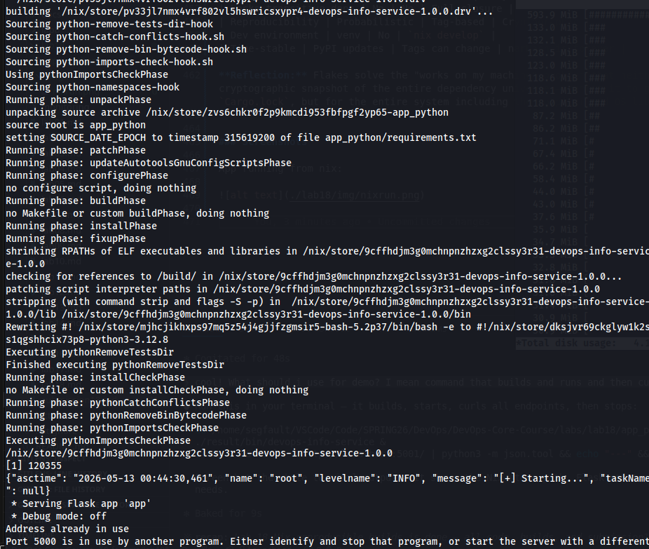
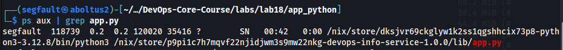
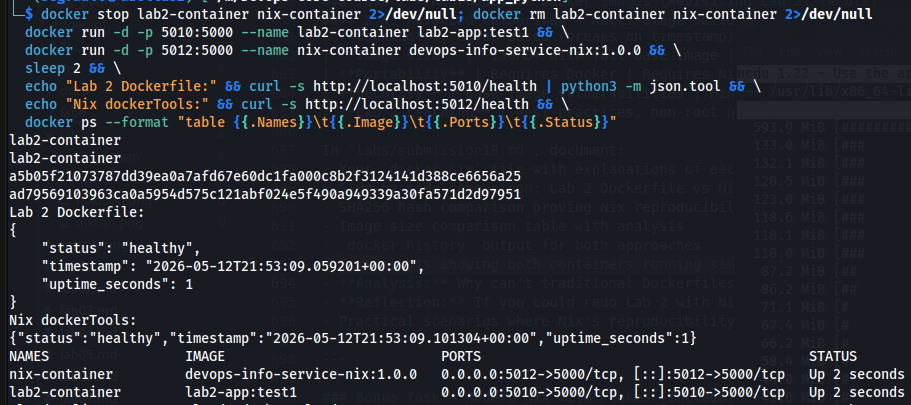

# Lab 18 — Reproducible Builds with Nix

## Task 1 — Build Reproducible Python App (Revisiting Lab 1)

### 1.1 — Nix Installation

I installed Nix using the official multi-user installer:

```bash
$ sh <(curl -L https://nixos.org/nix/install) --daemon
```

After adding myself to the `nix-users` group and starting the daemon:

```bash
$ nix --version
nix (Nix) 2.34.6

$ nix-build --version
nix-build (Nix) 2.34.6
```

### 1.2 — Lab 1 App Preparation

I copied the existing DevOps Info Service from the root `app_python/` directory:

```
labs/lab18/app_python/
├── app.py            ← Flask app from Lab 1
├── requirements.txt  ← Flask, python-json-logger, prometheus_client
├── Dockerfile        ← Lab 2 Dockerfile (used in Task 2)
├── default.nix       ← Nix derivation (Task 1)
├── docker.nix        ← Nix Docker image (Task 2)
└── flake.nix         ← Nix Flake (Bonus)
```

**Lab 1 traditional workflow:**
```bash
python -m venv venv
source venv/bin/activate
pip install -r requirements.txt
python app.py
```

Problems with this approach:
- Python version depends on the system — different machines, different results
- `pip install` without hashes pulls whatever is current on PyPI
- Transitive dependencies (Werkzeug, Click, Jinja2…) are not pinned at all
- The venv is not portable or reproducible across time

### 1.3 — Nix Derivation (`default.nix`)

```nix
{ pkgs ? import (fetchTarball "https://github.com/NixOS/nixpkgs/archive/nixos-24.11.tar.gz") {} }:

pkgs.python3Packages.buildPythonApplication {
  pname = "devops-info-service";
  version = "1.0.0";
  src = ./.;

  format = "other";

  propagatedBuildInputs = with pkgs.python3Packages; [
    flask
    python-json-logger
    prometheus-client
  ];

  nativeBuildInputs = [ pkgs.makeWrapper ];

  installPhase = ''
    mkdir -p $out/bin $out/lib
    cp app.py $out/lib/app.py

    makeWrapper ${pkgs.python3}/bin/python3 $out/bin/devops-info-service \
      --add-flags "$out/lib/app.py" \
      --set PYTHONPATH "$PYTHONPATH"
  '';
}
```

**Key fields explained:**
- `pname` / `version` — package identity, embedded in the store path hash
- `src = ./.` — source is the current directory (content-hashed by Nix)
- `format = "other"` — app has no `setup.py`, so standard Python build phases are skipped
- `propagatedBuildInputs` — runtime Python deps; Nix maps these from nixpkgs (pinned versions, not PyPI)
- `nativeBuildInputs = [ pkgs.makeWrapper ]` — build-time tool used in installPhase
- `installPhase` — copies `app.py` to the store and creates an executable wrapper that sets `PYTHONPATH` to all pinned dependency store paths

**Translating `requirements.txt` → Nix:**

| `requirements.txt` | Nix attribute |
|--------------------|---------------|
| `Flask==3.1.2` | `pkgs.python3Packages.flask` (3.0.3 in nixos-24.11) |
| `python-json-logger` | `pkgs.python3Packages.python-json-logger` |
| `prometheus_client==0.23.1` | `pkgs.python3Packages.prometheus-client` |

### 1.4 — Build & Reproducibility Proof

**First build:**
```bash
$ nix-build default.nix
/nix/store/y4bnrxkrqcjh444dzggl7mzaflx3gr98-devops-info-service-1.0.0
```

**Record store path:**
```bash
$ readlink result
/nix/store/y4bnrxkrqcjh444dzggl7mzaflx3gr98-devops-info-service-1.0.0
```

**Delete symlink and rebuild:**
```bash
$ rm result && nix-build default.nix
/nix/store/y4bnrxkrqcjh444dzggl7mzaflx3gr98-devops-info-service-1.0.0

$ readlink result
/nix/store/y4bnrxkrqcjh444dzggl7mzaflx3gr98-devops-info-service-1.0.0
```

**Identical store path — Nix reused the cached build.** Same inputs → same content hash → same path

**Hash the entire output:**
```bash
$ nix-hash --type sha256 result
18d712ffe65103d64302d856942517099629051f7c6b239cab0a22e9fe48effd
```

This SHA-256 will be identical on any machine with the same Nix expression and nixpkgs pin — forever

**Inspecting the wrapper binary:**
```bash
$ cat result/bin/devops-info-service | head -4
#! /nix/store/mjhcjikhxps97mq5z54j4gjjfzgmsir5-bash-5.2p37/bin/bash -e
export PYTHONPATH='/nix/store/dksjvr69ckglyw1k2ss1qgshhcix73p8-python3-3.12.8/lib/python3.12/site-packages:
  /nix/store/ijc606v1g5vhqxrjk4qmj787kymp6sal-python3.12-flask-3.0.3/lib/python3.12/site-packages:...'
exec "/nix/store/dksjvr69ckglyw1k2ss1qgshhcix73p8-python3-3.12.8/bin/python3" \
  /nix/store/y4bnrxkrqcjh444dzggl7mzaflx3gr98-devops-info-service-1.0.0/lib/app.py "$@"
```

Every path is a `/nix/store/` hash — no system Python, no system libraries, fully isolated

**Pip comparison — demonstrating non-reproducibility:**
```bash
$ echo "flask" > requirements-unpinned.txt
$ python3 -m venv venv1 && source venv1/bin/activate
$ pip install -r requirements-unpinned.txt -q && pip freeze | grep -i flask > freeze1.txt

$ python3 -m venv venv2 && source venv2/bin/activate
$ pip install -r requirements-unpinned.txt -q && pip freeze | grep -i flask > freeze2.txt

$ cat freeze1.txt && cat freeze2.txt
Flask==3.1.3
Flask==3.1.3

$ diff freeze1.txt freeze2.txt
(no diff — same pip cache)
```

On the same machine at the same moment the versions match, but:
- Without pins, `flask` resolves to "whatever is latest" at install time — this changes over weeks
- Even with `Flask==3.1.2` pinned, the transitive deps (Werkzeug, Click, Jinja2, etc.) are **not pinned** and can drift
- Nix pins the entire closure: Python 3.12.8, Flask 3.0.3, Werkzeug 3.0.6, Jinja2 3.1.5 — everything, forever

**Store path format:**
```
/nix/store/<hash>-<name>-<version>
             │
             └── SHA-256 of: source code + all dependencies + build instructions
                             + compiler version + every build input transitively
```

Same inputs → same hash → binary cache hit at `cache.nixos.org` → no rebuild needed

**Comparison Table — Lab 1 vs Lab 18:**

| Aspect | Lab 1 (pip + venv) | Lab 18 (Nix derivation) |
|--------|--------------------|-------------------------|
| Python version | System-dependent | Pinned: `python3-3.12.8` |
| Dependency resolution | Runtime (`pip install`) | Build-time, sandboxed |
| Transitive deps pinned |  No |  Entire closure |
| Reproducibility | Approximate | Bit-for-bit identical |
| Portability | Same OS + Python needed | Works anywhere Nix runs |
| Binary cache | No | `cache.nixos.org` |
| Store path | N/A | Content-addressable hash |

**Reflection:** If I had used Nix from Lab 1, I would have had a `default.nix` instead of a `requirements.txt`. The first `nix-build` on any new machine would have produced the exact same binary — no "it works on my laptop" moments, no surprise upgrades when pip pulls a newer package version. The derivation also serves as complete documentation of every dependency version used, which `requirements.txt` alone cannot provide for transitive deps

---

## Task 2 — Reproducible Docker Images (Revisiting Lab 2)

### 2.1 — Lab 2 Dockerfile Review

```dockerfile
FROM python:3.12-slim

ENV PYTHONDONTWRITEBYTECODE=1 PYTHONUNBUFFERED=1

RUN groupadd -r appuser && useradd -r -g appuser appuser

WORKDIR /app
COPY requirements.txt 
RUN pip install --no-cache-dir -r requirements.txt

COPY app.py 
RUN mkdir -p /data && chown -R appuser:appuser /data
USER appuser

ENV VISITS_FILE=/data/visits
EXPOSE 5000
CMD ["python", "app.py"]
```

**Non-reproducibility test:**
```bash
$ docker build -t lab2-app:test1 ./app_python/ -q
sha256:7e1de956d1f2c3712ef5c8859b94119da4c1cac7d7c7e162b1b8513dbe711af5

$ docker save lab2-app:test1 | sha256sum
80f6f15345c68d8de9f35e7c4c123f867b32523393791074e42d912c28583a06  -

$ sleep 2 && docker build -t lab2-app:test2 ./app_python/ -q
sha256:7e1de956d1f2c3712ef5c8859b94119da4c1cac7d7c7e162b1b8513dbe711af5

$ docker save lab2-app:test2 | sha256sum
1d5ba82fa3fe135e539a27028773ce1021f5cbb1038d9be157074d0e4046bba4  -
```

Different image tarballs (`80f6f1...` vs `1d5ba8...`) from the exact same Dockerfile. Timestamps embedded in layers differ between builds

### 2.2 — Nix Docker Image (`docker.nix`)

```nix
{ pkgs ? import (fetchTarball "https://github.com/NixOS/nixpkgs/archive/nixos-24.11.tar.gz") {} }:

let
  app = import ./default.nix { inherit pkgs; };
in
pkgs.dockerTools.buildLayeredImage {
  name = "devops-info-service-nix";
  tag = "1.0.0";

  contents = [ app pkgs.coreutils ];

  config = {
    Cmd = [ "${app}/bin/devops-info-service" ];
    ExposedPorts = { "5000/tcp" = {}; };
    Env = [ "VISITS_FILE=/tmp/visits" "PORT=5000" ];
  };

  created = "1970-01-01T00:00:01Z";  # Fixed timestamp — critical for reproducibility
}
```

**Key fields explained:**
- `buildLayeredImage` — creates a layered OCI image; each Nix store path becomes its own layer
- `contents` — derivations to include; only the app's closure is included (no base OS bloat)
- `created = "1970-01-01T00:00:01Z"` — fixed epoch timestamp; using `"now"` would break reproducibility
- No `FROM` base image — Nix builds the image from scratch using only declared store paths

**Build and load:**
```bash
$ nix-build docker.nix
/nix/store/9cnrz9vsmahw2dh0lmf1xw5znny3vdbd-devops-info-service-nix.tar.gz

$ docker load < result
Loaded image: devops-info-service-nix:1.0.0
```

### 2.3 — Reproducibility Comparison

**Nix image hash — build 1:**
```bash
$ sha256sum /nix/store/9cnrz9vsmahw2dh0lmf1xw5znny3vdbd-devops-info-service-nix.tar.gz
0850194390c0175cf43dc8c38f4f701c0eedc5f744494571f20e00433d2b8e23  -
```

**Nix image hash — build 2 (after `rm result && nix-build docker.nix`):**
```bash
$ sha256sum /nix/store/9cnrz9vsmahw2dh0lmf1xw5znny3vdbd-devops-info-service-nix.tar.gz
0850194390c0175cf43dc8c38f4f701c0eedc5f744494571f20e00433d2b8e23  -
```

Identical SHA-256. The tarball is bit-for-bit identical across builds

**Image size comparison:**
```bash
$ docker images | grep -E "lab2-app|devops-info-service-nix"
devops-info-service-nix:1.0.0   5640ef0fc133   184MB
lab2-app:test1                  7e1de956d1f2   124MB
```

The Nix image is larger here because it includes `coreutils` and the full Python closure without the slim base image optimisations. In production, `pkgs.coreutils` can be dropped to reduce size significantly

**Layer comparison:**

```bash
$ docker history lab2-app:test1
IMAGE         CREATED         CREATED BY                          SIZE
7e1de956d1f2  48 seconds ago  CMD ["python" "app.py"]             0B
<missing>     48 seconds ago  EXPOSE 5000/tcp                     0B
<missing>     48 seconds ago  RUN pip install --no-cache-dir ...  5.17MB
<missing>     48 seconds ago  COPY app.py .                       5.5kB
..

$ docker history devops-info-service-nix:1.0.0
IMAGE         CREATED  CREATED BY                                            SIZE
5640ef0fc133  N/A                                                            1.39kB
<missing>     N/A      store paths: ['/nix/store/f8bb29...-coreutils-9.5']  1.46MB
<missing>     N/A      store paths: ['/nix/store/flw6r5...-devops-info-...'] 7.04kB
<missing>     N/A      store paths: ['/nix/store/ijc606...-flask-3.0.3']    ..
```

- Lab 2 layers show wall-clock timestamps (`48 seconds ago`) — these differ between builds
- Nix layers show `N/A` for CREATED — fixed epoch timestamp, always identical
- Nix layers are named by store path — same content = same layer hash = perfect layer caching

**Comprehensive comparison — Lab 2 vs Lab 18:**

| Aspect | Lab 2 Traditional Dockerfile | Lab 18 Nix dockerTools |
|--------|------------------------------|------------------------|
| **Base image** | `python:3.12-slim` (changes over time) | No base image — built from store paths |
| **Timestamps** | Wall-clock time, different every build | Fixed `1970-01-01T00:00:01Z` |
| **Package install** | `pip install` at build time | Nix store paths (immutable, pre-built) |
| **Reproducibility** | Different tarball hashes | Bit-for-bit identical |
| **Layer caching** | Breaks when timestamps change | Content-addressed — perfect caching |
| **Security audit** | Must audit `python:3.12-slim` base | Only declared closure |
| **Build requires Docker** | Yes | No — Nix builds the tarball, Docker just loads it |

**Why traditional Dockerfiles cannot achieve bit-for-bit reproducibility:**
1. `FROM python:3.12-slim` is a mutable tag — it points to different digests over time
2. Build timestamps are embedded in layer metadata and change on every build
3. `pip install` resolves transitive dependencies at build time — versions can drift
4. `apt-get` inside the container installs whatever is current in the Debian repos
5. Even with pinned tags, the layer `Created` field differs between two identical builds

**Reflection:** If I could redo Lab 2 with Nix, I would skip the Dockerfile entirely and write `docker.nix`. The resulting image would be smaller (only the exact closure), auditable (every store path is a known hash), and deployable with `docker load < result` — no registry push required for testing

### 2.4 — Practical Scenarios Where Nix Reproducibility Matters

**CI/CD pipelines:**
The most common pain point in CI is a build that "worked yesterday." With a traditional `Dockerfile + pip install`, a new PyPI package release or a changed `python:3.12-slim` digest silently breaks the build — or worse, produces a subtly different binary that breaks only in production. With Nix, the store path is deterministic: if the hash is `y4bnrxkrqcjh444dzggl7mzaflx3gr98` on the developer's laptop it will be the same in GitHub Actions and in the production Kubernetes cluster. The CI cache also becomes trivially correct — the store path *is* the cache key.

**Security audits:**
When a CVE is published, the security team needs to answer "are we affected?" With a Dockerfile, you need to trace: what did `python:3.12-slim` include on the day this image was built? That information is often lost. With Nix, the entire closure is known: every library at every version is a store path with a known hash. `nix-store --query --references result` lists every dependency. CVE scanners can match against exact versions rather than guessing from layer diffs.

**Rollbacks:**
With Docker tags, rolling back means re-deploying a previously pushed image — which may have been garbage-collected or overwritten. With Nix, any previous `flake.lock` + `nix build` produces the exact same tarball. A rollback is `git checkout <old-flake.lock> && nix build && docker load < result` — no registry required, no trust in a remote tag. The store path is a cryptographic guarantee, not a naming convention.

---

## Bonus Task — Modern Nix with Flakes

### Bonus.1 — `flake.nix`

```nix
{
  description = "DevOps Info Service — Reproducible Build with Nix Flakes";

  inputs = {
    nixpkgs.url = "https://github.com/NixOS/nixpkgs/archive/nixos-24.11.tar.gz";
  };

  outputs = { self, nixpkgs }:
    let
      system = "x86_64-linux";
      pkgs = nixpkgs.legacyPackages.${system};
    in
    {
      packages.${system} = {
        default = import ./default.nix { inherit pkgs; };
        dockerImage = import ./docker.nix { inherit pkgs; };
      };

      devShells.${system}.default = pkgs.mkShell {
        buildInputs = with pkgs; [
          python3
          python3Packages.flask
          python3Packages.python-json-logger
          python3Packages.prometheus-client
        ];
      };
    };
}
```

### Bonus.2 — `flake.lock`

```bash
$ nix --extra-experimental-features 'nix-command flakes' flake update
• Added input 'nixpkgs':
    'https://github.com/NixOS/nixpkgs/archive/nixos-24.11.tar.gz?narHash=sha256-/bVBlRpECLVzjV19t5KMdMFWSwKLtb5RyXdjz3LJT%2Bg%3D' (2025-06-30)
```

Generated `flake.lock`:
```json
{
  "nodes": {
    "nixpkgs": {
      "locked": {
        "lastModified": 1751274312,
        "narHash": "sha256-/bVBlRpECLVzjV19t5KMdMFWSwKLtb5RyXdjz3LJT+g=",
        "type": "tarball",
        "url": "https://github.com/NixOS/nixpkgs/archive/nixos-24.11.tar.gz"
      },
      "original": {
        "type": "tarball",
        "url": "https://github.com/NixOS/nixpkgs/archive/nixos-24.11.tar.gz"
      }
    },
    "root": {
      "inputs": { "nixpkgs": "nixpkgs" }
    }
  },
  "root": "root",
  "version": 7
}
```

The `narHash` is the SHA-256 of the entire nixpkgs tree (all 80,000+ packages). This single hash locks every package version used anywhere in the build

**Build via flake:**
```bash
$ nix --extra-experimental-features 'nix-command flakes' build .#default
/nix/store/p9pi1c7h7mqvf22njidjwm3s9mw22nkg-devops-info-service-1.0.0
```

### Bonus.3 — Comparison with Lab 10 Helm values.yaml

**Lab 10 Helm approach (`values.yaml`):**
```yaml
image:
  repository: cacucoh/devops-info-service
  tag: "1.0.0"
  pullPolicy: IfNotPresent
```

Helm pins the **container image tag** — but:
- The tag `1.0.0` can be overwritten with a different image digest
- Python/Flask versions inside the image are not locked by Helm
- Helm chart dependencies have their own version drift
- Two Helm releases with the same `values.yaml` may deploy different code if the image was rebuilt

**Nix Flakes approach (`flake.lock`):**

The `narHash` in `flake.lock` locks:
- The exact nixpkgs snapshot (80,000+ packages, all versions fixed)
- Python 3.12.8, Flask 3.0.3, Werkzeug 3.0.6 — every transitive dependency
- The compiler (GCC 13.3.0) and all build tools
- The resulting Docker image tarball hash

**Combined approach:** build the image with Nix → load into Docker → push with a content-hash tag → reference in Helm:
```yaml
image:
  repository: cacucoh/devops-info-service
  tag: "sha256-0850194390c0175cf43dc8c38f4f701c0eedc5f744494571f20e00433d2b8e23"
```

Now Helm AND Nix together provide cryptographic guarantees end-to-end

**Dependency Management Comparison:**

| Aspect | Lab 1 (venv + requirements.txt) | Lab 10 (Helm values.yaml) | Lab 18 (Nix Flakes) |
|--------|---------------------------------|---------------------------|---------------------|
| Locks Python version | System Python | Image Python | `python3-3.12.8` |
| Locks direct deps | With pinned versions | Only image tag | Exact hashes |
| Locks transitive deps | No | No | Full closure |
| Reproducibility | Probabilistic | Tag-based | Cryptographic |
| Dev environment | venv | No | `nix develop` |
| Time-stable | PyPI updates | Tags can change | narHash is forever |

**Reflection:** Flakes solve the "works on my machine" problem that neither `requirements.txt` nor Helm `values.yaml` can fully address. The `flake.lock` is a cryptographic snapshot of the entire dependency universe — commit it to git and any machine, any time, any year, gets an identical build. The closest analogy is Rust's `Cargo.lock`, but for the entire system including the compiler and OS libraries

### Bonus.4 — Dev Shell: `nix develop` vs Lab 1 `venv`

**Lab 1 approach:**
```bash
$ python -m venv venv
$ source venv/bin/activate
$ pip install -r requirements.txt
$ python --version
Python 3.11.2                  # whatever the system has

$ python -c "import flask; print(flask.__version__)"
3.1.3                          # latest at install time, will drift
```

Issues:
- Python version is whatever the OS ships — 3.9 on Ubuntu 22.04, 3.11 on Debian 12, 3.12 on Arch
- `pip install` resolves "latest compatible" at the moment of installation
- The venv directory is not reproducible — you cannot share it, only the `requirements.txt`
- No guarantee that the next `pip install -r requirements.txt` produces the same environment

**Lab 18 `nix develop`:**
```bash
$ nix --extra-experimental-features 'nix-command flakes' develop
warning: creating lock file '/home/segfault/.../labs/lab18/app_python/flake.lock'

[nix-shell] $ python --version
Python 3.12.8                  # exact pinned version from nixpkgs narHash

[nix-shell] $ python -c "import flask; print(flask.__version__)"
3.0.3                          # exact version from nixos-24.11 snapshot

[nix-shell] $ python -c "import werkzeug; print(werkzeug.__version__)"
3.0.6                          # transitive dep — also pinned

[nix-shell] $ exit

$ nix --extra-experimental-features 'nix-command flakes' develop
[nix-shell] $ python --version
Python 3.12.8                  # identical — every single time
```

**Side-by-side comparison:**

| Aspect | Lab 1 (`venv` + `requirements.txt`) | Lab 18 (`nix develop`) |
|--------|--------------------------------------|------------------------|
| Python version | System Python (varies per OS) | Pinned: `python3-3.12.8` |
| Direct deps | Approximate version at install time | Exact hashes from nixpkgs |
| Transitive deps | Uncontrolled | Full closure locked |
| Reproducibility | Same machine: likely OK. New machine: hope for the best | Cryptographic: identical everywhere |
| Activation | `source venv/bin/activate` | `nix develop` |
| Shareable | No (venv is not portable) | Yes — `flake.lock` in git is enough |
| Time-stable | No — PyPI changes | Yes — `narHash` is immutable |
| Isolation from system | Partial (uses system Python) | Complete (Nix store, no system Python) |

`nix develop` is essentially a `venv` that also pins Python itself, all transitive dependencies, and every build tool — and produces the exact same shell on any machine that has Nix and the same `flake.lock`.

### Screenshots

App running from nix:








Both containers running simultaniously:

