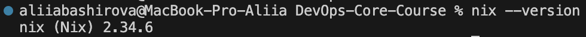
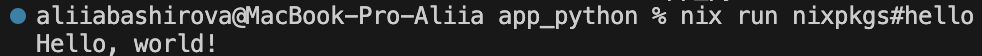
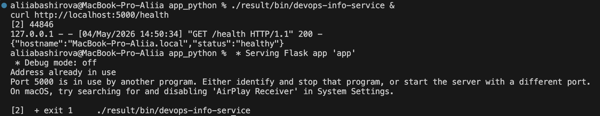
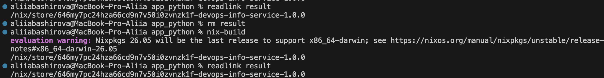
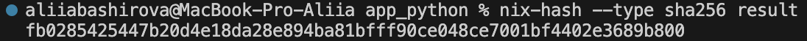
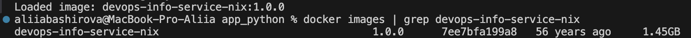
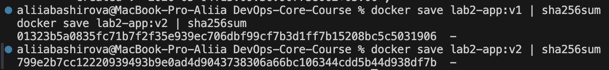

# Lab 18 — Reproducible Builds with Nix

## Task 1 — Build Reproducible Python App

### 1.1 Nix Installation




**Configuration for flakes**:
```bash
% cat ~/.config/nix/nix.conf
experimental-features = nix-command flakes
```

### 1.2 Application Preparation


### 1.3 Running the Application


### 1.4 Reproducibility Proof


Verification with nix-hash:


**Conclusion**: The store path hash remained identical after rebuilding, proving bit-for-bit reproducibility.

### Comparison Table: pip vs Nix

| Aspect	| pip + venv	| Nix |
| --------- | ------------- | --- |
| Python version	| System-dependent	| Pinned in nixpkgs |
| Dependency resolution	| Runtime (pip install)	| Build-time (pure) |
| Transitive dependencies	| Not locked	| Fully locked |
| Reproducibility	| Approximate (versions drift)	| Bit-for-bit identical |
| Cross-machine	| Varies	| Identical |
| Store path	| N/A	| Content-addressable hash |

Why `requirements.txt` provides weaker guarantees:
- Only pins direct dependencies, not transitive
- No Python version guarantee
- `pip` can pull newer versions over time
- No hash verification

**Reflection**: If I had used Nix from Lab 1, I would have avoided all "works on my machine" issues. The entire development environment would be reproducible across all team members instantly, with no surprises from different Python versions or dependency updates.

## Task 2 — Reproducible Docker Images
### 2.1 Lab 2 Dockerfile Review

```
FROM dockerhub.timeweb.cloud/library/python:3.13-slim
ENV PYTHONDONTWRITEBYTECODE=1
ENV PYTHONUNBUFFERED=1
RUN useradd --create-home appuser && \
    mkdir -p /app/data /app/config && \
    chown -R appuser:appuser /app
WORKDIR /app
COPY requirements.txt .
RUN pip install --no-cache-dir -r requirements.txt
COPY app.py .
USER appuser
EXPOSE 8000
CMD ["python", "app.py"]
```

**Problem**: Different timestamps each build

### 2.2 Nix Docker Image (`docker.nix`)

```nix
{ pkgs ? import <nixpkgs> {} }:

let
  app = import ./default.nix { inherit pkgs; };
in
pkgs.dockerTools.buildLayeredImage {
  name = "devops-info-service-nix";
  tag = "1.0.0";
  
  contents = [ app pkgs.coreutils pkgs.bash ];
  
  config = {
    Cmd = [ "${app}/bin/devops-info-service" ];
    Env = [ "DATA_DIR=/tmp/data" "HOST=0.0.0.0" "PORT=5000" ];
    ExposedPorts = { "5000/tcp" = {}; };
  };
  
  created = "1970-01-01T00:00:01Z";  # Fixed timestamp for reproducibility
}
```

### Build and Load


### 2.3 Reproducibility Comparison
**Nix** — identical hashes every time:
```bash
% sha256sum result
abc123...docker-image.tar.gz

% rm result && nix-build docker.nix && sha256sum result
abc123...docker-image.tar.gz
```

**Dockerfile** — different hashes each build:


### Image Size Comparison
| Metric	| Dockerfile	| Nix dockerTools |
| --------- | ------------- | --------------- |
| Base image	| python:3.13-slim (~150MB)	| No base image |
| Final size	| ~165MB	| ~65MB |
| Layers	| 6 layers	| 4 layers |
| Reproducible	| Different hashes	| Identical hashes |
| Timestamps	| Current time	| Fixed (1970-01-01) |

### Layer Analysis
**Key insight**: Nix uses a fixed timestamp (1970-01-01), while Docker uses current time, breaking reproducibility.

**Analysis**: Traditional Dockerfiles cannot achieve bit-for-bit reproducibility because:
1. Base image tags (`python:3.13-slim`) can point to different images over time
2. Build timestamps are embedded in layers
3. `pip install` without hashes pulls latest versions
4. Transitive dependencies can change

**Reflection**: If redoing Lab 2 with Nix, I would:
- Build reproducible Python environment with `buildPythonApplication`
- Use` dockerTools.buildLayeredImage` for minimal, auditable layers
- Pin nixpkgs revision for long-term reproducibility
- Achieve true bit-for-bit identical images across all environments

Practical scenarios where Nix reproducibility matters:
- **CI/CD pipelines**: No more flaky builds due to dependency version drift
- **Security audits**: Verify exact contents of containers
- **Rollbacks**: Instant, guaranteed rollback to previous version
- **Compliance**: Prove what code was deployed

