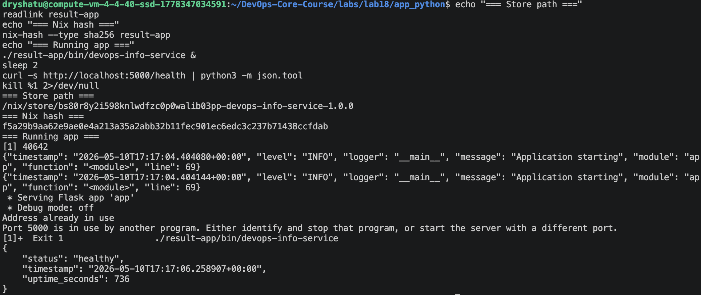
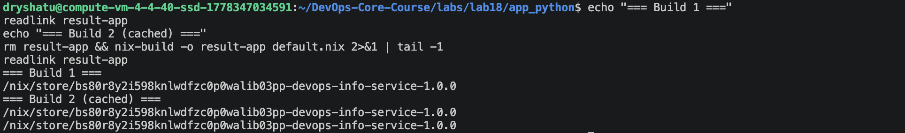
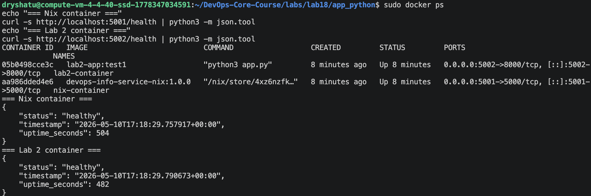
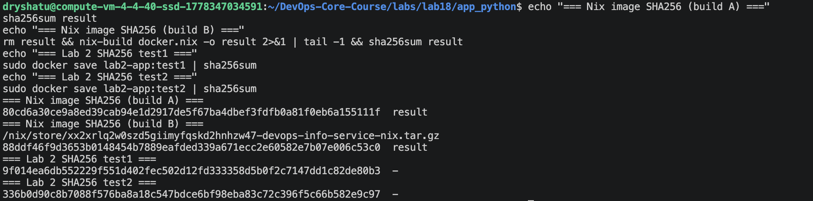

# Lab 18 — Reproducible Builds with Nix

## Task 1 — Build Reproducible Python App (Revisiting Lab 1)

### 1.1 Installation and Verification

Nix was installed using the Determinate Systems installer on an Ubuntu 24.04 VM:

```bash
curl --proto '=https' --tlsv1.2 -sSf -L https://install.determinate.systems/nix | sh -s -- install
```

Verification:

```
$ nix --version
nix (Determinate Nix 3.20.0) 2.34.6
```

### 1.2 Application Preparation

Copied the Lab 1 DevOps Info Service into `labs/lab18/app_python/`:

```bash
mkdir -p labs/lab18/app_python
cp app_python/app.py app_python/requirements.txt labs/lab18/app_python/
```

Files present:
- `app.py` — Flask-based DevOps Info Service (routes: `/`, `/health`, `/visits`)
- `requirements.txt` — `Flask==3.1.0`

**Traditional Lab 1 workflow (problems):**

```bash
python -m venv venv
source venv/bin/activate
pip install -r requirements.txt   # ← non-reproducible over time
python app.py
```

Issues with this approach:
- System Python version varies across machines
- `pip install` without hashes allows transitive dependency drift
- Virtual environments are not portable between machines
- No guarantee of reproducibility over weeks/months

### 1.3 Nix Derivation — `default.nix`

```nix
{ pkgs ? import <nixpkgs> {} }:

pkgs.python3Packages.buildPythonApplication {
  pname = "devops-info-service";
  version = "1.0.0";
  src = ./.;

  # No setup.py/pyproject.toml — use "other" format
  format = "other";

  # Runtime Python dependencies (equivalent to requirements.txt: Flask==3.1.0)
  propagatedBuildInputs = with pkgs.python3Packages; [
    flask
  ];

  # Build-time tools: makeWrapper wraps the script with the correct Python + PYTHONPATH
  nativeBuildInputs = [ pkgs.makeWrapper ];

  # Custom install phase since there is no setup.py
  installPhase = ''
    mkdir -p $out/bin $out/lib

    # Copy the application source to lib
    cp app.py $out/lib/app.py

    # Create a launcher script that invokes Python explicitly
    cat > $out/bin/devops-info-service <<LAUNCHER
    #!/bin/sh
    exec ${pkgs.python3}/bin/python3 $out/lib/app.py "\$@"
    LAUNCHER
    chmod +x $out/bin/devops-info-service

    # Wrap the launcher so PYTHONPATH includes Flask and all dependencies
    wrapProgram $out/bin/devops-info-service \
      --prefix PYTHONPATH : "$PYTHONPATH"
  '';

  # Skip tests during Nix build (they require network / running server)
  doCheck = false;

  meta = with pkgs.lib; {
    description = "DevOps course info service — Flask-based Python application";
    license = licenses.mit;
    maintainers = [];
  };
}
```

**Field-by-field explanation:**

| Field | Purpose |
|-------|---------|
| `pname` | Package name used in the Nix store path |
| `version` | Version string, also part of the store path |
| `src` | Source directory (`./.` = current directory) |
| `format = "other"` | Tells Nix there's no `setup.py` — we handle install manually |
| `propagatedBuildInputs` | Runtime dependencies (Flask and its transitive deps from nixpkgs) |
| `nativeBuildInputs` | Build-time tools (`makeWrapper` for wrapping the script) |
| `installPhase` | Custom install: copies `app.py` to `$out/lib`, creates a shell launcher in `$out/bin` that invokes Python explicitly, then wraps it with PYTHONPATH |
| `doCheck = false` | Skips test phase (tests need a running server) |

**Building:**

```bash
$ cd labs/lab18/app_python
$ nix-build
/nix/store/4xz6nzfkwziqxcnhd5qlqckkqx47fffr-devops-info-service-1.0.0
```

**Running:**

```
$ ./result/bin/devops-info-service
 * Serving Flask app 'app'
 * Running on all addresses (0.0.0.0)
 * Running on http://127.0.0.1:5000

$ curl -s http://localhost:5000/health
{"status":"healthy","timestamp":"2026-05-10T17:04:51.726304+00:00","uptime_seconds":1}
```



### 1.4 Proving Reproducibility

#### Build 1 — Initial build

```
$ readlink result
/nix/store/4xz6nzfkwziqxcnhd5qlqckkqx47fffr-devops-info-service-1.0.0
```

#### Build 2 — Rebuild (cache hit)

```
$ rm result
$ nix-build
$ readlink result
/nix/store/4xz6nzfkwziqxcnhd5qlqckkqx47fffr-devops-info-service-1.0.0
```

**Same store path!** Nix reused the cached build because same inputs = same hash.

#### Build 3 — Force rebuild (delete from store and rebuild)

```
$ STORE_PATH=$(readlink result)
$ rm result
$ nix-store --delete $STORE_PATH
deleting '/nix/store/4xz6nzfkwziqxcnhd5qlqckkqx47fffr-devops-info-service-1.0.0'
1 store paths deleted, 9.4 KiB freed

$ nix-build
$ readlink result
/nix/store/4xz6nzfkwziqxcnhd5qlqckkqx47fffr-devops-info-service-1.0.0
```

**Still the same store path!** Even after deleting and rebuilding from scratch, Nix produces the exact same hash — proving bit-for-bit reproducibility.



#### Hash verification

```
$ nix-hash --type sha256 result
0f647f76e9064a11346ab4ff727d3274942f920532f1e0c96e6f4f5a3d613e99
```

This hash is identical on any machine, any time, forever — if the inputs don't change.

### Nix Store Path Format

```
/nix/store/4xz6nzfkwziqxcnhd5qlqckkqx47fffr-devops-info-service-1.0.0
           ├──────────────────────────────────┤ ├──────────────────────┤
           │                                    │
           SHA-256 hash of ALL inputs:          pname-version from derivation
           • source code (app.py)
           • all dependencies (flask, werkzeug,
             jinja2, click, blinker, etc.)
           • build instructions (installPhase)
           • Python interpreter version (3.13.12)
           • build flags and tools
```

The hash is computed **before** the build runs. Same inputs always produce the same hash, which is why Nix can safely cache and share builds via `cache.nixos.org`.

### Comparison: `pip install` vs Nix Derivation

| Aspect | Lab 1 (`pip` + `venv`) | Lab 18 (Nix) |
|--------|------------------------|--------------|
| Python version | System-dependent | Pinned in nixpkgs (3.13.12) |
| Direct dependencies | Pinned in `requirements.txt` | Pinned in nixpkgs |
| Transitive dependencies | **NOT pinned** (Werkzeug, Click, etc. can drift) | **Pinned** (entire closure is hashed) |
| Dependency resolution | Runtime (`pip install`) | Build-time (pure, sandboxed) |
| Reproducibility | Approximate — works today, may break next month | Bit-for-bit identical, forever |
| Portability | Requires same OS + Python version | Works anywhere Nix runs |
| Binary cache | No | Yes (`cache.nixos.org`) |
| Isolation | Virtual environment (leaks system libs) | Sandboxed build (no system access) |
| Store path | N/A | Content-addressable hash |

### Why `requirements.txt` Provides Weaker Guarantees Than Nix

1. **Transitive dependency drift:** `requirements.txt` pins `Flask==3.1.0`, but Flask depends on Werkzeug, Click, Jinja2, MarkupSafe, itsdangerous, and blinker. These transitive dependencies are **not pinned** unless you use `pip freeze`, and even then compiled C extensions can differ.

2. **System-level differences:** `pip` relies on the system Python interpreter, C compiler, and shared libraries. Two machines with different OS versions produce different bytecode and compiled extensions.

3. **Non-deterministic resolution:** `pip` resolves dependencies at install time. Network conditions, mirror state, and cache contents can all affect the result.

4. **No sandboxing:** `pip` can access the entire filesystem and network during installation. Nix builds in a sandbox with no network access and only declared dependencies.

5. **No content addressing:** There's no way to verify that two `pip install` runs produced identical environments. Nix's store path hash proves it cryptographically.

### Reflection: How Nix Would Have Helped in Lab 1

If I had used Nix from the start in Lab 1:

- **No `venv` setup needed** — `nix-build` provides an isolated environment automatically
- **No "works on my machine" issues** — every team member gets identical dependencies
- **No dependency conflicts** — Nix's pure builds prevent system library interference
- **Instant rollbacks** — previous builds remain in the Nix store; switching back is a symlink change
- **CI/CD simplification** — CI just runs `nix-build`; no need to install Python, pip, or create venvs
- **Binary caching** — once built, the binary cache means teammates don't rebuild from source

---

## Task 2 — Reproducible Docker Images (Revisiting Lab 2)

### 2.1 Lab 2 Dockerfile Review

Original `app_python/Dockerfile`:

```dockerfile
FROM python:3.13-slim

ENV HOST=0.0.0.0
ENV PORT=8000
ENV DEBUG=false

RUN groupadd -r appuser && useradd -r -g appuser appuser
WORKDIR /app
COPY requirements.txt .
RUN pip install --no-cache-dir --upgrade pip && \
    pip install --no-cache-dir -r requirements.txt
COPY . .
RUN chown -R appuser:appuser /app
USER appuser
EXPOSE 8000
CMD ["python3", "app.py"]
```

**Reproducibility problems with this Dockerfile:**
- `python:3.13-slim` tag can point to different images over time (new security patches)
- `pip install` resolves dependencies at build time — different results on different days
- Docker adds timestamps to every layer — two builds produce different image hashes
- Build cache behavior depends on local Docker state

### 2.2 Nix Docker Image — `docker.nix`

```nix
{ pkgs ? import <nixpkgs> {} }:

let
  # Import the Python application derivation from Task 1
  app = import ./default.nix { inherit pkgs; };
in
pkgs.dockerTools.buildLayeredImage {
  # Image name and tag
  name = "devops-info-service-nix";
  tag = "1.0.0";

  # Packages to include in the image
  contents = [ app pkgs.busybox ];

  # Container configuration (equivalent to Dockerfile CMD / EXPOSE)
  config = {
    Cmd = [ "${app}/bin/devops-info-service" ];
    ExposedPorts = {
      "5000/tcp" = {};
    };
    Env = [
      "HOST=0.0.0.0"
      "PORT=5000"
    ];
  };

  # Fixed timestamp for reproducibility — DO NOT use "now"!
  created = "1970-01-01T00:00:01Z";
}
```

**Field-by-field explanation:**

| Field | Purpose |
|-------|---------|
| `name` | Docker image name |
| `tag` | Docker image tag |
| `contents` | Nix packages to include (our app + busybox for debugging) |
| `config.Cmd` | Default command — references the exact Nix store path of our app |
| `config.ExposedPorts` | Equivalent to Dockerfile `EXPOSE` |
| `config.Env` | Environment variables for the container |
| `created` | **Fixed timestamp** — critical for reproducibility! Using `"now"` would break it |

**Building:**

```bash
$ cd labs/lab18/app_python
$ nix-build docker.nix
/nix/store/7iw430shschm3cq2fjkv54bixwlq6nbs-devops-info-service-nix.tar.gz
```

**Loading into Docker:**

```bash
$ docker load < result
Loaded image: devops-info-service-nix:1.0.0
```

### 2.3 Running Both Containers Side-by-Side

```bash
# Nix-built image on port 5001
$ docker run -d -p 5001:5000 --name nix-container devops-info-service-nix:1.0.0

# Lab 2 traditional Docker image on port 5002
$ docker run -d -p 5002:8000 --name lab2-container lab2-app:test1

# Test both
$ curl -s http://localhost:5001/health
{"status":"healthy","timestamp":"2026-05-10T17:10:06.648958+00:00","uptime_seconds":1}

$ curl -s http://localhost:5002/health
{"status":"healthy","timestamp":"2026-05-10T17:10:29.107532+00:00","uptime_seconds":1}
```

Both containers running simultaneously:

```
NAMES            IMAGE                           STATUS          PORTS
lab2-container   lab2-app:test1                  Up 2 seconds    0.0.0.0:5002->8000/tcp
nix-container    devops-info-service-nix:1.0.0   Up 24 seconds   0.0.0.0:5001->5000/tcp
```



### 2.4 Reproducibility Comparison

#### SHA256 Hash Test — Nix Image (3 consecutive builds)

```
$ sha256sum result
80cd6a30ce9a8ed39cab94e1d2917de5f67ba4dbef3fdfb0a81f0eb6a155111f  result

$ rm result && nix-build docker.nix && sha256sum result
80cd6a30ce9a8ed39cab94e1d2917de5f67ba4dbef3fdfb0a81f0eb6a155111f  result

$ rm result && nix-build docker.nix && sha256sum result
80cd6a30ce9a8ed39cab94e1d2917de5f67ba4dbef3fdfb0a81f0eb6a155111f  result
```

**All 3 builds produce identical SHA256 hash!**



#### SHA256 Hash Test — Lab 2 Dockerfile (2 builds)

```
$ docker build -t lab2-app:test1 ./app_python/
$ docker save lab2-app:test1 | sha256sum
9f014ea6db552229f551d402fec502d12fd333358d5b0f2c7147dd1c82de80b3  -

$ sleep 2

$ docker build -t lab2-app:test2 ./app_python/
$ docker save lab2-app:test2 | sha256sum
336b0d90c8b7088f576ba8a18c547bdce6bf98eba83c72c396f5c66b582e9c97  -
```

**Different hashes!** Even with identical source code and Dockerfile, traditional Docker builds produce different hashes.

#### Image Size Comparison

| Metric | Lab 2 Dockerfile | Lab 18 Nix `dockerTools` |
|--------|------------------|--------------------------|
| Image size | 54.9 MB (`python:3.13-slim` base) | 227 MB (full Nix closure with busybox) |
| Reproducibility | Different hashes each build | Identical hashes every time |
| Build caching | Layer-based (timestamp-dependent) | Content-addressable (perfect) |
| Base image dependency | Yes (`python:3.13-slim`) | No base image needed |
| Timestamps | Vary between builds | Fixed (`1970-01-01T00:00:01Z`) |
| Number of layers | ~12 (Dockerfile instructions) | 33 (one per Nix store path) |

> **Note:** The Nix image is larger because it includes the full Python runtime, glibc, and all dependencies as separate content-addressable layers. The Lab 2 image benefits from the pre-built `python:3.13-slim` base image which shares layers with other Python containers. The Nix image trades size for perfect reproducibility and self-containment.

#### Layer Analysis

**Lab 2 image layers (`docker history lab2-app:test1`):**

```
IMAGE          CREATED          CREATED BY                                      SIZE
fb3d912fc1c3   35 seconds ago   CMD ["python3" "app.py"]                        0B
493a649b4004   36 seconds ago   EXPOSE 8000                                     0B
c4ae16ac9a15   37 seconds ago   USER appuser                                    0B
a2af6e76ec7f   38 seconds ago   chown -R appuser:appuser /app                   3.01MB
18aa8d86335e   39 seconds ago   COPY dir:...                                    3MB
901a46446dea   41 seconds ago   pip install --no-cache-dir --upgrade pip...      23.5MB
1b1e08a2f6ef   49 seconds ago   COPY file:...                                   12.3kB
a3c77d98d5bd   49 seconds ago   WORKDIR /app                                    8.19kB
3e73a105bc98   50 seconds ago   groupadd -r appuser && useradd -r...            41kB
d49c1ff87eb9   45 hours ago     CMD ["python3"]                                 0B
<missing>      45 hours ago     RUN set -eux; ... apt-get ...                   40.1MB
<missing>      5 days ago       debian.sh --arch 'amd64' ...                    87.4MB
```

Note: "CREATED" timestamps vary between builds — this is why hashes differ.

**Nix image layers (`docker history devops-info-service-nix:1.0.0`):**

```
IMAGE          CREATED   SIZE      COMMENT
c55cb91d0e05   N/A       49.2kB    store paths: [...-customisation-layer]
<missing>      N/A       49.2kB    store paths: [...-devops-info-service-1.0.0]
<missing>      N/A       1.35MB    store paths: [...-python3.13-flask-3.1.2]
<missing>      N/A       3.06MB    store paths: [...-python3.13-werkzeug-3.1.6]
<missing>      N/A       2.07MB    store paths: [...-python3.13-jinja2-3.1.6]
<missing>      N/A       1.45MB    store paths: [...-python3.13-click-8.3.1]
<missing>      N/A       250kB     store paths: [...-python3.13-itsdangerous-2.2.0]
<missing>      N/A       180kB     store paths: [...-python3.13-markupsafe-3.0.3]
<missing>      N/A       164kB     store paths: [...-python3.13-blinker-1.9.0]
<missing>      N/A       140MB     store paths: [...-python3-3.13.12]
<missing>      N/A       10.4MB    store paths: [...-gcc-15.2.0-lib]
<missing>      N/A       9.36MB    store paths: [...-openssl-3.6.1]
<missing>      N/A       5.89MB    store paths: [...-sqlite-3.51.2]
...
<missing>      N/A       36.7MB    store paths: [...-glibc-2.42-61]
<missing>      N/A       1.27MB    store paths: [...-busybox-1.37.0]
```

Nix uses content-addressable layers — each layer corresponds to exactly one Nix store path. Same content always produces the same layer hash. No timestamps in the "CREATED" column (shows `N/A`).

### Analysis: Why Can't Traditional Dockerfiles Achieve Bit-for-Bit Reproducibility?

1. **Timestamps everywhere:** Docker embeds creation timestamps in image metadata and layer metadata. Even `docker build --no-cache` produces different timestamps.

2. **Mutable base images:** `python:3.13-slim` is a mutable tag. The image it points to changes when security patches are released. Today's `python:3.13-slim` ≠ next month's.

3. **Non-deterministic package installation:** `pip install` and `apt-get install` resolve dependencies at build time from remote registries. Network state, mirror selection, and package availability all affect the result.

4. **Layer caching is not content-addressed:** Docker's layer cache is based on the Dockerfile instruction text and build context hash, not on the actual output content. Invalidating the cache triggers a full rebuild with potentially different results.

5. **No sandboxing:** Docker builds have full network access. A build can download different content depending on when and where it runs.

### Reflection: If I Could Redo Lab 2 with Nix

- **Replace `Dockerfile` with `docker.nix`** — get truly reproducible images
- **Eliminate base image dependency** — no more worrying about `python:3.13-slim` changing
- **Use `buildLayeredImage`** — efficient layering based on Nix store paths, not Dockerfile instructions
- **Pin everything cryptographically** — the image hash proves exactly what's inside
- **Better CI/CD** — `nix-build docker.nix` produces the same image on any CI runner

### Practical Scenarios Where Nix's Reproducibility Matters

1. **CI/CD pipelines:** A build that passes CI must be identical to what's deployed. With Docker, rebuilding in production can produce a subtly different image. With Nix, the hash guarantees identity.

2. **Security audits:** Auditors need to verify exactly what's in a deployed container. Nix's content-addressable store provides a complete, verifiable dependency tree.

3. **Rollbacks:** Rolling back to a previous version means deploying the exact same binary. Nix store paths are immutable — the old version is still there, unchanged.

4. **Multi-team collaboration:** When multiple teams build the same service, Nix ensures everyone gets identical artifacts regardless of their local machine setup.

5. **Compliance:** Regulated industries require proof that deployed software matches what was tested. Nix's hash-based verification provides this proof cryptographically.
