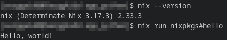
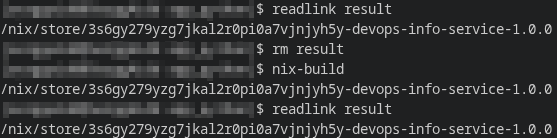
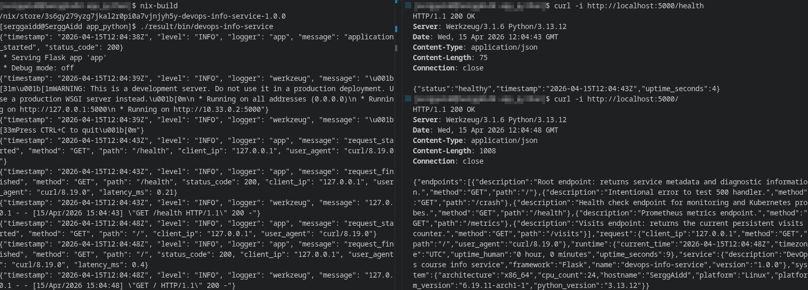
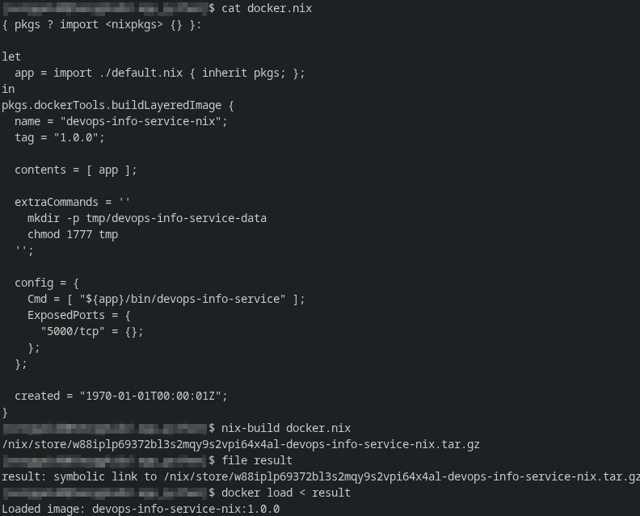
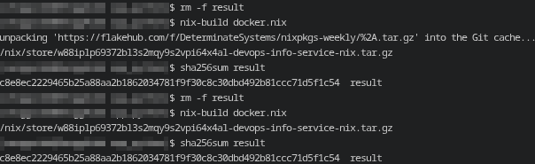
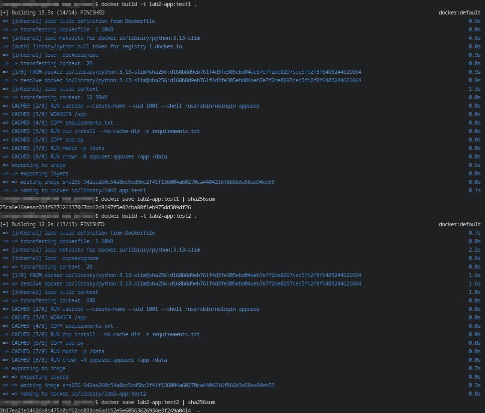
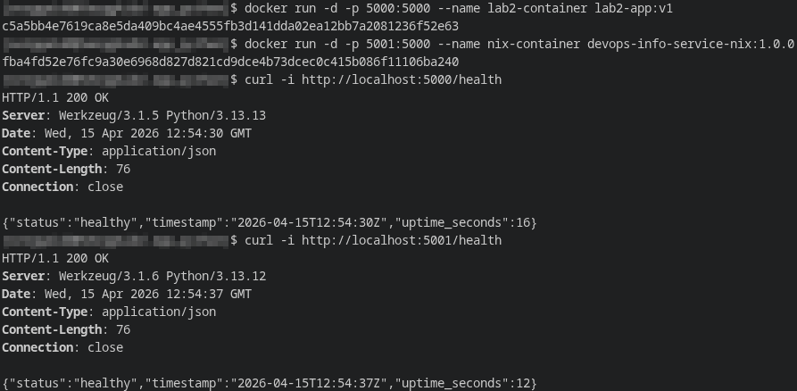
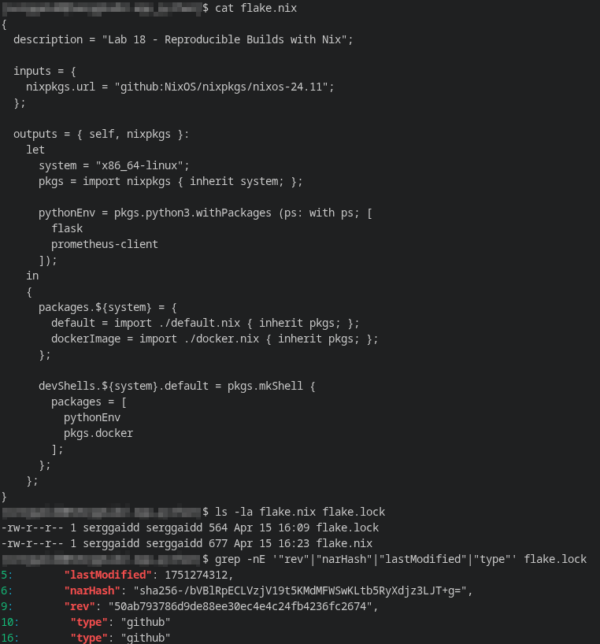
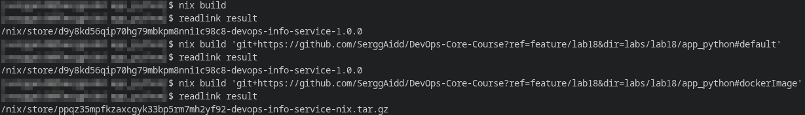
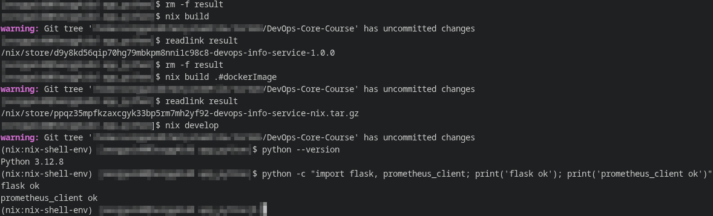

# Lab 18 — Reproducible Builds with Nix

## Task 1 — Reproducible Python App
### Installation steps and verification output
Nix was installed using the Determinate Systems installer. After installation, basic checks were successful:


### `default.nix` file with explanations:
**`default.nix` file:**
```nix
{ pkgs ? import <nixpkgs> {} }:

let
  pythonEnv = pkgs.python3.withPackages (ps: with ps; [
    flask
    prometheus-client
  ]);
in
pkgs.stdenvNoCC.mkDerivation {
  pname = "devops-info-service";
  version = "1.0.0";
  src = pkgs.lib.cleanSource ./.;

  nativeBuildInputs = [ pkgs.makeWrapper ];

  installPhase = ''
    runHook preInstall

    mkdir -p $out/app $out/bin
    cp -r . $out/app

    makeWrapper ${pythonEnv}/bin/python $out/bin/devops-info-service \
      --set DATA_DIR /tmp/devops-info-service-data \
      --set VISITS_FILE /tmp/devops-info-service-data/visits \
      --add-flags "$out/app/app.py"

    runHook postInstall
  '';
}
```

**Explanation of each field:**
- `pkgs ? import <nixpkgs> {}` - imports the `nixpkgs` package set if it wasn't supplied;
- `pythonEnv` - creates a fixed Python environment with precisely specified dependencies;
- `pname` and `version` - the package name and version;
- `src = pkgs.lib.cleanSource ./.;` - takes the current directory as the source and cleans it of some unnecessary junk;
- `nativeBuildInputs = [ pkgs.makeWrapper ];` - includes a tool that allows you to create an executable wrapper script;
- `installPhase` - copies the source files to `$out/app`, then creates an executable file `$out/bin/devops-info-service`, which runs `app.py` through the desired Python;
- `--set DATA_DIR` and `--set VISITS_FILE` - redirect runtime data to the writable directory `/tmp/...` without changing the application code itself.

### Store path from multiple builds
**Reproducibility testing was performed in three steps:**
1. Normal build;
2. Rebuild without changing inputs;
3. Removing the store path from the Nix store and forcing a rebuild.



The verification results prove that, given the same inputs, Nix returns the same store path and the same result, even after physically removing the artifact from the store and completely rebuilding.

### Comparison table: `pip install` vs Nix derivation
| Aspect | `pip install` + `venv` | Nix derivation |
|---|---|---|
| Python version | Depends on system Python | Fixed via `nixpkgs` |
| Direct dependencies | Can be partially fixed | Explicitly listed |
| Transitive dependencies | May drift | Enters fixed closure |
| Build environment | Machine-dependent | Declarative and reproducible |
| Output identity | Not bound to content hash | Bound to `/nix/store/<hash>-...` |
| Rebuild guarantee | Approximate | Strong, content-addressable |

### Reasons why `requirements.txt` provides weaker guarantees than Nix
- Typically captures only direct dependencies, not the entire dependency graph;
- Depends on the current system Python;
- Depends on the state of the external package index at installation time;
- Does not describe build tools, environment layout, and other build inputs;
- Does not generate a content-addressed output path.

Thus, when a particular run of `pip` produces the same result, it does not mean a cryptographically reproducible build; in the case of Nix, the result is determined not only by the package version, but by the entire set of inputs, which is then reflected in the store path.

### Explanation of the Nix store path format
**Store path example:**
```text
/nix/store/3s6gy279yzg7jkal2r0pi0a7vjnjyh5y-devops-info-service-1.0.0
```

**Analysis:**
- `/nix/store/` — the global Nix artifact repository;
- `3s6gy279yzg7jkal2r0pi0a7vjnjyh5y` — a hash calculated from the build inputs;
- `devops-info-service` — the package name (`pname`);
- `1.0.0` — the package version (`version`).
This is why identical inputs lead to the same path, and changing any significant input produces a new path.

### Screenshots showing your Lab 1 app running from Nix-built version


### Reflection
Using Nix from the start in Lab 1 would have provided the following benefits:
- a unified and reproducible Python environment on any machine;
- no dependency on the system Python or local venv state;
- easier dependency auditing;
- predictable rebuild results;
- less chance of encountering the classic "works on my machine" problem.

---

## Task 2 — Reproducible Docker Images
### `docker.nix` file with explanations:
**`docker.nix` file**
```nix
{ pkgs ? import <nixpkgs> {} }:

let
  app = import ./default.nix { inherit pkgs; };
in
pkgs.dockerTools.buildLayeredImage {
  name = "devops-info-service-nix";
  tag = "1.0.0";

  contents = [ app ];

  extraCommands = ''
    mkdir -p tmp/devops-info-service-data
    chmod 1777 tmp
  '';

  config = {
    Cmd = [ "${app}/bin/devops-info-service" ];
    ExposedPorts = {
      "5000/tcp" = {};
    };
  };

  created = "1970-01-01T00:00:01Z";
}
```

**Explanation of each field**
- `app = import ./default.nix { inherit pkgs; };` - reuses the already built Nix package from Task 1;
- `buildLayeredImage` - builds a Docker image as a set of deterministic layers;
- `name` and `tag` - the name and tag of the resulting image;
- `contents` - a list of objects that should be included in the image; in this case, it is a ready-made reproducible package;
- `extraCommands` - creates a runtime directory within the image for application data;
- `config.Cmd` - the container launch command;
- `config.ExposedPorts` - declares port `5000/tcp`;
- `created = "1970-01-01T00:00:01Z";` - a fixed timestamp for reproducibility.

### Side-by-side comparison: Lab 2 Dockerfile vs Nix `docker.nix`
| Aspect | Lab 2 Dockerfile | Nix `docker.nix` |
|---|---|---|
| Base image | `python:3.13-slim` | No mutable base image |
| Dependency installation | `pip install` during build | Pre-built Nix package from the store |
| Timestamp control | No | Explicitly commits `created` |
| Reproducibility | Limited | Strong |
| Layer model | Docker layers | Content-addressed layers |
| Runtime data handling | `/data` is created in the Dockerfile | `tmp/devops-info-service-data` is created declaratively |

### Build, load and run


### SHA256 hash comparison proving Nix reproducibility

The Nix tarball hashes are identical across two successive builds, proving the Nix Docker image is bit-for-bit reproducible.


For the traditional Docker image, different hashes were obtained via `docker save | sha256sum`, which proves that the traditional approach does not guarantee the same final image archive.

### Image size comparison table with analysis
**Actual sizes of images:**
| Image | Size |
|---|---:|
| `lab2-app:v1` | 138MB |
| `devops-info-service-nix:1.0.0` | 197MB |

**Analysis:**
- In this case, the Nix image turned out to be larger than a regular Docker image;
- This is because the image contains a complete closure of dependencies from the Nix store;
- However, size is less important here than ensuring reproducibility and accurately capturing dependencies.

### `docker history` output for both approaches
**Lab 2 Docker image:**
```text
IMAGE          CREATED      CREATED BY                                      SIZE      COMMENT
942aa260c54a   5 days ago   CMD ["python" "app.py"]                         0B        buildkit.dockerfile.v0
<missing>      5 days ago   EXPOSE [5000/tcp]                               0B        buildkit.dockerfile.v0
<missing>      5 days ago   USER appuser                                    0B        buildkit.dockerfile.v0
<missing>      5 days ago   RUN /bin/sh -c chown -R appuser:appuser /app…   12.3kB    buildkit.dockerfile.v0
<missing>      5 days ago   RUN /bin/sh -c mkdir -p /data # buildkit        0B        buildkit.dockerfile.v0
<missing>      5 days ago   COPY app.py . # buildkit                        12kB      buildkit.dockerfile.v0
<missing>      5 days ago   RUN /bin/sh -c pip install --no-cache-dir -r…   11.7MB    buildkit.dockerfile.v0
<missing>      5 days ago   COPY requirements.txt . # buildkit              268B      buildkit.dockerfile.v0
<missing>      5 days ago   WORKDIR /app                                    0B        buildkit.dockerfile.v0
<missing>      5 days ago   RUN /bin/sh -c useradd --create-home --uid 1…   8.49kB    buildkit.dockerfile.v0
<missing>      5 days ago   ENV PYTHONDONTWRITEBYTECODE=1 PYTHONUNBUFFER…   0B        buildkit.dockerfile.v0
...
```

**Nix Docker image:**
```text
IMAGE          CREATED   CREATED BY   SIZE      COMMENT
a26da0e57595   N/A                    0B        store paths: ['/nix/store/3w3pbml78cmdqpja8w9ynf3blnlyh1dc-devops-info-service-nix-customisation-layer']
<missing>      N/A                    2.54MB    store paths: ['/nix/store/nsjp3pynmcj1irzgzcvllfbgc9l4mbm9-devops-info-service-1.0.0']
<missing>      N/A                    177kB     store paths: ['/nix/store/3cdz72hrajiz4bsqzzn1y50aqjv8kfll-python3-3.13.12-env']
<missing>      N/A                    1.08MB    store paths: ['/nix/store/kbr0hysfl5ab62l4zygbikirp2k84iqd-python3.13-flask-3.1.2']
<missing>      N/A                    2.56MB    store paths: ['/nix/store/60aw55d621p2d4l6kkli6dfp47wmnj98-python3.13-werkzeug-3.1.6']
<missing>      N/A                    1.85MB    store paths: ['/nix/store/3ridhx9ylh8dc0qkqi7dzbz7m7kdn3kx-python3.13-jinja2-3.1.6']
<missing>      N/A                    713kB     store paths: ['/nix/store/09f6k42d8zfxiadj2rc02gfpnmhlja7y-python3.13-prometheus-client-0.24.1']
...
```

The key difference is that traditional Docker history shows the steps in the Dockerfile, while Nix history shows the store paths from which the image was built.

### Screenshot showing both containers running simultaneously


### Analysis: Why traditional Dockerfiles cannot achieve bit-for-bit reproducibility
A traditional Dockerfile is poorly suited for bit-for-bit reproducibility for several reasons:
- the build depends on mutable base images (`python:3.13-slim`);
- `pip install` is executed during build and depends on an external package index;
- internal layer packaging and image storage can produce different archives even with the same Dockerfile;
- Docker is focused on a convenient, cacheable build, not strict content-addressed artifact reproducibility.

### Reflection
If I were rebuilding Lab 2 directly from Nix, I would:
- first build the application using `default.nix`;
- then build the container exclusively from this reproducible package;
- use a fixed timestamp and eliminate runtime dependency installation within the Dockerfile.
This approach would produce more predictable results and simplify artifact comparisons between machines and builds.

### Practical scenarios where Nix reproducibility matters
- **CI/CD** - builds in different runners produce the same artifact;
- **Security audits** - easier to prove which inputs an image was derived from;
- **Rollbacks** - you can safely revert to a known artifact;
- **Incident response** - easier to compare the "expected" and the actual deployed image;
- **Supply chain control** - less hidden dynamics during the build process.

---

## Bonus Task — Modern Nix with Flakes
### `flake.nix` file with explanations:
**`flake.nix` file:**
```nix
{
  description = "Lab 18 - Reproducible Builds with Nix";

  inputs = {
    nixpkgs.url = "github:NixOS/nixpkgs/nixos-24.11";
  };

  outputs = { self, nixpkgs }:
    let
      system = "x86_64-linux";
      pkgs = import nixpkgs { inherit system; };

      pythonEnv = pkgs.python3.withPackages (ps: with ps; [
        flask
        prometheus-client
      ]);
    in
    {
      packages.${system} = {
        default = import ./default.nix { inherit pkgs; };
        dockerImage = import ./docker.nix { inherit pkgs; };
      };

      devShells.${system}.default = pkgs.mkShell {
        packages = [
          pythonEnv
          pkgs.docker
        ];
      };
    };
}
```
**Explanation:**
- `inputs.nixpkgs.url` - captures the `nixpkgs` source;
- `system = "x86_64-linux";` - explicitly specifies the target platform;
- `pkgs = import nixpkgs { inherit system; };` - retrieves the package set for the selected platform;
- `pythonEnv` - creates an isolated Python environment for the dev shell;
- `packages.${system}.default` - describes the default package;
- `packages.${system}.dockerImage` - describes building a Docker image via the flake target;
- `devShells.${system}.default` creates a reproducible dev environment.


### `flake.lock` snippet showing locked dependencies

This screenshot proves that flake is committing a specific revision of `nixpkgs` and its contents.

### Build outputs from `nix build`
**Building the default package using flake:**
```text
/nix/store/d9y8kd56qip70hg79mbkpm8nni1c98c8-devops-info-service-1.0.0
```

**Building a Docker image using flake target:**
```text
/nix/store/ppqz35mpfkzaxcgyk33bp5rm7mh2yf92-devops-info-service-nix.tar.gz
```

### Proof that builds are identical across machines/time

Reproducibility was verified in two ways: using a local Flake build and building directly from a remote Git source on the `feature/lab18` branch. In both cases, the same store path for the package was obtained, confirming the identical result with the same inputs fixed in `flake.lock`. A fixed store path was also obtained for the Docker image using `#dockerImage`. A separate test on a different physical machine was not performed, but the matching results between the local and remote Git builds confirm reproducibility in time and source.

### Dev shell experience: `nix develop` vs Lab 1 `venv`
**Lab 1 approach:**
```bash
python -m venv venv
source venv/bin/activate
pip install -r requirements.txt
```

**Flakes approach:**
```bash
nix develop
python --version
python -c "import flask, prometheus_client; print('flask ok'); print('prometheus_client ok')"
```



**Observations:**
- `nix develop` immediately provides a ready-made isolated environment;
- no need to manually create `venv`;
- no need to manually install dependencies;
- the system environment is not polluted;
- after `exit`, dependencies disappear from the current shell, confirming isolation.

### Comparison with Lab 10 Helm values.yaml approach
| Aspect | Lab 10 Helm values.yaml | Lab 18 Nix Flakes |
|---|---|---|
| What is fixed | Usually an image tag | Specific `nixpkgs` revision and closure |
| Python dependencies | Not fixed within Helm | Fixed via `flake.lock` + derivations |
| Build tools | Not fixed | Fixed |
| Reproducibility | Limited, deployment-oriented | Strong, build-oriented |
| Main role | Deployment configuration | Fixing build inputs |
**Conclusion:** Helm and Flakes solve different problems. Helm is convenient for declarative deployment in Kubernetes, while Flakes is for recording *exactly* what is being built. Together, they work better than either alone: ​​Nix reproducibly builds an artifact, while Helm reproducibly deploys the desired tag/image.

### Reflection
Flakes improve on traditional dependency management by:
- introducing a lock file for `nixpkgs` and other inputs;
- making the project structure more standard;
- simplifying repeatable builds on different machines;
- allowing the package, docker image, and dev shell to be defined uniformly in a single place.

### Practical scenarios where `flake.lock` prevented a "works on my machine" problem
- Local development and CI use the same `nixpkgs` revision;
- A new developer's machine receives the same inputs without manual version selection;
- When rebuilding after a while, the project doesn't "flip" to newer versions of dependencies;
- The dev shell and build targets are defined in a single flake, so the difference between the "developer environment" and the "build environment" is minimized.

---

## Conclusion
This lab implemented three levels of reproducibility:
1. Reproducible Python application build using `default.nix`;
2. Reproducible Docker image using `dockerTools`;
3. Fixed build inputs and development environment using Flakes.
In practice, this demonstrated that Nix provides stronger guarantees than classic approaches based on `venv`, `pip install`, and regular Dockerfiles. The main result is that identical inputs lead to identical artifacts, and all essential dependencies and build assumptions are explicitly described.
