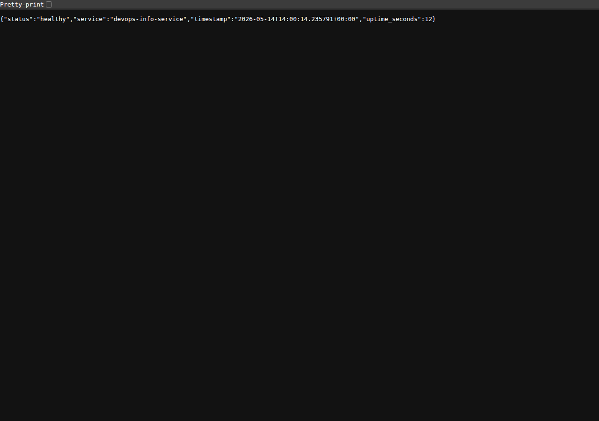
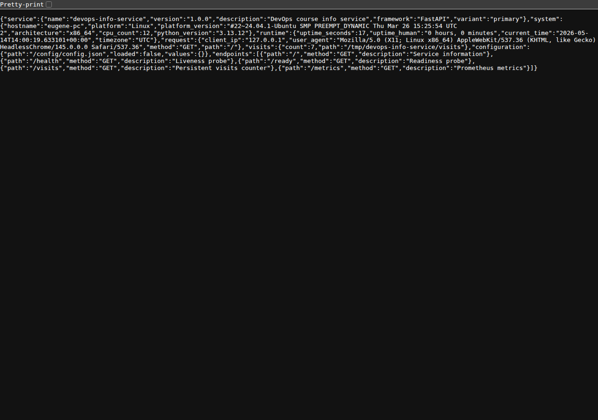
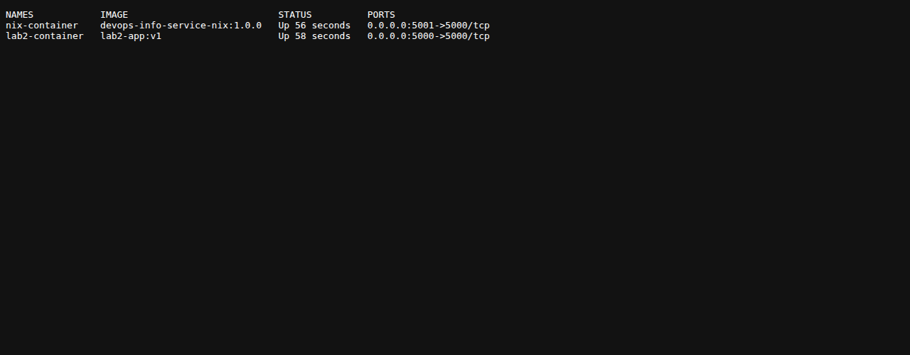
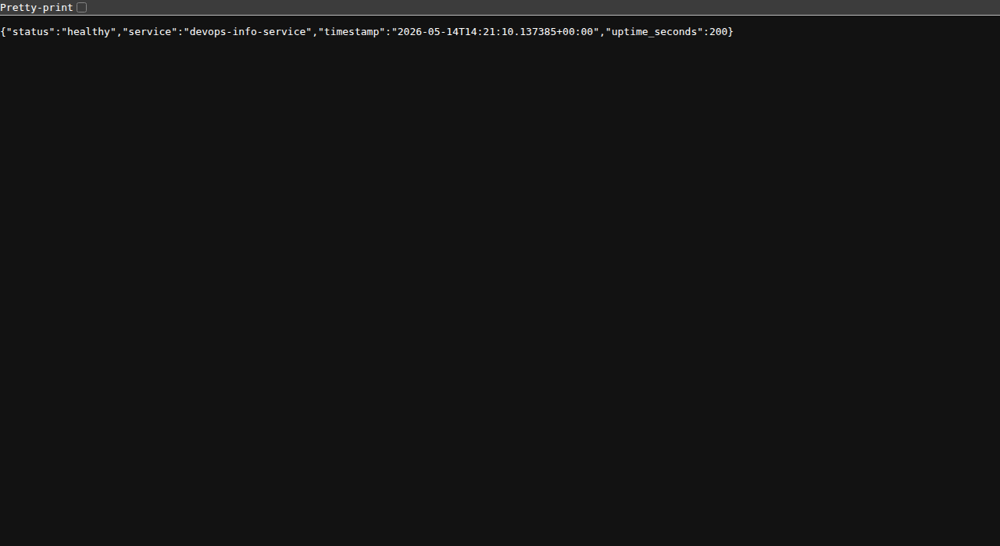

# Lab 18 - Reproducible Builds with Nix

## Task 1 - Build Reproducible Python App

### 1.1 Nix installation and verification

Nix was installed with the Determinate Systems installer from the lab:

```bash
curl --proto '=https' --tlsv1.2 -sSf -L https://install.determinate.systems/nix | sh -s -- install
```

The Codex shell did not automatically load the Nix profile after installation, so I sourced the installed profile hook before running Nix commands:

```bash
. /nix/store/ffqv0md8wq10ay9mpaslasmh85qg3mvd-determinate-nix-3.20.0/etc/profile.d/nix-daemon.sh
```

Verification output:

```text
$ nix --version
nix (Determinate Nix 3.20.0) 2.34.6

$ which nix
/nix/var/nix/profiles/default/bin/nix

$ nix run nixpkgs#hello
Hello, world!
```

### 1.2 Application copied from Lab 1

The Lab 1 FastAPI service was copied into `labs/lab18/app_python/`:

```text
labs/lab18/app_python/app.py
labs/lab18/app_python/requirements.txt
labs/lab18/app_python/Dockerfile
labs/lab18/app_python/tests/test_app.py
```

The copied app still passes its existing tests:

```text
$ python3 -m unittest -v
Ran 9 tests in 0.060s

OK
```

The original Lab 1 dependency file pins only the direct Python dependencies:

```text
fastapi==0.115.0
uvicorn==0.30.6
prometheus-client==0.23.1
ruff==0.6.8
```

### 1.3 Nix derivation

`labs/lab18/app_python/default.nix`:

```nix
{ pkgs ? import <nixpkgs> {} }:

let
  python = pkgs.python3;
  pythonPackages = pkgs.python3Packages;
in
pythonPackages.buildPythonApplication {
  pname = "devops-info-service";
  version = "1.0.0";
  src = ./.;

  format = "other";
  dontBuild = true;
  dontCheck = true;

  propagatedBuildInputs = with pythonPackages; [
    fastapi
    uvicorn
    prometheus-client
  ];

  nativeBuildInputs = [
    pkgs.makeWrapper
  ];

  installPhase = ''
    runHook preInstall

    mkdir -p $out/bin $out/share/devops-info-service
    cp app.py $out/share/devops-info-service/app.py

    makeWrapper ${python}/bin/python $out/bin/devops-info-service \
      --add-flags "$out/share/devops-info-service/app.py" \
      --prefix PYTHONPATH : "$PYTHONPATH"

    runHook postInstall
  '';

  meta = {
    description = "FastAPI DevOps Info Service built reproducibly with Nix";
    mainProgram = "devops-info-service";
  };
}
```

Field explanations:

| Field | Purpose |
| --- | --- |
| `pkgs ? import <nixpkgs> {}` | Imports the nixpkgs package set from the configured Nix channel/registry used for this build. |
| `python = pkgs.python3` | Uses the Python interpreter supplied by Nix, not the host system Python. |
| `buildPythonApplication` | Builds an executable Python application derivation. |
| `pname` / `version` | Names the output path as `devops-info-service-1.0.0`. |
| `src = ./.` | Uses the copied Lab 1 app as the build source. |
| `format = "other"` | The app has no `setup.py` or `pyproject.toml`; it is a simple script app. |
| `propagatedBuildInputs` | Adds runtime Python dependencies to the wrapper environment. |
| `nativeBuildInputs = [ pkgs.makeWrapper ]` | Provides `makeWrapper` for creating the executable launcher. |
| `installPhase` | Copies `app.py` into the output and wraps it with the Nix Python interpreter and `PYTHONPATH`. |

Build output:

```text
$ nix-build
building '/nix/store/x467fywsgljh83sq2di8297v00h8x7n8-devops-info-service-1.0.0.drv'...
...
/nix/store/kgg4m28rq11dld64qflaz2sxv5p1qiv3-devops-info-service-1.0.0
```

The build pulled Nix-managed versions of Python and all Python dependencies, including:

```text
python3-3.13.12
python3.13-fastapi-0.128.0
python3.13-uvicorn-0.40.0
python3.13-prometheus-client-0.24.1
python3.13-pydantic-2.12.5
python3.13-starlette-0.52.1
python3.13-anyio-4.13.0
python3.13-click-8.3.1
```

### Running the Nix-built app

Port `5000` was already unavailable in the execution environment, so I used the app's supported `PORT` environment variable and ran the Nix-built service on `127.0.0.1:5050`:

```text
$ PORT=5050 HOST=127.0.0.1 ./result/bin/devops-info-service
{"message": "application_starting", "service": "devops-info-service", "host": "127.0.0.1", "port": 5050}
INFO:     Uvicorn running on http://127.0.0.1:5050
```

Health check:

```text
$ curl -sS http://127.0.0.1:5050/health
{"status":"healthy","service":"devops-info-service","timestamp":"2026-05-14T14:00:10.623117+00:00","uptime_seconds":8}
```

Root endpoint excerpt:

```json
{
  "service": {
    "name": "devops-info-service",
    "version": "1.0.0",
    "framework": "FastAPI"
  },
  "system": {
    "architecture": "x86_64",
    "python_version": "3.13.12"
  }
}
```

Screenshots:





### 1.4 Reproducibility evidence

Initial store path:

```text
$ readlink result
/nix/store/kgg4m28rq11dld64qflaz2sxv5p1qiv3-devops-info-service-1.0.0
```

Rebuild after removing only the `result` symlink:

```text
$ rm result
$ nix-build
/nix/store/kgg4m28rq11dld64qflaz2sxv5p1qiv3-devops-info-service-1.0.0

$ readlink result
/nix/store/kgg4m28rq11dld64qflaz2sxv5p1qiv3-devops-info-service-1.0.0

$ nix-hash --type sha256 result
8f8ae902c21757e7954a449857b74c63f1b267e8fc849ae6433b49689dd86146
```

Forced rebuild after deleting the output from the Nix store:

```text
$ STORE_PATH=$(readlink result)
$ echo "Original store path: $STORE_PATH"
Original store path: /nix/store/kgg4m28rq11dld64qflaz2sxv5p1qiv3-devops-info-service-1.0.0

$ rm result
$ nix-store --delete $(nix-store --query --referrers-closure "$STORE_PATH")
deleting '/nix/store/81ml7bsx6v36njf2far1p6rv9nz8xz4j-layers.json'
deleting '/nix/store/h56s83sijxshjm2p8bdrk3spd9h6ff6s-stream-devops-info-service-nix'
deleting '/nix/store/bkf1cibb14d3zdc5d4yy9ybhjkdidr73-devops-info-service-nix-conf.json'
deleting '/nix/store/iv44arghghixnrkm1ha5xdy5xp1m5cg3-excludePaths'
deleting '/nix/store/xw7hgvxzw14zrcmfq6d124vwq99hd22m-devops-info-service-nix-base.json'
deleting '/nix/store/wjrp975xcggp4vlj1alx9mfd6x0p4lw5-devops-info-service-nix-customisation-layer'
deleting '/nix/store/kgg4m28rq11dld64qflaz2sxv5p1qiv3-devops-info-service-1.0.0'
7 store paths deleted, 37.4 KiB freed

$ nix-build
building '/nix/store/x467fywsgljh83sq2di8297v00h8x7n8-devops-info-service-1.0.0.drv'...
...
/nix/store/kgg4m28rq11dld64qflaz2sxv5p1qiv3-devops-info-service-1.0.0

$ readlink result
/nix/store/kgg4m28rq11dld64qflaz2sxv5p1qiv3-devops-info-service-1.0.0

$ nix-hash --type sha256 result
8f8ae902c21757e7954a449857b74c63f1b267e8fc849ae6433b49689dd86146
```

Result:

| Build | Store path | Output hash |
| --- | --- | --- |
| Initial build | `/nix/store/kgg4m28rq11dld64qflaz2sxv5p1qiv3-devops-info-service-1.0.0` | `8f8ae902c21757e7954a449857b74c63f1b267e8fc849ae6433b49689dd86146` |
| Rebuild via cache | `/nix/store/kgg4m28rq11dld64qflaz2sxv5p1qiv3-devops-info-service-1.0.0` | `8f8ae902c21757e7954a449857b74c63f1b267e8fc849ae6433b49689dd86146` |
| Forced rebuild | `/nix/store/kgg4m28rq11dld64qflaz2sxv5p1qiv3-devops-info-service-1.0.0` | `8f8ae902c21757e7954a449857b74c63f1b267e8fc849ae6433b49689dd86146` |

The same declared inputs produced the same store path and the same output hash, even after deleting the previous output and rebuilding it.

Note: after Task 2 was added, the app output had unrooted dockerTools metadata referrers in the Nix store. I deleted that referrer closure so Nix could remove the app output and perform a real rebuild.

### Nix store path format

Example:

```text
/nix/store/kgg4m28rq11dld64qflaz2sxv5p1qiv3-devops-info-service-1.0.0
```

Parts:

| Part | Meaning |
| --- | --- |
| `/nix/store` | Global immutable Nix store. Build outputs are stored here instead of inside the project directory. |
| `kgg4m28rq11dld64qflaz2sxv5p1qiv3` | Hash portion computed from the derivation inputs and build recipe for this standard input-addressed derivation. |
| `devops-info-service` | Package name from `pname`. |
| `1.0.0` | Package version from `version`. |

The output content hash was separately recorded with `nix-hash --type sha256 result`.

### pip install comparison

I used temporary virtual environments and an unpinned requirement to demonstrate the Lab 1 style dependency resolution:

```text
$ printf 'flask\n' > /tmp/lab18-requirements-unpinned.txt
$ python3 -m venv /tmp/lab18-venv1
$ /tmp/lab18-venv1/bin/python -m pip install -r /tmp/lab18-requirements-unpinned.txt
$ /tmp/lab18-venv1/bin/python -m pip freeze
blinker==1.9.0
click==8.3.3
Flask==3.1.3
itsdangerous==2.2.0
Jinja2==3.1.6
MarkupSafe==3.0.3
Werkzeug==3.1.8

$ python3 -m venv /tmp/lab18-venv2
$ /tmp/lab18-venv2/bin/python -m pip install -r /tmp/lab18-requirements-unpinned.txt
$ /tmp/lab18-venv2/bin/python -m pip freeze
blinker==1.9.0
click==8.3.3
Flask==3.1.3
itsdangerous==2.2.0
Jinja2==3.1.6
MarkupSafe==3.0.3
Werkzeug==3.1.8

$ diff -u /tmp/lab18-freeze1.txt /tmp/lab18-freeze2.txt
# no output
```

The two back-to-back runs matched because both were resolved against the same PyPI state on May 14, 2026. This does not provide a long-term reproducibility guarantee. The unpinned requirement selected the latest Flask and latest compatible transitive dependencies at install time. If PyPI publishes a newer compatible dependency later, the same command can resolve to a different environment.

For my Lab 1 app, `requirements.txt` pins direct dependencies, but it still does not pin:

- Python interpreter version
- all transitive dependency versions
- package hashes
- wheel build options and platform-specific wheel selection
- build tools and system libraries used by native extensions

For the selected nixpkgs input, Nix fixes the whole build closure through Nix store paths: Python, Python packages, transitive dependencies, build hooks, C libraries, and tools.

### Lab 1 pip + venv vs Lab 18 Nix

| Aspect | Lab 1: pip + venv | Lab 18: Nix derivation |
| --- | --- | --- |
| Python version | Comes from the host machine | Comes from Nix (`python3-3.13.12` in this build) |
| Direct dependencies | Listed in `requirements.txt` | Listed in `propagatedBuildInputs` |
| Transitive dependencies | Resolved by pip at install time | Fixed by the selected nixpkgs package set |
| Package hashes | Not required by this project | Encoded through Nix store paths and binary cache validation |
| Build isolation | Virtual environment only | Nix sandbox and immutable store |
| Rebuild behavior | Re-runs resolver and installer | Reuses identical store path or rebuilds deterministically |
| Portability | Depends on host Python, pip, OS, and PyPI state | Works anywhere the same Nix inputs can be evaluated |

### Why requirements.txt is weaker than Nix

`requirements.txt` is an installation recipe for `pip`, not a complete build description. It tells pip what to request, but pip still has to resolve dependencies using the current package index, current Python interpreter, platform tags, local build tools, and available wheels.

Nix describes the full build graph. The derivation records the source, Python interpreter, Python dependencies, transitive dependencies, build tools, and environment. When those inputs are unchanged, Nix returns the same store path and content hash.

### Reflection

If Nix had been used from Lab 1, the project would have started with a reproducible runtime instead of relying on each developer's system Python and pip resolver. The FastAPI service, tests, and later containerization work would have shared the same dependency closure. That would have reduced "works on my machine" failures, made CI closer to local development, and provided a stronger base for later labs involving Docker, Kubernetes, and rollbacks.

### Task 1 challenges

- After installation, the interactive shell used by Codex did not have `nix` on `PATH`; sourcing the installed `nix-daemon.sh` profile fixed it for the session.
- The tool sandbox blocked access to `/home/eugene/.cache/nix`, so I used `XDG_CACHE_HOME=/tmp/codex-nix-cache` for Nix command caches.
- The sandbox also restricted the Nix daemon socket and external network access; Nix build/fetch commands were run with approval when daemon or network access was required.
- Port `5000` was unavailable in this environment, so the app was run on its supported configured port `5050`.

## Task 2 - Reproducible Docker Images

### 2.1 Lab 2 Dockerfile review

The copied Lab 2 Dockerfile is in `labs/lab18/app_python/Dockerfile`:

```dockerfile
FROM python:3.13-slim

ENV PYTHONDONTWRITEBYTECODE=1 \
    PYTHONUNBUFFERED=1

WORKDIR /app

RUN groupadd --system --gid 10001 app && \
    useradd --system --uid 10001 --gid app --create-home appuser

COPY requirements.txt .

RUN pip install --no-cache-dir --upgrade pip && \
    pip install --no-cache-dir -r requirements.txt

COPY app.py .

USER 10001:10001

EXPOSE 5000

CMD ["python", "app.py"]
```

This image follows good Docker practices from Lab 2: slim base image, non-root user, dependency layer before source code, and no pip cache. It is still not bit-for-bit reproducible because it depends on mutable external state such as the `python:3.13-slim` tag, build timestamps, and live `pip install` resolution.

### 2.2 Nix Docker image

`labs/lab18/app_python/docker.nix`:

```nix
{ pkgs ? import <nixpkgs> {} }:

let
  app = import ./default.nix { inherit pkgs; };
in
pkgs.dockerTools.buildLayeredImage {
  name = "devops-info-service-nix";
  tag = "1.0.0";

  contents = [
    app
  ];

  config = {
    Cmd = [ "${app}/bin/devops-info-service" ];
    Env = [
      "HOST=0.0.0.0"
      "PORT=5000"
      "PYTHONDONTWRITEBYTECODE=1"
      "PYTHONUNBUFFERED=1"
    ];
    ExposedPorts = {
      "5000/tcp" = {};
    };
  };

  created = "1970-01-01T00:00:01Z";
}
```

Field explanations:

| Field | Purpose |
| --- | --- |
| `app = import ./default.nix { inherit pkgs; }` | Reuses the Task 1 Nix-built app as the container payload. |
| `buildLayeredImage` | Builds a layered Docker-compatible image directly from Nix store paths. |
| `name` / `tag` | Produces `devops-info-service-nix:1.0.0`. |
| `contents = [ app ]` | Includes the app closure: Python, FastAPI, Uvicorn, Prometheus client, and transitive runtime dependencies. |
| `config.Cmd` | Runs the Nix-built app executable by exact store path. |
| `config.Env` | Preserves the app's normal container runtime behavior. |
| `config.ExposedPorts` | Documents port `5000/tcp`. |
| `created` | Uses a fixed timestamp so the image output is reproducible. |

Build and load:

```text
$ nix-build docker.nix
/nix/store/4ffmhpmlsnp6f3sjgswp3g0nwn8y683i-devops-info-service-nix.tar.gz

$ sha256sum result
9960795a7f78fb2a9d2db2e7b6ebc6b7a2e470afcc96ac38c045e3bc295ea38e  result

$ docker load -i result
Loaded image: devops-info-service-nix:1.0.0
```

### 2.3 Nix Docker reproducibility proof

I removed `result` before each Nix image build so the generated symlink would not become part of the `src = ./.` input.

```text
$ rm -f result
$ nix-build docker.nix
/nix/store/4ffmhpmlsnp6f3sjgswp3g0nwn8y683i-devops-info-service-nix.tar.gz
$ sha256sum result
9960795a7f78fb2a9d2db2e7b6ebc6b7a2e470afcc96ac38c045e3bc295ea38e  result

$ rm -f result
$ nix-build docker.nix
/nix/store/4ffmhpmlsnp6f3sjgswp3g0nwn8y683i-devops-info-service-nix.tar.gz
$ sha256sum result
9960795a7f78fb2a9d2db2e7b6ebc6b7a2e470afcc96ac38c045e3bc295ea38e  result
```

Result:

| Build | Nix image tarball | SHA256 |
| --- | --- | --- |
| First | `/nix/store/4ffmhpmlsnp6f3sjgswp3g0nwn8y683i-devops-info-service-nix.tar.gz` | `9960795a7f78fb2a9d2db2e7b6ebc6b7a2e470afcc96ac38c045e3bc295ea38e` |
| Second | `/nix/store/4ffmhpmlsnp6f3sjgswp3g0nwn8y683i-devops-info-service-nix.tar.gz` | `9960795a7f78fb2a9d2db2e7b6ebc6b7a2e470afcc96ac38c045e3bc295ea38e` |

The tarball is bit-for-bit identical across builds.

### 2.4 Traditional Dockerfile comparison

I built the Lab 2 Dockerfile twice with `--no-cache` so Docker's layer cache would not hide timestamp and resolver drift:

```text
$ docker build --no-cache -t lab2-app:v1 ./labs/lab18/app_python
...
writing image sha256:6c6cf08fc5d0aa144781f8028d1b9f72e51f16d122f1e242b4a48ecfaeecd62d

$ docker build --no-cache -t lab2-app:v2 ./labs/lab18/app_python
...
writing image sha256:ef9155ba267c193e50dd8af95c6565a87110a89f8f22986514697a778c182cec
```

Creation timestamps:

```text
$ docker inspect --format '{{.Id}} {{.Created}}' lab2-app:v1 lab2-app:v2 devops-info-service-nix:1.0.0
sha256:6c6cf08fc5d0aa144781f8028d1b9f72e51f16d122f1e242b4a48ecfaeecd62d 2026-05-14T17:14:11.923629421+03:00
sha256:ef9155ba267c193e50dd8af95c6565a87110a89f8f22986514697a778c182cec 2026-05-14T17:15:43.885673425+03:00
sha256:62e3aa73c785e06af4b3c53c913e6d7496d2215ee487b36e8a7a25a47610da22 1970-01-01T00:00:01Z
```

Saved image hashes:

```text
$ docker save lab2-app:v1 | sha256sum
48c6490bc06e75576139f44cd496ae56d9cf499a5c5efc9d0014b84d00ce0061  -

$ docker save lab2-app:v2 | sha256sum
492d113348055ebab6dc32bae52619ed2196912c29f8778c3039624e70a493c8  -
```

The traditional Dockerfile builds produced different image IDs, different creation timestamps, and different saved image hashes.

### 2.5 Image size comparison

```text
$ docker images
REPOSITORY                TAG       IMAGE ID       CREATED        SIZE
lab2-app                  v2        ef9155ba267c   28 seconds ago 174MB
lab2-app                  v1        6c6cf08fc5d0   2 minutes ago  174MB
devops-info-service-nix   1.0.0     62e3aa73c785   56 years ago   228MB
```

| Metric | Lab 2 Dockerfile | Lab 18 Nix dockerTools |
| --- | --- | --- |
| Image ID | Changed between builds | Stable for the Nix tarball input |
| Created timestamp | Current build time | Fixed at `1970-01-01T00:00:01Z` |
| Saved image hash | Different: `48c649...` vs `492d11...` | Nix tarball hash stable: `996079...` |
| Image size | `174MB` | `228MB` |
| Base image | `python:3.13-slim` | No Docker base image; Nix store closure |
| Dependency install | `pip install` during Docker build | Prebuilt Nix derivations |

The Nix image is larger in this run because it carries the full Nix Python runtime closure as store paths, including Python, glibc, OpenSSL, SQLite, and Python packages. The important Task 2 result is reproducibility rather than minimal size: the Nix image tarball stayed byte-identical.

### 2.6 Layer history comparison

Traditional Dockerfile history excerpt:

```text
$ docker history lab2-app:v1
CREATED BY                                      CREATED         SIZE
CMD ["python" "app.py"]                         5 minutes ago   0B
EXPOSE [5000/tcp]                               5 minutes ago   0B
USER 10001:10001                                5 minutes ago   0B
COPY app.py . # buildkit                        5 minutes ago   13.9kB
RUN /bin/sh -c pip install --no-cache-dir --... 5 minutes ago   56.3MB
COPY requirements.txt . # buildkit              6 minutes ago   71B
RUN /bin/sh -c groupadd --system --gid 10001... 6 minutes ago   8.86kB
WORKDIR /app                                    6 minutes ago   0B
...
```

Nix image history excerpt:

```text
$ docker history devops-info-service-nix:1.0.0
CREATED BY   CREATED   SIZE
             N/A       300B
             N/A       20.5kB
             N/A       1.65MB
             N/A       5.6MB
             N/A       132MB
             N/A       34.9MB
             N/A       118kB
```

Dockerfile layers show relative creation times and Dockerfile commands. Nix layers are content-addressed store paths; the visible history does not depend on the current build time.

### 2.7 Running both containers

I ran both images side by side:

```text
$ docker run -d -p 5000:5000 --name lab2-container lab2-app:v1
aa3e4e1d83e07c90069d29d7e01cbc22bf8b0dec9e4503e17d4deac04c9f660f

$ docker run -d -p 5001:5000 --name nix-container devops-info-service-nix:1.0.0
3e80f2da7b0c6f5bb09194e5f97ab2667e39d86335949f15db28aa1b2812dda3

$ docker ps
NAMES            IMAGE                           STATUS          PORTS
nix-container    devops-info-service-nix:1.0.0   Up 56 seconds   0.0.0.0:5001->5000/tcp
lab2-container   lab2-app:v1                     Up 58 seconds   0.0.0.0:5000->5000/tcp
```

Health checks:

```text
$ curl -sS http://127.0.0.1:5000/health
{"status":"healthy","service":"devops-info-service","timestamp":"2026-05-14T14:18:05.332232+00:00","uptime_seconds":15}

$ curl -sS http://127.0.0.1:5001/health
{"status":"healthy","service":"devops-info-service","timestamp":"2026-05-14T14:18:05.332571+00:00","uptime_seconds":15}
```

Screenshots:






### Why traditional Dockerfiles are not bit-for-bit reproducible

Traditional Dockerfiles are good operational packaging, but they do not fully describe all build inputs. This Dockerfile depends on:

- the mutable `python:3.13-slim` tag
- timestamps embedded in image config and layers
- live PyPI resolution during `pip install`
- transitive Python dependency ranges
- base-image OS package state
- Docker builder behavior and layer metadata

Even when the application files do not change, rebuilding can produce a different image ID and saved tar hash.

### Reflection

If I redid Lab 2 with Nix, I would still keep the Dockerfile version for learning Docker fundamentals, but I would use Nix as the reproducible image builder for CI/CD release artifacts. The deployment pipeline would build the app once as a Nix derivation, build the container with `dockerTools`, record the tarball hash, then load/tag/push that exact artifact.

### Practical scenarios where this matters

- CI/CD: repeated builds from the same commit should produce the same deployable artifact.
- Security audits: auditors can rebuild the image and compare hashes.
- Rollbacks: an old release can be recreated from the same Nix inputs instead of relying on old mutable tags.
- Incident response: teams can prove whether a running image matches the declared source and dependency graph.
- Multi-machine builds: developers and CI runners can share binary-cache outputs safely when the Nix inputs match.

## Bonus Task - Modern Nix with Flakes

Not attempted. The requested scope excludes bonus tasks.
