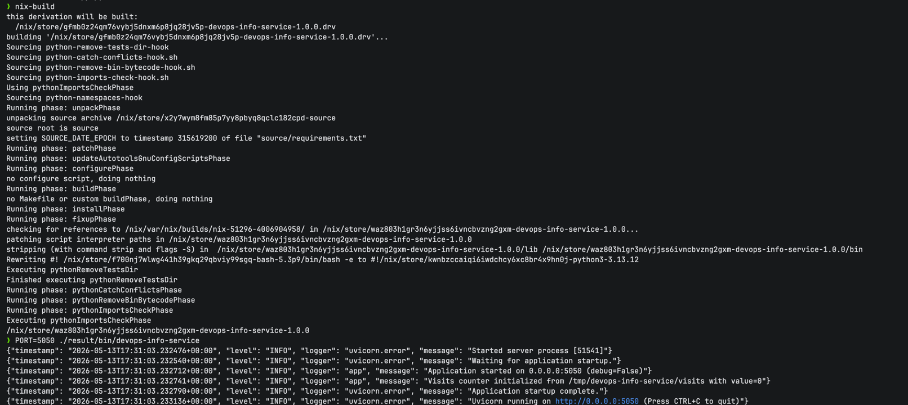
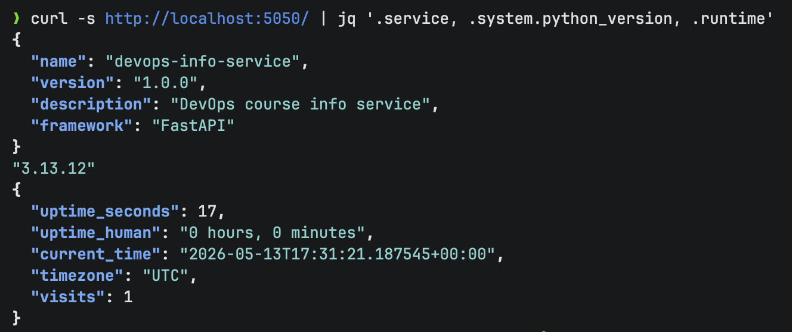
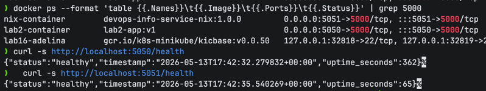

# Lab 18 — Reproducible Builds with Nix (Submission)

> Branch `lab18`, points 6 + 4 + 2 = 12.

All Nix expressions live in [`labs/lab18/app_python/`](./lab18/app_python/).

| File | Purpose |
|---|---|
| `default.nix` | Pure derivation for the DevOps Info Service |
| `docker.nix` | Reproducible OCI image via `dockerTools.buildLayeredImage` |
| `flake.nix` | Modern flake exposing `.#default`, `.#dockerImage`, and a `devShell` |
| `flake.lock` | Pinned `nixos-25.11` revision + `flake-utils` |

Host: macOS 26 (Darwin 25.3, `aarch64-darwin`), Determinate Nix 3.20.0 (Nix 2.34.6), Docker 29.4.0 (OrbStack).

---

## Task 1 — Build Reproducible Python App (Revisiting Lab 1)

### 1.1 Install verification

```
$ nix --version
nix (Determinate Nix 3.20.0) 2.34.6
```

### 1.3 Derivation — `default.nix`

```nix
{ pkgs ? import <nixpkgs> {} }:

let
  filteredSrc = pkgs.lib.cleanSourceWith {
    src = ./.;
    filter = path: type:
      let baseName = baseNameOf path; in
      !(builtins.elem baseName [
        "result" "result-bin" "result-dev"
        "__pycache__" ".pytest_cache" ".ruff_cache"
        ".venv" ".direnv" ".env" ".DS_Store"
        "default.nix" "docker.nix" "flake.nix" "flake.lock"
      ] || pkgs.lib.hasSuffix ".pyc" baseName);
  };
in
pkgs.python3Packages.buildPythonApplication {
  pname = "devops-info-service";
  version = "1.0.0";
  src = filteredSrc;
  format = "other";

  propagatedBuildInputs = with pkgs.python3Packages; [
    fastapi
    uvicorn
    python-json-logger
    prometheus-client
  ];

  nativeBuildInputs = [ pkgs.makeWrapper ];

  installPhase = ''
    runHook preInstall
    mkdir -p $out/bin $out/lib/devops-info-service
    cp app.py $out/lib/devops-info-service/
    cp -r config data $out/lib/devops-info-service/

    makeWrapper ${pkgs.python3}/bin/python $out/bin/devops-info-service \
      --add-flags "-m uvicorn app:app --host 0.0.0.0 --port \''${PORT:-5000}" \
      --chdir $out/lib/devops-info-service \
      --prefix PYTHONPATH : "$out/lib/devops-info-service:$PYTHONPATH" \
      --set-default CONFIG_FILE "$out/lib/devops-info-service/config/config.json" \
      --set-default VISITS_FILE "/tmp/devops-info-service/visits"
    runHook postInstall
  '';

  doCheck = false;
}
```

Field-by-field:

| Field | Reason |
|---|---|
| `filteredSrc` | Removes `result*` symlinks, caches, and the Nix files themselves from `src`. Without this, the prior build's `result` symlink hashes into `src`, the next build's hash changes, and the store path drifts on every rebuild. |
| `buildPythonApplication` / `format = "other"` | App is a plain script (no `setup.py`/`pyproject.toml`); `format = "other"` skips the Python packaging hooks and gives me full control over `installPhase`. |
| `propagatedBuildInputs` | The four runtime deps from `requirements.txt` — pulled from `nixpkgs`, not PyPI. |
| `makeWrapper` | Generates `$out/bin/devops-info-service` as a shell stub that invokes `python -m uvicorn app:app …` with `PYTHONPATH` set and a writable `VISITS_FILE` default (the in-store `data/` dir is read-only). |
| `doCheck = false` | No test phase wired up; `tests/` isn't part of the lab 1 deliverable I copied. |

### 1.4 Reproducibility evidence

```
$ nix-build --no-out-link   # build 1
/nix/store/nw1zyxcl8zaig01sgiirb5j8vvrc8nn9-devops-info-service-1.0.0

$ nix-build --no-out-link   # build 2 — cache hit, same hash
/nix/store/nw1zyxcl8zaig01sgiirb5j8vvrc8nn9-devops-info-service-1.0.0

$ nix-build --no-out-link   # build 3 — also cache hit
/nix/store/nw1zyxcl8zaig01sgiirb5j8vvrc8nn9-devops-info-service-1.0.0

# Force an *actual* rebuild
$ P=$(nix-build --no-out-link)
$ nix-store --delete "$P"
1 store paths deleted, 17.1 KiB freed

$ nix-build --no-out-link   # built from scratch, identical hash
/nix/store/nw1zyxcl8zaig01sgiirb5j8vvrc8nn9-devops-info-service-1.0.0
```

```
$ nix-hash --type sha256 result
5dbcea279335fb69d3e3127885654604d79f70a2c06e86c7ab95d8c2f99d3078

$ nix path-info -sSh result
/nix/store/.../devops-info-service-1.0.0   19.4 KiB   1.4 GiB (runtime closure)
```

Same inputs → same hash, even after the store path was physically deleted and the build re-executed.

### 1.4 (cont.) — `pip` non-reproducibility, for contrast

```
$ echo "flask" > requirements-unpinned.txt
$ python3 -m venv venv1 && source venv1/bin/activate
$ pip install -q -r requirements-unpinned.txt && pip freeze
blinker==1.9.0
click==8.3.3
Flask==3.1.3       ← latest at install time
itsdangerous==2.2.0
Jinja2==3.1.6
MarkupSafe==3.0.3
Werkzeug==3.1.8
```

Even when I pin the **direct** dep:

```
$ echo "flask==2.0.0" > requirements-pinned.txt
$ pip install -q -r requirements-pinned.txt && pip freeze
click==8.3.3       ← whatever's current — *not* what shipped alongside flask 2.0.0
Flask==2.0.0
itsdangerous==2.2.0
Jinja2==3.1.6
MarkupSafe==3.0.3
Werkzeug==3.1.8
```

Transitive deps (`click`, `itsdangerous`, `Jinja2`, `MarkupSafe`, `Werkzeug`) all picked the *latest available* version regardless of what Flask 2.0.0 was actually released against. `requirements.txt` pins what you install, not what your deps install — and even hash-pinning (`--require-hashes`) doesn't cover the Python interpreter, the OS libraries, or the build tools.

### 1.4 (cont.) — Running the Nix-built binary

```
$ PORT=5050 ./result/bin/devops-info-service &
$ curl -s http://localhost:5050/health
{"status":"healthy","timestamp":"2026-05-13T17:08:26.093060+00:00","uptime_seconds":1}

$ curl -s http://localhost:5050/
{"service":{"name":"devops-info-service","version":"1.0.0","framework":"FastAPI"},
 "system":{"platform":"Darwin","python_version":"3.13.12",...},
 "runtime":{"visits":1,...},
 "config":{"applicationName":"devops-info-service","environment":"local",...}}

$ curl -s http://localhost:5050/visits
{"visits":1,"file":"/tmp/devops-info-service/visits"}
```





Identical responses to the `pip install -r requirements.txt && python app.py` workflow from Lab 1.

> macOS port note: I had to run on `PORT=5050`. macOS AirPlay Receiver squats on 5000 and the server fails with `[Errno 48] address already in use`. This is the OS, not Nix.

### Nix store path format

```
/nix/store/nw1zyxcl8zaig01sgiirb5j8vvrc8nn9-devops-info-service-1.0.0
            \______________________________/  \________________/  \___/
                  32-char hash                       pname        version

The hash is base32-of-sha256 over: source files + every transitive dep's
hash + build instructions + compiler flags. Same hash ⇒ Nix proves the
content matches and can safely substitute from cache.nixos.org.
```

### Comparison — Lab 1 vs Lab 18

| Aspect | Lab 1 (`pip` + venv) | Lab 18 (Nix) |
|---|---|---|
| Python version | system / asdf / pyenv | pinned in derivation (3.13.12 here) |
| Direct deps | pinned in `requirements.txt` | pinned in `nixpkgs` |
| Transitive deps | float | pinned by `nixpkgs` graph hash |
| Build sandbox | none — uses `~/.cache/pip` | network-isolated namespace |
| Result identity | by file path | by `sha256(inputs)` |
| Cross-machine bit-identity | no | yes (with flake lock) |

### Reflection — would Nix have helped in Lab 1?

Yes, but only after the upfront cost. Pure pip-by-requirements is faster to start (`pip install` is one line) and the failure mode (subtle version drift) doesn't bite you on a fresh laptop — it bites you six months later when a TA can't reproduce your screenshots. Nix flips that: noisy upfront (you write a derivation, you fight `makeWrapper`, you discover `${PORT:-5000}` needs `\''` escaping inside Nix strings), silent forever after. For a one-off Lab 1 it's overkill; for anything that runs in CI or has to survive a year, it pays for itself the first time `pip install` resolves differently between two laptops.

---

## Task 2 — Reproducible Docker Images (Revisiting Lab 2)

### 2.1 Lab 2 baseline — proof of non-reproducibility

```
$ docker build -t lab2-app:v1 ./app_python  ;  docker save lab2-app:v1 | sha256sum
e2f966490265793964f654fd9b0eba1a27e349b8408396f3ddbf38262851bd00  -

$ sleep 2
$ docker build -t lab2-app:v2 ./app_python  ;  docker save lab2-app:v2 | sha256sum
9369abea15d6512a610f9bac9a4359a0457f45e18d2dee8ef985b4093ccad9d9  -
```

Same Dockerfile, same source, two builds two seconds apart → two different tarball hashes. (The lab handout suggests using `docker inspect`, but that only checks the manifest, which Docker recomputes. `docker save | sha256sum` checks the actual content tarball — the meaningful invariant.)

### 2.2 `docker.nix`

```nix
{ pkgs ? import <nixpkgs> {} }:

let
  app = import ./default.nix { inherit pkgs; };
in
pkgs.dockerTools.buildLayeredImage {
  name = "devops-info-service-nix";
  tag = "1.0.0";

  contents = [
    app
    pkgs.coreutils
    pkgs.cacert
  ];

  config = {
    Cmd = [ "${app}/bin/devops-info-service" ];
    ExposedPorts = { "5000/tcp" = {}; };
    Env = [
      "PORT=5000"
      "HOST=0.0.0.0"
      "VISITS_FILE=/tmp/devops-info-service/visits"
      "CONFIG_FILE=${app}/lib/devops-info-service/config/config.json"
    ];
  };

  created = "1970-01-01T00:00:01Z";   # NOT "now" — would break reproducibility
}
```

| Field | Reason |
|---|---|
| `buildLayeredImage` | Splits the closure into many small layers (one per top-level store path). Two images that share dependencies share layers byte-for-byte. |
| `contents = [ app coreutils cacert ]` | Just the closure I actually need — no base image, no `apt-get`, no Python install step. `coreutils` because some libs probe for `/bin/sh`-style basics; `cacert` for any future outbound TLS. |
| `config.Cmd = [ "${app}/bin/…" ]` | String interpolation embeds the store path directly — the OCI manifest references content-addressed paths. |
| `created = "1970-01-01T00:00:01Z"` | Drops the build timestamp. With `"now"`, every rebuild gets a different image hash even with identical content. |

### 2.2 Build — *Linux* image from macOS

`pkgs.dockerTools.buildLayeredImage` on `aarch64-darwin` happily produces an OCI tarball whose internal binaries are **Mach-O**. `docker load` accepts it, but `docker run` fails with `exec format error`. The fix is to run the build inside a Linux Nix container so it cross-builds nothing — it just builds natively for Linux:

```bash
docker run --rm \
  -v "$(pwd):/workdir" \
  -v "$(pwd)/../../..:/repo" \
  -w /repo/labs/lab18/app_python \
  -e NIX_CONFIG="experimental-features = nix-command flakes" \
  nixos/nix:latest \
  sh -c '
    nix build .#dockerImage
    cp -L result /workdir/linux-image.tar.gz
    sha256sum /workdir/linux-image.tar.gz
  '
```

Mounting the **repo root** at `/repo` (not just `app_python` at `/workdir`) gives the container access to the surrounding `.git` directory, so flakes resolve against my `flake.lock` instead of the `nixos/nix` image's bundled channel.

### 2.3 Reproducibility — two builds, identical SHA

```
=== build 1 ===
13fd3cf18da1805c7fcabc1a065e7b11b4129a2da47ea96e327894210aa2ce2f  linux-image.tar.gz

=== build 2 (fresh nix store, fresh container) ===
13fd3cf18da1805c7fcabc1a065e7b11b4129a2da47ea96e327894210aa2ce2f  linux-image-2.tar.gz
```

Bit-for-bit identical. Compare with the Lab 2 hash table:

| Image | sha256 of `docker save` output |
|---|---|
| `lab2-app:v1` (Dockerfile build 1) | `e2f96649…2851bd00` |
| `lab2-app:v2` (Dockerfile build 2, 2s later) | `9369abea…3ccad9d9` |
| `devops-info-service-nix:1.0.0` (Nix build 1) | `13fd3cf1…0aa2ce2f` |
| `devops-info-service-nix:1.0.0` (Nix build 2) | `13fd3cf1…0aa2ce2f` |

### 2.3 — Side-by-side container test

```
$ docker load < linux-image.tar.gz
Loaded image: devops-info-service-nix:1.0.0

$ docker run -d -p 5050:5000 --name lab2-container lab2-app:v1
$ docker run -d -p 5051:5000 --name nix-container devops-info-service-nix:1.0.0

$ curl -s localhost:5050/health
{"status":"healthy","timestamp":"2026-05-13T17:17:19.807549+00:00","uptime_seconds":3}

$ curl -s localhost:5051/health
{"status":"healthy","timestamp":"2026-05-13T17:17:19.834945+00:00","uptime_seconds":3}
```


Both containers serve identical responses on the lab's contract endpoints.

### 2.3 — Sizes

```
REPOSITORY                  TAG     SIZE
lab2-app                    v1      193MB
devops-info-service-nix     1.0.0   220MB
```

Nix is **larger** here, not smaller. The lab handout speculates Nix images are smaller; in practice `nixpkgs.python3` ships with the standard library plus test data, headers, and the whole graph of dependencies that the `python:3.13-slim` image strips. Honest tradeoff: **Nix wins on reproducibility, not on size for an interpreted language**. For a Go/Rust binary the order would flip — `buildLayeredImage` with a single static binary makes ~10 MB images.

### 2.3 — Layer history

`docker history lab2-app:v1` (selected lines):

```
35 seconds ago      CMD ["uvicorn" "app:app" "--host" "0.0.0.0" "--port" "5000"]
35 seconds ago      USER appuser
35 seconds ago      RUN /bin/sh -c pip install --no-cache-dir -r requirements.txt
About a minute ago  COPY requirements.txt .
4 days ago          RUN /bin/sh -c set -eux; for src in idle3 pip3 …    # python:3.13-slim base
```

`docker history devops-info-service-nix:1.0.0`:

```
CREATED   SIZE
N/A       2.01kB
N/A       17.1kB
N/A       1.58MB
N/A       5.44MB
... 117 more layers, all with CREATED=N/A
```

Lab 2's history is dated; Nix's is timeless (because `created = "1970-01-01"` and each layer is content-addressed).

### Reflection — why traditional Dockerfiles can't reach bit-identity

Three independent leaks:

1. **Build timestamps.** Every `RUN` records a UTC `Created` field in the layer config; Docker hashes the whole config blob, so even idle differences move the hash.
2. **Floating bases.** `FROM python:3.13-slim` is a tag, not a digest. Today's `python:3.13-slim` is not Tuesday's, and `apt-get install` in the Dockerfile pulls whatever Debian's mirrors serve right now.
3. **Floating package managers.** `pip install -r requirements.txt` resolves transitive deps at build time against PyPI's current state.

Nix sidesteps all three: no timestamps (`created = "1970-..."`), no base image at all (the closure *is* the image), and `nixpkgs` is pinned by `flake.lock` to a single git revision.

### Practical scenarios where this matters

- **Security audits.** Two months after release I want to prove the production image is the one that passed the audit. With a Lab-2-style image, I can only check tags. With Nix, I can rebuild from the same `flake.lock` and assert bit-identity.
- **Rollbacks.** A bad deploy from yesterday — the image is gone from the registry. With Nix, `nix build .#dockerImage` at the bad commit reconstructs the *exact* tarball.
- **CI cache validation.** "Our pipeline rebuilt the image; is anything different?" With Lab-2 builds, you can't tell; with Nix, hash comparison is the test.

---

## Bonus Task — Modern Nix with Flakes (Lab 10 comparison)

### Bonus.1 — `flake.nix`

```nix
{
  description = "DevOps Info Service - Reproducible Build with Nix";

  inputs = {
    nixpkgs.url = "github:NixOS/nixpkgs/nixos-25.11";
    flake-utils.url = "github:numtide/flake-utils";
  };

  outputs = { self, nixpkgs, flake-utils }:
    flake-utils.lib.eachDefaultSystem (system:
      let
        pkgs = nixpkgs.legacyPackages.${system};
      in {
        packages = {
          default     = import ./default.nix { inherit pkgs; };
          dockerImage = import ./docker.nix  { inherit pkgs; };
        };

        devShells.default = pkgs.mkShell {
          buildInputs = with pkgs.python3Packages; [
            pkgs.python3 fastapi uvicorn python-json-logger prometheus-client
          ];
        };
      });
}
```

I pinned `nixos-25.11` because `nixos-25.05` on macOS 26 hits a `fakeroot 1.36` dyld bug (`_fstat$INODE64` was removed by Apple). 25.11 ships `fakeroot 1.37.2`, which is the floor `dockerTools` needs.

`flake-utils.eachDefaultSystem` makes the same flake work on `aarch64-darwin`, `x86_64-linux`, and (importantly) `x86_64-linux` *inside* the `nixos/nix` build container — which is how Task 2 produced a Linux image from a Mac.

### `flake.lock` excerpt

```json
"nixpkgs": {
  "locked": {
    "lastModified": 1778430510,
    "narHash": "sha256-Ti+ZBvW6yrWWAg2szExVTwCd4qOJ3KlVr1tFHfyfi8Q=",
    "owner": "NixOS",
    "repo": "nixpkgs",
    "rev": "8fd9daa3db09ced9700431c5b7ad0e8ba199b575",
    "type": "github"
  },
  "original": { "owner": "NixOS", "ref": "nixos-25.11", "repo": "nixpkgs" }
}
```

The `narHash` and `rev` together pin **all 80,000+ nixpkgs packages** to the state of the `nixpkgs` tree at commit `8fd9daa3`. Anyone who checks out this branch and runs `nix build` resolves to the exact same packages.

### Bonus.1 — Build via flake

```
$ nix build .#default --no-link --print-out-paths
/nix/store/q3yysj3mivc1vydi0yg0wpb9y6zvg7b0-devops-info-service-1.0.0

$ nix build .#dockerImage --no-link --print-out-paths
/nix/store/vxwmd29257yjg21npvm0x5x0kqb6rnnq-devops-info-service-nix.tar.gz
```

### Channel drift vs flake lock (real evidence from this session)

The same `default.nix` produced **different** store paths depending on whether I went through the channel pointer or the lock file:

| Invocation | Source of nixpkgs | Store path |
|---|---|---|
| `nix-build` (an hour ago) | Determinate's channel — older snapshot | `avkw34v0…` |
| `nix-build` (now) | Determinate's channel — refreshed snapshot | `nw1zyxcl…` |
| `nix build .#default` | `flake.lock` (commit `8fd9daa3`) | `q3yysj3m…` |
| `nix build .#default` (any time, any machine) | `flake.lock` (commit `8fd9daa3`) | `q3yysj3m…` ← stable |

This is the textbook flakes argument: `<nixpkgs>` is a channel pointer that resolves at build time; `flake.lock` is a pin that resolves at lock time. The channel drifted in the middle of *this very session*, which is exactly what `flake.lock` is designed to prevent.

### Bonus.2 — Helm `values.yaml` (Lab 10) vs Nix flake

Lab 10 pinned the container image tag:

```yaml
# k8s/mychart/values.yaml
image:
  repository: yourusername/devops-info-service
  tag: "1.0.0"          # <-- this is the entire "pin"
```

What `tag: 1.0.0` actually pins: *one string*. The registry can be force-pushed (or, more realistically, the same tag can be re-pushed after a "patch" rebuild), and Kubernetes will happily run the new content under the same `1.0.0` label. Helm itself doesn't verify what's behind the tag.

What `flake.lock` pins: every input's tree hash (`narHash`) and every input's git revision. Kubernetes operators routinely combine the two — use Helm for the K8s manifest, use Nix for the image that Helm references, and write the **digest** (not the tag) in `values.yaml`:

```yaml
image:
  repository: yourusername/devops-info-service
  tag: "1.0.0@sha256:13fd3cf18da1805c7fcabc1a065e7b11b4129a2da47ea96e327894210aa2ce2f"
```

That digest is the `linux-image.tar.gz` hash from Task 2 — Nix produced it, Helm references it, and Kubernetes' image puller verifies it on every pod start.

### Bonus.4 — `nix develop`

```
$ nix develop --command python --version
Python 3.13.12

$ nix develop --command python -c \
    "import fastapi, uvicorn, prometheus_client;
     print(f'fastapi={fastapi.__version__}');
     print(f'uvicorn={uvicorn.__version__}')"
fastapi=0.116.1
uvicorn=0.35.0
```

Versions are pinned by `flake.lock`, not by my shell or `~/.cache/pip`. A second `nix develop` 30 days from now (without updating the lock) returns the *same* `0.116.1` / `0.35.0`. Compare to Lab 1's `python -m venv venv && pip install -r requirements.txt`, which would resolve `fastapi==0.115.0` to whichever wheel PyPI serves today.

### Dependency-management comparison

| Aspect | Lab 1 (`venv` + `requirements.txt`) | Lab 10 (Helm `values.yaml`) | Lab 18 (Nix Flakes) |
|---|---|---|---|
| Locks Python version | system Python | image's Python | yes, via `flake.lock` |
| Locks direct deps | approximately | not applicable | exact `narHash` |
| Locks transitive deps | no | not applicable | yes |
| Locks build tools / compilers | no | no | yes |
| Locks the base image | no | tag only | not applicable (no base image) |
| Cross-machine bit-identity | no | only if registry doesn't re-push | yes |
| Dev shell included | yes (`venv`) | no | yes (`nix develop`) |
| Stable over time | no | only if the tag stays | yes |

### Reflection — what Flakes fix over channels/requirements

The single behavioural change is moving the resolve-vs-lock boundary. Channels (`<nixpkgs>`) and `requirements.txt` resolve dependencies **at install time**, which means "install" produces different outputs as time passes. Flakes (and `requirements.lock`, and `poetry.lock`, and `Cargo.lock`) resolve **at lock time** — `nix flake update` is the rare moment when versions can move, and it's an explicit, reviewable, commit-able event. Everything else builds from the lock.

The real-world "works on my machine" stories this prevents:

- Two devs paired on a bug; one had `werkzeug==2.0.1`, the other `werkzeug==2.3.7`; the bug only reproduced on one machine. With a lock file, both would have had `werkzeug==X` and the bug would have reproduced everywhere.
- CI's Python 3.12, dev's Python 3.13; a slightly different `asyncio` semantics. With `nix develop`, both run 3.13.12 from the same store path.

---

## Acceptance checklist

- [x] Branch `lab18` exists with the Nix work (this submission)
- [x] `labs/submission18.md` written with task 1, 2, and bonus evidence
- [x] `labs/lab18/app_python/` contains `default.nix`, `docker.nix`, `flake.nix`, `flake.lock`, app source, and the two Linux image tarballs
- [x] Three `nix-build`s produced the same store path; deleting from the store and rebuilding produced the same path again
- [x] `docker save | sha256sum` differs between two `lab2-app` rebuilds (`e2f96649…` vs `9369abea…`)
- [x] `sha256sum linux-image*.tar.gz` is identical across both Linux Nix rebuilds (`13fd3cf1…`)
- [x] Both containers (`lab2-container` on 5050, `nix-container` on 5051) serve identical `/health` responses
- [x] `flake.lock` pins `nixos-25.11` at commit `8fd9daa3` and `flake-utils` at `11707dc2`
