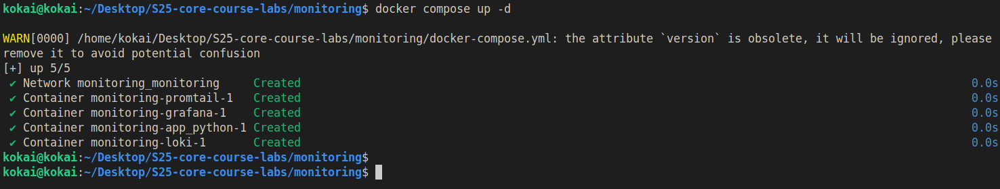
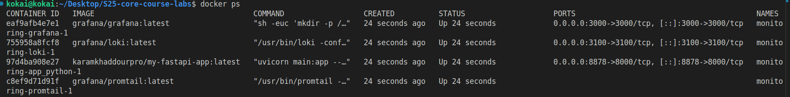
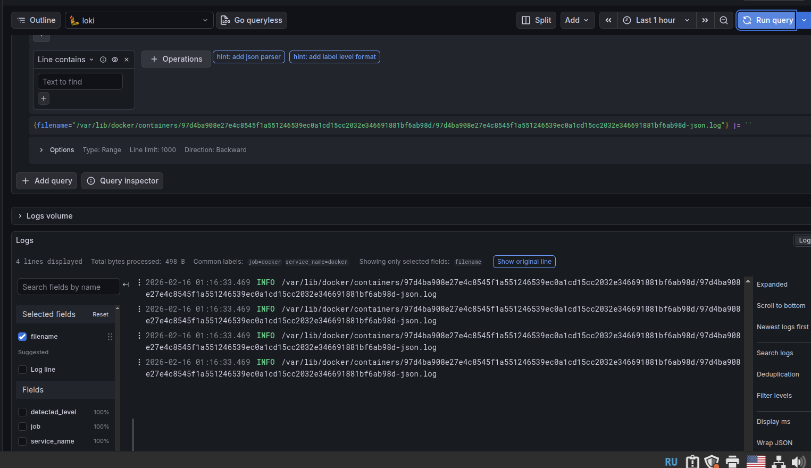
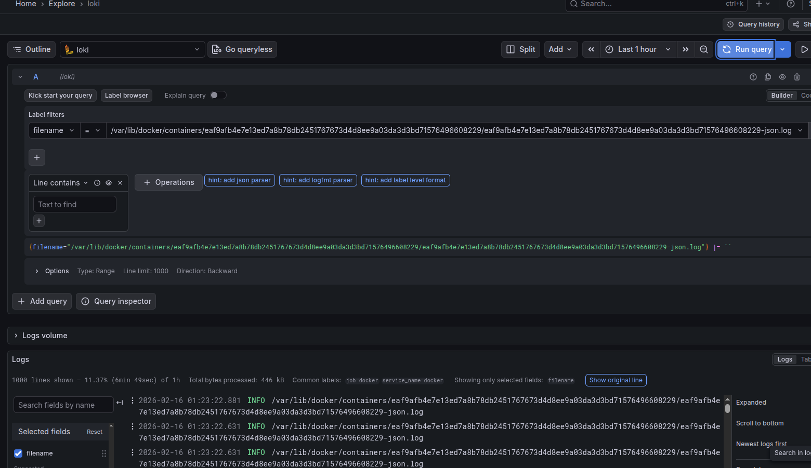
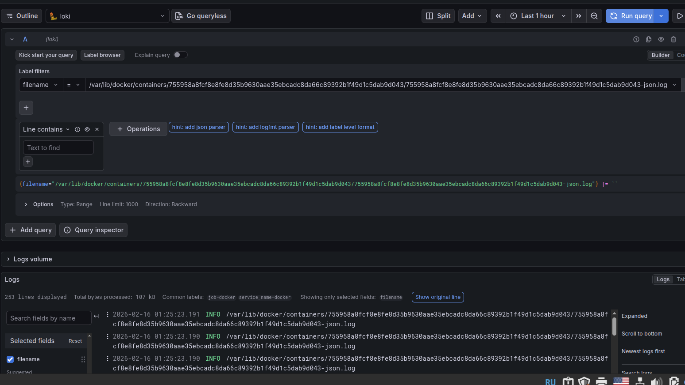
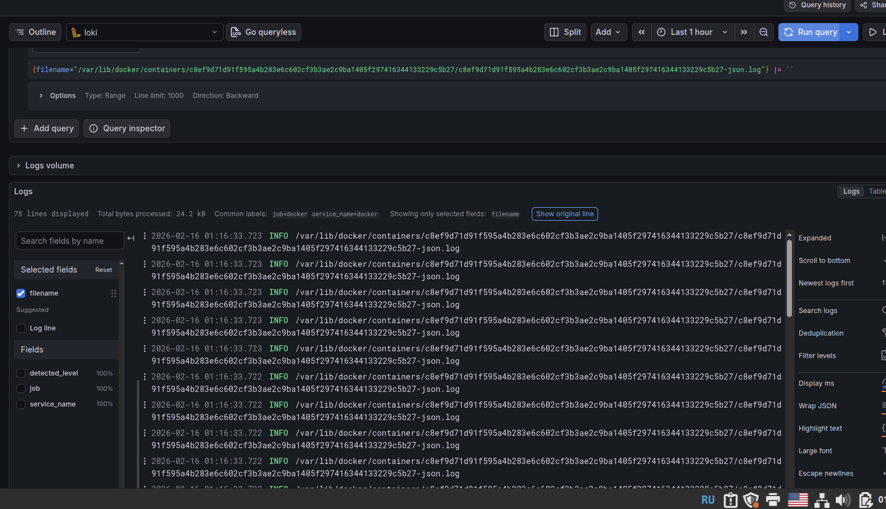

# Overview

The logging stack contains Loki, Promtail, and Grafana. which  enables efficient log collection and monitoring for debugging.

## Components

In this system, we have the following components (according to the docker-compose file):

- Grafana: This provides the dashboard for the monitoring system

- Loki: This is the log aggregation system that stores logs from the applications and let us query them

- Promtail: This is the agent that collects logs from the applications and sends them to Loki

- app_python: This is the python web app that returns the current Moscow Time

## Screenshots

### Running docker compose comand

### Active containers

### App Logs

### Grafana logs

### Loki logs

### Promtail logs

