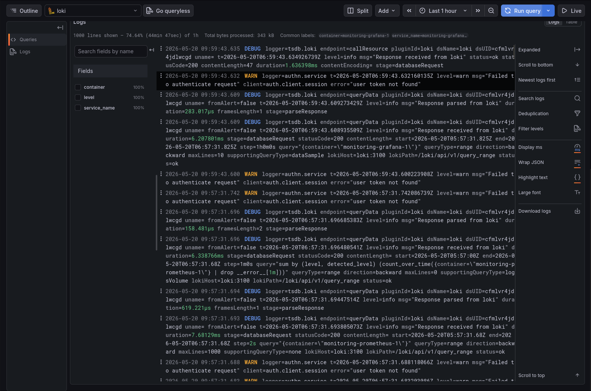
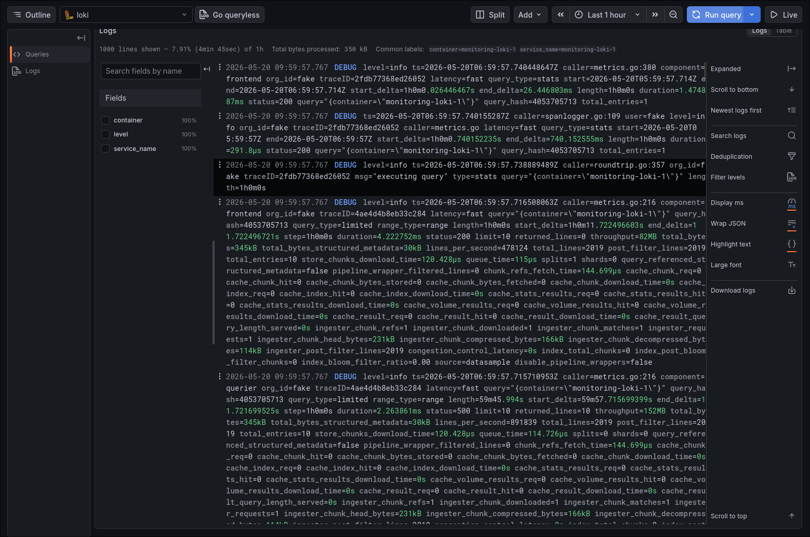
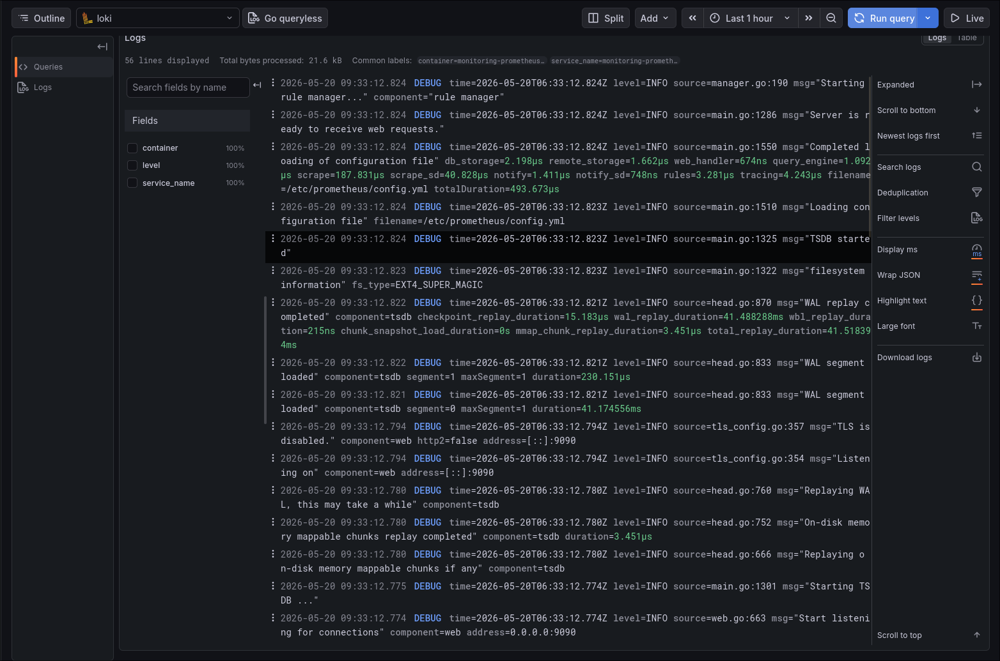
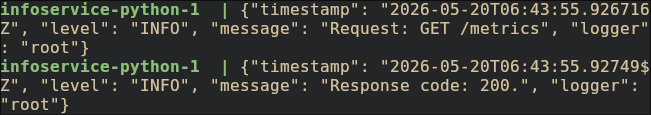
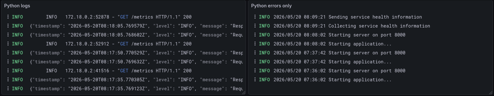
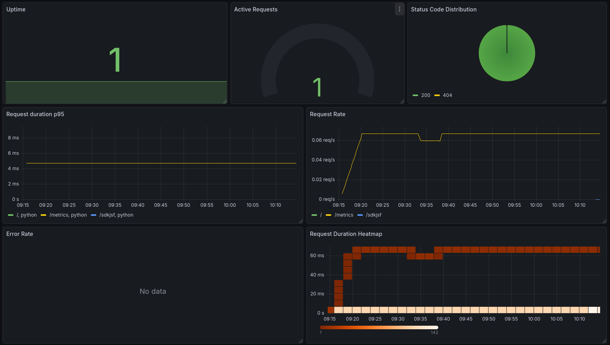
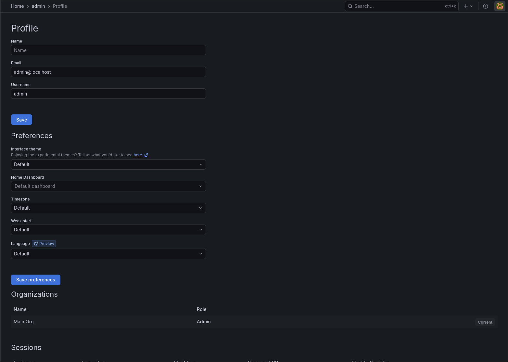

# Evidence
## Task 1

## Task 2

Log QL Queries used:
- `{container="monitoring-infoservice-python-1"} |= ""`
- `{container="monitoring-infoservice-python-1"} |= "ERROR"`
- `{container="monitoring-infoservice-python-1"} | json | __error__=''`

## Task 3

## Task 4

# Architecture
# Setup Guide
# Configuration
# Application Logging
# Dashboard
# Production Config
# Testing
# Challenges
- There is no `curl` in some images to check health, therefore had to use `wget` instead.
