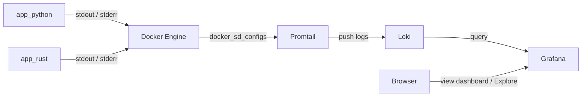
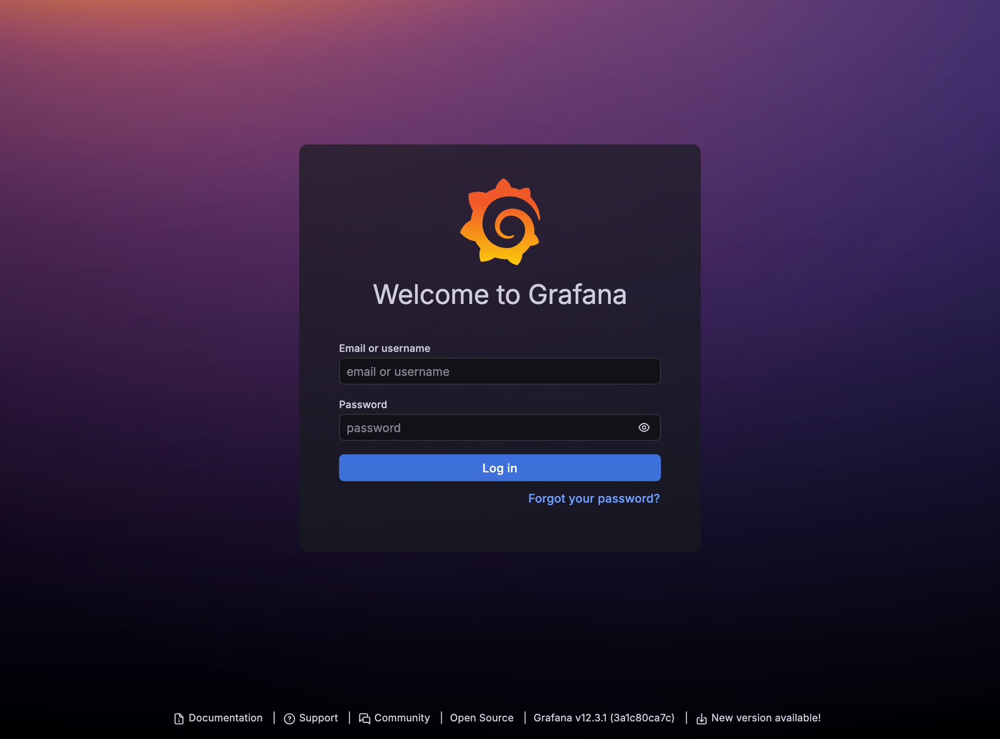
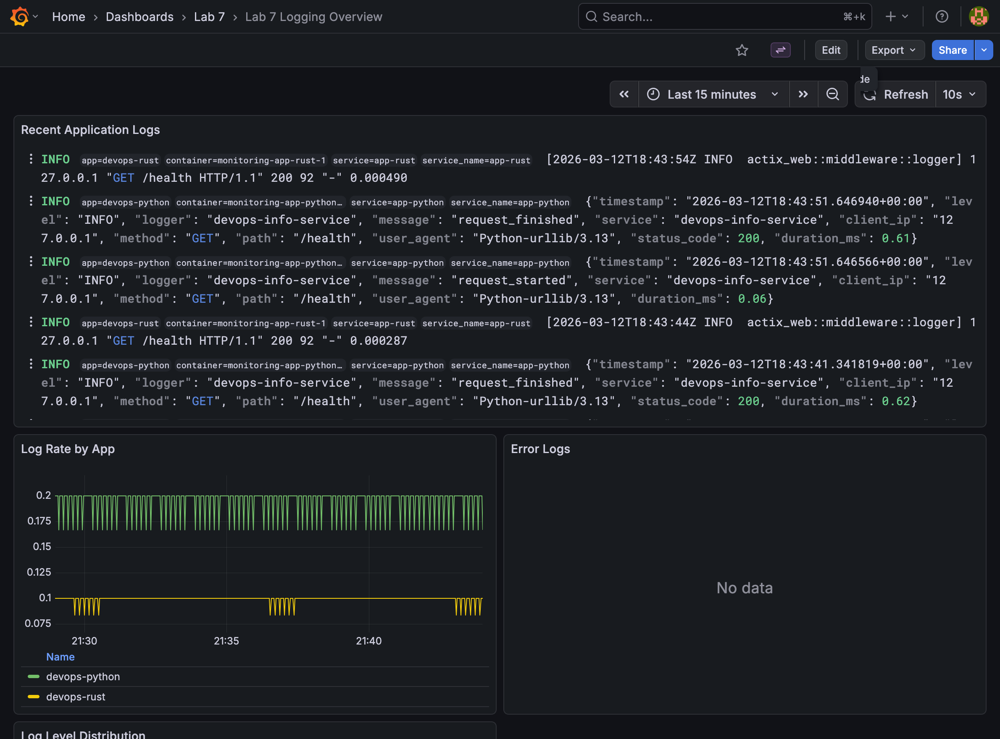

# Lab 07 - Observability and Logging with Loki Stack

## What I built

For this lab I put together a small logging stack around the two apps that already live in this repository:

- `app_python` sends structured JSON logs
- `app_rust` sends request logs through Actix middleware
- `Loki` stores the log streams
- `Promtail` discovers Docker containers and forwards their logs into Loki
- `Grafana` is pre-provisioned with a Loki data source and a ready-to-use dashboard

The main goal was to make logs useful instead of just visible. That meant adding labels, structured request data, a dashboard I can open right away, and health checks so the stack can be verified from `docker compose ps`.

## Architecture



## Project structure

```text
monitoring/
├── docker-compose.yml
├── .env.example
├── loki/
│   └── config.yml
├── promtail/
│   └── config.yml
├── grafana/
│   ├── dashboards/
│   │   └── logging-overview.json
│   └── provisioning/
│       ├── dashboards/
│       │   └── dashboard.yml
│       └── datasources/
│           └── loki.yml
└── docs/
    ├── LAB07.md
    └── screenshots/
        ├── grafana-dashboard.png
        └── grafana-login.png
```

## Setup guide

### 1. Prepare environment variables

```bash
cd monitoring
cp .env.example .env
```

The committed example keeps Grafana on the lab's default host port:

```env
GRAFANA_ADMIN_PASSWORD=change-me-lab7
GRAFANA_HOST_PORT=3000
```

### 2. Start the stack

```bash
docker compose up -d --build
```

### 3. Open Grafana

```text
http://127.0.0.1:3000
```

Login:

- user: `admin`
- password: value from `.env`

Grafana login page with anonymous access disabled:



## Configuration

### Loki

The Loki config uses the modern single-binary TSDB setup:

```yaml
schema_config:
  configs:
    - from: 2024-01-01
      object_store: filesystem
      schema: v13
      store: tsdb
      index:
        prefix: index_
        period: 24h

limits_config:
  retention_period: 168h

compactor:
  retention_enabled: true
```

Why this layout:

- `schema: v13` matches the recommended Loki 3.x storage schema
- `store: tsdb` keeps queries fast and simple for a single-node lab setup
- `object_store: filesystem` is enough for local development
- `retention_period: 168h` gives me the required 7-day retention window

### Promtail

Promtail is configured around Docker service discovery and a label filter:

```yaml
scrape_configs:
  - job_name: docker
    docker_sd_configs:
      - host: unix:///var/run/docker.sock
        refresh_interval: 5s
        filters:
          - name: label
            values:
              - logging=promtail
    pipeline_stages:
      - docker: {}
    relabel_configs:
      - source_labels: ["__meta_docker_container_label_app"]
        target_label: app
      - source_labels: ["__meta_docker_container_name"]
        regex: "/(.*)"
        target_label: container
```

Why this layout:

- only containers with `logging=promtail` are scraped
- the custom `app` label makes LogQL filters readable
- the container name is preserved for troubleshooting
- the Docker pipeline stage unwraps Docker log frames correctly

### Grafana provisioning

Grafana is not left to manual setup. It comes up with:

- a provisioned Loki data source (`uid: loki`)
- a provisioned folder called `Lab 7`
- a provisioned dashboard called `Lab 7 Logging Overview`

That made local testing much faster because I did not have to click through setup after every container recreate.

## Application logging

### Python app

The Python app now emits JSON lines with request context:

```json
{
  "timestamp": "2026-03-12T18:20:52.071786+00:00",
  "level": "INFO",
  "logger": "devops-info-service",
  "message": "request_finished",
  "service": "devops-info-service",
  "client_ip": "127.0.0.1",
  "method": "GET",
  "path": "/health",
  "user_agent": "Python-urllib/3.13",
  "status_code": 200,
  "duration_ms": 0.13
}
```

What I log:

- startup event
- request start
- request completion
- 404s
- uncaught 500s

The structured fields I kept most useful are:

- `method`
- `path`
- `status_code`
- `client_ip`
- `user_agent`
- `duration_ms`

### Rust app

The Rust app did not need full JSON logging for the lab, but it did need to contribute real request logs to Loki. I added Actix request logging middleware so both apps now appear in Grafana with live traffic instead of only startup logs.

Example Rust log line captured by Loki:

```text
[2026-03-12T18:15:52Z INFO  actix_web::middleware::logger] 192.168.97.1 "GET /health HTTP/1.1" 200 90 "curl/8.7.1" 0.000025
```

## Dashboard

The dashboard is provisioned automatically and contains the four required panels:

1. `Recent Application Logs`
   Query: `{app=~"devops-.*"}`

2. `Log Rate by App`
   Query: `sum by (app) (rate({app=~"devops-.*"}[1m]))`

3. `Error Logs`
   Query: `{app=~"devops-.*"} | json | level="ERROR"`

4. `Log Level Distribution`
   Query: `sum by (level) (count_over_time({app=~"devops-.*"} | json [5m]))`

Provisioned dashboard screenshot:



### LogQL queries I validated

These are the queries I tested against the running stack:

```logql
{app="devops-python"}
```

```logql
{app="devops-rust"}
```

```logql
{app="devops-python"} | json | status_code=404
```

```logql
sum by (app) (rate({app=~"devops-.*"}[1m]))
```

Observed result for the rate query during local traffic generation:

```json
[
  {"app": "devops-python", "value": "0.7166666666666667"},
  {"app": "devops-rust", "value": "0.3333333333333333"}
]
```

## Production configuration

I treated the compose stack as more than a demo:

- Grafana anonymous access is disabled
- admin password comes from `.env`, not from the compose file
- Loki retention is set to 7 days
- resource limits and reservations are defined for every service
- health checks are configured for Loki, Promtail, Grafana, and both apps

One detail worth calling out is the Rust app healthcheck. Because the container uses a distroless runtime, I did not want to add shell tools just to probe the service. Instead, the binary now supports `--healthcheck` and performs a lightweight HTTP check against its own `/health` endpoint. That kept the image clean and still let `docker compose ps` report healthy state.

## Testing

### Python unit tests

I ran the existing Python test suite in an isolated temporary virtual environment:

```bash
$ python3 -m venv /tmp/devops-lab7-venv
$ source /tmp/devops-lab7-venv/bin/activate
$ pip install -q -r requirements.txt -r requirements-dev.txt
$ pytest
============================= test session starts ==============================
collected 4 items

tests/test_app.py ....                                                   [100%]

============================== 4 passed in 0.27s ===============================
```

### Compose status

After the final rebuild, `docker compose ps` looked like this:

```bash
NAME                      IMAGE                    STATUS
monitoring-app-python-1   monitoring-app-python    Up (healthy)
monitoring-app-rust-1     monitoring-app-rust      Up (healthy)
monitoring-grafana-1      grafana/grafana:12.3.1   Up (healthy)
monitoring-loki-1         grafana/loki:3.0.0       Up (healthy)
monitoring-promtail-1     grafana/promtail:3.0.0   Up (healthy)
```

### Runtime checks

```bash
$ curl -sf http://127.0.0.1:3100/ready
ready

$ curl -sf http://127.0.0.1:3300/api/health
{
  "database": "ok",
  "version": "12.3.1",
  "commit": "3a1c80ca7ce612f309fdc99338dd3c5e486339be"
}
```

Promtail discovered all expected containers:

```text
devops-python
devops-rust
grafana
loki
promtail
```

Grafana API also confirms both the data source and dashboard provisioning:

```bash
$ curl -su admin:*** http://127.0.0.1:3300/api/datasources/name/Loki
```

Result:

```json
{"uid":"loki","name":"Loki","type":"loki","url":"http://loki:3100","isDefault":true}
```

```bash
$ curl -su admin:*** "http://127.0.0.1:3300/api/search?query=Lab%207%20Logging%20Overview"
```

Result:

```json
[{"uid":"lab7-logging-overview","title":"Lab 7 Logging Overview","type":"dash-db"}]
```

## Challenges

### Promtail image does not include `wget`

My first Promtail healthcheck copied the Loki/Grafana pattern and failed silently because the Promtail image does not ship with `wget`. I replaced it with a small `bash` + `/dev/tcp` probe against `/ready`, which works inside the stock image.

### Distroless Rust image made healthchecks less obvious

The Rust container uses a distroless runtime, which is good for production but leaves no shell utilities behind. Instead of abandoning healthchecks or bloating the image, I added a `--healthcheck` mode to the binary itself. That gave me a real healthcheck and kept the runtime clean.

## Result

The lab is complete in repository form:

- Loki, Promtail, and Grafana are defined in Docker Compose
- Loki uses TSDB with filesystem storage and 7-day retention
- Promtail collects logs from labeled Docker containers
- Python logging is structured JSON
- both apps are integrated into the stack
- Grafana is secured and pre-provisioned
- the required 4-panel dashboard is present
- local tests and runtime checks were executed successfully
