# Lab 7: Observability & Logging with Loki Stack - Submission

**Name:** Sergey Aitov  
**Date:** 2026-03-12  
**Lab Points:** 10 + 0

---

## 1. Architecture
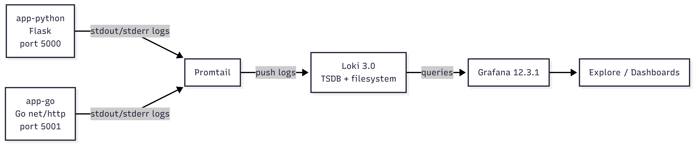

---

## 2. Setup Guide
1. Create a `docker-compose.yml` file with the Loki, Promtail, Grafana stack and two applications (`app_python`, `app_go`).
2. Configuring Loki according to the task conditions.
3. Configured Promtail according to the task conditions.
4. Updating Python and Go applications for structured JSON logging.
5. Deploy the stack with the `docker compose up -d` command::
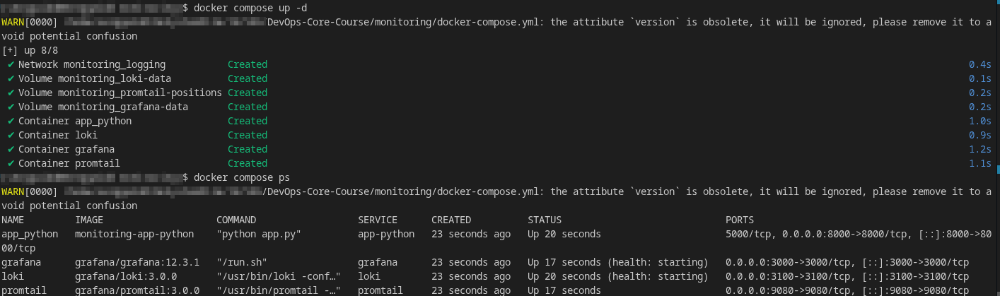
6. Checking services availability (commands `curl http://localhost:3100/ready` and `curl http://localhost:9080/targets`):
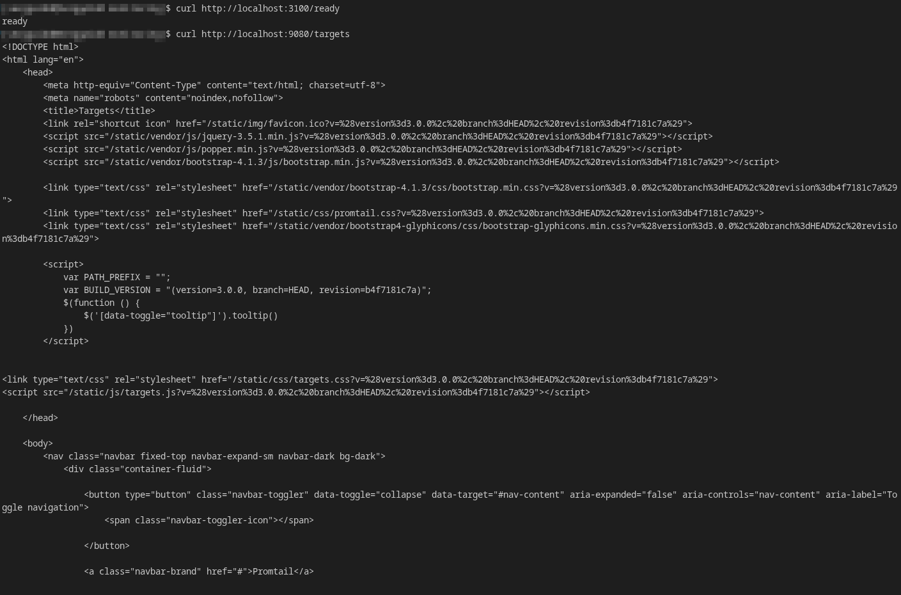
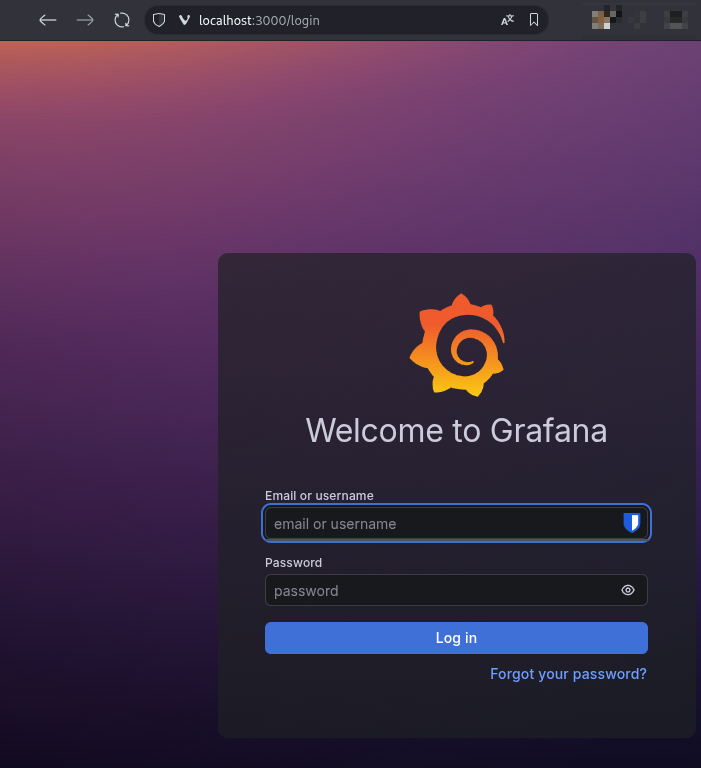
7. Adding the Loki data source to Grafana with the URL `http://loki:3100`:
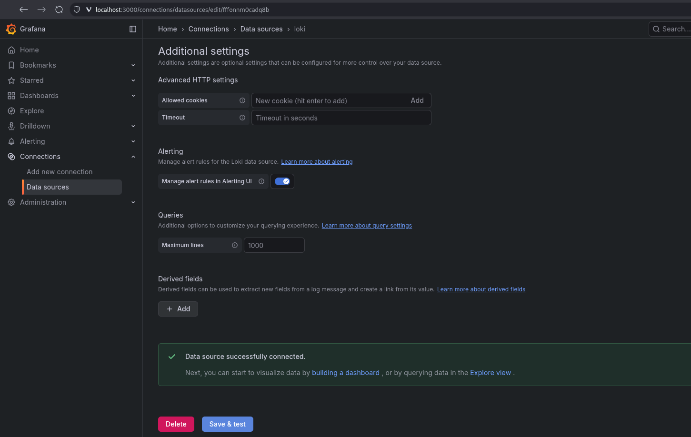
8. Checking the execution of test LogQL queries in Grafana Explore:
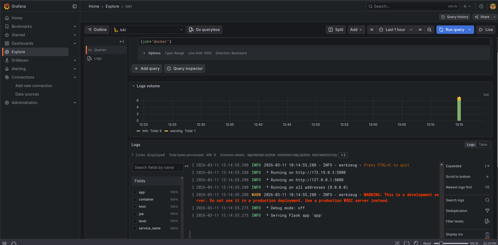
9. Creating a dashboard from 4 visualization panels:
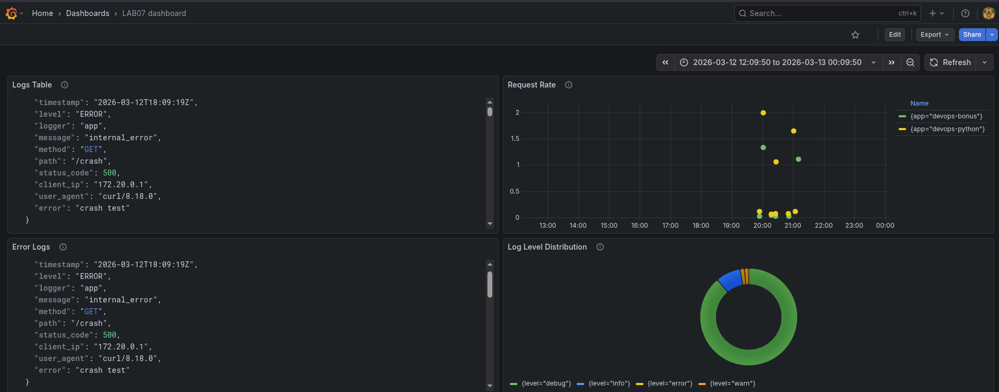
---

## 3. Configuration
### Loki Configuration
#### What was used
- `auth_enabled: false` — simplification for a local setup.
- `store: tsdb`, `schema: v13` — current Loki 3.x schema.
- `filesystem` — sufficient for a single-instance setup.
- `retention_period: 168h` — 7-day log retention.
- `compactor` — required to delete old logs during retention.
#### Snippet
```yaml
auth_enabled: false

common:
  path_prefix: /loki
  storage:
    filesystem:
      chunks_directory: /loki/chunks
      rules_directory: /loki/rules

limits_config:
  retention_period: 168h
  allow_structured_metadata: true

schema_config:
  configs:
    - from: 2024-01-01
      store: tsdb
      object_store: filesystem
      schema: v13
```

### Promtail Configuration
#### What was used
- `docker_sd_configs` automatically detects Docker containers.
- `filters` limits log collection to only relevant containers.
- `docker:{}` correctly unpacks the Docker log envelope.
- `relabel_configs` creates convenient Loki labels (`container`, `app`, `job`).
#### Snippet
```yaml
clients:
  - url: http://loki:3100/loki/api/v1/push
    external_labels:
      host: monitoring

scrape_configs:
  - job_name: docker
    docker_sd_configs:
      - host: unix:///var/run/docker.sock
        refresh_interval: 5s
        filters:
          - name: label
            values: ["logging=promtail"]

    pipeline_stages:
      - docker: {}

    relabel_configs:
      - source_labels: ['__meta_docker_container_name']
        regex: '/(.*)'
        target_label: 'container'
      - source_labels: ['__meta_docker_container_label_app']
        target_label: 'app'
      - target_label: 'job'
        replacement: 'docker'
```
---

## 4. Application Logging

### Python App (`devops-python`)
The Flask application implemented its own `JSONFormatter`, which serializes log entries into JSON. The following events are logged:
- Application startup;
- Request start (`request_started`);
- Request completion (`request_finished`);
- 404 (`not_found`);
- 500 (`internal_error`).

#### Example log entry:
```json
{
  "timestamp": "2026-03-12T17:25:07Z",
  "level": "INFO",
  "logger": "app",
  "message": "request_finished",
  "method": "GET",
  "path": "/health",
  "status_code": 200,
  "client_ip": "172.20.0.1",
  "user_agent": "curl/8.18.0"
}
```

#### LogQL Query Proofs:
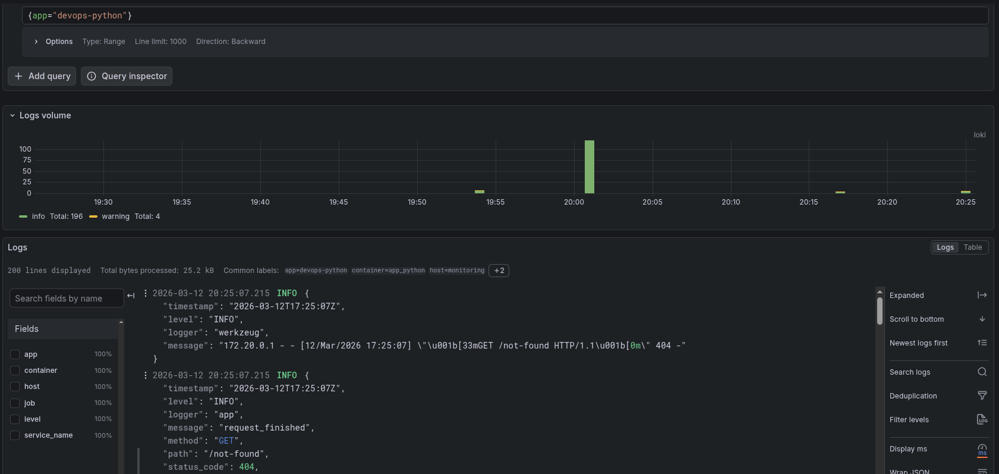
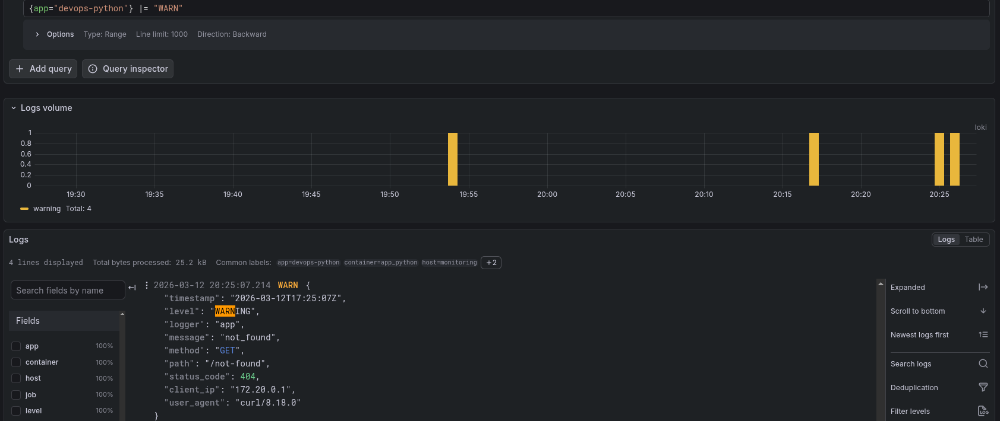  
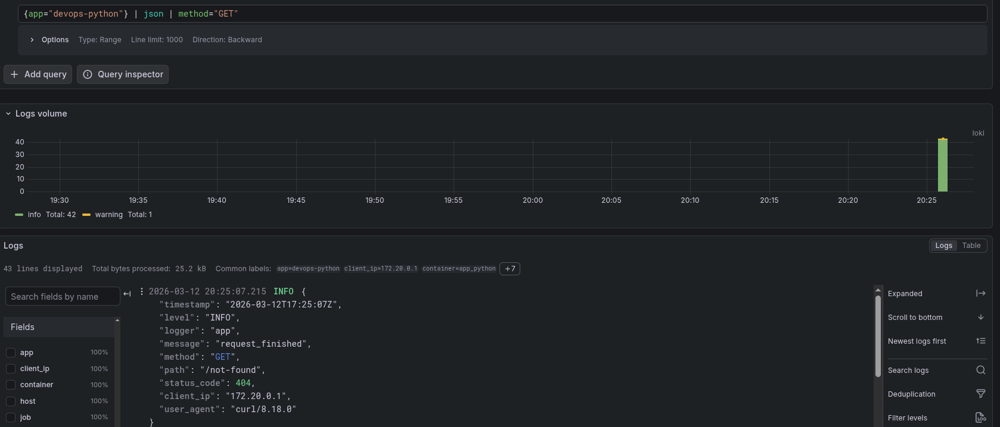

### Go App (`devops-bonus`)
In the Go application, the regular `log.Printf` was replaced with the `logJSON` function, which writes the log string as JSON to stdout. The following are logged:
- `application_started`;
- `server_listening`;
- `request_started`;
- `request_finished`;
- `not_found`;
- `internal_error` in panic recovery middleware.

#### Example log entry:
```json
{
  "timestamp": "2026-03-12T17:16:13Z",
  "level": "WARN",
  "logger": "app",
  "message": "not_found",
  "method": "GET",
  "path": "/not-found",
  "status_code": 404,
  "client_ip": "172.20.0.1",
  "user_agent": "curl/8.18.0"
}
```

#### LogQL Query Proofs:
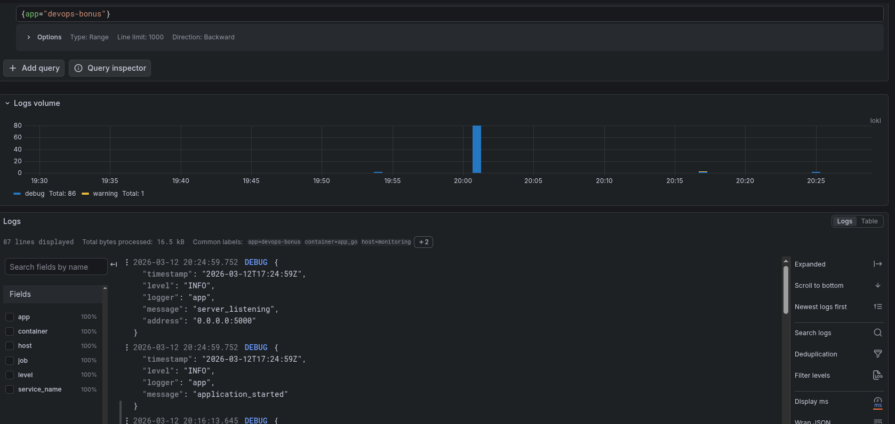
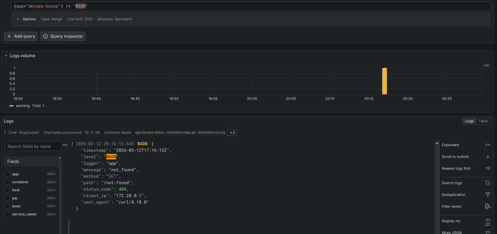
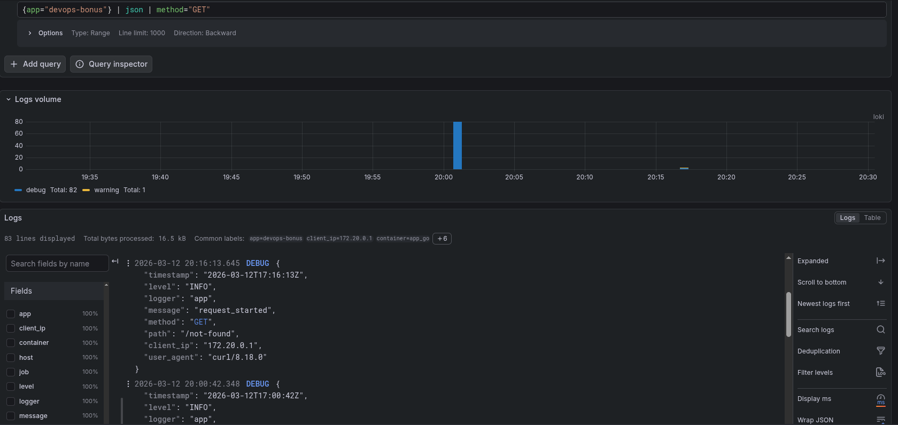


### Both applications visible in Grafana:  
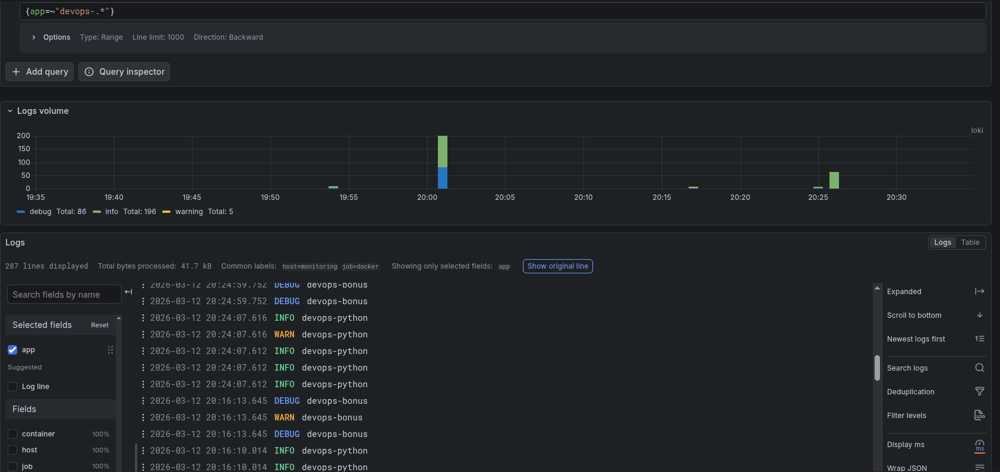

---

## 5. Dashboard
### Dashboard Overview
In Grafana, a dashboard named `LAB07 dashboard` was created, consisting of 4 panels that cover the basic observability tasks for the application.

### Panel 1 — Logs Table
- **Visualization:** Logs  
- **Purpose:** Show recent logs from all apps  
- **Query:** `{app=~"devops-.*"}`

### Panel 2 — Request Rate
- **Visualization:** Time series  
- **Purpose:** Show logs per second by app 
- **Query:**  `sum by (app) (rate({app=~"devops-.*"}[1m]))`

### Panel 3 — Error Logs
- **Visualization:** Logs  
- **Purpose:** Show only ERROR level logs (generated specialty with help of `/crash` endpoints) 
- **Primary query used for validation:** `{app=~"devops-.*"} | json | level="error"`

### Panel 4 — Log Level Distribution
- **Visualization:** Pie chart  
- **Purpose:** Count logs by level (INFO, ERROR, etc.)  
- **Query:** `sum by (level) (count_over_time({app=~"devops-.*"} | json [5m]))`
---

## 6. Production Config

### Resource Limits
`deploy.resources.limits` and `deploy.resources.reservations` were added for all services to estimate CPU and memory consumption. This is too low a risk of one container hogging resources from others.

#### Snippet
```yaml
deploy:
  resources:
    limits:
      cpus: "1.00"
      memory: 1G
    reservations:
      cpus: "0.25"
      memory: 256M
```

### Security Measures
Anonymous access was disabled for Grafana; secrets were moved to `.env`, which was added to `.gitignore` to prevent credentials from being committed to the repository.

#### Snippet
```yaml
environment:
  GF_AUTH_ANONYMOUS_ENABLED: "false"
  GF_SECURITY_ADMIN_USER: "${GRAFANA_ADMIN_USER}"
  GF_SECURITY_ADMIN_PASSWORD: "${GRAFANA_ADMIN_PASSWORD}"
```


### Retention
Loki was set to a 7-day retention period.

#### Snippet
```yaml
limits_config:
  retention_period: 168h
```

### Health Checks
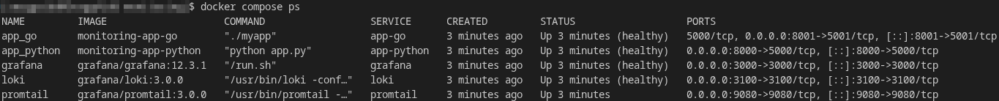
---

## 7. Testing
### Service Verification Commands
```bash
docker compose up -d --build
docker compose ps
curl http://localhost:3100/ready
curl http://localhost:9080/targets
curl http://localhost:8000/health
curl http://localhost:8001/health
```

### Traffic Generation Commands
```bash
for i in {1..15}; do curl http://localhost:8000/; done
for i in {1..15}; do curl http://localhost:8000/health; done
curl http://localhost:8000/not-found
curl http://localhost:8000/crash

for i in {1..15}; do curl http://localhost:8001/; done
for i in {1..15}; do curl http://localhost:8001/health; done
curl http://localhost:8001/not-found
curl http://localhost:8001/crash
```

### Manual Verification in Grafana
1. Verify that the Loki datasource is connected.
2. Run LogQL queries in Explore.
3. Ensure that logs for both applications are visible.
4. Ensure that the dashboard is populated with real data.
5. Verify that the Error panel contains `internal_error` events.


---

## 8. Challenges

### 1. Promtail streams were rejected by Loki
**Problem:** Loki returned `400 Bad Request: at least one label pair is required per stream`.

**Reason:** In an earlier version of the configuration, Promtail didn't send any regular label pairs to the stream.

**Solution:** `external_labels`, `relabel_configs`, and the `app` / `container` labels were added.

### 2. Logs were visible, but field filtering did not work
**Problem:** Requests like `| json | method="GET"` did not work.

**Reason:** The application continued to write some logs in plain text, not JSON.

**Solution:** Python and Go applications were rewritten to use structured JSON logging.

### 3. Error filtering in Loki required normalization of log levels
**Problem:** A direct filter on `level="ERROR"` initially failed, even though error events were present in the logs.

**Reason:** In JSON logs, the error level was ultimately interpreted as lowercase, so filtering by the `ERROR` value did not match the actual field content.

**Solution:** After checking the logs in Grafana, the correct query `{app=~"devops-.*"} | json | level="error"` was used, which successfully filtered out error events.

---

## Summary

**Results:** A centralized logging stack based on Loki, Promtail, and Grafana was deployed, two container applications were integrated, structured JSON logging was implemented, logs were visualized in the Grafana dashboard, and production-oriented settings (security, health checks, resource limits, retention) were added.

**Total time spent:** ~6 hours (configuration, JSON logging refactor, LogQL debugging, dashboard creation, production readiness fixes).

**Key learnings:**
- How the Loki + Promtail + Grafana stack is structured;
- Why labels and structured logs are different levels of observability;
- How LogQL works with stream selectors, text filters, and JSON parsing;
- How to build a dashboard from logs, not just look at raw records;
- How to quickly find problems in the logging stack using `docker compose ps`, `docker inspect`, `curl`, and Grafana Explore.