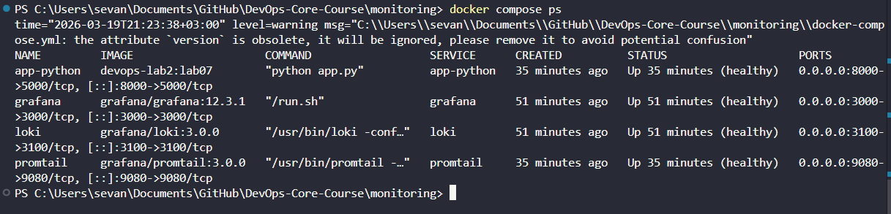
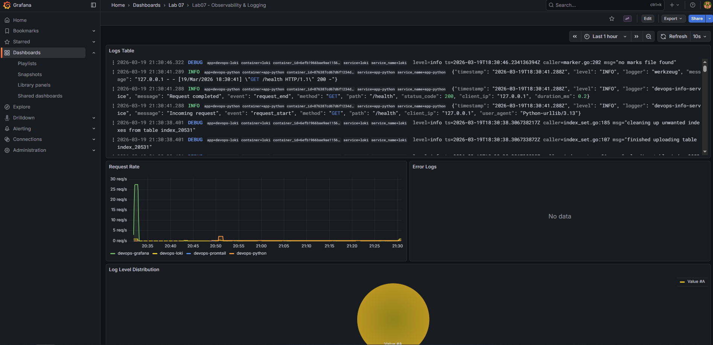
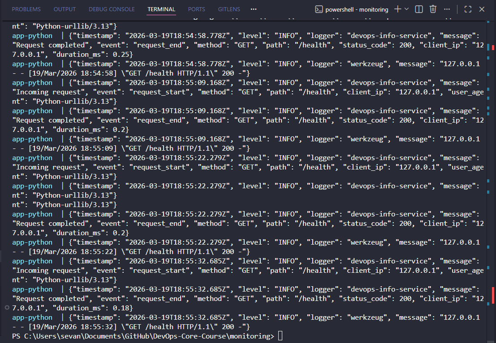
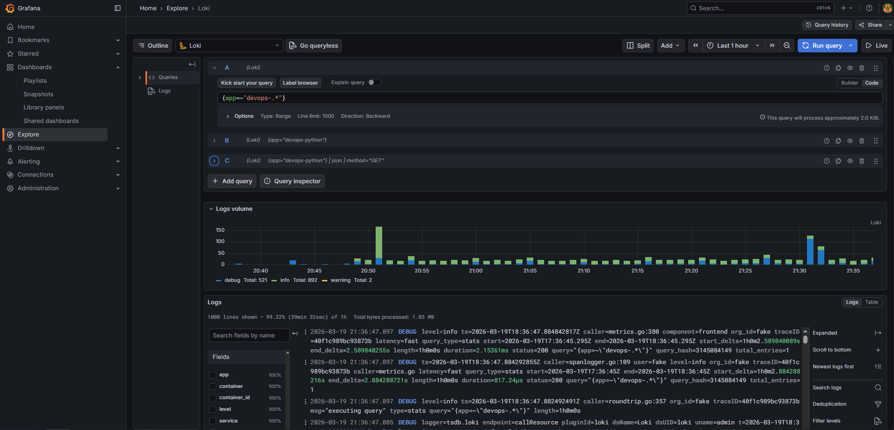
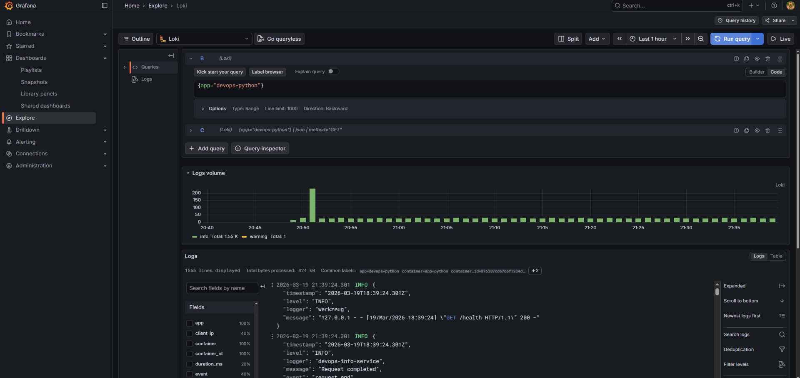
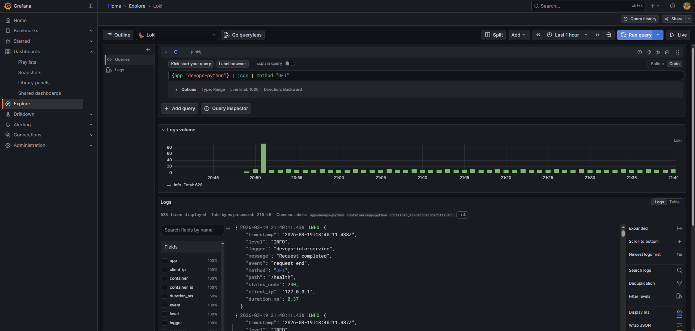
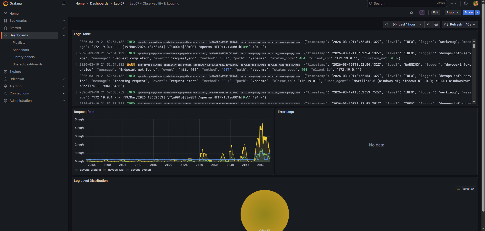

# LAB07 - Observability & Logging with Loki Stack

## 1. Architecture

```text
                 +-------------------------+
                 |         Grafana         |
                 |  :3000 (Dashboards)     |
                 +------------+------------+
                              |
                              | LogQL queries
                              v
                 +-------------------------+
                 |          Loki           |
                 |   :3100 (Log Storage)   |
                 +------------+------------+
                              ^
                              | /loki/api/v1/push
                              |
                 +------------+------------+
                 |        Promtail         |
                 | :9080 + Docker SD       |
                 +-----+-----------+-------+
                       |           |
        Docker socket  |           | Container log files
                       |           |
          +------------+-----------+------------+
          |                                     |
 +--------+---------+                  +--------+---------+
 | app-python:8000  |                  | grafana/loki/... |
 | JSON application |                  | infra containers  |
 +------------------+                  +------------------+
```

Architecture notes:
- `Promtail` discovers containers via Docker socket and reads container log files.
- Only containers with label `logging=promtail` are scraped.
- `Loki` stores logs with TSDB schema `v13` on local filesystem volume.
- `Grafana` queries Loki via LogQL and shows both Explore and dashboard panels.

## 2. Setup Guide

1. Open `monitoring` directory.
2. Create secrets file:

```bash
cd monitoring
cp .env.example .env
# set a strong password in .env
```

3. Start stack:

```bash
docker compose up -d
docker compose ps
```

4. Verify endpoints:

```bash
curl http://localhost:3100/ready
curl http://localhost:9080/targets
curl http://localhost:3000/api/health
curl http://localhost:8000/health
```

5. Open Grafana: `http://localhost:3000` and login with `.env` credentials.

## 3. Configuration

### Loki (`monitoring/loki/config.yml`)
- Uses `tsdb` + `filesystem` storage.
- Uses schema `v13`.
- Retention is set to `168h` (7 days).
- Compactor is enabled for retention cleanup.
- `schema_config.configs[].from` is set to `"2024-01-01"` for stable v13 schema activation.

### Promtail (`monitoring/promtail/config.yml`)
- Sends logs to `http://loki:3100/loki/api/v1/push`.
- Uses `docker_sd_configs` for container discovery.
- Uses label filter `logging=promtail` to collect only tagged containers.
- Relabeling maps:
  - container name to `container`
  - app label to `app`
  - compose service to `service`

### Grafana provisioning
- Data source provisioned from `monitoring/grafana/provisioning/datasources/datasources.yml`.
- Dashboard provider points to `monitoring/grafana/dashboards/`.
- Dashboard is preloaded from `lab07-logs-dashboard.json`.
- Anonymous access is disabled; login is required.

## 4. Application Logging

`Lab-1/app_python/app.py` now logs in JSON format using a custom `JSONFormatter`.

Logged events:
- `startup` (app boot info)
- `request_start` (method/path/client/user-agent)
- `request_end` (status + request duration)
- `http_404` and `http_500` errors

Example log:

```json
{"timestamp":"2026-03-19T01:20:00.123Z","level":"INFO","logger":"devops-info-service","message":"Request completed","event":"request_end","method":"GET","path":"/health","status_code":200,"client_ip":"127.0.0.1","duration_ms":2.53}
```

## 5. Dashboard

Dashboard file: `monitoring/grafana/dashboards/lab07-logs-dashboard.json`

Panels:
1. Logs Table  
Query: `{app=~"devops-.*"}`
2. Request Rate (time series)  
Query: `sum by (app) (rate({app=~"devops-.*"}[1m]))`
3. Error Logs  
Query: `{app=~"devops-.*"} | json | level="ERROR"`
4. Log Level Distribution (pie chart)  
Query: `sum by (level) (count_over_time({app=~"devops-.*"} | json [5m]))`

Additional useful LogQL examples:

```logql
{app="devops-python"}
{app="devops-python"} |= "ERROR"
{app="devops-python"} | json | method="GET"
```

## 6. Production Config

Implemented in `monitoring/docker-compose.yml`:
- Resource limits and reservations for all services (`deploy.resources`).
- Per-service limits:
  - Loki: `cpus: 1.0`, `memory: 1G`
  - Promtail: `cpus: 0.5`, `memory: 512M`
  - Grafana: `cpus: 1.0`, `memory: 1G`
  - app-python: `cpus: 0.5`, `memory: 512M`
- Grafana anonymous access is disabled:
  - `GF_AUTH_ANONYMOUS_ENABLED=false`
- Admin credentials loaded from `.env` (`GRAFANA_ADMIN_PASSWORD`).
- Healthchecks for Loki, Promtail, Grafana, and app-python.
- Retention policy in Loki: `168h` (7 days).

## 7. Testing

Validation date: **2026-03-19**

Command:

```powershell
docker compose ps
```

Result:
- `app-python` - `Up ... (healthy)`
- `grafana` - `Up ... (healthy)`
- `loki` - `Up ... (healthy)`
- `promtail` - `Up ... (healthy)`

Command:

```powershell
docker compose logs app-python --tail=20
```

Result:
- JSON logs confirmed.
- Structured fields observed: `timestamp`, `level`, `logger`, `message`, `event`, `method`, `path`, `status_code`, `client_ip`, `duration_ms`.

Command:

```powershell
curl http://localhost:3100/ready
```

Result:
- HTTP 200
- Response body: `ready`

Command:

```powershell
curl http://localhost:3000/api/health
```

Result:
- HTTP 200
- Grafana health response includes `database: ok`

Command:

```powershell
curl http://localhost:3100/loki/api/v1/label/app/values
```

Result:
- HTTP 200
- Loki labels received: `devops-grafana`, `devops-loki`, `devops-promtail`, `devops-python`

Command:

```powershell
curl http://localhost:9080/targets
```

Result:
- HTTP 200 (Promtail targets UI HTML page)
- Ready targets visible for Docker job

## 8. Challenges

1. Docker label-based filtering  
Promtail was configured to scrape only `logging=promtail` containers to reduce noise.

2. Structured logs from Flask  
A custom JSON formatter was added to keep logs machine-readable and searchable in LogQL.

3. Repeatable setup  
Grafana data source and dashboard were provisioned from files to avoid manual UI setup.

4. Docker Compose warning  
`docker compose` prints warning that `version` is obsolete in v2 CLI. This warning does not affect stack functionality.

## 9. Bonus - Ansible Automation

Added role and playbook:
- `ansible/roles/monitoring`
- `ansible/playbooks/deploy-monitoring.yml`

Role behavior:
- creates monitoring directories on target host
- renders templated Loki/Promtail/Compose/Grafana provisioning files
- writes `.env` with Grafana admin credentials
- deploys stack with `community.docker.docker_compose_v2`
- waits for ports and health endpoints
- verifies Loki datasource exists in Grafana API

Run:

```bash
cd ansible
ansible-playbook playbooks/deploy-monitoring.yml --vault-id @prompt
ansible-playbook playbooks/deploy-monitoring.yml --vault-id @prompt
```

Expected second run: idempotent (`changed=0` for already converged state).

## Evidence Checklist

- `monitoring/docker-compose.yml` includes Loki/Promtail/Grafana + app.
- Loki data source is provisioned automatically.
- Python app logs are JSON.
- Dashboard with 4 panels is provisioned.
- Resource limits, health checks, and Grafana auth hardening are present.

## 10. Screenshots

### Docker stack health


### Grafana Loki data source


### JSON logs from app-python


### LogQL query examples




### Dashboard with 3 panels

