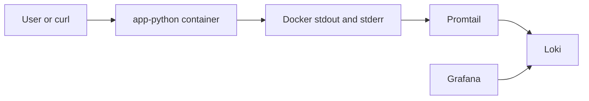
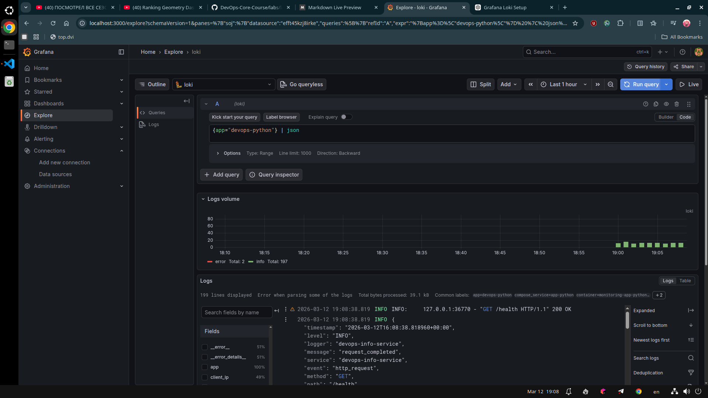
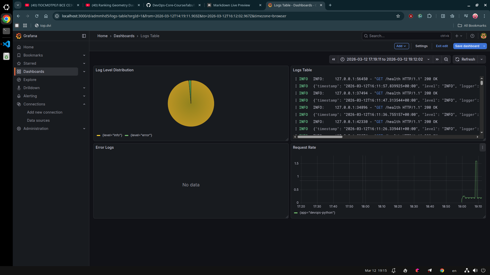
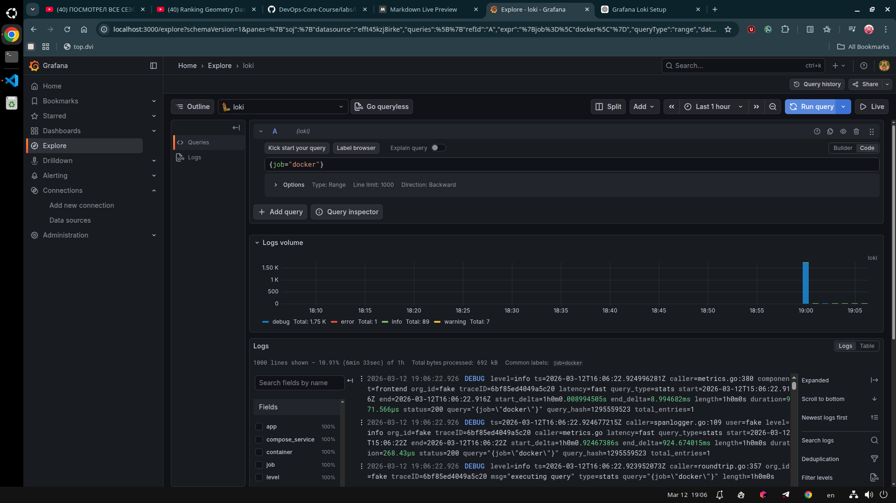

# Lab 07 - Observability and Logging with Loki Stack

## Status

Main lab work is implemented in `monitoring/` and integrated with the FastAPI app from `app_python/`.

Current state captured during this lab:

- Loki, Grafana, and `app-python` were running and healthy
- Promtail was forwarding logs to Loki successfully
- In one captured `docker compose ps` snapshot, Promtail still showed `unhealthy`
- Only the Python app was integrated because this repository does not contain a second lab01 bonus app

This report documents the implemented stack, the working evidence that exists in this repository, and the remaining health-check caveat honestly.

## 1. Architecture



### Component roles

- `app-python`: emits structured JSON logs to stdout
- `Promtail`: discovers Docker containers through `docker_sd_configs`, filters containers by label, and forwards logs to Loki
- `Loki`: stores log streams indexed by labels such as `job`, `app`, and `container`
- `Grafana`: queries Loki with LogQL and visualizes the results in Explore and dashboards

### Why Loki instead of Elasticsearch in this lab

Loki indexes labels, not the entire log body. That makes it lighter for a course lab and forces cleaner logging discipline:

- stable metadata becomes labels
- dynamic request data stays in the JSON payload
- query-time parsing happens with `| json`

### Labels used in this setup

Stable labels extracted or assigned in the stack:

- `job="docker"`
- `app="devops-python"` for the application
- `app="loki"`, `app="promtail"`, `app="grafana"` for the stack services
- `container`
- `compose_service`
- `stream`

Fields intentionally left inside the JSON body:

- `client_ip`
- `path`
- `method`
- `status_code`
- `duration_ms`
- `user_agent`

This keeps Loki label cardinality under control.

## 2. Setup Guide

The monitoring stack is implemented in:

```text
monitoring/
├── .env
├── .gitignore
├── docker-compose.yml
├── loki/config.yml
├── promtail/config.yml
└── docs/
    ├── LAB07.md
    └── screenshots/
```

### Deployment commands

```bash
cd monitoring
docker compose up -d --build
docker compose ps
```

### Verification commands

```bash
curl http://localhost:3100/ready
curl http://localhost:9080/targets
curl http://localhost:3000/api/health
curl http://localhost:8000/health
```

### Captured compose status

```text
(.venv) ✔ ~/IU/DevOps/DevOps-Core-Course/monitoring [lab07 L|● 7✚ 1…1]
19:15 $ docker compose ps
NAME                      IMAGE                       COMMAND                  SERVICE      CREATED          STATUS                      PORTS
monitoring-app-python-1   devops-info-service:lab07   "python app.py"          app-python   16 minutes ago   Up 16 minutes (healthy)     0.0.0.0:8000->5000/tcp
monitoring-grafana-1      grafana/grafana:12.3.1      "/run.sh"                grafana      16 minutes ago   Up 16 minutes (healthy)     0.0.0.0:3000->3000/tcp
monitoring-loki-1         grafana/loki:3.0.0          "/usr/bin/loki -conf…"   loki         16 minutes ago   Up 16 minutes (healthy)     0.0.0.0:3100->3100/tcp
monitoring-promtail-1     grafana/promtail:3.0.0      "/usr/bin/promtail -…"   promtail     16 minutes ago   Up 16 minutes (unhealthy)   0.0.0.0:9080->9080/tcp
```

### Grafana data source setup

Inside Grafana the Loki data source is configured with:

- URL: `http://loki:3100`
- authentication: default local Grafana login from `.env`

The important detail is that Grafana uses the Compose service name `loki`, not `localhost`, because communication happens inside the Docker network.

## 3. Configuration

### 3.1 Docker Compose

The stack is defined in `monitoring/docker-compose.yml` and includes:

- `grafana/loki:3.0.0`
- `grafana/promtail:3.0.0`
- `grafana/grafana:12.3.1`
- locally built `devops-info-service:lab07`

Key choices:

- named volumes for Loki, Grafana, and Promtail positions
- a dedicated bridge network called `logging`
- Docker labels so Promtail can filter only intended containers
- health checks and resource limits on every service
- Grafana anonymous access disabled

Relevant snippet:

```yaml
labels:
  logging: "promtail"
  app: "devops-python"
```

```yaml
environment:
  GF_AUTH_ANONYMOUS_ENABLED: "false"
  GF_USERS_ALLOW_SIGN_UP: "false"
  GF_SECURITY_ADMIN_USER: "${GRAFANA_ADMIN_USER}"
  GF_SECURITY_ADMIN_PASSWORD: "${GRAFANA_ADMIN_PASSWORD}"
```

```yaml
networks:
  logging:
    driver: bridge
    ipam:
      config:
        - subnet: ${MONITORING_SUBNET:-172.29.50.0/24}
```

The explicit subnet was added after Docker initially failed to create the Compose network because the default address pools were exhausted.

### 3.2 Loki

The Loki configuration uses a single-node filesystem-backed TSDB layout:

- `schema: v13`
- `store: tsdb`
- `object_store: filesystem`
- `retention_period: 168h`

Key snippet:

```yaml
common:
  path_prefix: /loki
  replication_factor: 1
  ring:
    kvstore:
      store: inmemory
  storage:
    filesystem:
      chunks_directory: /loki/chunks
      rules_directory: /loki/rules
```

```yaml
schema_config:
  configs:
    - from: 2024-01-01
      store: tsdb
      object_store: filesystem
      schema: v13
      index:
        prefix: index_
        period: 24h
```

```yaml
limits_config:
  retention_period: 168h

compactor:
  working_directory: /loki/compactor
  compaction_interval: 10m
  retention_enabled: true
  delete_request_store: filesystem
```

Why this matters:

- TSDB is the recommended storage mode for Loki 3.x
- `filesystem` is sufficient for a local course lab
- the compactor plus retention settings enforce 7-day cleanup

### 3.3 Promtail

Promtail uses Docker service discovery and relabeling:

```yaml
scrape_configs:
  - job_name: docker
    docker_sd_configs:
      - host: unix:///var/run/docker.sock
        refresh_interval: 5s
        filters:
          - name: label
            values: ["logging=promtail"]
```

```yaml
relabel_configs:
  - source_labels: ["__meta_docker_container_name"]
    regex: "/(.*)"
    target_label: container
  - source_labels: ["__meta_docker_container_label_app"]
    target_label: app
  - source_labels: ["__meta_docker_container_label_com_docker_compose_service"]
    target_label: compose_service
  - source_labels: ["__meta_docker_container_log_stream"]
    target_label: stream
  - target_label: job
    replacement: docker
```

Why this matters:

- only labeled containers are scraped
- container metadata becomes searchable Loki labels
- application request fields stay in the JSON log body and are parsed later with LogQL

## 4. Application Logging

The Python app in `app_python/app.py` was updated to emit structured JSON logs using the standard `logging` module.

### What changed

- a custom `JsonFormatter` writes one JSON object per log line
- startup is logged with host, port, and debug configuration
- HTTP requests are logged through FastAPI middleware
- `4xx` and `5xx` responses are written at `ERROR` level

### Important fields in each log line

- `timestamp`
- `level`
- `logger`
- `message`
- `service`
- `method`
- `path`
- `status_code`
- `client_ip`
- `duration_ms`
- `user_agent`

### Implementation excerpt

```python
class JsonFormatter(logging.Formatter):
    def format(self, record: logging.LogRecord) -> str:
        payload: dict[str, object] = {
            "timestamp": datetime.now(timezone.utc).isoformat(),
            "level": record.levelname,
            "logger": record.name,
            "message": record.getMessage(),
            "service": "devops-info-service",
        }
        ...
        return json.dumps(payload, ensure_ascii=True)
```

```python
@app.middleware("http")
async def log_requests(request: Request, call_next):
    ...
    log_method = logger.error if response.status_code >= 400 else logger.info
    log_method(
        "request_completed",
        extra={
            "event": "http_request",
            "method": request.method,
            "path": request.url.path,
            "status_code": response.status_code,
            "client_ip": client_ip,
            "duration_ms": duration_ms,
            "user_agent": user_agent,
        },
    )
```

### Result

The app now produces logs that can be parsed directly in Grafana with:

```logql
{app="devops-python"} | json
```

This is visible in the Explore screenshot below.



## 5. Dashboard

The Grafana dashboard contains the four panels required by the lab.

### Panel 1 - Logs Table

Purpose:

- show recent logs from the application

Query:

```logql
{app=~"devops-.*"}
```

### Panel 2 - Request Rate

Purpose:

- show log volume per second by application

Query:

```logql
sum by (app) (rate({app=~"devops-.*"}[1m]))
```

### Panel 3 - Error Logs

Purpose:

- filter only application logs marked as `ERROR`

Query:

```logql
{app=~"devops-.*"} | json | level="ERROR"
```

### Panel 4 - Log Level Distribution

Purpose:

- aggregate parsed JSON logs by log level

Query:

```logql
sum by (level) (count_over_time({app=~"devops-.*"} | json [5m]))
```

### Dashboard evidence

The dashboard screenshot below shows:

- log level distribution
- recent application logs
- request rate
- the `Error Logs` panel configured but empty at the captured moment because the visible traffic was mostly healthy



## 6. Production Config

Production-oriented improvements implemented in this lab:

- Grafana anonymous access disabled
- admin credentials externalized into `.env`
- health checks added to each service
- resource limits and reservations defined
- Loki log retention set to 7 days
- persistent named volumes used for Loki and Grafana data
- `.env` excluded from version control through `monitoring/.gitignore`

### Security

Anonymous access is disabled with:

```yaml
GF_AUTH_ANONYMOUS_ENABLED: "false"
GF_USERS_ALLOW_SIGN_UP: "false"
```

This means Grafana should require login even on local development runs.

### Resource control

Example resource limits:

```yaml
deploy:
  resources:
    limits:
      cpus: "0.50"
      memory: 512M
    reservations:
      cpus: "0.10"
      memory: 128M
```

### Retention

Loki retention is configured explicitly:

```yaml
limits_config:
  retention_period: 168h
```

## 7. Testing

### Service validation

The stack was validated with:

```bash
docker compose up -d --build
docker compose ps
curl http://localhost:3100/ready
curl http://localhost:9080/targets
curl http://localhost:3000/api/health
curl http://localhost:8000/health
```

### Traffic generation

Application traffic can be generated with:

```bash
for i in {1..20}; do curl -s http://localhost:8000/ > /dev/null; done
for i in {1..20}; do curl -s http://localhost:8000/health > /dev/null; done
curl -s -o /dev/null -w "%{http_code}\n" http://localhost:8000/does-not-exist
curl -s -o /dev/null -w "%{http_code}\n" -X POST http://localhost:8000/health
```

### Working LogQL queries

All Docker logs:

```logql
{job="docker"}
```

Application logs:

```logql
{app="devops-python"}
```

Parsed application JSON logs:

```logql
{app="devops-python"} | json
```

Parsed application error logs:

```logql
{app="devops-python"} | json | level="ERROR"
```

### Evidence from Grafana Explore

This query shows logs from the full Docker job:

```logql
{job="docker"}
```

The screenshot shows Explore returning data with labels such as `app`, `compose_service`, `container`, and `job`.



This query shows parsed application JSON:

```logql
{app="devops-python"} | json
```

In the screenshot, Grafana exposes parsed fields such as:

- `client_ip`
- `method`
- `path`
- `status_code`
- `service`


## 8. Challenges

### 8.1 Docker network creation failed

Symptom:

```text
failed to create network monitoring_logging: Error response from daemon:
all predefined address pools have been fully subnetted
```

Root cause:

- Docker could not allocate another default bridge subnet on the local machine

Fix:

- an explicit subnet was added to the `logging` network in `docker-compose.yml`

```yaml
networks:
  logging:
    driver: bridge
    ipam:
      config:
        - subnet: ${MONITORING_SUBNET:-172.29.50.0/24}
```

Lesson:

- local Docker environments can fail for infrastructure reasons unrelated to the application itself, so Compose network settings sometimes need to be made explicit

### 8.2 Promtail health check did not match observed behavior

Symptom:

- `docker compose ps` showed Promtail as `unhealthy`
- Grafana Explore still received logs from the stack and from `app-python`

Evidence of working ingestion:

- `{job="docker"}` returned logs in Grafana Explore
- `{app="devops-python"} | json` returned parsed application logs

Likely cause:

- the health probe definition and the Promtail container runtime behavior did not align perfectly, even though Promtail was scraping and forwarding logs

Current mitigation:

- keep the health check defined for task 4
- use actual log ingestion in Grafana as the primary proof that the logging path works

Follow-up improvement:

- change the Promtail probe to the exact endpoint and binary combination that succeeds in the image, then re-run `docker compose up -d`

### 8.3 Only one application was available

The lab mentions a second lab01 bonus application if it exists. This repository only contains the Python app, so only `app-python` was integrated into the monitoring stack. The dashboard queries still use `app=~"devops-.*"` so they will automatically include a second app later if one is added.

## 9. Conclusion

Lab07 added centralized logging to the repository with Loki, Promtail, Grafana, and the existing FastAPI application.

What was achieved:

- structured JSON logging in the Python app
- Docker-based log discovery with Promtail
- centralized storage in Loki with TSDB and 7-day retention
- interactive exploration in Grafana
- a dashboard with the required four panels
- production-oriented config for auth, resources, and persistence

The main remaining refinement is the Promtail health-check definition. Even with that caveat, the core observability path was demonstrated successfully because logs from the stack and the application were visible and queryable in Grafana.
