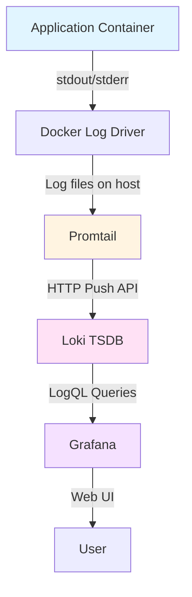
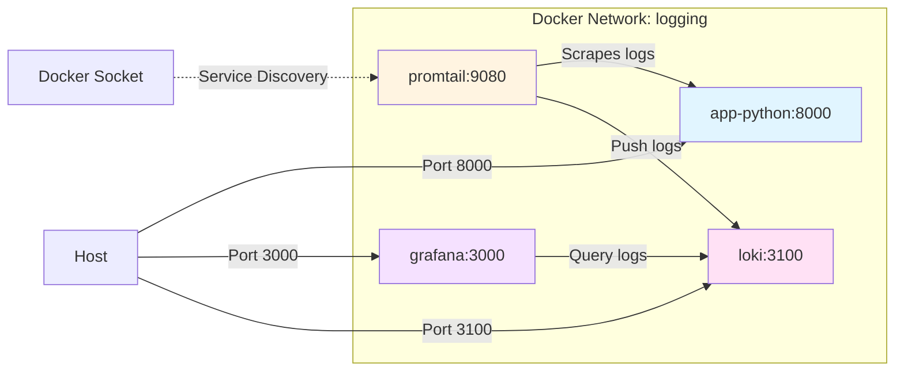
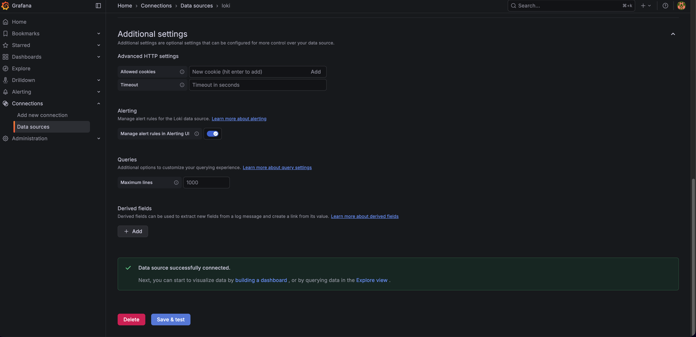
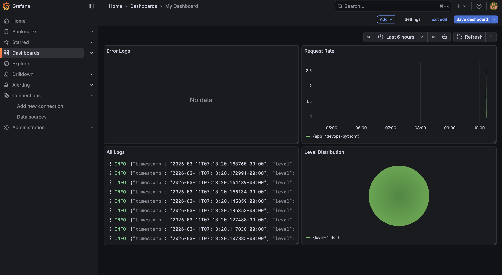
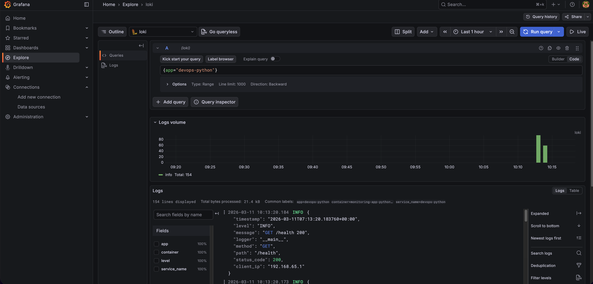
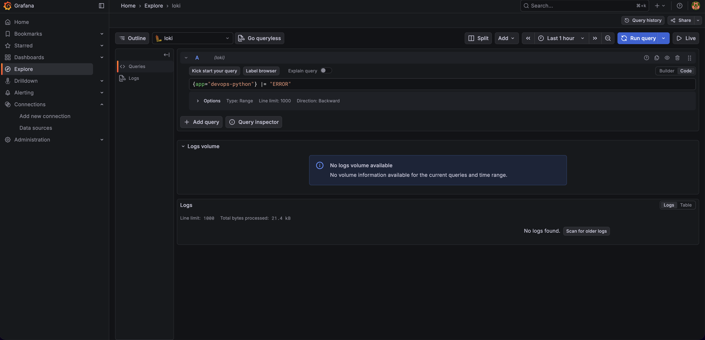
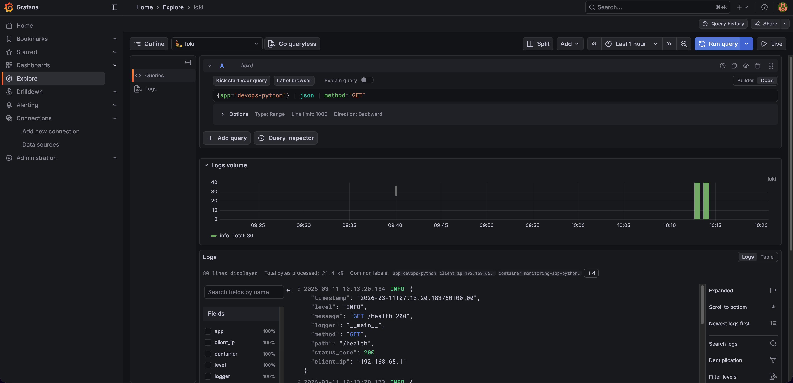

# Lab 7: Observability & Logging with Loki Stack

**Name:** Nikita Maksimenko  
**Date:** 2026-03-11  
**Lab Points:** 10 pts

## 1. Overview

### Environment

- **Loki Version:** 3.0.0
- **Promtail Version:** 3.0.0
- **Grafana Version:** 12.3.1
- **Host OS:** macOS
- **Docker Compose Version:** v2
- **Application:** Python FastAPI service with JSON logging

### What I Accomplished

I deployed a complete centralized logging stack using Grafana Loki, Promtail, and Grafana. The system collects logs from containerized applications, stores them efficiently using Loki's TSDB backend, and provides visualization through Grafana dashboards.

1. **Stack Deployment** - Deployed Loki, Promtail, and Grafana with proper configuration
2. **App Integration** - Added JSON structured logging to Python app and integrated it into the stack
3. **Dashboard** - Created interactive dashboard with 4 panels for log visualization
4. **Production Config** - Added resource limits, health checks, and security measures
5. **Documentation** - Complete documentation with evidence

### Technologies Used

- Grafana Loki 3.0 with TSDB storage backend
- Promtail 3.0 with Docker service discovery
- Grafana 12.3.1 for visualization
- Python logging module with custom JSON formatter
- Docker Compose for orchestration
- LogQL query language for log analysis

---

## 2. Architecture

### Component Overview

The logging stack consists of three main components:

1. **Loki** - Log aggregation system that stores logs and provides query API
2. **Promtail** - Log collector that scrapes Docker container logs and sends them to Loki
3. **Grafana** - Visualization platform for querying and displaying logs

### Data Flow Diagram



### Network Architecture Diagram



### Storage

- **Loki data**: Stored in Docker volume `loki-data` at `/loki`
- **Grafana data**: Stored in Docker volume `grafana-data` at `/var/lib/grafana`
- **Promtail positions**: Tracked in `/tmp/positions.yaml` inside container

---

## 3. Setup Guide

### Prerequisites

- Docker and Docker Compose v2 installed
- Ports 3000, 3100, 8000, 9080 available
- Basic understanding of Docker networking

### Deployment Steps

**Step 1: Create project structure**

```bash
mkdir -p monitoring/{loki,promtail,docs/screenshots}
```

**Step 2: Create configuration files**

Create the three configuration files:
- `monitoring/loki/config.yml` - Loki server configuration
- `monitoring/promtail/config.yml` - Promtail scraping configuration
- `monitoring/docker-compose.yml` - Service orchestration

**Step 3: Create environment file**

```bash
cd monitoring
echo "GRAFANA_ADMIN_PASSWORD=admin123" > .env
```

Make sure `.env` is in your `.gitignore` file.

**Step 4: Deploy the stack**

```bash
cd monitoring
docker compose up -d
```

**Step 5: Verify services**

```bash
docker compose ps
curl http://localhost:3100/ready
curl http://localhost:9080/targets
```

**Step 6: Configure Grafana data source**

1. Open `http://localhost:3000`
2. Login with admin / admin123
3. Go to Connections > Data sources > Add data source
4. Select Loki
5. Set URL to `http://loki:3100`
6. Click Save & Test



---

## 4. Configuration

### Loki Configuration

**File:** `monitoring/loki/config.yml`

Key configuration sections:

```yaml
auth_enabled: false

server:
  http_listen_port: 3100

common:
  path_prefix: /loki
  storage:
    filesystem:
      chunks_directory: /loki/chunks
      rules_directory: /loki/rules
  replication_factor: 1
```

**Why these settings:**
- `auth_enabled: false` - Simplifies setup for single-tenant use
- `http_listen_port: 3100` - Standard Loki port
- `common.storage.filesystem` - Uses local filesystem for storage (suitable for single instance)
- `replication_factor: 1` - Single instance, no replication needed

**Schema configuration:**

```yaml
schema_config:
  configs:
    - from: 2024-01-01
      store: tsdb
      object_store: filesystem
      schema: v13
      index:
        prefix: index_
        period: 24h
```

**Why TSDB:**
- TSDB is the recommended index type for Loki 3.0
- Provides up to 10x faster queries compared to older boltdb-shipper
- Better compression and lower memory usage
- Schema v13 is required for TSDB

**Retention policy:**

```yaml
limits_config:
  retention_period: 168h

compactor:
  working_directory: /loki/compactor
  retention_enabled: true
  delete_request_store: filesystem
```

Logs are automatically deleted after 7 days (168 hours). The compactor runs periodically to clean up old data.

### Promtail Configuration

**File:** `monitoring/promtail/config.yml`

Key sections:

```yaml
server:
  http_listen_port: 9080

clients:
  - url: http://loki:3100/loki/api/v1/push

scrape_configs:
  - job_name: docker
    docker_sd_configs:
      - host: unix:///var/run/docker.sock
        refresh_interval: 5s
        filters:
          - name: label
            values: ["logging=promtail"]
```

**How it works:**
- Promtail connects to Docker socket to discover containers
- Only scrapes containers with label `logging=promtail`
- Refreshes container list every 5 seconds
- Sends logs to Loki via HTTP push API

**Label extraction:**

```yaml
relabel_configs:
  - source_labels: ['__meta_docker_container_name']
    regex: '/(.*)' 
    target_label: container
  - source_labels: ['__meta_docker_container_label_app']
    target_label: app
```

This extracts:
- Container name (removes leading `/`)
- Custom `app` label from Docker container

These labels can be used in LogQL queries like `{app="devops-python"}`.

### Docker Compose Configuration

**File:** `monitoring/docker-compose.yml`

**Network setup:**

```yaml
networks:
  logging:
```

All services join this network for internal communication.

**Volume mounts:**

```yaml
volumes:
  loki-data:
  grafana-data:
```

Named volumes persist data across container restarts.

**Promtail mounts:**

```yaml
volumes:
  - ./promtail/config.yml:/etc/promtail/config.yml
  - /var/lib/docker/containers:/var/lib/docker/containers:ro
  - /var/run/docker.sock:/var/run/docker.sock:ro
```

Promtail needs access to:
- Docker socket for service discovery
- Container log files on the host filesystem

---

## 5. Application Logging

### JSON Structured Logging Implementation

I modified the Python FastAPI application to output logs in JSON format using a custom formatter.

**Custom JSON Formatter:**

```python
class JSONFormatter(logging.Formatter):
    def format(self, record):
        log_data = {
            'timestamp': datetime.fromtimestamp(record.created, tz=timezone.utc).isoformat(),
            'level': record.levelname,
            'message': record.getMessage(),
            'logger': record.name
        }
        if hasattr(record, 'method'):
            log_data['method'] = record.method
        if hasattr(record, 'path'):
            log_data['path'] = record.path
        if hasattr(record, 'status_code'):
            log_data['status_code'] = record.status_code
        if hasattr(record, 'client_ip'):
            log_data['client_ip'] = record.client_ip
        return json.dumps(log_data)
```

This formatter converts Python log records into JSON objects with standard fields plus optional HTTP context fields.

**Logging setup:**

```python
handler = logging.StreamHandler()
handler.setFormatter(JSONFormatter())
logger = logging.getLogger(__name__)
logger.setLevel(logging.DEBUG if DEBUG else logging.INFO)
logger.addHandler(handler)
logger.propagate = False
```

**HTTP request logging middleware:**

```python
@app.middleware("http")
async def log_requests(request: Request, call_next):
    client_ip = request.client.host if request.client else "unknown"
    method = request.method
    path = str(request.url.path)
    
    start_time = time.time()
    response = await call_next(request)
    process_time = time.time() - start_time
    
    log_record = logger.makeRecord(
        logger.name, logging.INFO, "", 0, 
        f"{method} {path} {response.status_code}",
        (), None
    )
    log_record.method = method
    log_record.path = path
    log_record.status_code = response.status_code
    log_record.client_ip = client_ip
    logger.handle(log_record)
    
    return response
```

This middleware logs every HTTP request with:
- HTTP method (GET, POST, etc.)
- Request path
- Response status code
- Client IP address

**Example log output:**

```json
{
  "timestamp": "2026-03-11T07:13:20.145859+00:00",
  "level": "INFO",
  "message": "GET /health 200",
  "logger": "__main__",
  "method": "GET",
  "path": "/health",
  "status_code": 200,
  "client_ip": "192.168.65.1"
}
```

**Benefits of JSON logging:**
- Easy to parse by log aggregation tools like Loki
- Structured data allows filtering by specific fields
- Can extract metrics from log fields
- Better than plain text for automated analysis

---

## 6. Dashboard

### Dashboard Overview

Created a Grafana dashboard with 4 panels to visualize application logs.

**Dashboard name:** DevOps Application Logs

### Panel 1: All Logs

**Type:** Logs visualization  
**Query:** `{app=~"devops-.*"}`

**What it shows:**
- All logs from applications with label matching `devops-*`
- Displays full log content with timestamp
- Shows JSON fields in expandable format

**Use case:** Quick overview of all application activity

### Panel 2: Request Rate

**Type:** Time series graph  
**Query:** `sum by (app) (rate({app=~"devops-.*"}[1m]))`

**What it shows:**
- Logs per second for each application
- Calculated over 1-minute rolling window
- Separate line for each app

**Use case:** Monitor traffic patterns and detect spikes

**How the query works:**
- `rate({app=~"devops-.*"}[1m])` - Calculate log rate per second over 1 minute
- `sum by (app)` - Aggregate by application name
- Result is logs/second metric

### Panel 3: Error Logs

**Type:** Logs visualization  
**Query:** `{app=~"devops-.*"} | json | level="ERROR"`

**What it shows:**
- Only logs with level field equal to ERROR
- Parses JSON logs to extract level field
- Displays full error context

**Use case:** Quick error detection and debugging

**Query breakdown:**
- `{app=~"devops-.*"}` - Select application logs
- `| json` - Parse JSON log format
- `| level="ERROR"` - Filter for ERROR level

### Panel 4: Level Distribution

**Type:** Pie chart  
**Query:** `sum by (level) (count_over_time({app=~"devops-.*"} | json [5m]))`

**What it shows:**
- Count of logs by level (INFO, ERROR, DEBUG, etc.)
- Calculated over last 5 minutes
- Visual proportion of each log level

**Use case:** Understand log level distribution and detect anomalies

**Query breakdown:**
- `count_over_time({app=~"devops-.*"} | json [5m])` - Count logs in 5-minute window
- `sum by (level)` - Group by log level field
- Result shows total count per level



---

## 7. Production Configuration

### Resource Limits

All services have resource constraints to prevent overconsumption:

**Loki:**
```yaml
deploy:
  resources:
    limits:
      cpus: '1.0'
      memory: 1G
    reservations:
      cpus: '0.5'
      memory: 512M
```

**Grafana:**
```yaml
deploy:
  resources:
    limits:
      cpus: '1.0'
      memory: 512M
```

**Promtail:**
```yaml
deploy:
  resources:
    limits:
      cpus: '0.5'
      memory: 256M
```

**Application:**
```yaml
deploy:
  resources:
    limits:
      cpus: '0.5'
      memory: 256M
    reservations:
      cpus: '0.25'
      memory: 128M
```

**Why resource limits:**
- Prevent single service from consuming all host resources
- Ensure predictable performance
- Required for production Kubernetes deployments
- Help with capacity planning

### Health Checks

**Loki health check:**
```yaml
healthcheck:
  test: ["CMD-SHELL", "wget --no-verbose --tries=1 --spider http://localhost:3100/ready || exit 1"]
  interval: 10s
  timeout: 5s
  retries: 5
  start_period: 10s
```

**Grafana health check:**
```yaml
healthcheck:
  test: ["CMD-SHELL", "curl -f http://localhost:3000/api/health || exit 1"]
  interval: 10s
  timeout: 5s
  retries: 5
  start_period: 10s
```

**Benefits:**
- Docker automatically monitors service health
- Unhealthy containers can be restarted automatically
- Health status visible in `docker compose ps`
- Integration with orchestration platforms

### Security Configuration

**Grafana authentication:**

```yaml
environment:
  - GF_AUTH_ANONYMOUS_ENABLED=false
  - GF_SECURITY_ADMIN_PASSWORD=${GRAFANA_ADMIN_PASSWORD}
```

**Environment file (.env):**
```
GRAFANA_ADMIN_PASSWORD=admin123
```

**Security measures:**
- Anonymous access disabled
- Admin password stored in environment variable
- .env file excluded from git repository
- No hardcoded credentials in docker-compose.yml

**Additional security considerations:**
- Promtail has read-only access to Docker socket
- Container log directories mounted read-only
- Services run with minimal required permissions

### Data Retention

Loki is configured to retain logs for 7 days:

```yaml
limits_config:
  retention_period: 168h

compactor:
  working_directory: /loki/compactor
  retention_enabled: true
  delete_request_store: filesystem
```

The compactor runs automatically to delete old logs and reclaim disk space.

---

## 8. Testing

### Verify Stack Deployment

**Check all services are running:**
```bash
cd monitoring
docker compose ps
```

Expected output: All services should show status "Up" and health checks should be "healthy".

**Test Loki API:**
```bash
curl http://localhost:3100/ready
```

Expected output: `ready`

**Test Promtail targets:**
```bash
curl http://localhost:9080/targets
```

Expected output: JSON showing discovered Docker containers.

### Generate Test Traffic

**Create log entries:**
```bash
for i in {1..20}; do curl http://localhost:8000/; done
for i in {1..20}; do curl http://localhost:8000/health; done
```

This generates 40 log entries in JSON format.

**Verify JSON logs:**
```bash
docker logs monitoring-app-python-1 --tail 5
```

Expected output: JSON formatted log lines with timestamp, level, message, method, path, status_code, and client_ip fields.

### Test LogQL Queries

**In Grafana Explore, test these queries:**

**Query 1: All application logs**
```
{app="devops-python"}
```



**Query 2: Error logs only**
```
{app="devops-python"} |= "ERROR"
```



**Query 3: GET requests only**
```
{app="devops-python"} | json | method="GET"
```



**Query 4: Calculate request rate**
```
sum by (app) (rate({app=~"devops-.*"}[1m]))
```

**Query 5: Count by log level**
```
sum by (level) (count_over_time({app=~"devops-.*"} | json [5m]))
```

### Verify Dashboard

1. Navigate to Dashboards in Grafana
2. Open "DevOps Application Logs" dashboard
3. Verify all 4 panels show data
4. Check that time range selector works
5. Test refresh functionality

---

## 9. Challenges

### Loki 3.0 TSDB Configuration

Loki 3.0 introduced TSDB as the recommended storage backend with a new configuration structure. I used schema v13 with the common section instead of separate storage sections. The TSDB provides faster queries and better compression compared to older boltdb-shipper.

### JSON Logging Implementation

Implemented custom JSONFormatter class using Python's built-in logging module without external libraries. Created custom log record attributes for HTTP context (method, path, status_code, client_ip) and used FastAPI middleware instead of Flask hooks to capture request/response data.

### Promtail Label Filtering

Configured Promtail to only scrape containers with the `logging=promtail` label to avoid collecting logs from infrastructure containers like Loki and Grafana themselves. This prevents log loops and reduces noise in the system.

---

## 10. Useful Commands

### Docker Compose Operations

**Start the stack:**
```bash
docker compose up -d
```

**Stop the stack:**
```bash
docker compose down
```

**View logs:**
```bash
docker compose logs -f loki
docker compose logs -f promtail
docker compose logs -f app-python
```

**Restart specific service:**
```bash
docker compose restart app-python
```

**Rebuild and restart:**
```bash
docker compose up -d --build app-python
```

### Debugging

**Check Promtail targets:**
```bash
curl http://localhost:9080/targets | jq
```

**Query Loki directly:**
```bash
curl -G -s "http://localhost:3100/loki/api/v1/query" \
  --data-urlencode 'query={app="devops-python"}' | jq
```

**Check container labels:**
```bash
docker inspect monitoring-app-python-1 | jq '.[0].Config.Labels'
```

**View application logs:**
```bash
docker logs monitoring-app-python-1 --tail 50
```

---

## 11. Evidence

### Task 1: Stack Deployment

**Services running:**
```
NAME                      IMAGE                                COMMAND                  SERVICE      STATUS
monitoring-app-python-1   nexonm22/devops-info-service:lab07   "python app.py"          app-python   Up
monitoring-grafana-1      grafana/grafana:12.3.1               "/run.sh"                grafana      Up (healthy)
monitoring-loki-1         grafana/loki:3.0.0                   "/usr/bin/loki -conf…"   loki         Up (healthy)
monitoring-promtail-1     grafana/promtail:3.0.0               "/usr/bin/promtail -…"   promtail     Up
```

**Loki ready check:**
```bash
$ curl http://localhost:3100/ready
ready
```


### Task 2: Application Integration

**JSON log output:**
```json
{"timestamp": "2026-03-11T07:13:20.145859+00:00", "level": "INFO", "message": "GET /health 200", "logger": "__main__", "method": "GET", "path": "/health", "status_code": 200, "client_ip": "192.168.65.1"}
```

**Docker labels on app container:**
```yaml
labels:
  logging: "promtail"
  app: "devops-python"
```

### Task 3: Dashboard


Dashboard includes:
1. All Logs panel showing recent log entries
2. Request Rate time series graph
3. Error Logs filtered view
4. Level Distribution pie chart

### Task 4: Production Configuration

**Resource limits:** Added to all services  
**Health checks:** Configured for Loki and Grafana  
**Security:** Anonymous access disabled, password in .env file  
**Retention:** 7-day log retention with compactor enabled

---

## 12. Conclusion

This lab successfully demonstrated centralized logging using the Grafana Loki stack. The setup provides:

- Efficient log storage with Loki 3.0 TSDB backend
- Automatic log collection from Docker containers via Promtail
- Rich visualization and querying capabilities in Grafana
- Production-ready configuration with security and resource management
- Structured JSON logging for better analysis

The system is ready for monitoring multiple applications and can be extended with additional features like alerting, log-based metrics, and integration with other observability tools.

### Key Takeaways

1. **Loki is not Elasticsearch** - It indexes labels, not full text, making it more efficient for logs
2. **Labels are critical** - Choose labels carefully as they determine query performance
3. **JSON logging enables rich queries** - Structured logs allow field-based filtering and metrics
4. **LogQL is powerful** - Can transform logs into metrics and create complex filters
5. **Production readiness matters** - Security, resource limits, and health checks are essential
