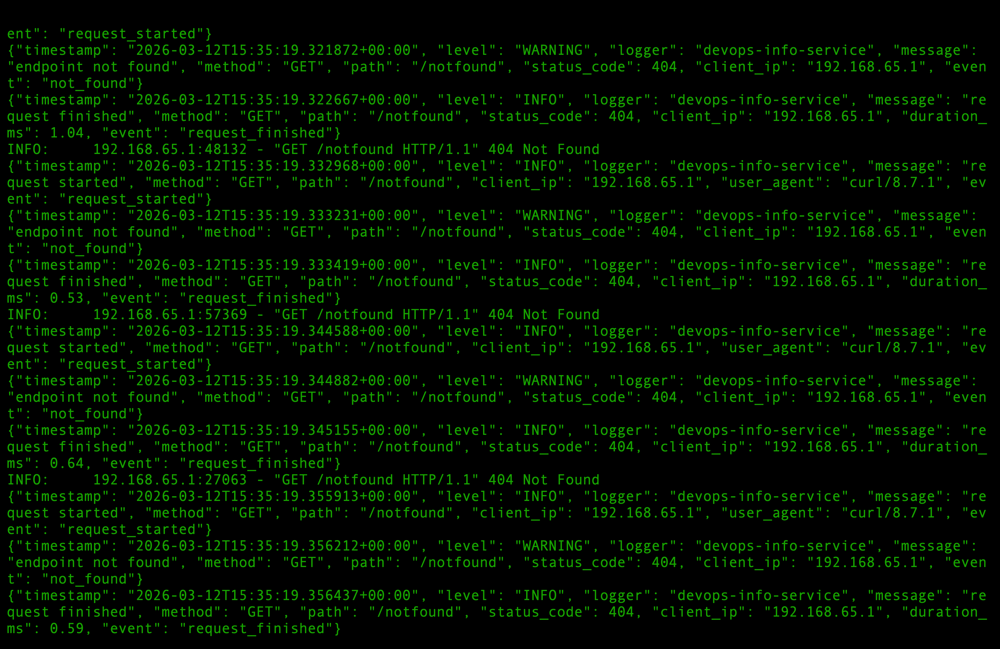
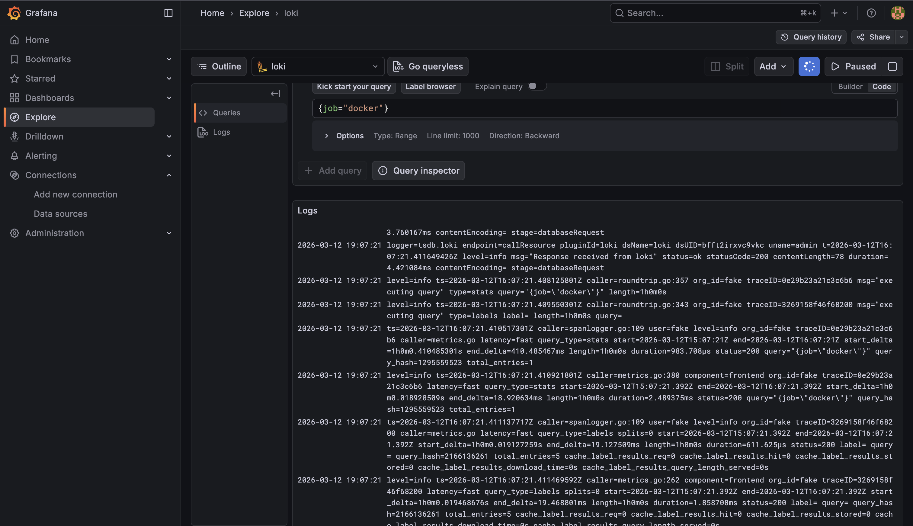
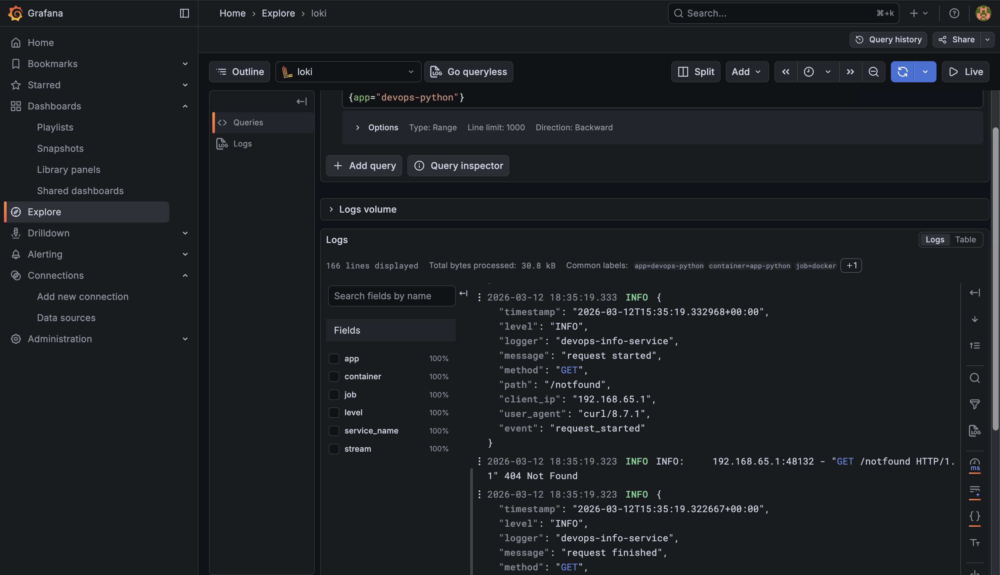
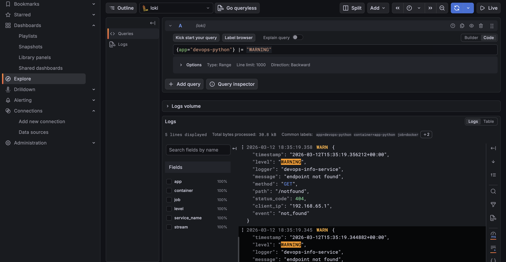
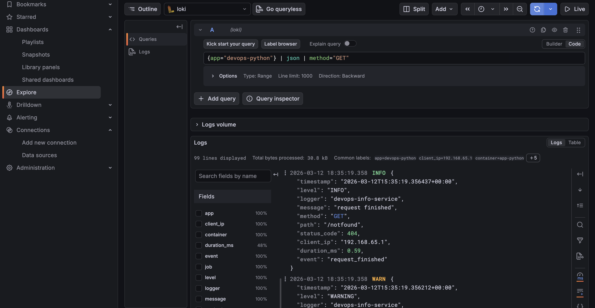
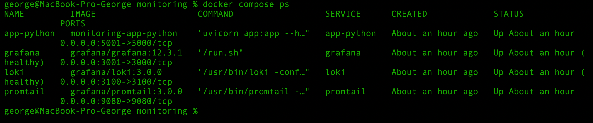
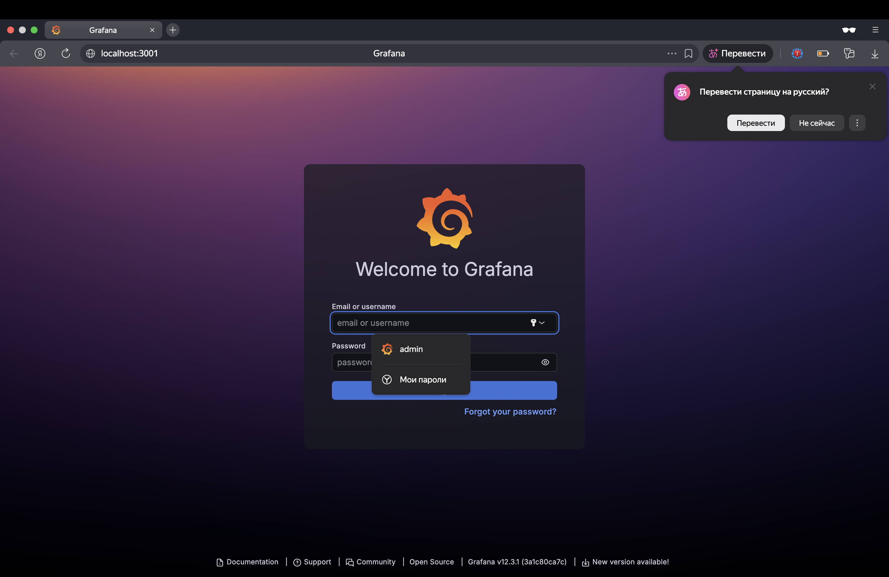

# LAB07 — Centralized Logging with Loki, Promtail, and Grafana

# Setup Guide

The logging stack can be deployed using Docker Compose.

## Step 1 — Navigate to monitoring directory

```bash
cd monitoring
```

## Step 2 — Build and start the stack

```bash
docker compose up -d --build
```

This starts:

* Loki
* Promtail
* Grafana
* Python application

## Step 3 — Verify services

```bash
docker compose ps
```

Expected output should show:

* Loki — healthy
* Grafana — healthy
* Promtail — running
* app-python — running

## Step 4 — Access Grafana

Open:

```
http://localhost:3001
```

Login using credentials defined in `.env`.


---

# Configuration

## Loki Configuration

Loki is configured to store logs and provide a query API for Grafana.

Key configuration aspects:

- HTTP API enabled on port **3100**
- Log storage using local filesystem
- Query support for LogQL

Promtail sends logs directly to Loki.

## Promtail Configuration

Promtail collects logs from Docker containers.

Important configuration elements:

- Docker service discovery
- Container label filtering
- Log forwarding to Loki

Example configuration snippet:

```yaml
scrape_configs:
  - job_name: docker
    docker_sd_configs:
      - host: unix:///var/run/docker.sock
```

Promtail uses container labels such as:

```yaml
labels:
  logging: "promtail"
  app: "devops-python"
```

This allows filtering logs by application in Loki queries.


# Task 1 — Logging Stack Setup

A centralized logging stack was deployed using Docker Compose based on the **Grafana Loki ecosystem**.

The stack includes:

* **Loki** — log storage and query engine
* **Promtail** — log collector that sends logs to Loki
* **Grafana** — visualization and log querying interface

The Python application from Lab 1 generates logs which are collected by Promtail and stored in Loki.

---

## Loki Overview

Loki is a log aggregation system designed for container environments.

Unlike **Elasticsearch**, Loki **indexes only log labels instead of the entire log content**.

| Feature      | Loki               | Elasticsearch         |
| ------------ | ------------------ | --------------------- |
| Indexing     | Labels only        | Full log indexing     |
| Storage cost | Low                | High                  |
| Performance  | Optimized for logs | General search engine |

This approach reduces storage costs and improves performance for log workloads.

---

## Log Labels

Labels are key-value pairs attached to logs.

Example:

```
{app="devops-python", level="INFO"}
```

Labels allow efficient filtering using **LogQL queries**.

Example query:

```
{app="devops-python"}
```

This returns logs only from the Python application.

---

## Promtail Log Collection

Promtail is responsible for collecting logs and sending them to Loki.

Promtail uses **Docker service discovery** to automatically detect containers.

It reads metadata such as:

* container name
* container labels
* container ID

These values are converted into **log labels** used in LogQL queries.

---

## Project Structure

```
monitoring/
├── docker-compose.yml
├── loki/
│   └── config.yml
├── promtail/
│   └── config.yml
└── docs/
    └── LAB07.md
```

* `docker-compose.yml` — defines logging services
* `loki/config.yml` — Loki configuration
* `promtail/config.yml` — Promtail log collection configuration
* `docs/LAB07.md` — documentation

---

## Docker Compose Services

| Service    | Image                  | Purpose       |
| ---------- | ---------------------- | ------------- |
| Loki       | grafana/loki:3.0.0     | Log storage   |
| Promtail   | grafana/promtail:3.0.0 | Log collector |
| Grafana    | grafana/grafana:12.3.1 | Visualization |
| Python App | custom image           | Log source    |

All services share a **common logging network** and use volumes for configuration and data persistence.

---

## Deployment and Verification

The stack was deployed using Docker Compose.

Start the services:

```bash
cd monitoring
docker compose up -d
```

Verify services:

```bash
docker compose ps
```

Test Loki readiness:

```bash
curl http://localhost:3100/ready
```

Expected output:

```
ready
```

Check Promtail targets:

```bash
curl http://localhost:9080/targets
```

---

## Grafana Verification

Grafana was used to query logs stored in Loki.

Steps:

1. Open Grafana
2. Add Loki data source
3. URL: `http://loki:3100`
4. Save and test connection

Example query in Grafana Explore:

```
{job="docker"}
```

This returns logs from multiple containers.

---

## Evidence




---

# Task 2 — Integrate Application Logging

## 2.1 Structured Logging

The Python FastAPI application was updated to use structured JSON logging via Python's `logging` module.

Logs contain:

- timestamp
- log level
- message
- HTTP method
- request path
- status code
- client IP
- request duration

Example JSON log:

```json
{
  "timestamp": "2026-03-12T15:35:19.001470+00:00",
  "level": "INFO",
  "logger": "devops-info-service",
  "message": "request finished",
  "method": "GET",
  "path": "/",
  "status_code": 200,
  "client_ip": "192.168.65.1",
  "duration_ms": 0.3,
  "event": "request_finished"
}
```

### Evidence — JSON logs from container

Screenshot showing structured logs from the Python application container.

**Screenshot:**
*(insert screenshot of `docker logs app-python`)*

---

## 2.2 Application Integration with Docker Compose

The Python application was added to `monitoring/docker-compose.yml`.

The container joins the logging network and includes labels used by Promtail for log discovery.

Example labels:

```yaml
labels:
  logging: "promtail"
  app: "devops-python"
```

Promtail automatically discovers containers with the `logging=promtail` label and collects their logs.

---

## 2.3 Log Generation and Testing

Traffic was generated to produce application logs.

Example requests:

```bash
curl http://localhost:5001/
curl http://localhost:5001/health
curl http://localhost:5001/notfound
```

These requests generate:

* successful requests (200)
* health checks
* 404 warnings

Logs were successfully collected by Promtail and stored in Loki.

---

# LogQL Queries

The following LogQL queries were executed in Grafana Explore.

## Query 1 — All logs from Python application

```logql
{app="devops-python"}
```

**Screenshot:**


---

## Query 2 — Filter WARNING logs

```logql
{app="devops-python"} |= "WARNING"
```

This query filters logs containing warning messages, such as requests to non-existent endpoints.

**Screenshot:**


---

## Query 3 — JSON parsing and GET requests

```logql
{app="devops-python"} | json | method="GET"
```

The `json` operator parses structured logs and allows filtering by fields.

**Screenshot:**


---

# Logging Architecture

The logging pipeline works as follows:

```
Python Application
        │
        │ stdout logs
        ▼
Docker container logs
        │
        ▼
Promtail
        │
        │ pushes logs
        ▼
Loki
        │
        ▼
Grafana Explore / Dashboards
```

---


# Task 3 — Log Dashboard

A Grafana dashboard was created to visualize application logs using Loki and LogQL.

The dashboard contains four panels.

## Logs Table

Displays recent logs from all applications.

Query:

```logql
{app=~"devops-.*"}
```

---

## Request Rate

Shows log rate per application.

Query:

```logql
sum by (app) (rate({app=~"devops-.*"} [1m]))
```

---

## Error Logs

Displays logs with ERROR level.

Query:

```logql
{app=~"devops-.*"} | json | level="ERROR"
```

---

## Log Level Distribution

Shows distribution of log levels.

Query:

```logql
sum by (level) (count_over_time({app=~"devops-.*"} | json [5m]))
```

---

## Dashboard

Demonstrating all 4 panels


# Task 4 — Production Readiness

## 4.1 Resource Limits

Resource limits and reservations were added to all services in `docker-compose.yml` to prevent excessive CPU and memory usage.

Example:

```yaml
deploy:
  resources:
    limits:
      cpus: "1.0"
      memory: 1G
    reservations:
      cpus: "0.5"
      memory: 512M
```

Appropriate lower values were used for lightweight services such as Promtail and the Python application.

## 4.2 Secure Grafana

Grafana anonymous authentication was disabled:

```yaml
GF_AUTH_ANONYMOUS_ENABLED: "false"
```

Admin credentials were configured through environment variables stored in `.env`:

```env
GRAFANA_ADMIN_USER=ADMIN_USER
GRAFANA_ADMIN_PASSWORD=ADMIN_PASSWORD
```

This ensures that Grafana requires authentication and secrets are separated from the Compose file.

## 4.3 Health Checks

Health checks were configured for critical services:

### Loki

```yaml
healthcheck:
  test: ["CMD-SHELL", "wget --no-verbose --tries=1 --spider http://localhost:3100/ready || exit 1"]
```

### Grafana

```yaml
healthcheck:
  test: ["CMD-SHELL", "wget --no-verbose --tries=1 --spider http://localhost:3000/api/health || exit 1"]
```

These checks confirm that services are healthy and ready before dependent services start.

## Evidence

### Docker Compose status

*`docker compose ps` showing healthy services*


### Grafana authentication

*Grafana login page showing that anonymous access is disabled*


---

# Testing

The following commands were used to verify the logging stack.

## Verify Loki

```bash
curl http://localhost:3100/ready
```

Expected output:

```
ready
```

## Verify Promtail

```bash
curl http://localhost:9080/targets
```

This confirms Promtail is scraping container logs.

## Generate Logs

```bash
for i in {1..20}; do curl http://localhost:5001/; done
for i in {1..20}; do curl http://localhost:5001/health; done
for i in {1..5}; do curl http://localhost:5001/notfound; done
```

## Query Logs in Grafana

Example queries:

```logql
{app="devops-python"}
```

```logql
{app="devops-python"} |= "WARNING"
```

```logql
{app="devops-python"} | json | method="GET"
```

# Challenges

## Port conflicts

During setup some ports were already in use on the host machine.

Example errors:

```

bind: address already in use

```

Solution:

Ports were remapped in `docker-compose.yml`:

- Grafana → 3001
- Python app → 5001

## JSON log parsing

Some logs were not parsed correctly until structured JSON logging was implemented in the Python application.

Solution:

Implemented structured logging using Python's `logging` module with JSON output.
