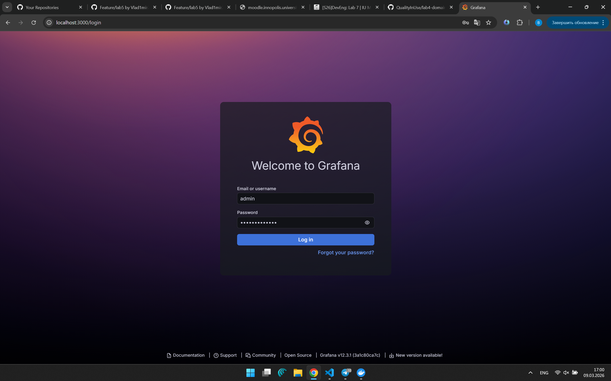
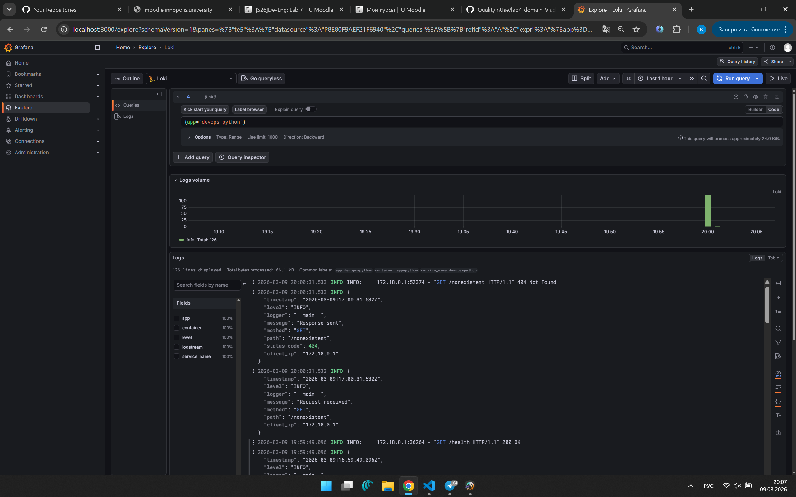
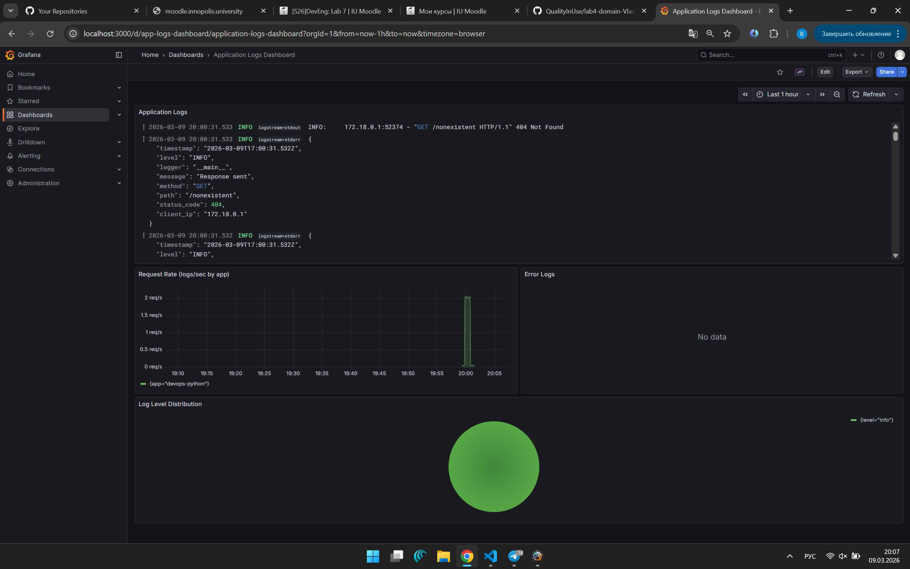

# Lab 07 — Observability & Logging with Loki Stack

## Architecture

```
┌──────────────┐     ┌────────────┐     ┌───────────┐
│  app-python  │────▶│  Promtail  │────▶│   Loki    │
│  (port 8000) │     │  (port 9080)│     │ (port 3100)│
└──────────────┘     └────────────┘     └─────┬─────┘
                           ▲                   │
                   Docker Socket          Stores logs
                   /var/run/docker.sock    (TSDB + filesystem)
                                               │
                                         ┌─────▼─────┐
                                         │  Grafana   │
                                         │ (port 3000)│
                                         └───────────┘
```

**Components:**

| Service   | Image                      | Role                         |
|-----------|----------------------------|------------------------------|
| Loki      | `grafana/loki:3.0.0`       | Log aggregation & storage    |
| Promtail  | `grafana/promtail:3.0.0`   | Log collection from Docker   |
| Grafana   | `grafana/grafana:12.3.1`   | Visualization & dashboards   |
| app-python| Built from `../app_python` | Application producing logs   |

---

## Setup Guide

### Prerequisites

- Docker & Docker Compose v2 installed
- Python app from Lab 1 available at `../app_python`

### Deployment

```bash
cd monitoring

# Start the full stack
docker compose up -d

# Check service status
docker compose ps

# Verify Loki is ready
curl http://localhost:3100/ready

# Verify Grafana health
curl http://localhost:3000/api/health

# Access Grafana UI
# Open http://localhost:3000
# Login: admin / SecretP@ss123 (from .env)
```

### Stopping

```bash
docker compose down          # Stop containers
docker compose down -v       # Stop and remove volumes
```

---

## Configuration

### Loki (`loki/config.yml`)

- **Auth disabled** (`auth_enabled: false`) — suitable for development/single-tenant
- **TSDB storage** — Loki 3.0 default index store, up to 10x faster queries than boltdb-shipper
- **Schema v13** — latest schema version for Loki 3.0+
- **Filesystem storage** — chunks and rules stored locally under `/loki/`
- **Retention: 168h (7 days)** — compactor cleans up old logs automatically
- **In-memory ring** — appropriate for single-instance deployment

### Promtail (`promtail/config.yml`)

- **Docker service discovery** — auto-discovers containers via Docker socket
- **Label filtering** — only scrapes containers with label `logging=promtail`
- **Relabeling** — extracts `container` name (stripping leading `/`) and `app` label from Docker container labels
- **Refresh interval: 5s** — quickly picks up new/removed containers

### Docker Compose

- **Named volumes** for Loki data and Grafana data persistence
- **Shared `logging` network** — all services communicate internally
- **Dependency ordering** — Promtail and Grafana wait for Loki to be healthy

---

## Application Logging

The Python app uses a custom `JSONFormatter` class (no extra dependencies) that outputs structured JSON logs:

```json
{
  "timestamp": "2026-03-09T12:00:00.000Z",
  "level": "INFO",
  "logger": "app",
  "message": "Request received",
  "method": "GET",
  "path": "/",
  "client_ip": "172.18.0.1"
}
```

**Logged events:**
- **Startup** — service host/port info
- **Request received** — method, path, client IP
- **Response sent** — method, path, status code, client IP
- **Errors** — unhandled exceptions with stack traces

The `extra` dict fields (`method`, `path`, `status_code`, `client_ip`) are detected by the formatter and included in the JSON output.

### Evidence: Logs in Grafana Explore

JSON-structured logs from the Python app visible in Grafana via LogQL query `{app="devops-python"}`:



---

## Dashboard

The provisioned dashboard (`grafana/dashboards/app-logs.json`) contains **4 panels**:

### 1. Application Logs (Logs Table)
```logql
{app=~"devops-.*"}
```
Shows all recent logs from all devops applications.

### 2. Request Rate (Time Series)
```logql
sum by (app) (rate({app=~"devops-.*"} [1m]))
```
Shows logs per second grouped by application.

### 3. Error Logs (Logs Panel)
```logql
{app=~"devops-.*"} | json | level="ERROR"
```
Filters and displays only ERROR-level log entries.

### 4. Log Level Distribution (Pie Chart)
```logql
sum by (level) (count_over_time({app=~"devops-.*"} | json [5m]))
```
Aggregates log counts by level (INFO, WARNING, ERROR) over 5-minute windows.

### Additional Useful LogQL Queries

```logql
# All logs from Python app
{app="devops-python"}

# Text search for specific messages
{app="devops-python"} |= "health"

# Parse JSON and filter by HTTP method
{app="devops-python"} | json | method="GET"

# Count requests per path
sum by (path) (count_over_time({app="devops-python"} | json [5m]))
```

### Evidence: Application Logs Dashboard

Grafana dashboard with all 4 panels (Logs Table, Request Rate, Error Logs, Log Level Distribution):



---

## Production Configuration

### Resource Limits

All services have `deploy.resources` configured:

| Service    | CPU Limit | Memory Limit | CPU Reserved | Memory Reserved |
|------------|-----------|-------------|-------------|-----------------|
| Loki       | 1.0       | 1G          | 0.5         | 512M            |
| Promtail   | 0.5       | 512M        | 0.25        | 256M            |
| Grafana    | 1.0       | 1G          | 0.5         | 512M            |
| app-python | 0.5       | 256M        | 0.25        | 128M            |

### Security

- **Anonymous access disabled** — `GF_AUTH_ANONYMOUS_ENABLED=false`
- **Admin credentials** — stored in `.env` file (not committed to VCS)
- **Docker socket** mounted read-only (`:ro`) to Promtail

### Health Checks

| Service | Endpoint                         | Interval | Retries |
|---------|----------------------------------|----------|---------|
| Loki    | `http://localhost:3100/ready`    | 10s      | 5       |
| Grafana | `http://localhost:3000/api/health`| 10s      | 5       |

Health checks use `wget` (available in Alpine-based images) with `start_period` grace time for startup.

### Evidence: Grafana Secured

Grafana login page — anonymous access disabled, authentication required:



---

## Testing

### Verify all services are running

```bash
docker compose ps
# Expected: all services "Up" and "healthy"
```

### Generate test traffic

```bash
# Generate requests
for i in $(seq 1 20); do curl -s http://localhost:8000/ > /dev/null; done
for i in $(seq 1 20); do curl -s http://localhost:8000/health > /dev/null; done
# Generate error logs
curl -s http://localhost:8000/nonexistent > /dev/null
```

### Verify logs in Loki

```bash
# Check Loki has received logs
curl -s "http://localhost:3100/loki/api/v1/query?query={app=%22devops-python%22}" | python -m json.tool
```

### Verify in Grafana

1. Open `http://localhost:3000`
2. Login with `admin / SecretP@ss123`
3. Go to **Explore** → Select **Loki** → Query: `{app="devops-python"}`
4. Go to **Dashboards** → **Application Logs Dashboard** → verify all 4 panels

---

## Challenges & Solutions

1. **Loki 3.0 TSDB configuration** — The `common` block simplifies configuration significantly compared to older Loki versions. Schema v13 + TSDB is recommended for new deployments.

2. **Promtail Docker discovery filtering** — Using `filters` in `docker_sd_configs` ensures only containers with the `logging=promtail` label are scraped, avoiding noise from utility containers.

3. **JSON logging without extra dependencies** — A custom `JSONFormatter` class avoids adding `python-json-logger` to requirements while achieving the same structured output.

4. **Health check dependencies** — Using `depends_on` with `condition: service_healthy` ensures Promtail and Grafana only start when Loki is ready to accept logs.

5. **Grafana provisioning** — Data source and dashboard are provisioned automatically via mounted config files, eliminating manual setup steps.
