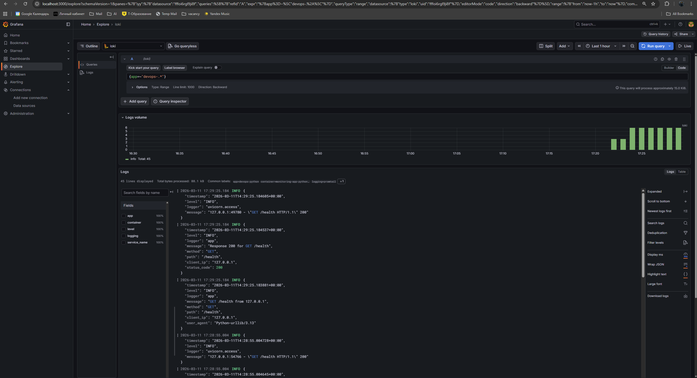
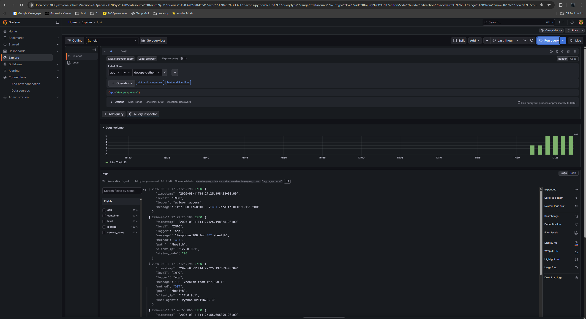
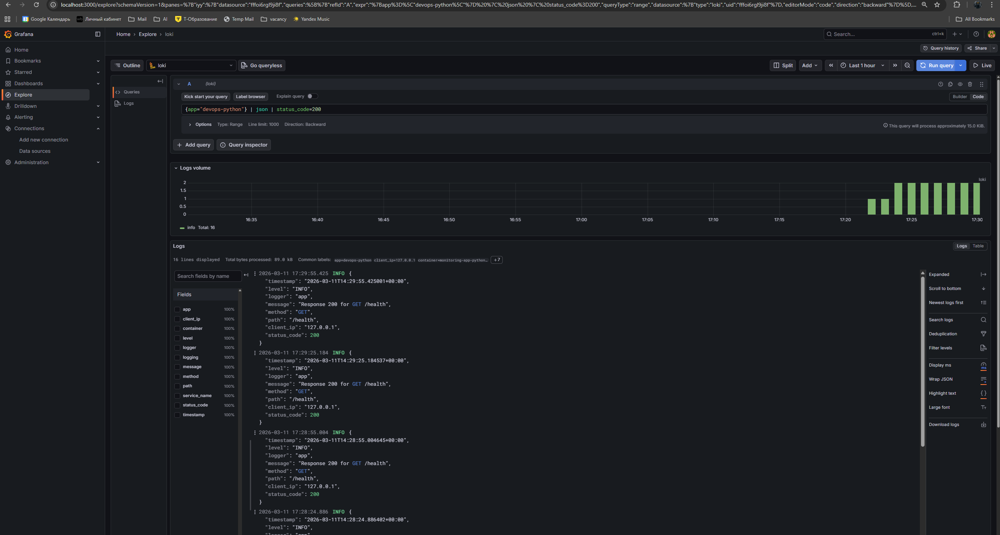

# Lab 7 — Observability & Logging with Loki Stack

## Architecture

```
┌──────────────┐     ┌──────────────┐
│  app-python  │     │   app-go     │
│  (port 8000) │     │  (port 8001) │
└──────┬───────┘     └──────┬───────┘
       │  stdout/stderr      │  stdout/stderr
       └──────────┬──────────┘
                  ▼
         ┌────────────────┐
         │    Promtail     │
         │  (port 9080)    │
         │  Docker SD      │
         └────────┬────────┘
                  │ push
                  ▼
         ┌────────────────┐
         │     Loki        │
         │  (port 3100)    │
         │  TSDB + FS      │
         └────────┬────────┘
                  │ query
                  ▼
         ┌────────────────┐
         │    Grafana      │
         │  (port 3000)    │
         │  Dashboards     │
         └────────────────┘
```

All services communicate over a shared `logging` Docker bridge network.

- **Promtail** discovers containers via Docker socket, filters by `logging=promtail` label, and ships logs to Loki.
- **Loki** stores logs using TSDB index with filesystem object store. Retention is set to 7 days.
- **Grafana** queries Loki and provides visualization dashboards.

## Setup Guide

### Prerequisites

- Docker and Docker Compose v2 installed
- Docker Desktop running
- Python and Go app sources available from previous labs

### Deployment

```bash
cd monitoring

# Build the local Python app image and start the full stack
docker compose up -d --build app-python

# Verify all services are running and healthy
docker compose ps
```

### Verify Services

```bash
# Check Loki readiness
curl http://localhost:3100/ready

# Check Promtail targets
curl http://localhost:9080/targets

# Access Grafana at http://localhost:3000
# Login: admin / admin (change on first login)
```

### Configure Grafana Data Source

Loki is provisioned automatically when Grafana starts.

1. Open **Connections** → **Data sources**
2. Verify that **Loki** already exists
3. Open it and confirm the URL is `http://loki:3100`

## Configuration

### Loki (`loki/config.yml`)

Key configuration choices:
- **TSDB index** (`store: tsdb`): Loki 3.0 recommended index type — up to 10x faster queries and lower memory usage vs. boltdb-shipper.
- **Schema v13**: Latest schema version for Loki 3.0+.
- **Filesystem storage**: Suitable for single-instance deployments, data persisted to `/loki` via named Docker volume.
- **Retention 168h (7 days)**: Compactor runs every 10 minutes and deletes data older than 7 days.

```yaml
schema_config:
  configs:
    - from: "2024-01-01"
      store: tsdb
      object_store: filesystem
      schema: v13
      index:
        prefix: index_
        period: 24h
```

### Promtail (`promtail/config.yml`)

- **Docker service discovery**: Connects to Docker socket to automatically find containers.
- **Label filtering**: Only scrapes containers with `logging=promtail` Docker label.
- **Relabeling**: Extracts container name (stripping leading `/`) and `app` label for use in LogQL queries.

```yaml
scrape_configs:
  - job_name: docker
    docker_sd_configs:
      - host: unix:///var/run/docker.sock
        refresh_interval: 5s
        filters:
          - name: label
            values: ["logging=promtail"]
```

## Application Logging

### Python App — JSON Structured Logging

Updated `app.py` to output JSON-formatted logs using a custom `JSONFormatter` that preserves structured fields passed through `extra=`:

```python
class JSONFormatter(logging.Formatter):
    def format(self, record):
        log_entry = {
            "timestamp": datetime.now(timezone.utc).isoformat(),
            "level": record.levelname,
            "logger": record.name,
            "message": record.getMessage(),
        }
        if record.exc_info and record.exc_info[0] is not None:
            log_entry["exception"] = self.formatException(record.exc_info)
        return json.dumps(log_entry)
```

A FastAPI middleware logs every HTTP request and response:

```python
@app.middleware("http")
async def log_requests(request: Request, call_next):
    logger.info(f"{request.method} {request.url.path} from {client_ip}")
    response = await call_next(request)
    logger.info(f"Response {response.status_code} for {request.method} {request.url.path}")
    return response
```

**Why JSON logging?**
- Parseable by Loki's `| json` pipeline stage
- Fields (level, method, path, status_code) can be extracted and filtered in LogQL
- Machine-readable, enabling automated alerting

### Go App

The Go app uses Go's standard `log` package. Promtail collects its stdout logs the same way.

## Dashboard

The Grafana dashboard contains 4 panels:

### 1. Logs Table
All recent logs from applications.
```logql
{app=~"devops-.*"}
```

### 2. Request Rate (Time Series)
Logs per second grouped by app.
```logql
sum by (app) (rate({app=~"devops-.*"} [1m]))
```

### 3. Error Logs
Only ERROR level log entries.
```logql
{app=~"devops-.*"} | json | level="ERROR"
```

### 4. Log Level Distribution (Stat/Pie)
Count of logs by severity level.
```logql
sum by (level) (count_over_time({app=~"devops-.*"} | json [5m]))
```

## Production Config

### Resource Limits

All services have CPU and memory limits to prevent resource exhaustion:

| Service    | CPU Limit | Memory Limit | CPU Reserved | Memory Reserved |
|------------|-----------|-------------|-------------|----------------|
| Loki       | 1.0       | 1G          | 0.25        | 256M           |
| Promtail   | 0.5       | 512M        | 0.1         | 128M           |
| Grafana    | 1.0       | 512M        | 0.25        | 256M           |
| app-python | 0.5       | 256M        | 0.1         | 128M           |
| app-go     | 0.5       | 128M        | 0.1         | 64M            |

### Security

- **Grafana anonymous access disabled** (`GF_AUTH_ANONYMOUS_ENABLED=false`)
- **Admin credentials** stored in `.env` file (not committed to git)
- **Promtail Docker socket** mounted read-only (`:ro`)
- **Config files** mounted read-only (`:ro`)

### Health Checks

- **Loki**: `wget --spider http://localhost:3100/ready`
- **Grafana**: `wget --spider http://localhost:3000/api/health`
- Both configured with retries, intervals, and start periods for graceful startup.

### Log Retention

- Loki retains logs for **7 days** (168h)
- Compactor runs every 10 minutes to clean up expired data
- Delete requests processed after 2-hour delay for safety

## Testing

### Verify Stack Health

```bash
docker compose ps
# All services should show "healthy" status
```

### Generate Test Traffic

```bash
# Python app
for i in $(seq 1 20); do curl -s http://localhost:8000/ > /dev/null; done
for i in $(seq 1 20); do curl -s http://localhost:8000/health > /dev/null; done

# Go app
for i in $(seq 1 20); do curl -s http://localhost:8001/ > /dev/null; done

# Trigger 404 errors for testing
curl -s http://localhost:8000/nonexistent > /dev/null
```

### Verify in Grafana

1. Open http://localhost:3000 and log in
2. Go to **Explore** → Select **Loki**
3. Run: `{app=~"devops-.*"}`
4. Verify logs from both apps appear

## Screenshots

### Combined application logs

Query used:

```logql
{app=~"devops-.*"}
```



### Python application logs

Query used:

```logql
{app="devops-python"}
```



### Python JSON logs filtered by status code

Query used:

```logql
{app="devops-python"} | json | status_code=200
```



## Results

The observability stack was deployed successfully and verified end to end.

- Loki is available on port `3100` and responds on `/ready`
- Promtail discovers labeled Docker containers and ships logs to Loki
- Grafana is available on port `3000` and the Loki data source is provisioned automatically
- The Python application emits structured JSON logs with fields such as `method`, `path`, `client_ip`, and `status_code`
- Logs from the monitored applications are visible in Grafana Explore using LogQL queries based on the `app` label

### Example LogQL Queries

```logql
# All logs from Python app
{app="devops-python"}

# Only errors
{app="devops-python"} |= "ERROR"

# Parse JSON and filter by level
{app="devops-python"} | json | level="INFO"

# Request rate per app
sum by (app) (rate({app=~"devops-.*"} [1m]))

# Count by log level
sum by (level) (count_over_time({app=~"devops-.*"} | json [5m]))
```

## Manual Steps

1. Open Grafana at `http://localhost:3000`.
2. Sign in with the credentials from `monitoring/.env`.
3. Check that the provisioned **Loki** data source exists.
4. Open Explore and run `{app=~"devops-.*"}` or `{app="devops-python"}`.
5. Capture the screenshots required by the lab instructions.

## Submission Checklist

- `docker compose ps` shows Loki, Promtail, Grafana, `app-python`, and `app-go` running
- `http://localhost:3100/ready` returns `ready`
- `http://localhost:9080/targets` is reachable from the host
- Grafana Explore displays logs for `{app=~"devops-.*"}`
- At least three screenshots are attached in this document
- The monitoring configuration files are committed:
  - `monitoring/docker-compose.yml`
  - `monitoring/loki/config.yml`
  - `monitoring/promtail/config.yml`
  - `monitoring/grafana/provisioning/datasources/loki.yml`
  - `monitoring/docs/LAB07.md`

## Challenges

1. **Loki 3.0 schema config**: The TSDB index type requires `schema: v13` and specific `tsdb_shipper` settings. Older examples using `boltdb-shipper` don't apply.

2. **Promtail Docker SD filtering**: Without the `filters` section in `docker_sd_configs`, Promtail scrapes all containers including itself and infrastructure services. Using `logging=promtail` Docker label as a filter keeps logs clean.

3. **JSON logging without breaking tests**: Switching to a custom `JSONFormatter` required replacing `logging.basicConfig()` with manual handler setup. All 26 existing tests continue to pass.

4. **Container name relabeling**: Docker prefixes container names with `/`. The regex `"/?(.*)"` strips it so labels like `container="monitoring-app-python-1"` are clean.
