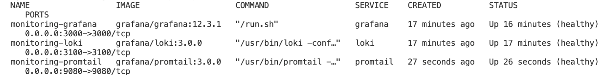
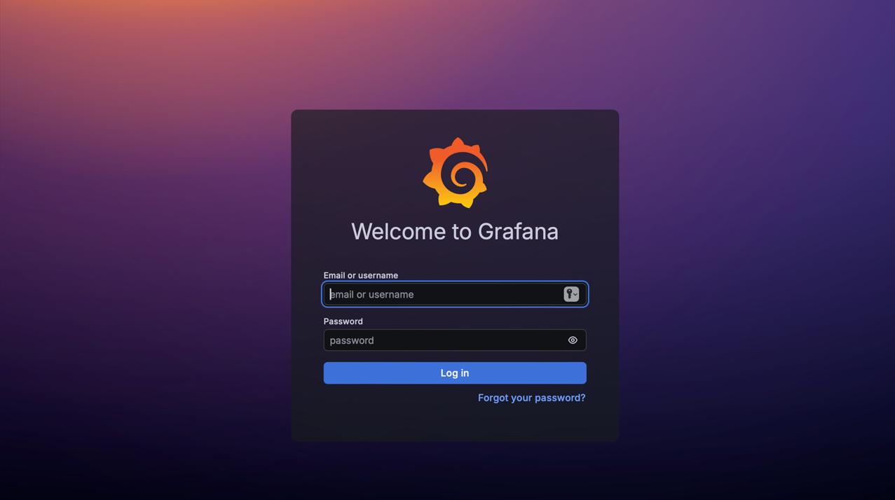
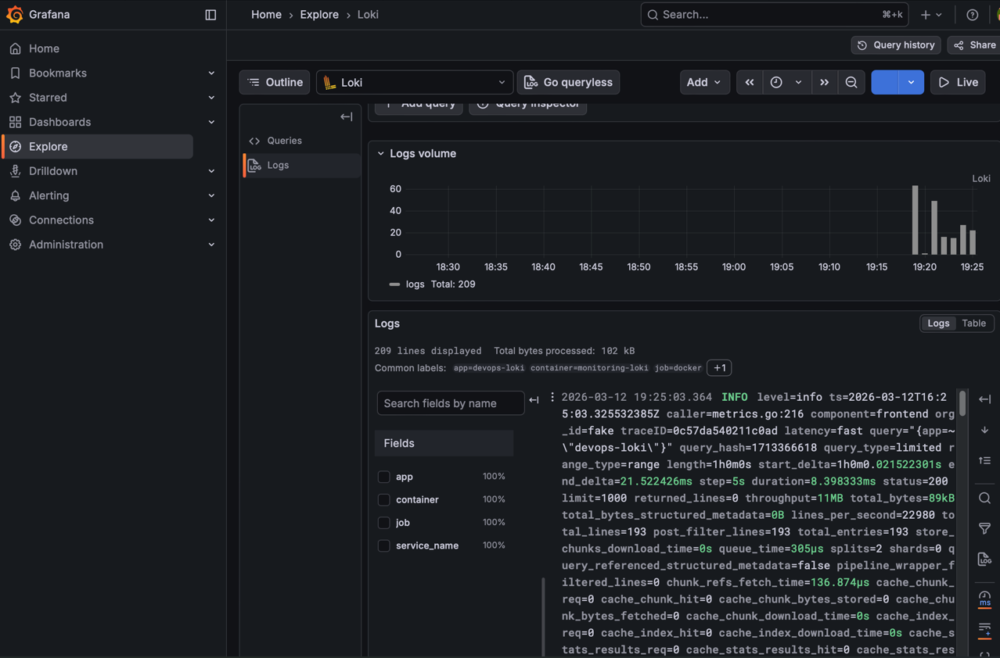
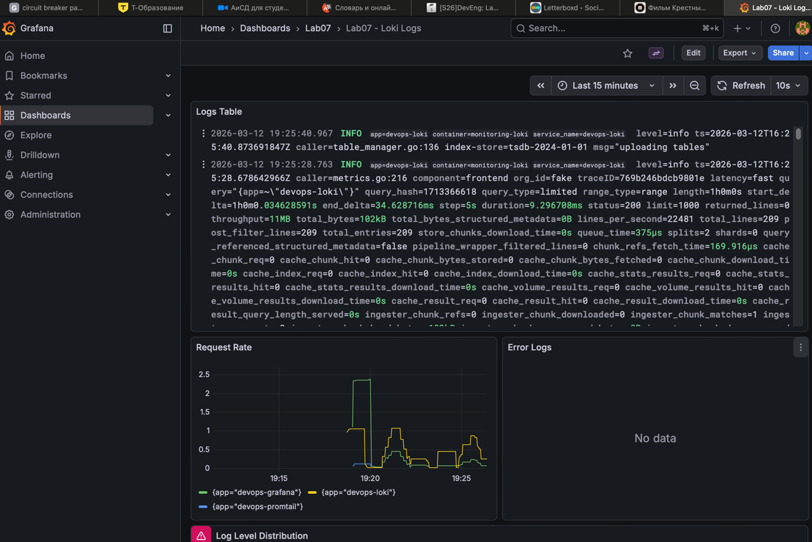

# Lab 07 - Observability and Logging with Loki Stack

## 1. Architecture

```text
+------------------------------+
|         Grafana 12.3.1       |
|  - Loki datasource (provisioned)
|  - Lab07 dashboard (4 panels)
+--------------+---------------+
               |
               | LogQL queries
               v
+--------------+---------------+
|          Loki 3.0.0          |
|  - TSDB schema v13           |
|  - Filesystem storage        |
|  - 7-day retention (168h)    |
+--------------+---------------+
               ^
               | push /loki/api/v1/push
+--------------+---------------+
|        Promtail 3.0.0        |
|  - Docker SD via socket      |
|  - Filter: logging=promtail  |
|  - Labels: app, container    |
+--------+---------------------+
         |
         | read container JSON logs
         v
+--------+---------------------+
| app-python (8000)            |
| app-go (8001->8080)          |
+------------------------------+
```

## 2. Setup Guide

1. Create local env file:
```bash
cp monitoring/.env.example monitoring/.env
```

2. If Docker logs are not at `/var/lib/docker/containers` (snap installs), update `DOCKER_CONTAINERS_PATH` in `monitoring/.env`.

3. Start stack:
```bash
cd monitoring
docker compose up -d --build
docker compose ps
```

4. Open Grafana at `http://localhost:3000` and log in as `admin` with `GF_SECURITY_ADMIN_PASSWORD` from `.env`.

5. Go to **Dashboards -> Lab 07 - Application Logs** (auto-provisioned).

## 3. Configuration

### Loki (`monitoring/loki/config.yml`)
- Uses `schema: v13` with `store: tsdb`.
- Filesystem-backed single-node setup under `/loki`.
- Retention configured via:
```yaml
limits_config:
  retention_period: 168h
```
- Compactor enabled for retention cleanup.

### Promtail (`monitoring/promtail/config.yml`)
- Docker service discovery:
```yaml
docker_sd_configs:
  - host: unix:///var/run/docker.sock
```
- Scrapes only containers labeled `logging=promtail`.
- Relabels:
  - `container` from Docker container name
  - `app` from Docker label `app`
- Reads JSON log files via `__path__` from container ID.

### Docker Compose (`monitoring/docker-compose.yml`)
- Services: Loki, Promtail, Grafana, app-python, app-go.
- Shared network: `logging`.
- Persistent volumes: `loki-data`, `grafana-data`.
- Security:
  - anonymous Grafana access disabled
  - admin password from `.env`
- Production settings:
  - resource constraints for all services
  - health checks for Loki and Grafana.

## 4. Application Logging

`app_python/app.py` now outputs structured JSON logs with a custom `JSONFormatter` and request middleware.

Example log line:
```json
{"timestamp":"2026-03-12T17:03:28.974789+00:00","level":"INFO","message":"HTTP request processed","method":"GET","path":"/health","status_code":200,"client_ip":"172.29.0.5","event":"http_request"}
```

Events logged:
- startup (`event=startup`)
- each HTTP request (method, path, status, client IP)
- errors and exceptions.

## 5. Dashboard

Provisioned dashboard file: `monitoring/grafana/dashboards/lab07-logs-dashboard.json`

Panels:
1. Logs Table (all app logs)
```logql
{app=~"devops-.*"}
```

2. Request Rate (time series by app)
```logql
sum by (app) (rate({app=~"devops-.*"}[1m]))
```

3. Error Logs
```logql
{app=~"devops-.*"} | json | level="ERROR"
```

4. Log Level Distribution (pie chart)
```logql
sum by (level) (count_over_time({app=~"devops-.*"} | json [5m]))
```

## 6. Production Config

Implemented hardening:
- resource limits/reservations on all services
- Grafana anonymous auth disabled (`GF_AUTH_ANONYMOUS_ENABLED=false`)
- admin password externalized into `.env` (ignored by git)
- Loki retention set to 7 days
- service labels + Promtail label filter to reduce noise.

## 7. Testing

Traffic generation:
```bash
docker exec devops-go sh -lc 'for i in $(seq 1 20); do wget -qO- http://devops-python:8000/ >/dev/null; done; for i in $(seq 1 20); do wget -qO- http://devops-python:8000/health >/dev/null; done'
```

Service status:
```bash
docker compose -f monitoring/docker-compose.yml ps
```

Loki labels discovered:
```bash
docker exec loki sh -lc 'wget -qO- "http://localhost:3100/loki/api/v1/labels"'
# -> {"status":"success","data":["app","container","service_name"]}
```

LogQL API query checks:
```bash
# all python app logs
docker exec loki sh -lc 'wget -qO- "http://localhost:3100/loki/api/v1/query?query=%7Bapp%3D%22devops-python%22%7D"'

# errors only
docker exec loki sh -lc 'wget -qO- "http://localhost:3100/loki/api/v1/query?query=%7Bapp%3D%22devops-python%22%7D%20%7C%3D%20%22ERROR%22"'

# parse json and filter method
docker exec loki sh -lc 'wget -qO- "http://localhost:3100/loki/api/v1/query?query=%7Bapp%3D%22devops-python%22%7D%20%7C%20json%20%7C%20method%3D%22GET%22"'
```

Evidences:





## 8. Challenges

1. Promtail mount path differed on this host (`/var/snap/docker/common/var-lib-docker/containers`).
- Solution: made source path configurable with `DOCKER_CONTAINERS_PATH` while defaulting to `/var/lib/docker/containers`.

2. `wget` was unavailable in Promtail/app images.
- Solution: removed non-required health checks from Promtail and apps; kept required health checks for Loki and Grafana.

3. Host-network `curl localhost:PORT` was unavailable in this execution environment.
- Solution: validated via Docker health statuses, container logs, and Loki HTTP API from inside the Loki container.

## Bonus - Ansible Automation

Implemented role: `ansible/roles/monitoring`

Structure:
- `defaults/main.yml` - versions, ports, retention, resources, Docker logs path
- `tasks/setup.yml` - create directories and template files
- `tasks/deploy.yml` - deploy with `community.docker.docker_compose_v2`, wait/check readiness, configure Grafana datasource
- `templates/*` - Compose, Loki, Promtail, Grafana provisioning, dashboard JSON
- `meta/main.yml` - depends on `docker` role

Playbook:
- `ansible/playbooks/deploy-monitoring.yml`

Syntax check executed:
```bash
ANSIBLE_LOCAL_TEMP=/tmp/ansible-local ANSIBLE_REMOTE_TEMP=/tmp/ansible-remote ansible-playbook ansible/playbooks/deploy-monitoring.yml --syntax-check
```

Idempotency test command:
```bash
ansible-playbook ansible/playbooks/deploy-monitoring.yml
ansible-playbook ansible/playbooks/deploy-monitoring.yml
```
(Expected: second run should report no changes, except when remote image pull updates tags.)
