# Lab 7 — Observability & Logging with Loki Stack

## Overview

This report documents the complete implementation of Lab 7, setting up centralized logging for applications using the Grafana Loki stack, deploying Loki 3.0 (log storage with TSDB), Promtail (log collector), and Grafana 11 (visualization), then integrating apps from previous labs.

## Architecture

The logging stack consists of the following components:

- **Loki 3.0**: Log aggregation backend with TSDB storage for fast queries
- **Promtail 3.0**: Log collector that discovers Docker containers and ships logs to Loki
- **Grafana 12.3.1**: Visualization platform for log exploration and dashboards
- **Python App**: FastAPI service with JSON structured logging
- **Go App**: service with JSON structured logging

All components run in Docker containers connected via a shared `logging` network. Promtail uses Docker service discovery to collect logs from containers labeled with `logging=promtail`.

### Diagram

```
                +------------------+
                |     Grafana      |
                |   :3000 (UI)     |
                +--------+---------+
                         |
                         | LogQL queries
                         v
                +------------------+
                |       Loki       |
                |   :3100 (API)    |
                +--------+---------+
                         ^
                         | push logs
                +--------+---------+
                |     Promtail     |
                |   :9080 (HTTP)   |
                +--------+---------+
                         ^
                         | Docker SD + labels
          +--------------+---------------+
          |                              |
 +--------+---------+          +---------+--------+
 |  app-python      |          |     app-go       |
 |  :8000 -> 5000   |          |  :8001 -> 8080   |
 +------------------+          +------------------+
```

## Setup Guide

### Prerequisites
- Docker and Docker Compose installed
- Python 3.13 and Go 1.21 for building application images
- At least 4GB RAM available for the stack

### Deployment Steps

1. **Clone and navigate to the project:**
   ```bash
   cd /path/to/DevOps-Core-Course/monitoring
   ```

2. **Build and start the stack:**
   ```bash
   docker compose up -d --build
   ```

3. **Verify services are running:**
   ```bash
   docker compose ps
   ```

4. **Check service health:**
   ```bash
   # Loki readiness
   curl http://localhost:3100/ready

   # Grafana health
   curl http://localhost:3000/api/health
   ```

5. **Access Grafana:**
   - URL: http://localhost:3000
   - Username: example
   - Password: example (actual values take from `monitoring/.env`)

Grafana provisioning is enabled:
- Data source auto-provisioned from `monitoring/grafana/provisioning/datasources/loki.yml`
- Dashboard auto-provisioned from `monitoring/grafana/dashboards/lab07-dashboard.json`

### Configuration

#### Loki Configuration (`monitoring/loki/config.yml`)
```yaml
auth_enabled: false
server:
  http_listen_port: 3100
common:
  path_prefix: /loki
  storage:
    filesystem:
      chunks_directory: /loki/chunks
      rules_directory: /loki/rules
  replication_factor: 1
  ring:
    kvstore:
      store: inmemory
schema_config:
  configs:
    - from: 2020-10-24
      store: tsdb
      object_store: filesystem
      schema: v13
      index:
        prefix: index_
        period: 24h
storage_config:
  tsdb_shipper:
    active_index_directory: /loki/tsdb-index
    cache_location: /loki/tsdb-cache
    cache_ttl: 24h
  filesystem:
    directory: /loki/chunks
limits_config:
  retention_period: 168h
compactor:
  working_directory: /loki/compactor
  compaction_interval: 10m
  retention_enabled: true
  delete_request_store: filesystem
```

Key features:
- TSDB storage for 10x faster queries
- 7-day log retention (168 hours)
- Filesystem storage for single-instance deployment

#### Promtail Configuration (`monitoring/promtail/config.yml`)
```yaml
server:
  http_listen_port: 9080
positions:
  filename: /tmp/positions.yaml
clients:
  - url: http://loki:3100/loki/api/v1/push
scrape_configs:
  - job_name: docker
    docker_sd_configs:
      - host: unix:///var/run/docker.sock
        refresh_interval: 5s
    relabel_configs:
      - target_label: job
        replacement: docker
      - source_labels: ['__meta_docker_container_name']
        regex: '/(.*)'
        target_label: 'container'
        replacement: '$1'
      - source_labels: ['__meta_docker_container_label_logging']
        regex: 'promtail'
        action: keep
      - source_labels: ['__meta_docker_container_label_app']
        target_label: 'app'
```

Features:
- Docker service discovery
- Container name extraction as label
- Filtering by `logging=promtail` label
- App name labeling for queries

#### Docker Compose Configuration
```yaml
version: '3.8'
services:
  loki:
    image: grafana/loki:3.0.0
    ports: ["3100:3100"]
    volumes:
      - ./loki/config.yml:/etc/loki/config.yml
      - loki-data:/loki
    command: -config.file=/etc/loki/config.yml
    networks: [logging]
    healthcheck:
      test: ["CMD-SHELL", "wget --no-verbose --tries=1 --spider http://localhost:3100/ready || exit 1"]
      interval: 10s
      timeout: 5s
      retries: 5
      start_period: 10s
    deploy:
      resources:
        limits:
          cpus: '1.0'
          memory: 1G
        reservations:
          cpus: '0.5'
          memory: 512M

  # ... other services with similar resource limits
```

Grafana volumes include provisioning and dashboards:
```yaml
    volumes:
      - grafana-data:/var/lib/grafana
      - ./grafana/provisioning:/etc/grafana/provisioning
      - ./grafana/dashboards:/var/lib/grafana/dashboards
```

## Application Logging

### Python Application (FastAPI)

#### JSON Logging Implementation
Updated `app_python/app.py` to use custom JSON logging without external dependencies:

```python
# Custom JSON formatter
class JSONFormatter(logging.Formatter):
    def format(self, record):
        log_entry = {
            "timestamp": self.formatTime(record, self.datefmt),
            "level": record.levelname,
            "message": record.getMessage(),
        }
        # Add extra fields from record
        for key in ['service', 'version', 'method', 'path', 'status_code', 'client_ip', 'user_agent', 'process_time_ms']:
            if hasattr(record, key):
                log_entry[key] = getattr(record, key)
        return json.dumps(log_entry)

# Configure logging
formatter = JSONFormatter(datefmt="%Y-%m-%dT%H:%M:%SZ")
handler = logging.StreamHandler()
handler.setFormatter(formatter)
logger.addHandler(handler)
```

#### Sample Log Output
```json
2026-03-11 20:26:38.920info{
  "timestamp": "2026-03-11T17:26:38Z",
  "level": "INFO",
  "message": "HTTP Request",
  "method": "GET",
  "path": "/health",
  "status_code": 200,
  "client_ip": "172.18.0.1",
  "user_agent": "curl/7.81.0",
  "process_time_ms": 0.27
}
```

### Go Application (net/http)

#### JSON Logging Implementation
Updated `app_go/main.go` to use custom JSON logging without external dependencies:

```go
// LogEntry represents a structured log entry
type LogEntry struct {
    Level     string `json:"level"`
    Message   string `json:"message"`
    Time      string `json:"time"`
    Service   string `json:"service,omitempty"`
    Version   string `json:"version,omitempty"`
    Method    string `json:"method,omitempty"`
    Path      string `json:"path,omitempty"`
    ClientIP  string `json:"client_ip,omitempty"`
    UserAgent string `json:"user_agent,omitempty"`
}

// logJSON logs a structured JSON message
func logJSON(entry LogEntry) {
    entry.Time = time.Now().UTC().Format(time.RFC3339)
    json.NewEncoder(os.Stdout).Encode(entry)
}
```

#### Sample Log Output
```json
2026-03-11 20:32:16.663debug{
  "level": "info",
  "message": "HTTP Request to health",
  "time": "2026-03-11T17:32:16Z",
  "method": "GET",
  "path": "/health",
  "client_ip": "172.18.0.1:37384",
  "user_agent": "curl/7.81.0"
}
```

## Dashboard

Created a comprehensive Grafana dashboard with 4 panels and provisioned it via file:
- `monitoring/grafana/dashboards/lab07-dashboard.json`

### 1. Logs Table
- **Visualization**: Logs
- **Query**: `{app=~"devops-.*"}`
- **Purpose**: Shows recent logs from all applications in chronological order

### 2. Request Rate
- **Visualization**: Time series
- **Query**: `sum by (app) (rate({app=~"devops-.*"} [1m]))`
- **Purpose**: Displays logs per second by application, showing traffic patterns

### 3. Error Logs
- **Visualization**: Logs
- **Query**: `{app=~"devops-.*"} | json | level="ERROR"`
- **Purpose**: Filters and displays only error-level logs for quick issue identification

### 4. Log Level Distribution
- **Visualization**: Pie chart
- **Query**: `sum by (level) (count_over_time({app=~"devops-.*"} | json [5m]))`
- **Purpose**: Shows distribution of log levels (INFO, ERROR, etc.) over the last 5 minutes

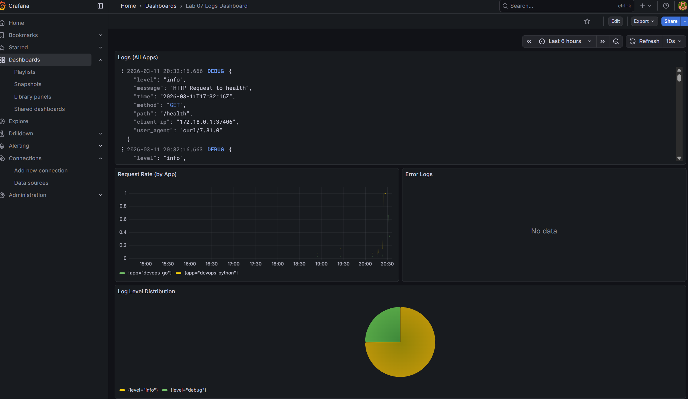

## Production Configuration

### Resource Limits
All services have resource constraints to prevent resource exhaustion:

```yaml
deploy:
  resources:
    limits:
      cpus: '1.0'
      memory: 1G
    reservations:
      cpus: '0.5'
      memory: 512M
```

### Security Measures
- **Grafana**: Anonymous access disabled, admin password set
- **Loki**: Authentication disabled for development (would be enabled in production)
- **Promtail**: Access to Docker socket (secured in production environments)

### Health Checks
All services include health checks:
- **Loki**: `http://localhost:3100/ready`
- **Grafana**: `http://localhost:3000/api/health`
- **Applications**: Built-in health endpoints (`/health`)

### Verification
```bash
$ docker compose ps
WARN[0000] /mnt/c/Users/1alen/Desktop/My_Py_Projects/DevOps-Core-Course/monitoring/docker-compose.yml: the attribute `version` is obsolete, it will be ignored, please remove it to avoid potential confusion
NAME         IMAGE                    COMMAND                  SERVICE      CREATED             STATUS                    PORTS
app-go       monitoring-app-go        "/usr/local/bin/devo…"   app-go       2 hours ago         Up 15 minutes             0.0.0.0:8001->8080/tcp
app-python   monitoring-app-python    "uvicorn app:app --h…"   app-python   2 hours ago         Up 15 minutes             0.0.0.0:8000->5000/tcp
grafana      grafana/grafana:12.3.1   "/run.sh"                grafana      15 minutes ago      Up 15 minutes (healthy)   0.0.0.0:3000->3000/tcp
loki         grafana/loki:3.0.0       "/usr/bin/loki -conf…"   loki         2 hours ago         Up 15 minutes (healthy)   0.0.0.0:3100->3100/tcp
promtail     grafana/promtail:3.0.0   "/usr/bin/promtail -…"   promtail     About an hour ago   Up 15 minutes             0.0.0.0:9080->9080/tcp

$ curl http://localhost:3000/api/health
{
  "database": "ok",
  "version": "12.3.1",
  "commit": "3a1c80ca7ce612f309fdc99338dd3c5e486339be"
}

$ curl http://localhost:3100/ready
ready
```

## Testing

### Successfull start
```bash
$ docker compose ps

$ curl http://localhost:3000/api/health

$ curl http://localhost:3100/ready
```

### Generate Test Logs
```bash
# Generate traffic to Python app
for i in {1..20}; do
  curl http://localhost:8000/
  echo
done
for i in {1..20}; do
  curl http://localhost:8000/health
  echo
done

# Generate traffic to Go app
for i in {1..20}; do
  curl http://localhost:8001/
  echo
done
for i in {1..20}; do
  curl http://localhost:80001health
  echo
done
```

### LogQL Queries Tested
1. **All logs**: `{app=~"devops-.*"}`
2. **Python app only**: `{app="devops-python"}`
3. **Go app only**: `{app="devops-go"}`
4. **Errors only**: `{app=~"devops-.*"} | json | level="ERROR"`
5. **GET requests**: `{app=~"devops-.*"} | json | method="GET"`
6. **Rate over time**: `rate({app=~"devops-.*"}[1m])`
7. **Count by level**: `sum by (level) (count_over_time({app=~"devops-.*"} | json [5m]))`

### Grafana Data Source
- **Type**: Loki
- **URL**: http://loki:3100
- **Status**: Successfully connected

### Required Query Check
In **Explore**, this query should return logs from all containers:
```
{job="docker"}
```

## Challenges & Solutions

### Challenge 1: JSON Parsing in LogQL
**Problem**: Initial attempts to parse JSON logs failed due to incorrect field references.

**Solution**: Used `{app="devops-python"} | json` to parse JSON, then accessed fields like `level` and `method`.

### Challenge 2: Network Issues During Build
**Problem**: Docker builds failed due to network connectivity issues when downloading dependencies (Go modules, Python packages).

**Solution**: Modified implementations to use standard library features instead of external dependencies:
- Replaced Logrus with custom JSON logging in Go
- Replaced python-json-logger with custom JSON formatter in Python
- Removed external logging dependencies to avoid network downloads during build

## Evidence of all tasks completed

### Task 1 — Deploy Loki Stack
1. Verify services:
  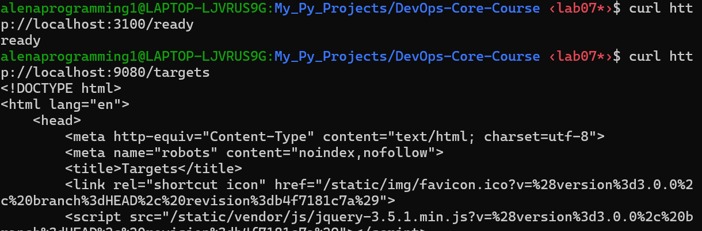

2. Screenshot showing logs from at least 3 containers in Grafana Explore
  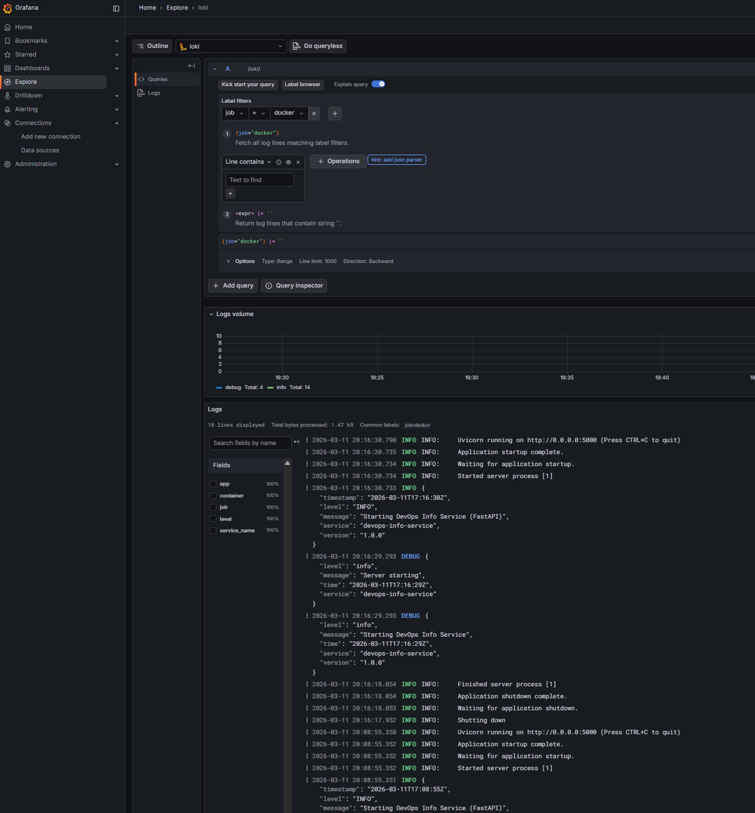

### Task 2 — Integrate Your Applications
1. Screenshot of JSON log output from your app  
  **app_python**  
  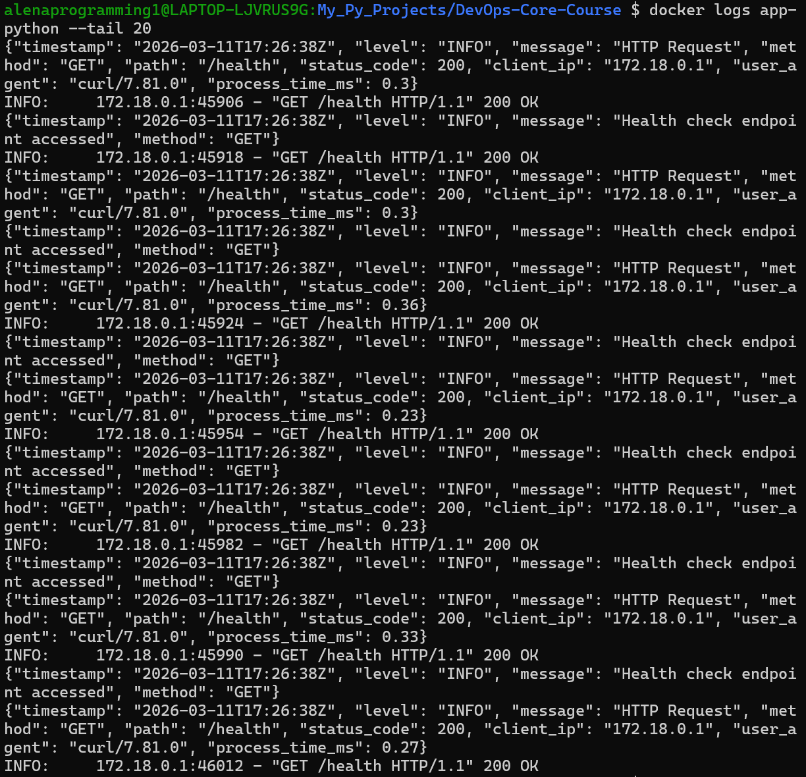  
  **app_go**  
  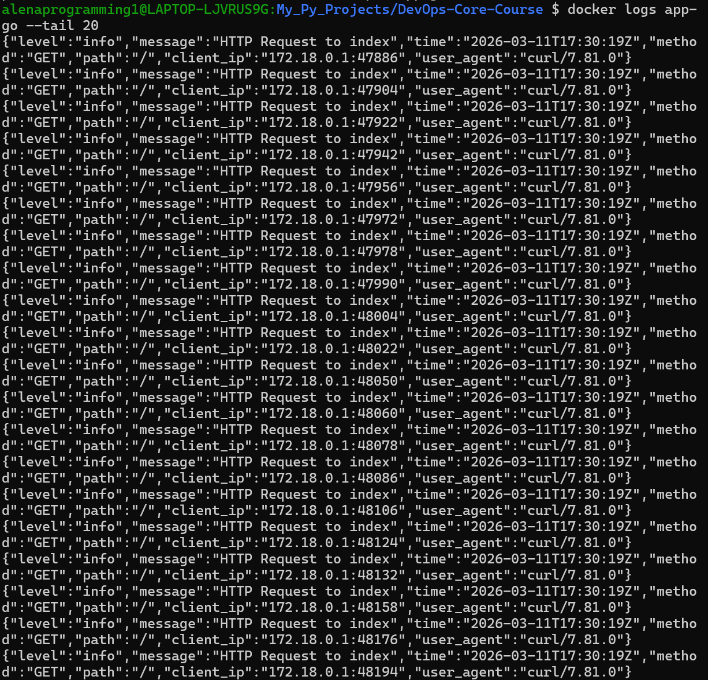  

2. Screenshot of Grafana showing logs from both applications with 3 different LogQL queries that work  
  **app_python**  
  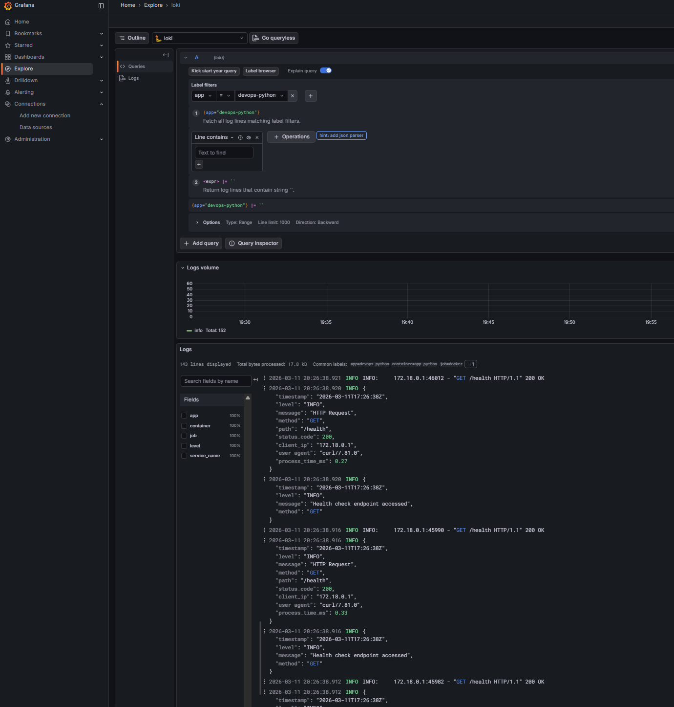  
  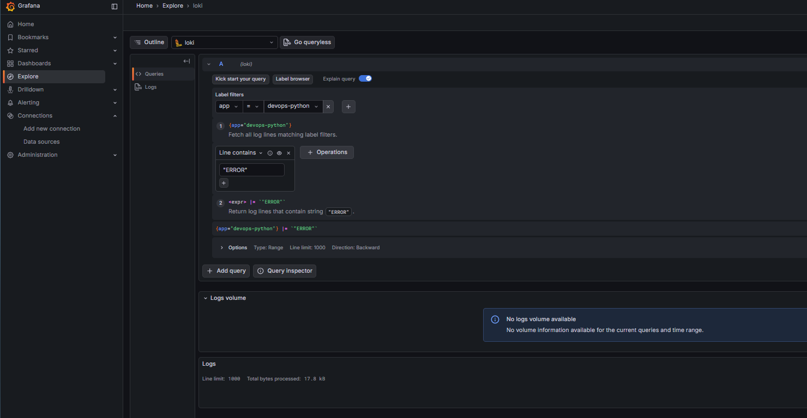  
  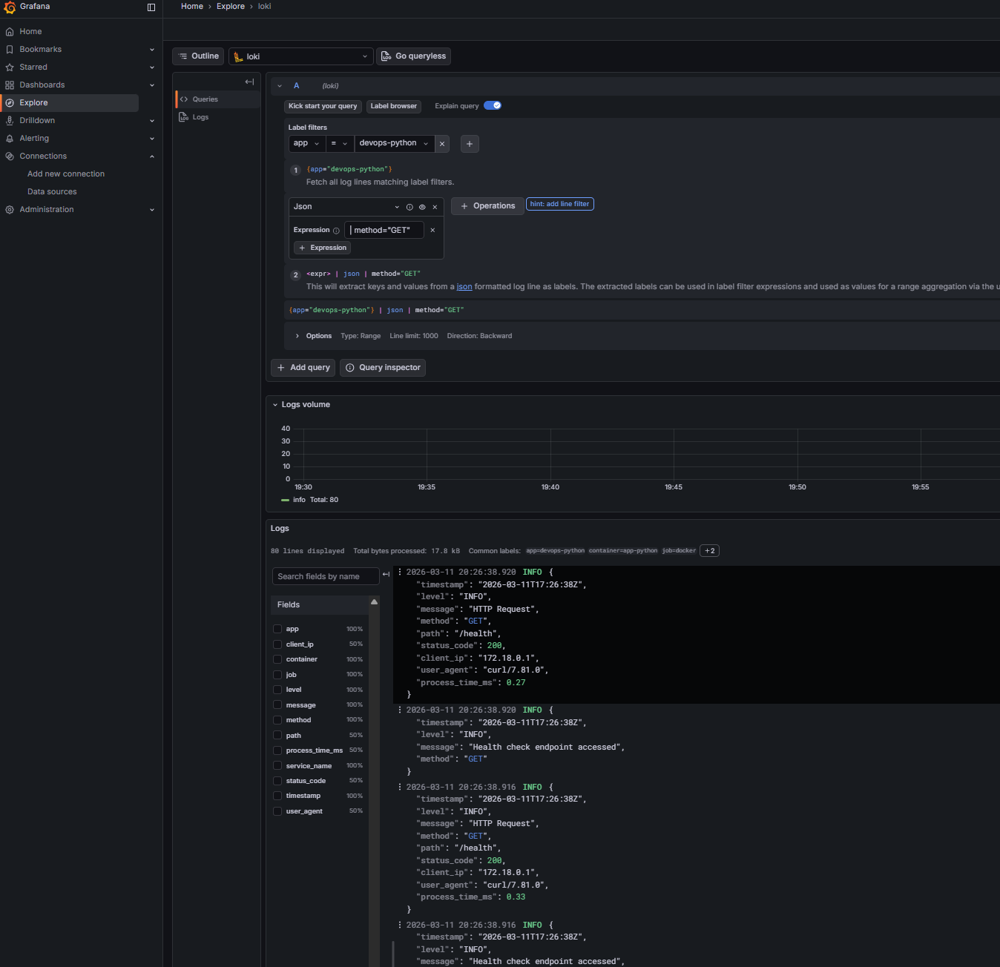  
  **app_go**  
  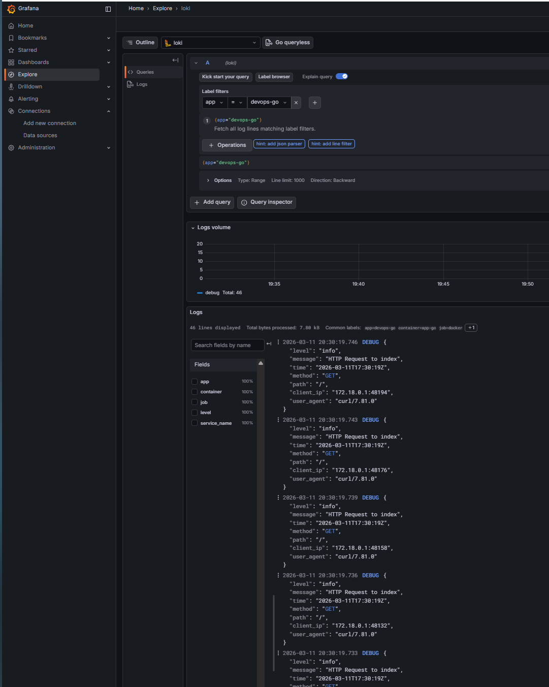  
  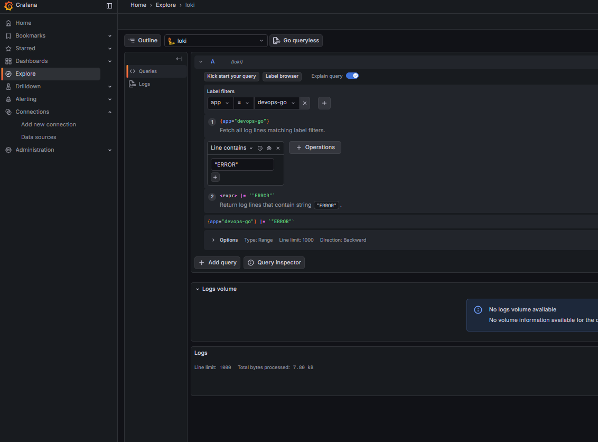  
  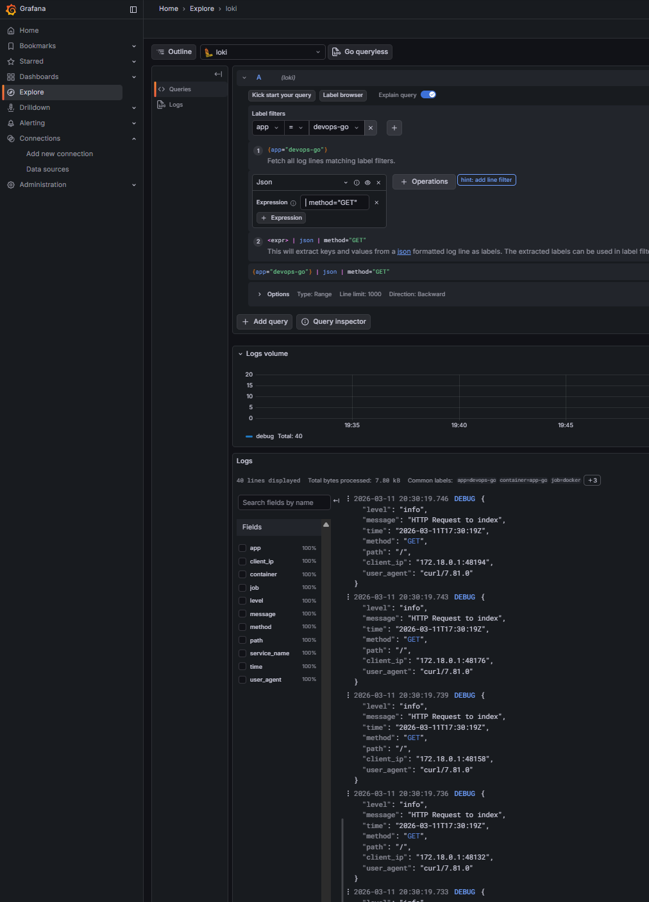  

### Task 3 — Build Log Dashboard
Screenshot of your dashboard showing all 4 panels with real data:  


### Task 4 — Production Readiness
1. `docker-compose ps` showing all services healthy  
  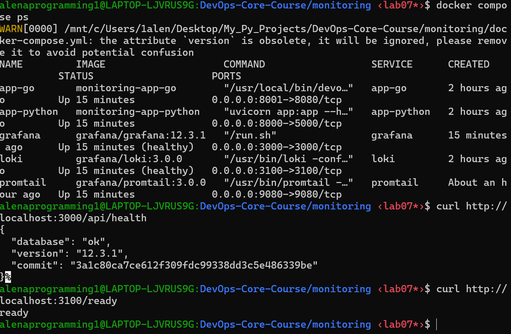  
2. Screenshot of Grafana login page (no anonymous access)
  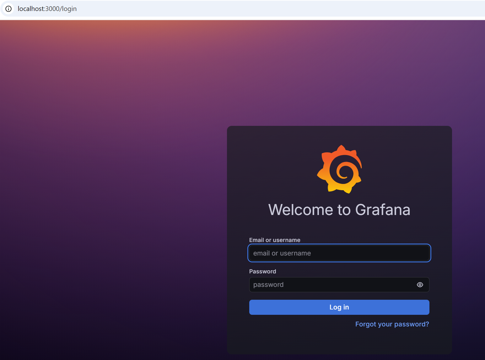
