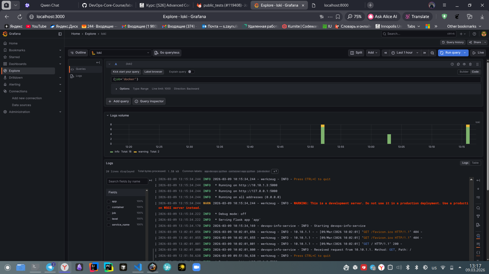
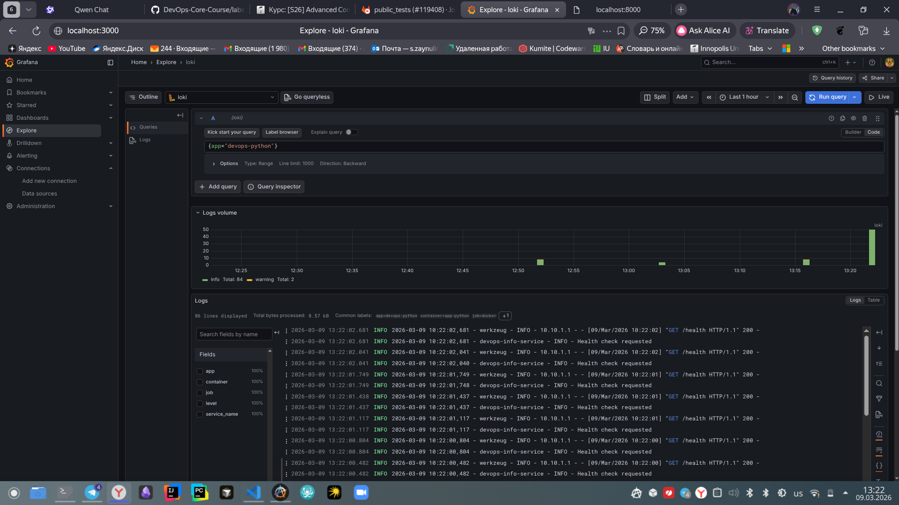
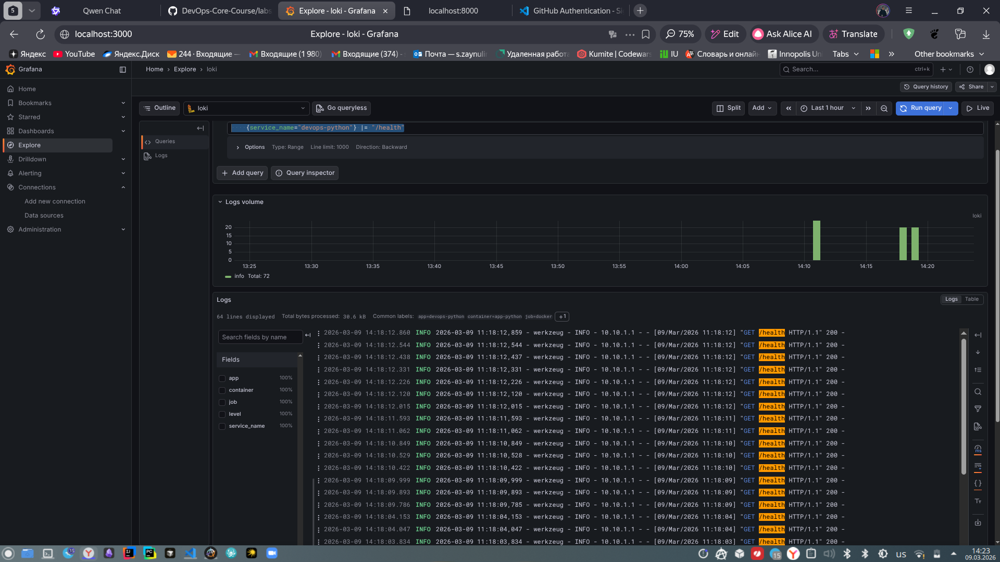
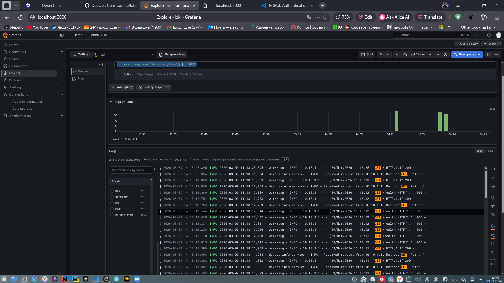
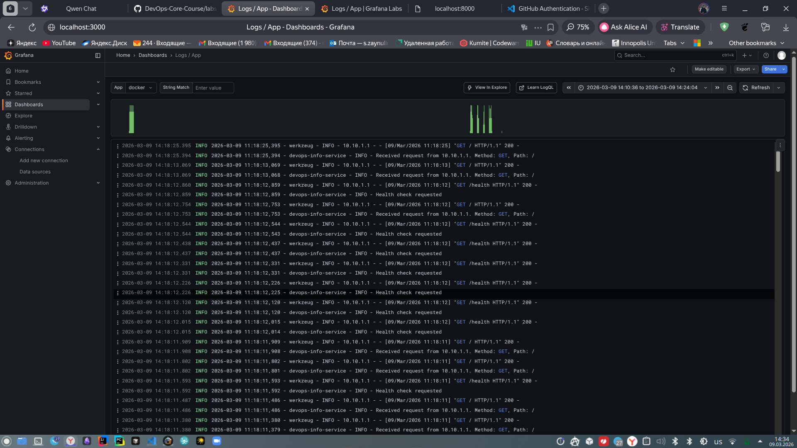
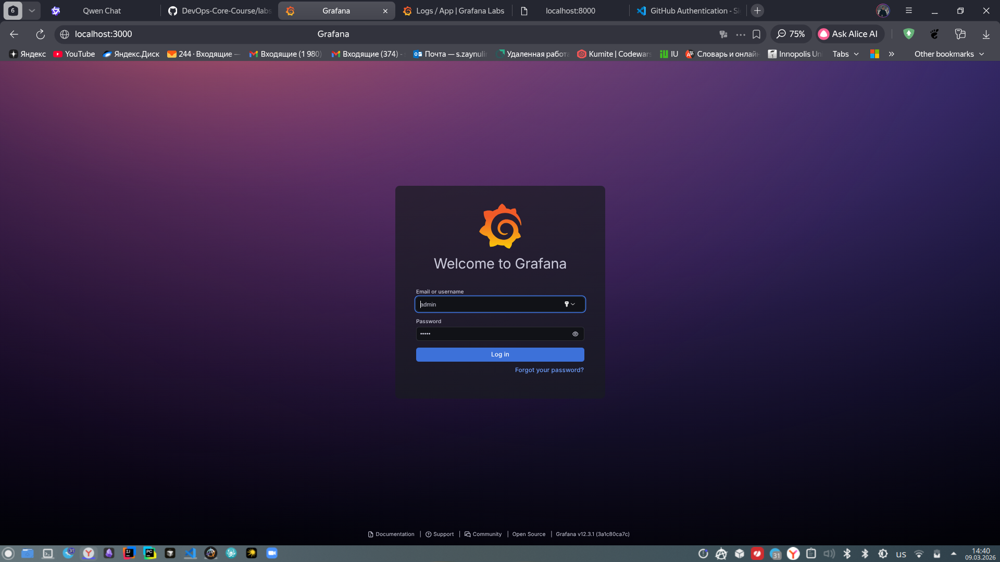

# LAB07 — Observability & Logging with Loki Stack

## Architecture

```
app-python -(logs)-> promtail -(push)-> loki -> grafana <- browser
```

**Data flow:**
1. `app-python` writes JSON logs to `stdout` / `stderr`.
2. Docker captures those logs and stores them under `/var/lib/docker/containers/`.
3. **Promtail** watches the Docker socket, discovers containers labelled `logging=promtail`, reads their logs, and ships them to Loki.
4. **Loki** indexes log streams by labels (`app`, `container`) and stores log chunks on the filesystem using the TSDB index (Loki 3.0+).
5. **Grafana** connects to Loki as a data source and lets you explore logs with LogQL.

## Testing details 

For testing this task, used basic python script what apply requests to app-python server. 

script name: `log_generator.py`

## Setup Guide

### Deployment

```bash
cd monitoring

# 1. Create .env from the example and set a strong password
cp .env.example .env
# Edit .env: set GF_ADMIN_PASSWORD

# 2. Start the stack
docker compose up -d

# 3. Verify all containers are healthy
docker compose ps

# 4. Smoke-test Loki
curl http://localhost:3100/ready   # expected: "ready"

# 5. Check Promtail is discovering targets
curl http://localhost:9080/targets

# 6. Open Grafana
xdg-open http://localhost:3000   
```

## Docker compose tests 

- `docker compose ps`

```bash
NAME         IMAGE                                        COMMAND                  SERVICE      CREATED          STATUS                    PORTS
app-python   zsalavat/devops-info-service-python:latest   "python app.py"          app-python   29 seconds ago   Up 28 seconds             0.0.0.0:8000->5000/tcp, [::]:8000->5000/tcp
grafana      grafana/grafana:12.3.1                       "/run.sh"                grafana      29 seconds ago   Up 7 seconds (healthy)    0.0.0.0:3000->3000/tcp, [::]:3000->3000/tcp
loki         grafana/loki:3.0.0                           "/usr/bin/loki -conf…"   loki         29 seconds ago   Up 28 seconds (healthy)   0.0.0.0:3100->3100/tcp, [::]:3100->3100/tcp
promtail     grafana/promtail:3.0.0                       "/usr/bin/promtail -…"   promtail     29 seconds ago   Up 7 seconds    
```
- `curl http://localhost:3100/ready`

```bash
➜  monitoring git:(lab7) ✗ curl http://localhost:3100/ready
ready
```

- ` curl http://localhost:9080/targets`

```bash
➜  monitoring git:(lab7) ✗ curl http://localhost:9080/targets 

<!DOCTYPE html>
<html lang="en">
    <head>
        <meta http-equiv="Content-Type" content="text/html; charset=utf-8">
        <meta name="robots" content="noindex,nofollow">
        <title>Targets</title>
        <link rel="shortcut icon" href="/static/img/favicon.ico?v=%28version%3d3.0.0%2c%20branch%3dHEAD%2c%20revision%3db4f7181c7a%29">
        <script src="/static/vendor/js/jquery-3.5.1.min.js?v=%28version%3d3.0.0%2c%20branch%3dHEAD%2c%20revision%3db4f7181c7a%29"></script>
        <script src="/static/vendor/js/popper.min.js?v=%28version%3d3.0.0%2c%20branch%3dHEAD%2c%20revision%3db4f7181c7a%29"></script>
        <script src="/static/vendor/bootstrap-4.1.3/js/bootstrap.min.js?v=%28version%3d3.0.0%2c%20branch%3dHEAD%2c%20revision%3db4f7181c7a%29"></script>

        <link type="text/css" rel="stylesheet" href="/static/vendor/bootstrap-4.1.3/css/bootstrap.min.css?v=%28version%3d3.0.0%2c%20branch%3dHEAD%2c%20revision%3db4f7181c7a%29">
        <link type="text/css" rel="stylesheet" href="/static/css/promtail.css?v=%28version%3d3.0.0%2c%20branch%3dHEAD%2c%20revision%3db4f7181c7a%29">
        <link type="text/css" rel="stylesheet" href="/static/vendor/bootstrap4-glyphicons/css/bootstrap-glyphicons.min.css?v=%28version%3d3.0.0%2c%20branch%3dHEAD%2c%20revision%3db4f7181c7a%29">

        <script>
            var PATH_PREFIX = "";
            var BUILD_VERSION = "(version=3.0.0, branch=HEAD, revision=b4f7181c7a)";
            $(function () {
                $('[data-toggle="tooltip"]').tooltip()
            })
        </script>

        
<link type="text/css" rel="stylesheet" href="/static/css/targets.css?v=%28version%3d3.0.0%2c%20branch%3dHEAD%2c%20revision%3db4f7181c7a%29">
<script src="/static/js/targets.js?v=%28version%3d3.0.0%2c%20branch%3dHEAD%2c%20revision%3db4f7181c7a%29"></script>

    </head>

    <body>
        <nav class="navbar fixed-top navbar-expand-sm navbar-dark bg-dark">
            <div class="container-fluid">

                <button type="button" class="navbar-toggler" data-toggle="collapse" data-target="#nav-content" aria-expanded="false" aria-controls="nav-content" aria-label="Toggle navigation">
                    <span class="navbar-toggler-icon"></span>
                    
                </button>

                <a class="navbar-brand" href="#">Promtail</a>


                <div id="nav-content" class="navbar-collapse collapse">
                    <ul class="navbar-nav">
                        <li class="nav-item"><a class="nav-link" href="/service-discovery">Service Discovery</a></li>
                        <li class="nav-item"><a class="nav-link" href="/targets">Targets</a></li>
                        <li class="nav-item"><a class="nav-link" href="/config">Config</a></li>
                        <li class= "nav-item" >
                            <a class ="nav-link" href="https://github.com/grafana/loki" target="_blank">Help</a>
                        </li>
                    </ul>
                </div>
            </div>
        </nav>

        
  <div class="container-fluid">
    <h1>Targets</h1>
    <div id="showTargets" class="btn-group btn-group-toggle" data-toggle="buttons">
      <label class="btn btn-primary">
        <input type="radio" name="targets" id="all-targets" autocomplete="off" checked> All
      </label>
      <label class="btn btn-primary">
        <input type="radio" name="targets" id="unready-targets" autocomplete="off"> Unready
      </label>
      </br>
  </div>

    
    
    

    <div class="table-container">
      <h2 class="job_header">
        <a id="job-docker/unix:///var/run/docker.sock:80" href="#job-docker%2funix%3a%2f%2f%2fvar%2frun%2fdocker.sock%3a80">docker/unix:///var/run/docker.sock:80 (1/1 ready)</a>
        <button type="button" class="targets expanded-table btn btn-primary">show less</button>
      </h2>
      <table class="table table-sm table-bordered table-striped table-hover">
        <thead class="job_details">
          <tr>
            <th>Type</th>
            <th>Ready</th>
            <th>Labels</th>
            <th>Details</th>
          </tr>
        </thead>
        <tbody>
        
          <tr>
            <td class="type">
              <span >Docker</a><br>
            </td>
            <td class="state">
              <span class="alert alert-success state_indicator text-uppercase">
                true
              </span>
            </td>
            <td class="labels">
              <span class="cursor-pointer" data-toggle="tooltip" title="" data-html=true data-original-title="<b>Before relabeling:</b><br>__address__=&quot;10.10.1.3:5000&quot;<br>__meta_docker_container_id=&quot;2ca9790fcf58ed0d710bd80681d7fc5ca42260e982ce62b6e121d8467417198b&quot;<br>__meta_docker_container_label_app=&quot;devops-python&quot;<br>__meta_docker_container_label_com_docker_compose_config_hash=&quot;802c548f88d7fe5a8114c66a63d9446088fde9b5a4f5fd5bcab92f5df03421c4&quot;<br>__meta_docker_container_label_com_docker_compose_container_number=&quot;1&quot;<br>__meta_docker_container_label_com_docker_compose_depends_on=&quot;&quot;<br>__meta_docker_container_label_com_docker_compose_image=&quot;sha256:6c1370dcf3ccab889830e63d7ae9825d83a957b91f7e03ede76dc405a6e0212b&quot;<br>__meta_docker_container_label_com_docker_compose_oneoff=&quot;False&quot;<br>__meta_docker_container_label_com_docker_compose_project=&quot;monitoring&quot;<br>__meta_docker_container_label_com_docker_compose_project_config_files=&quot;/home/setterwars/Documents/IU/DevOps-Core-Course/monitoring/docker-compose.yml&quot;<br>__meta_docker_container_label_com_docker_compose_project_working_dir=&quot;/home/setterwars/Documents/IU/DevOps-Core-Course/monitoring&quot;<br>__meta_docker_container_label_com_docker_compose_service=&quot;app-python&quot;<br>__meta_docker_container_label_com_docker_compose_version=&quot;5.0.1&quot;<br>__meta_docker_container_label_logging=&quot;promtail&quot;<br>__meta_docker_container_name=&quot;/app-python&quot;<br>__meta_docker_container_network_mode=&quot;monitoring_logging&quot;<br>__meta_docker_network_id=&quot;b3d277c42f7f7fd5beeba472780f08fca1cc945a70e7733c4ede82e2a8ac0f32&quot;<br>__meta_docker_network_ingress=&quot;false&quot;<br>__meta_docker_network_internal=&quot;false&quot;<br>__meta_docker_network_ip=&quot;10.10.1.3&quot;<br>__meta_docker_network_label_com_docker_compose_config_hash=&quot;ddec219b739fc99508f3c08de6c29964e557ed6549f4f58bb6df60e82e20dbb5&quot;<br>__meta_docker_network_label_com_docker_compose_network=&quot;logging&quot;<br>__meta_docker_network_label_com_docker_compose_project=&quot;monitoring&quot;<br>__meta_docker_network_label_com_docker_compose_version=&quot;5.0.1&quot;<br>__meta_docker_network_name=&quot;monitoring_logging&quot;<br>__meta_docker_network_scope=&quot;local&quot;<br>__meta_docker_port_private=&quot;5000&quot;<br>__meta_docker_port_public=&quot;8000&quot;<br>__meta_docker_port_public_ip=&quot;0.0.0.0&quot;">
                
                  <span class="badge badge-primary">__address__="10.10.1.3:5000"</span>
                
                  <span class="badge badge-primary">__meta_docker_container_id="2ca9790fcf58ed0d710bd80681d7fc5ca42260e982ce62b6e121d8467417198b"</span>
                
                  <span class="badge badge-primary">__meta_docker_container_label_app="devops-python"</span>
                
                  <span class="badge badge-primary">__meta_docker_container_label_com_docker_compose_config_hash="802c548f88d7fe5a8114c66a63d9446088fde9b5a4f5fd5bcab92f5df03421c4"</span>
                
                  <span class="badge badge-primary">__meta_docker_container_label_com_docker_compose_container_number="1"</span>
                
                  <span class="badge badge-primary">__meta_docker_container_label_com_docker_compose_depends_on=""</span>
                
                  <span class="badge badge-primary">__meta_docker_container_label_com_docker_compose_image="sha256:6c1370dcf3ccab889830e63d7ae9825d83a957b91f7e03ede76dc405a6e0212b"</span>
                
                  <span class="badge badge-primary">__meta_docker_container_label_com_docker_compose_oneoff="False"</span>
                
                  <span class="badge badge-primary">__meta_docker_container_label_com_docker_compose_project="monitoring"</span>
                
                  <span class="badge badge-primary">__meta_docker_container_label_com_docker_compose_project_config_files="/home/setterwars/Documents/IU/DevOps-Core-Course/monitoring/docker-compose.yml"</span>
                
                  <span class="badge badge-primary">__meta_docker_container_label_com_docker_compose_project_working_dir="/home/setterwars/Documents/IU/DevOps-Core-Course/monitoring"</span>
                
                  <span class="badge badge-primary">__meta_docker_container_label_com_docker_compose_service="app-python"</span>
                
                  <span class="badge badge-primary">__meta_docker_container_label_com_docker_compose_version="5.0.1"</span>
                
                  <span class="badge badge-primary">__meta_docker_container_label_logging="promtail"</span>
                
                  <span class="badge badge-primary">__meta_docker_container_name="/app-python"</span>
                
                  <span class="badge badge-primary">__meta_docker_container_network_mode="monitoring_logging"</span>
                
                  <span class="badge badge-primary">__meta_docker_network_id="b3d277c42f7f7fd5beeba472780f08fca1cc945a70e7733c4ede82e2a8ac0f32"</span>
                
                  <span class="badge badge-primary">__meta_docker_network_ingress="false"</span>
                
                  <span class="badge badge-primary">__meta_docker_network_internal="false"</span>
                
                  <span class="badge badge-primary">__meta_docker_network_ip="10.10.1.3"</span>
                
                  <span class="badge badge-primary">__meta_docker_network_label_com_docker_compose_config_hash="ddec219b739fc99508f3c08de6c29964e557ed6549f4f58bb6df60e82e20dbb5"</span>
                
                  <span class="badge badge-primary">__meta_docker_network_label_com_docker_compose_network="logging"</span>
                
                  <span class="badge badge-primary">__meta_docker_network_label_com_docker_compose_project="monitoring"</span>
                
                  <span class="badge badge-primary">__meta_docker_network_label_com_docker_compose_version="5.0.1"</span>
                
                  <span class="badge badge-primary">__meta_docker_network_name="monitoring_logging"</span>
                
                  <span class="badge badge-primary">__meta_docker_network_scope="local"</span>
                
                  <span class="badge badge-primary">__meta_docker_port_private="5000"</span>
                
                  <span class="badge badge-primary">__meta_docker_port_public="8000"</span>
                
                  <span class="badge badge-primary">__meta_docker_port_public_ip="0.0.0.0"</span>
                
              </span>
            </td>
            <td class="details">
              
            </td>
          </tr>
        
        </tbody>
      </table>
    </div>
    
  </div>

    </body>
</html>


➜  monitoring git:(lab7) 
```

## In explore query result



## Application integration in the grafana

- `{service_name="devops-python"} `



- `{service_name="devops-python"} |= "/health"`



- `{service_name="devops-python"} |= "GET"`



## Dashboard



## Production readlines

In the configurations will added lines what setup resource constrains. Added secure grafana auth with user credentials in the `.env` file. Also added helth check for verifiing service are working

### `docker compose ps` command output

```bash
NAME         IMAGE                                        COMMAND                  SERVICE      CREATED          STATUS                    PORTS
app-python   zsalavat/devops-info-service-python:latest   "python app.py"          app-python   30 minutes ago   Up 30 minutes             0.0.0.0:8000->5000/tcp, [::]:8000->5000/tcp
grafana      grafana/grafana:12.3.1                       "/run.sh"                grafana      30 minutes ago   Up 30 minutes (healthy)   0.0.0.0:3000->3000/tcp, [::]:3000->3000/tcp
loki         grafana/loki:3.0.0                           "/usr/bin/loki -conf…"   loki         30 minutes ago   Up 30 minutes (healthy)   0.0.0.0:3100->3100/tcp, [::]:3100->3100/tcp
promtail     grafana/promtail:3.0.0                       "/usr/bin/promtail -…"   promtail     30 minutes ago   Up 30 minutes             0.0.0.0:9080->9080/tcp, [::]:9080->9080/tcp
➜  monitoring git:(lab7) ✗ 

```

### Grafana auth screen

