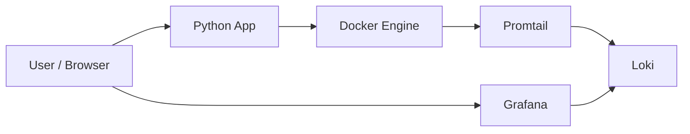
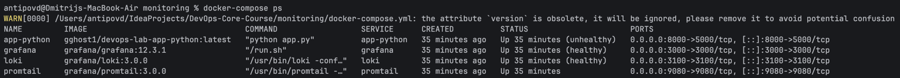
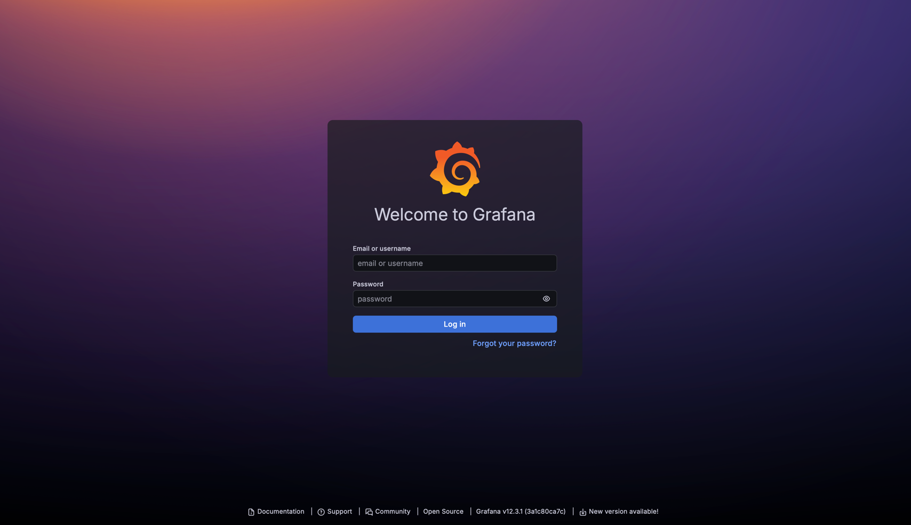
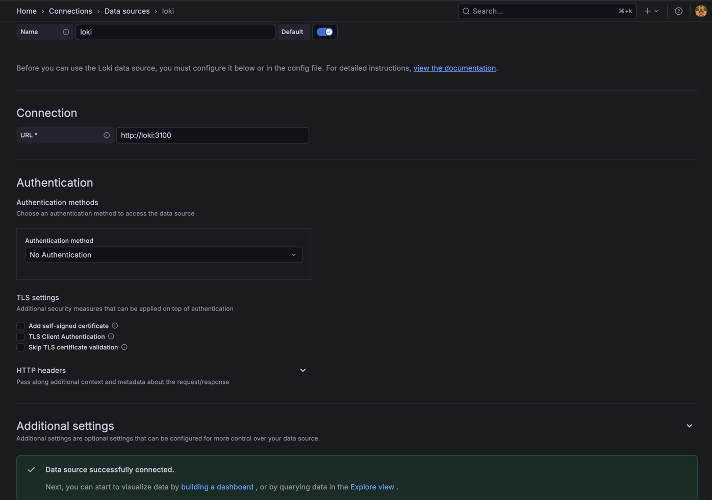
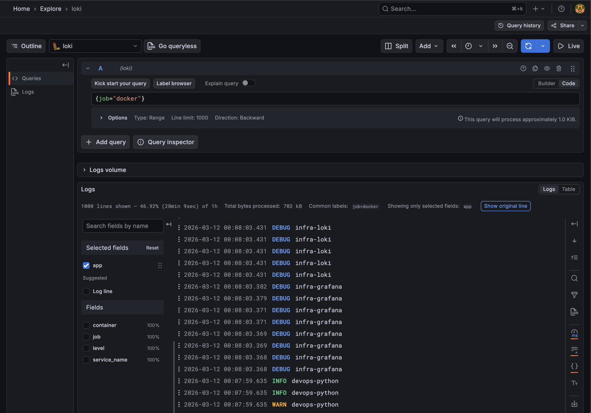
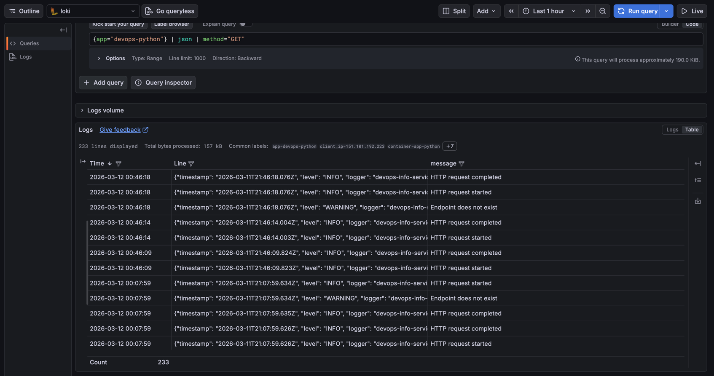

# LAB07

## 1. Architecture

This lab uses a centralized logging stack built with Grafana Loki, Promtail, and Grafana. Loki stores logs and indexes labels instead of full log contents, which reduces index size and makes label design important.

Promtail collects logs from Docker containers using Docker service discovery through the Docker socket, then forwards them to Loki. Grafana connects to Loki as a data source and is used to explore logs and build dashboards.

### Architecture Diagram


### Component Connections
`app-python` writes JSON logs to standard output, and Docker stores them using the container logging driver.

Promtail discovers containers through `docker_sd_configs` and filters only containers with the `logging=promtail` label.

Promtail relabels Docker metadata such as `__meta_docker_container_name` into Loki labels like container, which makes queries easier in Grafana.

## 2. Setup Guide
The stack was deployed with Docker Compose using separate services for Loki, Promtail, Grafana, and the Python application. Grafana was configured to connect to Loki at http://loki:3100, which is the internal Docker network address used by the stack.

### Deployment Steps
```bash
cd monitoring
docker compose up -d
```

Grafana login page:

Loki data source:

Grafana explore logs from all docker containers:


## 3. Configuration
Loki was configured with the TSDB storage mode and filesystem object store, which is the recommended single-store approach for newer Loki versions. Retention was set to 168 hours, and the compactor was enabled because retention cleanup depends on the compactor in this setup.

Promtail was configured with a Loki client endpoint ending in `/loki/api/v1/push`, Docker service discovery, and relabeling rules. The relabeling extracts useful metadata such as container name and app label from Docker container metadata, which improves query readability without indexing full log contents.

### Why This Loki Configuration
- `schema: v13` with `store: tsdb` matches the modern TSDB-based Loki storage model. 
- `object_store`: `filesystem` is appropriate for a single-node lab environment.
- `retention_period`: `168h` keeps logs for 7 days as required by the task.

### Why This Promtail Configuration
- Docker service discovery allows Promtail to watch containers directly through the Docker daemon.
- The label filter keeps only containers explicitly marked for collection, which reduces noise in Loki.
- Extracting `container` and `app` as labels makes LogQL selectors easier and more useful in Grafana. Loki labels should stay low-cardinality, so labels such as app and container are much safer than highly variable values like IP addresses.

## 4. Application Logging
The Python application was updated to produce structured JSON logs using Python's logging module. Structured JSON logs are easier to parse in LogQL with | json, and numeric values such as request duration can be converted into metrics with unwrap.

### JSON Logging Implementation
The application logs:
- startup events,
- request start,
- request completion,
- HTTP status code,
- client IP,
- method and path,
- errors and exceptions.

### Application Logging Snippet
```python
@app.before_request
def before_request_logging():
    g.request_started_at = datetime.now(timezone.utc)
    g.request_id = str(uuid.uuid4())
    logger.info(
        "HTTP request started",
        extra={
            **get_request_info(),
            "request_id": g.request_id,
        },
    )

@app.after_request
def after_request_logging(response):
    duration_ms = int(
        (datetime.now(timezone.utc) - g.request_started_at).total_seconds() * 1000
    )
    logger.info(
        "HTTP request completed",
        extra={
            **get_request_info(),
            "request_id": g.request_id,
            "status_code": response.status_code,
            "duration_ms": duration_ms,
        },
    )
    return response
```

### Example Log Entry
```json
{
  "timestamp": "2026-03-11T21:07:07.113Z",
  "level": "INFO",
  "logger": "devops-info-service",
  "message": "HTTP request completed",
  "service": "devops-info-service",
  "version": "1.0.0",
  "taskName": null,
  "client_ip": "151.101.192.223",
  "user_agent": "curl/8.7.1",
  "method": "GET",
  "path": "/health",
  "status_code": 200
}
```

## 5. Dashboard
The dashboard contains four required panels plus one optional panel for average request duration. Grafana can visualize raw logs and log-derived metrics from Loki using LogQL metric queries. 

- Panel 1 — Logs Table
  
    This panel provides a live view of application activity using label-based stream selection. Loki stream selectors match labels exactly or by regex, which is why the query uses `app=~"devops-.*"`.
- Panel 2 — Request Rate

  `rate()` converts logs into a per-second rate over a range window, which is useful for request throughput graphs.
- Panel 3 — Error Logs

  This query first parses the JSON payload and then filters by the `level` field. JSON parsing in LogQL is done with `| json`.
- Panel 4 — Log Level Distribution

  `count_over_time()` counts log entries over a time range, and grouping by level turns that into a per-level distribution.


## 6. Production Config
For production readiness, Grafana anonymous authentication was disabled and the admin password was moved to an environment file instead of being hardcoded into the Compose file. Health checks were added for Loki and Grafana, and resource limits were configured to reduce the chance of uncontrolled resource usage.

Loki retention was configured for 7 days, which is enforced through retention settings and the compactor in this single-node setup. Promtail was given Docker socket access because Docker service discovery depends on the Docker API, although this should be treated as a security-sensitive permission.

### Production Configuration Snippets
```text
grafana:
    env_file:
        - .env
    environment:
        GF_AUTH_ANONYMOUS_ENABLED: "false"
        GF_USERS_ALLOW_SIGN_UP: "false"
```
```text
healthcheck:
    test: ["CMD-SHELL", "wget --no-verbose --tries=1 --spider http://localhost:3100/ready || exit 1"]
    interval: 10s
    timeout: 5s
    retries: 5
```
```text
deploy:
    resources:
        limits:
            cpus: "1.0"
            memory: 1G
        reservations:
            cpus: "0.25"
            memory: 256M
```
### Security Measures
- Anonymous Grafana access was disabled. 
- Admin credentials were moved to .env.
- Promtail was limited to labeled containers only.
- Resource limits were added for all services.

## 7. Testing
The following commands were used to verify the stack:
```bash
docker compose up -d
docker compose ps
curl http://localhost:3100/ready
curl http://localhost:9080/targets
curl http://localhost:8000/
curl http://localhost:8000/health
curl http://localhost:8000/not-found
```
Traffic was generated to produce logs for dashboard panels and LogQL testing:
```bash
for i in {1..20}; do curl http://localhost:8000/; done
for i in {1..20}; do curl http://localhost:8000/health; done
for i in {1..5}; do curl http://localhost:8000/not-found; done
```
### Example Verified Queries
```text
{job="docker"}
```
This query verifies that Docker-collected streams are reaching Loki.
```text
{app="devops-python"} | json | method="GET"
```

This query verifies that the application logs are valid JSON and that field filtering works.
```text
{app="devops-python"} | json | level="ERROR"
```
This query verifies that error-level filtering works on structured logs.

## 8.Challenges
- Container metadata and readable labels

    Promtail receives Docker metadata as internal labels such as `__meta_docker_container_name`, so relabeling was needed to expose readable labels like `container` and `app` in Loki. Without this step, queries would be harder to read and dashboard filtering would be less convenient.
- Label design
  
    Loki works best with low-cardinality labels, so high-cardinality values such as unique IPs or request IDs should not be turned into labels. Those values are better kept inside structured log fields and parsed only when needed.