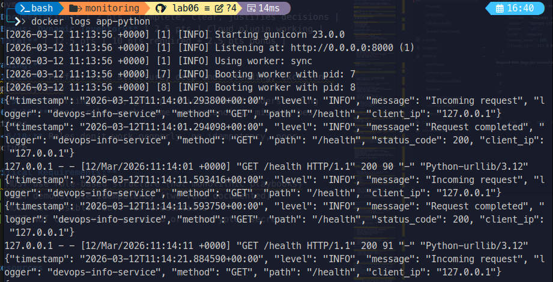
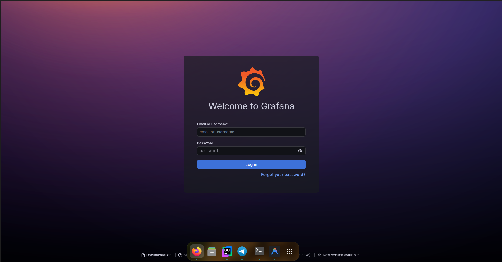
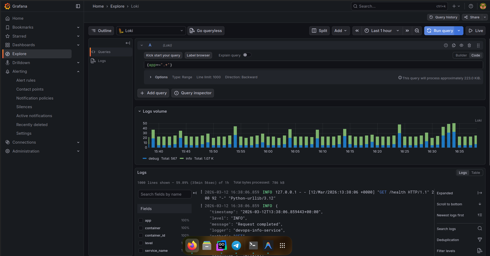

# Lab 07 — Observability & Logging with Loki Stack

## Architecture

How the components connect:

```
[Python App] ──logs──> [Docker Engine]
                              │
                         [Promtail]  ← watches Docker socket
                              │
                           [Loki]   ← stores logs (TSDB)
                              │
                         [Grafana]  ← visualizes logs
                              │
                           [You]    ← browser at localhost:3000
```

- **Promtail** collects logs from Docker containers using the Docker socket
- **Loki** stores logs indexed by labels (not full-text like Elasticsearch)
- **Grafana** queries Loki and shows dashboards

**Key difference from Elasticsearch:** Loki doesn't index log content — it indexes labels only. This makes it much cheaper to store logs. You query by label first, then filter by content.

## Setup Guide

### Deploy the stack

```bash
cd monitoring/

# Build the Python app first (offline pip packages included)
docker compose build app-python

# Start all services
docker compose up -d --pull never

# Check status
docker compose ps
```

All 4 services should show as healthy within ~30 seconds.

### Verify services

```bash
# Loki ready
curl http://localhost:3100/ready

# Grafana health
curl http://localhost:3000/api/health

# Python app health
curl http://localhost:8000/health

# Check what labels Loki has
curl http://localhost:3100/loki/api/v1/labels

# Check what apps are sending logs
curl http://localhost:3100/loki/api/v1/label/app/values
```

## Configuration

### Loki config (loki/config.yml)

Key settings explained:

```yaml
auth_enabled: false          # No auth needed for dev

common:
  path_prefix: /loki         # Where Loki stores everything

schema_config:
  configs:
    - from: 2024-01-01
      store: tsdb            # TSDB = faster queries than old boltdb
      schema: v13            # Latest schema version for Loki 3.0

limits_config:
  retention_period: 168h     # Keep logs for 7 days

compactor:
  retention_enabled: true    # Enable log cleanup after 7 days
  delete_request_store: filesystem
```

Why TSDB? It's the new index format in Loki 3.0 — up to 10x faster queries compared to the old boltdb-shipper.

### Promtail config (promtail/config.yml)

```yaml
clients:
  - url: http://loki:3100/loki/api/v1/push   # Where to send logs

scrape_configs:
  - job_name: docker
    docker_sd_configs:
      - host: unix:///var/run/docker.sock     # Watch Docker
        filters:
          - name: label
            values: ["logging=promtail"]       # Only labeled containers
    relabel_configs:
      - source_labels: ["__meta_docker_container_label_app"]
        target_label: app                      # Extract 'app' label
```

The filter `logging=promtail` means Promtail only collects logs from containers that have that Docker label. This prevents collecting logs from everything.

## Application Logging

The Python app (`app_python/app.py`) uses a custom `JSONFormatter` class:

```python
class JSONFormatter(logging.Formatter):
    def format(self, record):
        log_data = {
            "timestamp": datetime.now(timezone.utc).isoformat(),
            "level": record.levelname,
            "message": record.getMessage(),
        }
        # Add request context if available
        if hasattr(record, "method"):
            log_data["method"] = record.method
        return json.dumps(log_data)
```

Every HTTP request logs two events: one on entry (`before_request`) and one on exit (`after_request`) with status code.

Example log output:
```json
{"timestamp": "2026-03-12T11:14:28.749443+00:00", "level": "INFO", "message": "Request completed", "logger": "devops-info-service", "method": "GET", "path": "/health", "status_code": 200, "client_ip": "172.28.0.1"}
```

**Screenshot — JSON logs from the Python app:**



## Dashboard

The Grafana dashboard "Application Logs - Lab 07" has 4 panels:

### Panel 1 — Logs Table
```logql
{app="devops-python"}
```
Shows all logs from the Python app. Uses "Logs" visualization type for easy reading.

### Panel 2 — Request Rate
```logql
sum by (app) (rate({app=~"devops-.*"} [1m]))
```
Shows how many log lines per second each app generates. Uses Time series chart.
`rate()` calculates the average rate over the last 1 minute window.

### Panel 3 — Error Logs
```logql
{app=~"devops-.*"} |= "ERROR"
```
Filters only lines containing "ERROR". `|=` means "contains this string". Empty when no errors.

### Panel 4 — Log Level Distribution
```logql
sum by (level) (count_over_time({app=~"devops-.*"} | json [5m]))
```
Parses JSON logs and counts by `level` field. `| json` extracts fields from JSON log lines.
Shows how many INFO vs ERROR vs WARN logs in last 5 minutes.

**Screenshot — Dashboard with all 4 panels:**


## Production Config

### Resource Limits
All services have memory and CPU limits to prevent resource starvation:
- Loki: 1G RAM, 1.0 CPU
- Grafana: 512M RAM, 1.0 CPU
- Promtail: 512M RAM, 0.5 CPU
- Python app: 256M RAM, 0.5 CPU

### Security
- `GF_AUTH_ANONYMOUS_ENABLED=false` — login required
- Admin password set via `.env` file (not committed to git)
- Promtail mounts Docker socket read-only (`:ro`)

**Screenshot — Grafana login page (no anonymous access):**



### Health Checks
- Loki: polls `/ready` endpoint every 10s
- Grafana: polls `/api/health` endpoint every 10s
- Python app: uses built-in Python urllib (no wget dependency)

### Retention
7 days (168h) via Loki compactor. Old logs are automatically deleted.

## Testing

```bash
# Generate traffic
for i in {1..20}; do curl http://localhost:8000/; done
for i in {1..20}; do curl http://localhost:8000/health; done

# Check logs in Loki
curl -G "http://localhost:3100/loki/api/v1/query_range" \
  --data-urlencode 'query={app="devops-python"}' \
  --data-urlencode 'limit=5'

# Query all services
curl -s "http://localhost:3100/loki/api/v1/label/app/values"
# Shows: devops-python, grafana, loki, promtail
```

**LogQL queries used in Grafana Explore:**

```logql
# All logs from all labeled containers
{app=~".+"}

# Only Python app logs
{app="devops-python"}

# Only errors
{app="devops-python"} |= "ERROR"

# Parse JSON and filter by method
{app="devops-python"} | json | method="GET"

# Request rate per second
rate({app="devops-python"}[1m])
```

**Screenshot — Grafana Explore showing logs from containers:**



**Screenshot — All services healthy (docker compose ps):**


## Challenges and Solutions

**Problem 1:** Docker containers couldn't reach the internet for pip install.
**Solution:** Downloaded Python packages on the host with `pip download` and included them in the build context. Changed Dockerfile to use `--no-index --find-links=/tmp/pip-packages`.

**Problem 2:** Loki failed to start with "compactor.delete-request-store should be configured when retention is enabled".
**Solution:** Added `delete_request_store: filesystem` to the compactor config.

**Problem 3:** Loki got "permission denied" creating `/tmp/loki/rules` because Docker named volume mounted at `/tmp/loki` had permission issues.
**Solution:** Changed `path_prefix` in Loki config from `/tmp/loki` to `/loki` and updated the volume mount accordingly.

**Problem 4:** Python app container had no `wget` for health checks.
**Solution:** Changed health check to use Python's built-in `urllib` instead of wget.
