# Lab 7 — Observability & Logging with Loki Stack

## 1. Architecture

```
┌───────────────────────────────────────────────────────────────┐
│                     Docker Host                               │
│                                                               │
│  ┌────────────┐   logs   ┌───────────┐  push   ┌──────────┐  │
│  │ app-python ├──────────► Promtail  ├─────────► Loki     │  │
│  │ :8000      │          │ :9080     │         │ :3100    │  │
│  └────────────┘          └───────────┘         └────┬─────┘  │
│                               ▲                     │        │
│  ┌────────────┐    logs       │              query  │        │
│  │ grafana    ├───────────────┘                     │        │
│  │ :3000      │◄────────────────────────────────────┘        │
│  └────────────┘                                              │
│                                                               │
│  Network: logging (bridge)                                    │
│  Volumes: loki-data, grafana-data                             │
└───────────────────────────────────────────────────────────────┘
```

**Components:**

| Service   | Image                        | Port | Purpose                          |
|-----------|------------------------------|------|----------------------------------|
| Loki      | `grafana/loki:3.0.0`         | 3100 | Log storage with TSDB backend    |
| Promtail  | `grafana/promtail:3.0.0`     | 9080 | Collects Docker container logs   |
| Grafana   | `grafana/grafana:12.3.1`     | 3000 | Visualization and dashboards     |
| app-python| Built from `app_python/`     | 8000 | DevOps Info Service (FastAPI)    |

**Data flow:** Containers write to stdout/stderr → Docker stores JSON log files → Promtail discovers containers via Docker socket and tails their logs → Promtail pushes log entries to Loki via HTTP → Grafana queries Loki using LogQL.

---

## 2. Setup Guide

### Prerequisites

- Docker Engine with Docker Compose v2 plugin
- Ports 3000, 3100, 8000, 9080 available

### Deployment

```bash
cd monitoring

# Create .env with Grafana credentials (already provided)
# Edit monitoring/.env to change defaults

# Deploy the stack
docker compose up -d

# Verify all services
docker compose ps
```

### Verify services

```bash
# Loki readiness
curl http://localhost:3100/ready

# Promtail targets
curl http://localhost:9080/targets

# Grafana health
curl http://localhost:3000/api/health
```

### Configure Grafana data source

1. Open `http://localhost:3000` — log in with credentials from `.env`
2. Go to **Connections** → **Data sources** → **Add data source** → **Loki**
3. Set URL: `http://loki:3100`

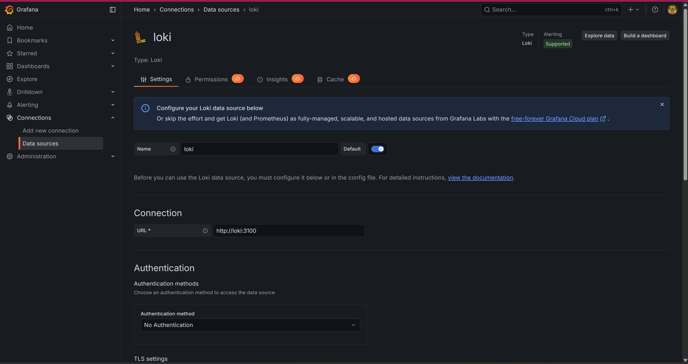

4. Click **Save & Test** — should show "Data source connected"
5. Go to **Explore** → select **Loki** → run `{job="docker"}`

### Evidence — Task 1: Stack Deployment

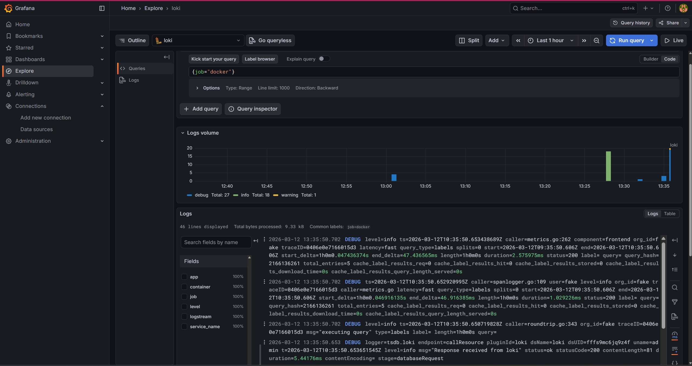
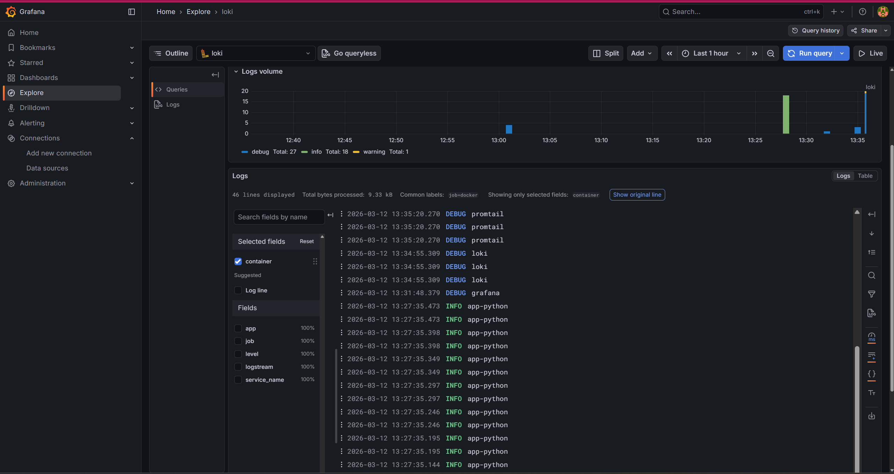
*Screenshot: Grafana Explore with query `{job="docker"}` showing logs from at least 3 containers (loki, promtail, grafana, app-python)*

---

## 3. Configuration

### Loki (`loki/config.yml`)

Key design decisions:

```yaml
# TSDB is the recommended index store for Loki 3.0+
# Up to 10x faster queries than boltdb-shipper
schema_config:
  configs:
    - from: "2024-01-01"
      store: tsdb
      object_store: filesystem
      schema: v13

# 7-day retention with compactor cleanup
limits_config:
  retention_period: 168h
compactor:
  retention_enabled: true
```

- **`auth_enabled: false`** — single-tenant mode for simplicity
- **`tsdb` store** — Loki 3.0 default; faster than boltdb-shipper, lower memory
- **`schema: v13`** — latest schema version for TSDB compatibility
- **`filesystem` object store** — suitable for single-instance deployments
- **`168h` retention** — keeps 7 days of logs; compactor deletes older data

### Promtail (`promtail/config.yml`)

```yaml
scrape_configs:
  - job_name: docker
    docker_sd_configs:
      - host: unix:///var/run/docker.sock
        filters:
          - name: label
            values: ["logging=promtail"]
    relabel_configs:
      - source_labels: ['__meta_docker_container_label_app']
        target_label: 'app'
```

- **Docker service discovery** — auto-discovers containers via Docker socket
- **Label filter** — only scrapes containers with `logging=promtail` Docker label
- **Relabeling** — extracts `container`, `logstream`, and `app` labels from Docker metadata for use in LogQL queries

---

## 4. Application Logging

### JSON structured logging in Python

The FastAPI app uses a custom `JSONFormatter` that outputs each log line as JSON:

```python
class JSONFormatter(logging.Formatter):
    def format(self, record):
        entry = {
            "timestamp": datetime.now(timezone.utc).isoformat(),
            "level": record.levelname,
            "logger": record.name,
            "message": record.getMessage(),
        }
        for attr in ("method", "path", "status_code", "client_ip", "duration_ms"):
            value = getattr(record, attr, None)
            if value is not None:
                entry[attr] = value
        return json.dumps(entry)
```

**What gets logged:**

| Event            | Level | Extra fields                                      |
|------------------|-------|---------------------------------------------------|
| Application start| INFO  | —                                                 |
| HTTP request     | INFO  | method, path, status_code, client_ip, duration_ms |
| 500 error        | ERROR | method, path, client_ip                           |
| Shutdown         | INFO  | —                                                 |

**Example JSON output:**

```json
{"timestamp": "2026-03-12T10:30:00.123456+00:00", "level": "INFO", "logger": "app", "message": "GET / 200", "method": "GET", "path": "/", "status_code": 200, "client_ip": "172.18.0.1", "duration_ms": 2.45}
```

**Why JSON?**
- Machine-parseable — Loki's `| json` parser extracts fields automatically
- Structured data enables filtering on individual fields (level, method, status code)
- No regex needed for common queries

### Evidence — Task 2: JSON Structured Logging

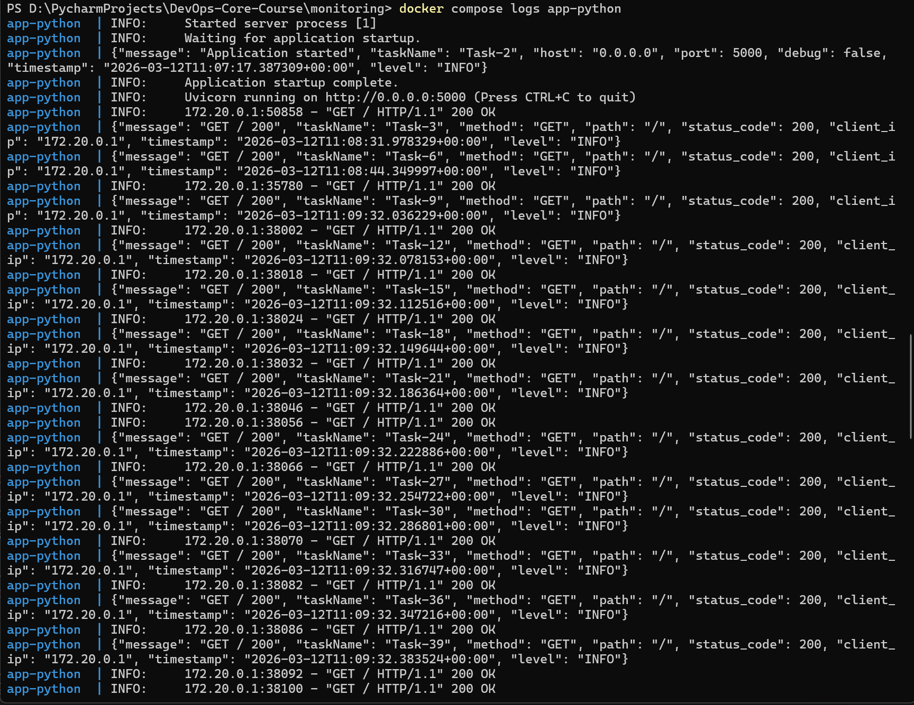

*Screenshot: Terminal output of `docker compose logs app-python` showing JSON-formatted log entries*

---

## 5. Dashboard

### Panel 1: Logs Table (Logs visualization)

Shows recent logs from all application containers.

```logql
{app=~"devops-.*"}
```
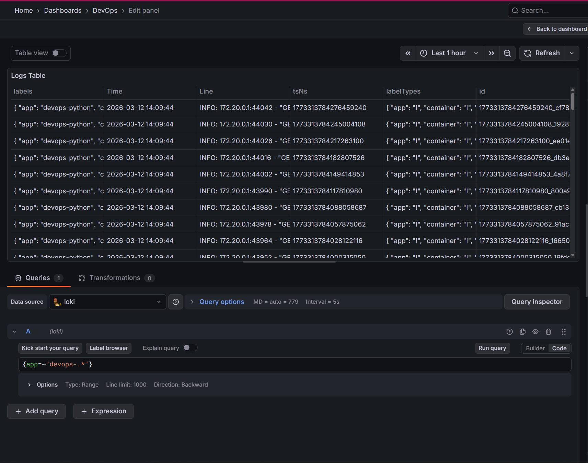
### Panel 2: Request Rate (Time series)

Log throughput per second, broken down by app label.

```logql
sum by (app) (rate({app=~"devops-.*"} [1m]))
```
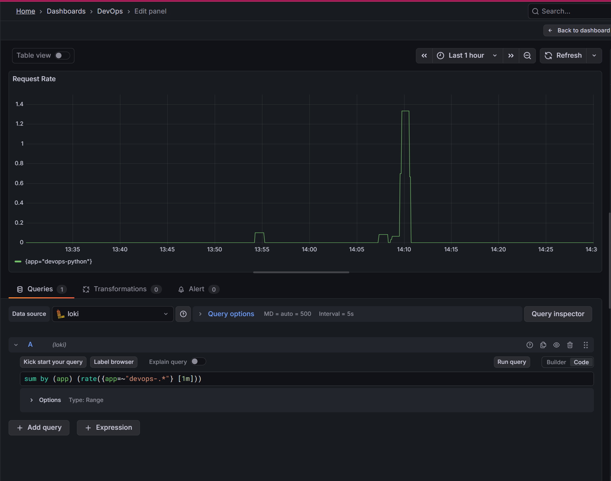
### Panel 3: Error Logs (Logs visualization)

Only ERROR-level entries from application containers.

```logql
{app=~"devops-.*"} | json | level="ERROR"
```
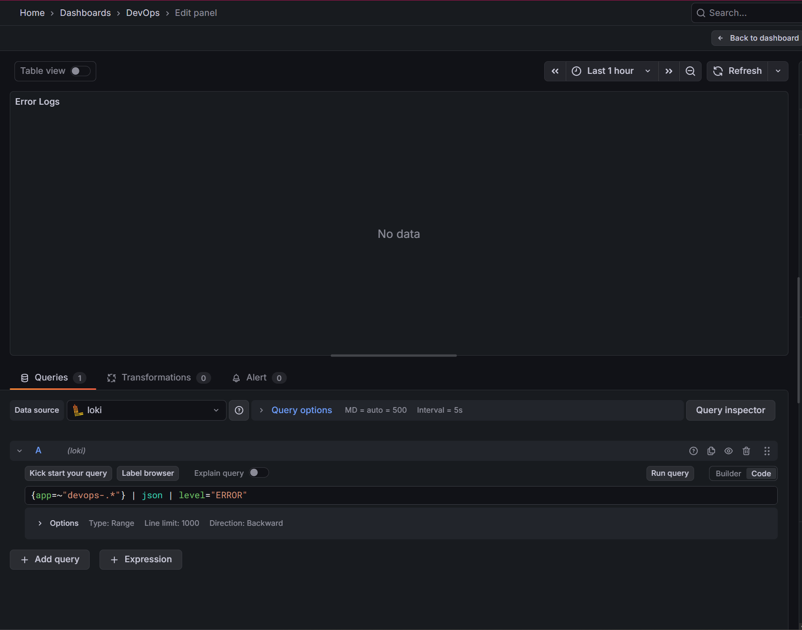
### Panel 4: Log Level Distribution (Pie chart)

Count of log entries per level over the last 5 minutes.

```logql
sum by (level) (count_over_time({app=~"devops-.*"} | json [5m]))
```
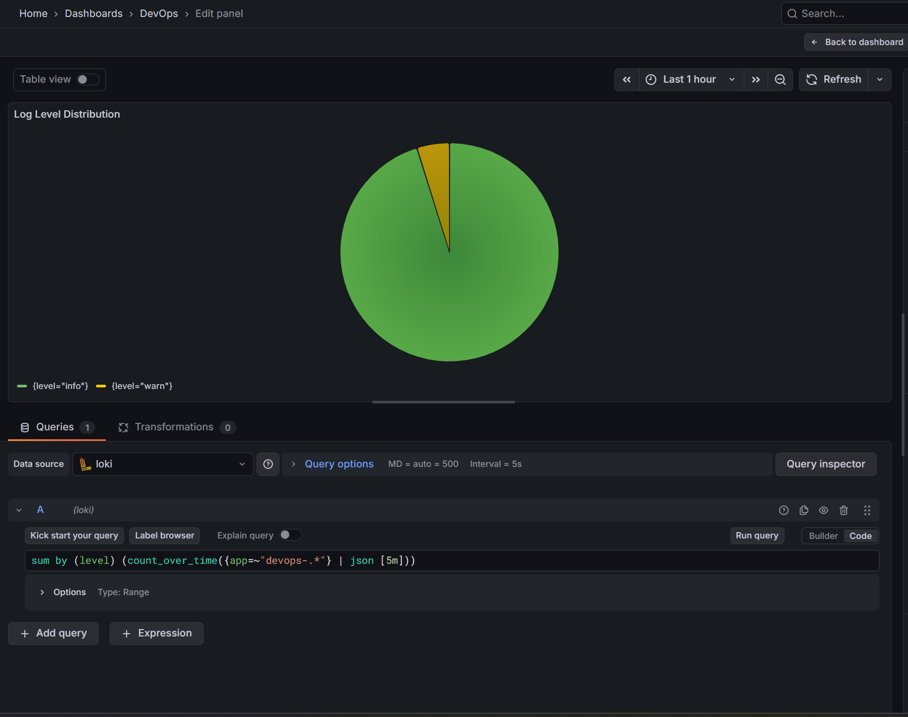


### Additional useful queries

```logql
# All logs from all monitored containers
{job="docker"}

# Only Python app logs
{app="devops-python"}

# Slow requests (>100 ms)
{app="devops-python"} | json | duration_ms > 100

# Requests to a specific path
{app="devops-python"} | json | path="/"

# Rate of errors over time
rate({app="devops-python"} | json | level="ERROR" [5m])
```


### Evidence — Task 2: Application Integration

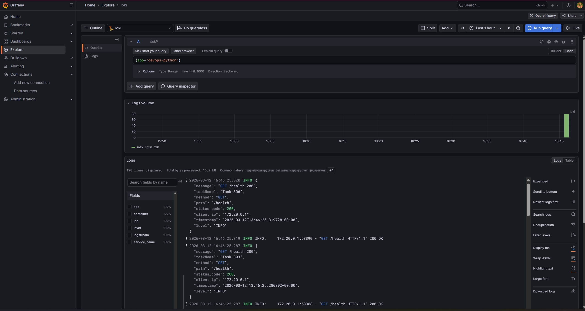

*Screenshot: Grafana Explore showing logs from both applications using query `{app="devops-python"}` after generating traffic with curl loops*

### Evidence — Task 2: LogQL Queries

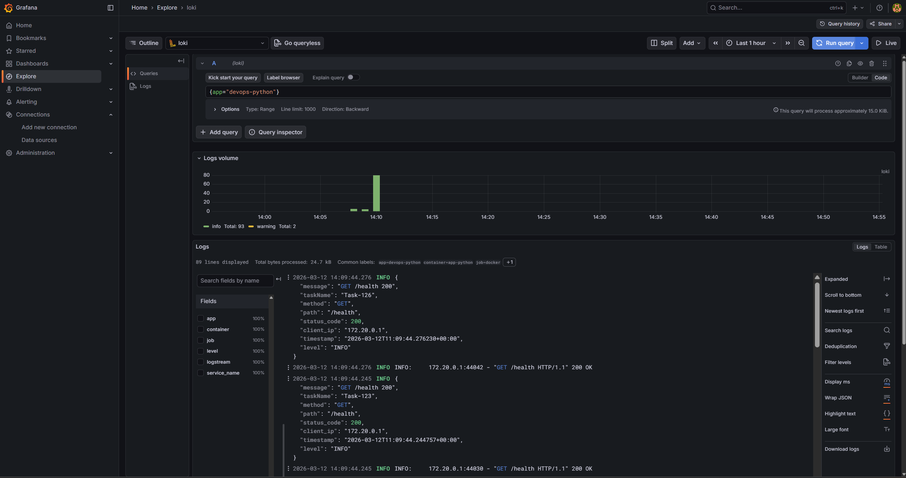
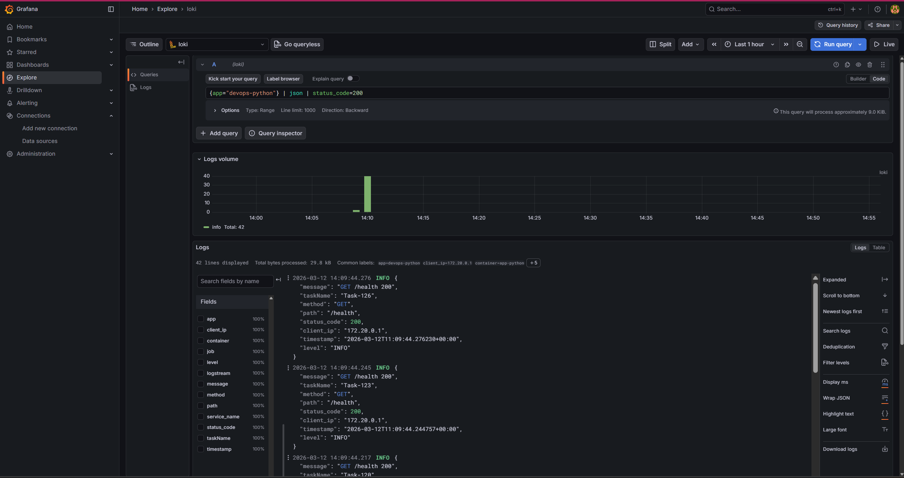
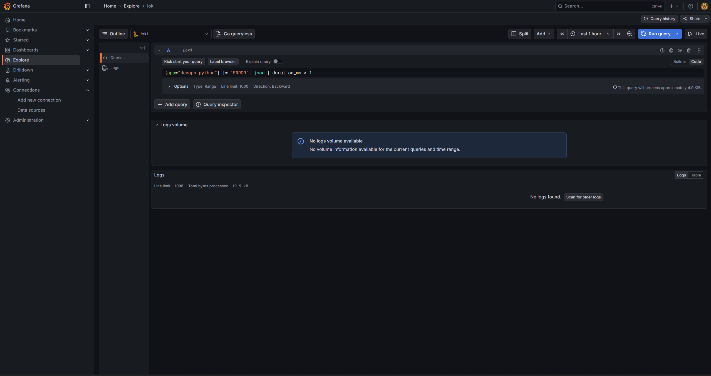

*Screenshot: Grafana Explore showing 3 different working LogQL queries, for example:*
- *`{app="devops-python"}` — all Python app logs*
- *`{app="devops-python"} | json | status_code=200` — only successful requests*
- *`{app="devops-python"} |= "ERROR"| json | duration_ms > 1` — requests taking more than 1ms*

### Evidence — Task 3: Dashboard


*Screenshot: Grafana dashboard showing all 4 panels (Logs Table, Request Rate time series, Error Logs, Log Level Distribution pie chart) with real data from the applications*

---

## 6. Production Config

### Resource limits

Every service has `deploy.resources` constraints to prevent runaway memory/CPU usage:

| Service    | CPU Limit | Memory Limit | CPU Reservation | Memory Reservation |
|------------|-----------|--------------|-----------------|---------------------|
| Loki       | 1.0       | 1G           | 0.25            | 256M                |
| Promtail   | 0.5       | 512M         | 0.25            | 128M                |
| Grafana    | 1.0       | 1G           | 0.25            | 256M                |
| app-python | 0.5       | 256M         | 0.25            | 128M                |

### Security

- **Anonymous access disabled:** `GF_AUTH_ANONYMOUS_ENABLED=false`
- **Admin credentials via `.env` file:** `GF_ADMIN_USER` / `GF_ADMIN_PASSWORD`
- **`.env` excluded from Git** via `.gitignore`
- **Docker socket mounted read-only** (`:ro`) — Promtail can discover but not control containers

### Health checks

```yaml
# Loki
healthcheck:
  test: ["CMD-SHELL", "wget ... http://localhost:3100/ready || exit 1"]

# Grafana
healthcheck:
  test: ["CMD-SHELL", "wget ... http://localhost:3000/api/health || exit 1"]
```

- Promtail and Grafana use `depends_on: loki: condition: service_healthy` to wait for Loki
- `start_period` gives containers time to initialize before health checks begin

### Log retention

Loki compactor runs every 10 minutes and deletes logs older than 7 days (168h).

### Evidence — Task 4: Production Readiness

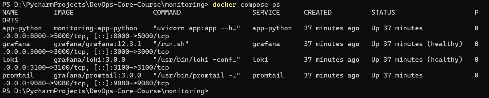

*Screenshot: Terminal output of `docker compose ps` showing all services (loki, promtail, grafana, app-python)*

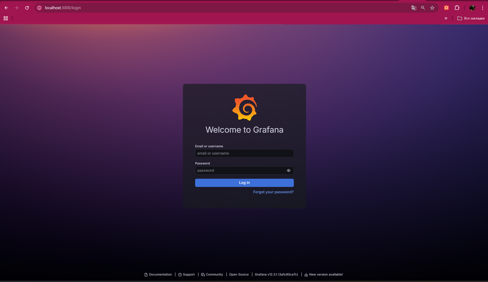

*Screenshot: Grafana login page at `http://localhost:3000` showing that anonymous access is disabled (login form visible, not automatically logged in)*

---

## 7. Testing

### Deploy and verify

```bash
cd monitoring
docker compose up -d
docker compose ps       # all services should be healthy
```

### Test Loki

```bash
curl -s http://localhost:3100/ready
# Expected: ready
```

### Test Promtail

```bash
curl -s http://localhost:9080/targets
# Expected: JSON listing active scrape targets
```

### Test Grafana

```bash
curl -s http://localhost:3000/api/health
# Expected: {"commit":"...","database":"ok","version":"..."}
```

### Generate traffic and verify logs

```bash
for i in $(seq 1 20); do curl -s http://localhost:8000/; done
for i in $(seq 1 20); do curl -s http://localhost:8000/health; done
curl -s http://localhost:8000/nonexistent   # generates 404
```

Then in Grafana Explore with Loki data source:

```logql
{app="devops-python"}
{app="devops-python"} | json | status_code=200
{app="devops-python"} |= "ERROR"
```

### Tear down

```bash
docker compose down -v   # removes volumes too
```

---

## 8. Challenges

| Problem | Solution |
|---------|----------|
| Promtail not discovering containers | Ensure all services have `labels: logging: "promtail"` in docker-compose.yml and the Docker socket is mounted |
| Loki returning "too many outstanding requests" | Add resource limits and increase `max_outstanding_per_tenant` in limits_config |
| Grafana "Data source connected" but no logs | Check that Promtail is running and the Loki URL uses the Docker service name (`http://loki:3100`) not localhost |
| JSON fields not parseable in LogQL | Verify app outputs single-line JSON (no multiline stack traces breaking JSON) |
| `docker compose` command not found | Install `docker-compose-plugin` package (Docker Compose v2) |

---

## Ansible Automation (Bonus)

The `roles/monitoring` Ansible role automates full deployment:

```bash
cd ansible
ansible-playbook playbooks/deploy-monitoring.yml
```

**Role structure:**

```
roles/monitoring/
├── defaults/main.yml           # All configurable variables
├── meta/main.yml               # Depends on: docker role
├── tasks/
│   ├── main.yml                # Orchestrates setup → deploy
│   ├── setup.yml               # Creates dirs, templates configs
│   └── deploy.yml              # docker compose up, waits, configures datasource
└── templates/
    ├── docker-compose.yml.j2   # Parameterized compose
    ├── loki-config.yml.j2      # Loki config with variable schema/retention
    └── promtail-config.yml.j2  # Promtail config with variable ports
```

**Key variables** (override in inventory or `-e`):

| Variable | Default | Description |
|----------|---------|-------------|
| `monitoring_loki_version` | 3.0.0 | Loki Docker image tag |
| `monitoring_grafana_version` | 12.3.1 | Grafana Docker image tag |
| `monitoring_retention_period` | 168h | Log retention (7 days) |
| `monitoring_grafana_admin_password` | admin | Grafana admin password |
| `monitoring_loki_schema_version` | v13 | Loki TSDB schema version |

**Idempotency:** Run twice — second run shows no changes if stack is already up and configs haven't changed.

### Evidence — Bonus: Ansible Deployment


**First run (deployment):**
```
adelina@Ubuntu25:~/DevOps-Core-Course/ansible$ ansible-playbook playbooks/deploy-monitoring.yml

PLAY [Deploy monitoring stack] *************************************************
[WARNING]: Found group_vars that is not a directory, skipping:
/home/adelina/DevOps-Core-Course/ansible/inventory/group_vars

TASK [Gathering Facts] *********************************************************
ok: [aws-vm]

TASK [docker : Install prerequisites for Docker repository] ********************
ok: [aws-vm]

TASK [docker : Create keyrings directory] **************************************
ok: [aws-vm]

TASK [docker : Add Docker GPG key] *********************************************
ok: [aws-vm]

TASK [docker : Add Docker repository] ******************************************
ok: [aws-vm]

TASK [docker : Install Docker packages] ****************************************
ok: [aws-vm]

TASK [docker : Ensure Docker service is enabled and started] *******************
ok: [aws-vm]

TASK [docker : Add user to docker group] ***************************************
ok: [aws-vm]

TASK [docker : Install python3-docker for Ansible docker modules] **************
ok: [aws-vm]

TASK [monitoring : Setup monitoring directory structure and configs] ***********
included: /home/adelina/DevOps-Core-Course/ansible/roles/monitoring/tasks/setup.yml for aws-vm

TASK [monitoring : Create monitoring directories] ******************************
ok: [aws-vm] => (item=/opt/monitoring)
ok: [aws-vm] => (item=/opt/monitoring/loki)
ok: [aws-vm] => (item=/opt/monitoring/promtail)

TASK [monitoring : Template docker-compose file] *******************************
changed: [aws-vm]

TASK [monitoring : Template Loki configuration] ********************************
changed: [aws-vm]

TASK [monitoring : Template Promtail configuration] ****************************
changed: [aws-vm]

TASK [monitoring : Deploy monitoring stack] ************************************
included: /home/adelina/DevOps-Core-Course/ansible/roles/monitoring/tasks/deploy.yml for aws-vm

TASK [monitoring : Pull monitoring Docker images] ******************************
ok: [aws-vm] => (item=grafana/loki:3.0.0)
ok: [aws-vm] => (item=grafana/promtail:3.0.0)
ok: [aws-vm] => (item=grafana/grafana:12.3.1)

TASK [monitoring : Deploy monitoring stack with docker compose] ****************
changed: [aws-vm]

TASK [monitoring : Wait for Loki to be ready] **********************************
ok: [aws-vm]

TASK [monitoring : Wait for Grafana to be ready] *******************************
FAILED - RETRYING: [aws-vm]: Wait for Grafana to be ready (12 retries left).
ok: [aws-vm]

TASK [monitoring : Configure Loki data source in Grafana] **********************
ok: [aws-vm]

TASK [monitoring : Display datasource configuration result] ********************
ok: [aws-vm] => {
    "msg": "Loki datasource configured (HTTP 200)"
}

PLAY RECAP *********************************************************************
aws-vm                     : ok=21   changed=4    unreachable=0    failed=0    skipped=0    rescued=0    ignored=0   

adelina@Ubuntu25:~/DevOps-Core-Course/ansible$ 

```

Terminal output of `ansible-playbook playbooks/deploy-monitoring.yml` showing successful first execution — 21 tasks OK, 4 changed (templating configs + deploying stack)*

**Second run (idempotency test):**

```
adelina@Ubuntu25:~/DevOps-Core-Course/ansible$ ansible-playbook playbooks/deploy-monitoring.yml

PLAY [Deploy monitoring stack] *************************************************
[WARNING]: Found group_vars that is not a directory, skipping:
/home/adelina/DevOps-Core-Course/ansible/inventory/group_vars

TASK [Gathering Facts] *********************************************************
ok: [aws-vm]

TASK [docker : Install prerequisites for Docker repository] ********************
ok: [aws-vm]

TASK [docker : Create keyrings directory] **************************************
ok: [aws-vm]

TASK [docker : Add Docker GPG key] *********************************************
ok: [aws-vm]

TASK [docker : Add Docker repository] ******************************************
ok: [aws-vm]

TASK [docker : Install Docker packages] ****************************************
ok: [aws-vm]

TASK [docker : Ensure Docker service is enabled and started] *******************
ok: [aws-vm]

TASK [docker : Add user to docker group] ***************************************
ok: [aws-vm]

TASK [docker : Install python3-docker for Ansible docker modules] **************
ok: [aws-vm]

TASK [monitoring : Setup monitoring directory structure and configs] ***********
included: /home/adelina/DevOps-Core-Course/ansible/roles/monitoring/tasks/setup.yml for aws-vm

TASK [monitoring : Create monitoring directories] ******************************
ok: [aws-vm] => (item=/opt/monitoring)
ok: [aws-vm] => (item=/opt/monitoring/loki)
ok: [aws-vm] => (item=/opt/monitoring/promtail)

TASK [monitoring : Template docker-compose file] *******************************
ok: [aws-vm]

TASK [monitoring : Template Loki configuration] ********************************
ok: [aws-vm]

TASK [monitoring : Template Promtail configuration] ****************************
ok: [aws-vm]

TASK [monitoring : Deploy monitoring stack] ************************************
included: /home/adelina/DevOps-Core-Course/ansible/roles/monitoring/tasks/deploy.yml for aws-vm

TASK [monitoring : Pull monitoring Docker images] ******************************
ok: [aws-vm] => (item=grafana/loki:3.0.0)
ok: [aws-vm] => (item=grafana/promtail:3.0.0)
ok: [aws-vm] => (item=grafana/grafana:12.3.1)

TASK [monitoring : Deploy monitoring stack with docker compose] ****************
ok: [aws-vm]

TASK [monitoring : Wait for Loki to be ready] **********************************
ok: [aws-vm]

TASK [monitoring : Wait for Grafana to be ready] *******************************
ok: [aws-vm]

TASK [monitoring : Configure Loki data source in Grafana] **********************
ok: [aws-vm]

TASK [monitoring : Display datasource configuration result] ********************
ok: [aws-vm] => {
    "msg": "Loki datasource configured (HTTP 409)"
}

PLAY RECAP *********************************************************************
aws-vm                     : ok=21   changed=0    unreachable=0    failed=0    skipped=0    rescued=0    ignored=0   

adelina@Ubuntu25:~/DevOps-Core-Course/ansible$
```

Second run of the same playbook showing idempotency — all 21 tasks report "ok" with **changed=0** (no modifications, stack already deployed)*
