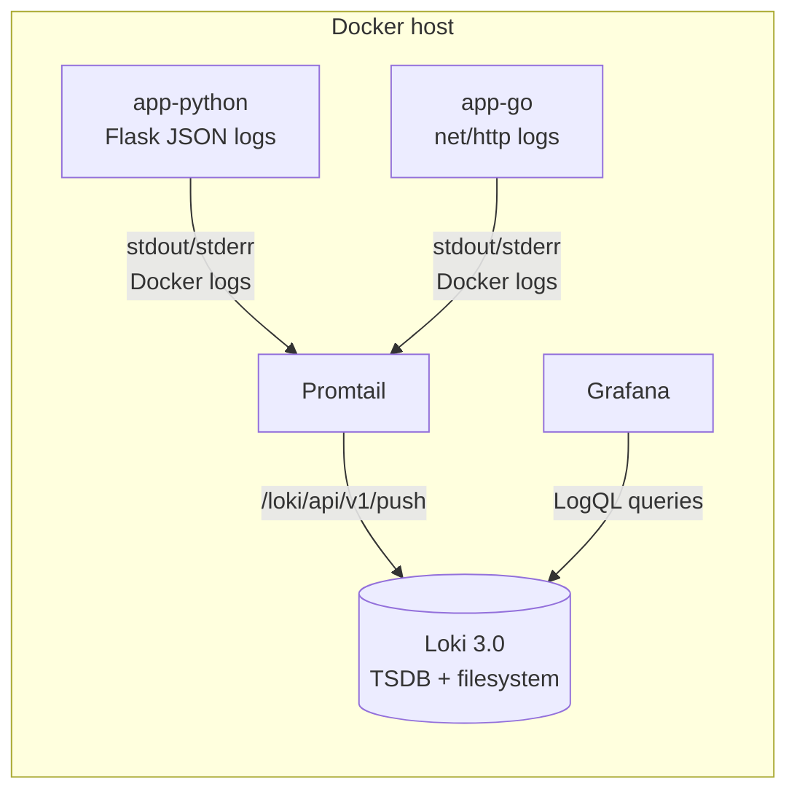

# LAB07 — Observability & Logging with Loki Stack

## Architecture



## Setup Guide

1. Create a local secrets file:

```bash
cd monitoring
cp .env.example .env
```

`docker compose` automatically loads variables from `.env` in the current directory, so no extra `env_file:` is needed in the Compose file.

2. Start the stack:

```bash
docker compose up -d
docker compose ps
```

3. Verify endpoints:

```bash
curl -s http://localhost:3100/ready
curl -s http://localhost:9080/targets
open http://localhost:3000
```

4. Login to Grafana:
   - URL: `http://localhost:3000`
   - User: value of `GRAFANA_ADMIN_USER` (default `admin`)
   - Password: value of `GRAFANA_ADMIN_PASSWORD` (from `monitoring/.env`)

5. Add Loki data source:
   - **Connections** → **Data sources** → **Add data source** → **Loki**
   - URL: `http://loki:3100`
   - **Save & Test**

## Configuration

### Loki (`monitoring/loki/config.yml`)

- **Storage**: TSDB index (`store: tsdb`) with **filesystem** object store for a single-node setup.
- **Schema**: `v13` (recommended for TSDB).
- **Retention**: 7 days via `limits_config.retention_period: 168h` + `compactor.retention_enabled: true`.

Snippet:

```yaml
schema_config:
  configs:
    - from: 2024-04-01
      store: tsdb
      object_store: filesystem
      schema: v13
```

### Promtail (`monitoring/promtail/config.yml`)

- **Discovery**: Docker service discovery via `/var/run/docker.sock`.
- **Filtering**: Only scrapes containers with label `logging=promtail`.
- **Labels**:
  - `container`: from Docker container name (without leading `/`)
  - `app`: from Docker label `app`

Snippet:

```yaml
relabel_configs:
  - source_labels: ["__meta_docker_container_label_logging"]
    regex: promtail
    action: keep
  - source_labels: ["__meta_docker_container_label_app"]
    target_label: app
```

## Application Logging

### Python app (`app_python/app.py`)

The Flask app logs to stdout in **JSON** using a custom `JSONFormatter`. Logged events include:
- `startup` (service metadata + config)
- `request_start` (method, path, client IP, user agent)
- `request_end` (status code, duration)
- `not_found` (404)
- `internal_error` (500 with stack trace)

Example fields:

```json
{"timestamp":"2026-03-12T12:34:56.789Z","level":"INFO","message":"request_end","event":"request_end","method":"GET","path":"/health","status_code":200,"client_ip":"127.0.0.1","duration_ms":1.23}
```

## Generate Logs (Testing)

Create traffic:

```bash
for i in {1..20}; do curl -s http://localhost:8000/ > /dev/null; done
for i in {1..20}; do curl -s http://localhost:8000/health > /dev/null; done
for i in {1..20}; do curl -s http://localhost:8001/ > /dev/null; done
```

## LogQL Queries (examples)

In Grafana **Explore**:

1. All docker-scraped logs:

```logql
{job="docker"}
```

2. Logs from the Python app:

```logql
{app="devops-python"}
```

3. Only errors (by JSON level):

```logql
{app="devops-python"} | json | level="ERROR"
```

4. Metrics from logs (rate):

```logql
sum by (app) (rate({app=~"devops-.*"}[1m]))
```

## Dashboard

Create a Grafana dashboard with these panels (data source: **Loki**):

1. **Logs Table** (Logs)
   - Query: `{app=~"devops-.*"}`

2. **Request Rate** (Time series)
   - Query: `sum by (app) (rate({app=~"devops-.*"}[1m]))`

3. **Error Logs** (Logs)
   - Query: `{app=~"devops-.*"} | json | level="ERROR"`

4. **Log Level Distribution** (Pie / Stat)
   - Query: `sum by (level) (count_over_time({app=~"devops-.*"} | json [5m]))`

Screenshots:
- Screenshot - Grafana Explore showing logs (3+ containers):

- Screenshot - JSON logs from Python app:

- Screenshot of Grafana showing logs from both applications:

- Screenshot - dashboard with 4 panels:


 
## Production Config

- **Grafana security**: anonymous auth disabled (`GF_AUTH_ANONYMOUS_ENABLED=false`), admin password provided via `monitoring/.env` (gitignored).
- **Resource limits**: set for all services in `monitoring/docker-compose.yml` (CPU/memory).
- **Health checks**: Loki `/ready`, Promtail `/ready`, and Grafana `/api/health` used by Compose.
- **Retention**: 7 days in Loki via compactor + `retention_period`.

- Screenshots:


