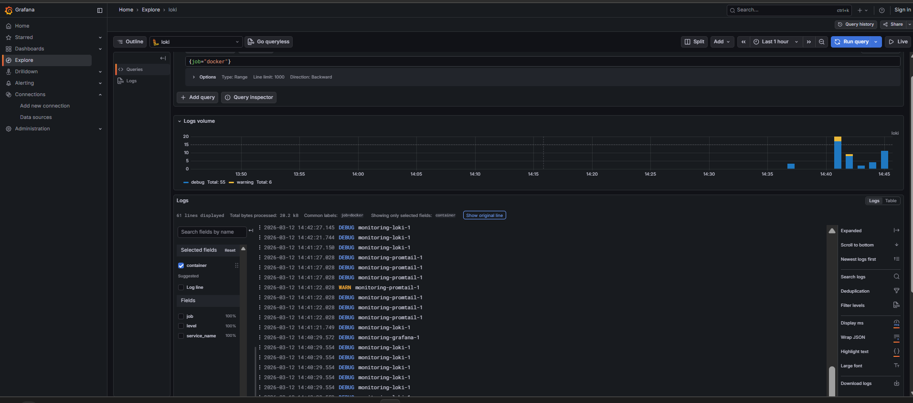
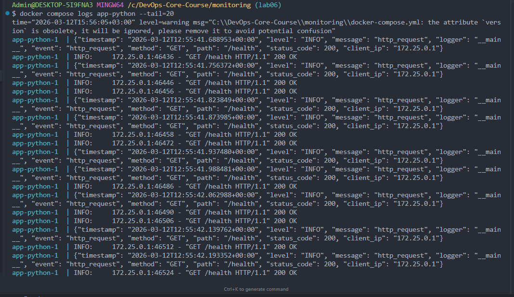
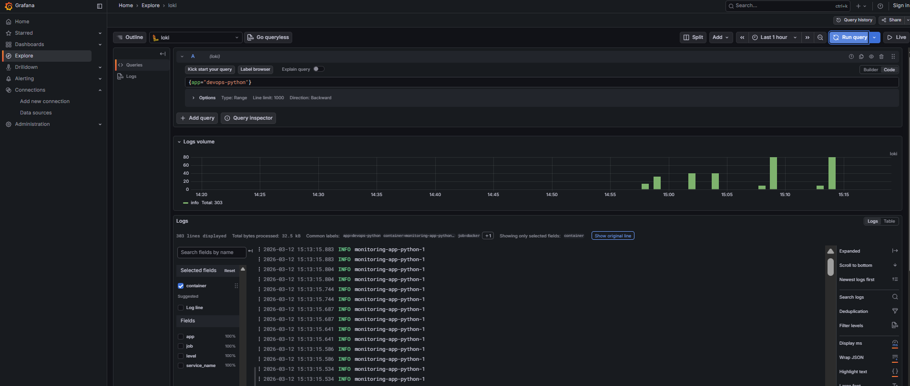
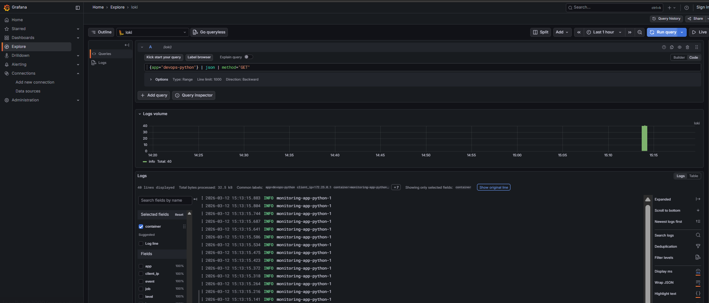
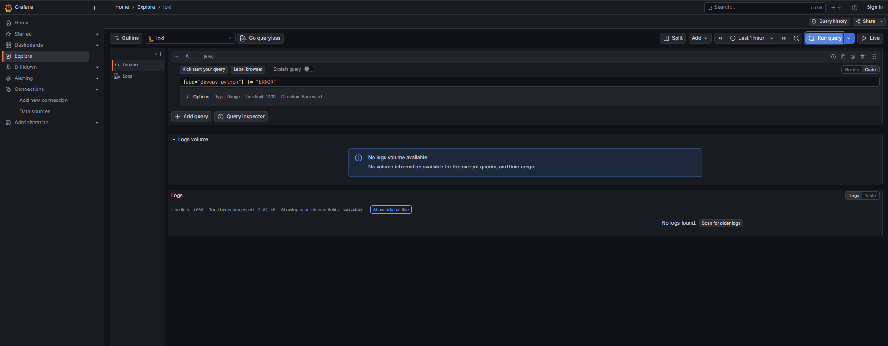
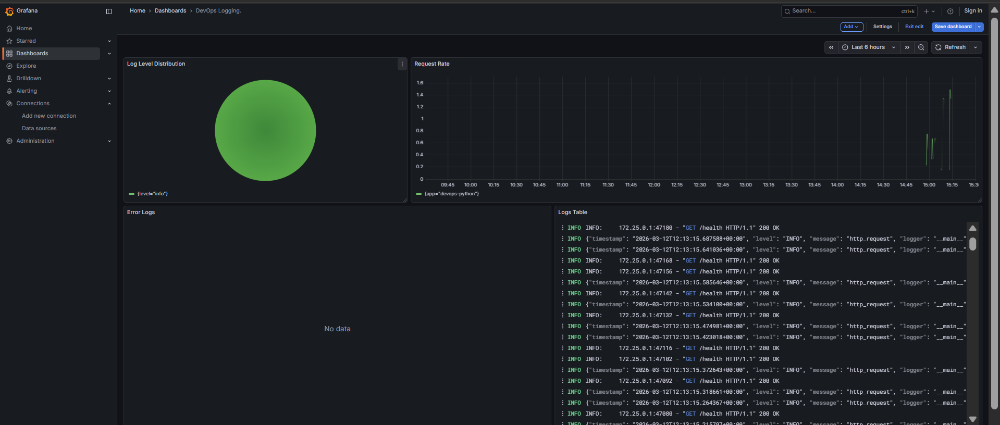
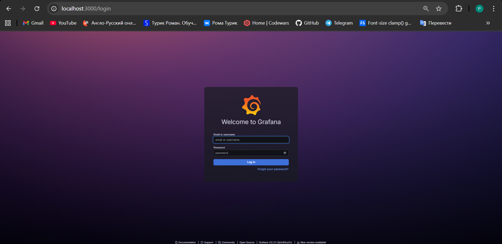
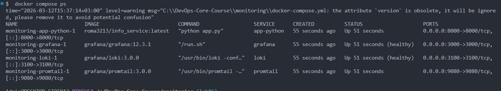

# Lab 07 — Observability & Logging with Loki Stack

> This lab is very cool, it will most likely help me a lot at my current job, thanks! :>

## 1. Architecture

**Stack:** Loki 3.0.0 + Promtail 3.0.0 + Grafana 12.3.1

**Application:** FastAPI info_service (`roma3213/info_service:latest`) on port 8000

**Host:** Windows (Docker Desktop)

**Project structure:**

```
monitoring/
├── docker-compose.yml
├── .env                      # Grafana admin password (not committed)
├── loki/
│   └── config.yml            # Loki 3.0 with TSDB + schema v13
├── promtail/
│   └── config.yml            # Docker SD + relabeling
└── docs/
    ├── LAB07.md
    └── screenshots/lab07/
```

**How components connect:**

```
App (port 8000)  ──stdout──►  Docker Engine
                                   │
Promtail ◄── Docker Socket ────────┘
    │         (service discovery)
    │
    ▼ push logs
Loki (port 3100) ◄──── Grafana (port 3000)
    │                      │
  TSDB index            LogQL queries
  + chunks              + dashboards
```

---

## 2. Setup Guide

### Deploy the stack

```bash
cd monitoring
docker compose up -d
docker compose ps
```

### Verify services

```bash
curl http://localhost:3100/ready       # Loki
curl http://localhost:9080/targets     # Promtail targets
```

### Configure Grafana data source

1. Open `http://localhost:3000` (login: `admin` / password from `.env`)
2. **Connections** → **Data sources** → **Add data source** → **Loki**
3. URL: `http://loki:3100`
4. **Save & Test** → "Data source connected"

### Verify logs

Query `{job="docker"}` in Grafana Explore — logs from all 3 containers (loki, promtail, grafana):



---

## 3. Configuration

### Loki (`loki/config.yml`)

Key settings:

```yaml
auth_enabled: false # No multi-tenancy (dev mode)

schema_config:
  configs:
    - from: 2026-01-01
      store: tsdb # TSDB index — 10x faster than boltdb-shipper
      object_store: filesystem
      schema: v13 # Latest schema for Loki 3.0+
      index:
        prefix: index_
        period: 24h

limits_config:
  retention_period: 168h # 7 days

compactor:
  retention_enabled: true # Actually delete old data
  compaction_interval: 10m
  retention_delete_delay: 2h # Safety delay before deletion
```

**Why TSDB?** New in Loki 3.0 — faster queries, lower memory, better compression vs old boltdb-shipper.

**Why compactor?** Without `retention_enabled: true`, the `retention_period` setting is ignored and logs are never deleted.

### Promtail (`promtail/config.yml`)

Key settings:

```yaml
clients:
  - url: http://loki:3100/loki/api/v1/push # Loki endpoint

scrape_configs:
  - job_name: docker
    docker_sd_configs:
      - host: unix:///var/run/docker.sock # Auto-discover containers
        refresh_interval: 5s
        filters:
          - name: label
            values: ["logging=promtail"] # Only scrape labeled containers
    relabel_configs:
      - source_labels: ["__meta_docker_container_name"]
        regex: "/(.*)"
        target_label: "container" # Extract container name
      - replacement: "docker"
        target_label: "job" # Static label for all streams
      - source_labels: ["__meta_docker_container_label_app"]
        target_label: "app" # Docker label → Loki label
```

**Why filters?** Only containers with Docker label `logging=promtail` are scraped. Infrastructure services (loki, grafana) are excluded — only application logs are collected.

**Why relabel `app`?** Docker label `app: "devops-python"` becomes Loki label `app="devops-python"`, enabling queries like `{app="devops-python"}`.

---

## 4. Application Logging

### JSON Formatter

Added structured JSON logging to `app_python/app.py`:

```python
class JSONFormatter(logging.Formatter):
    def format(self, record):
        log_obj = {
            "timestamp": datetime.now(timezone.utc).isoformat(),
            "level": record.levelname,
            "message": record.getMessage(),
            "logger": record.name,
        }
        if hasattr(record, "extra_fields"):
            log_obj.update(record.extra_fields)
        return json.dumps(log_obj)
```

### HTTP Request Logging

Middleware logs every request with context fields at the top level of JSON:

```python
@app.middleware("http")
async def log_requests(request, call_next):
    response = await call_next(request)
    # Logs: method, path, status_code, client_ip
    ...
```

**Output example:**

```json
{
  "timestamp": "2026-03-12T12:13:15.803989+00:00",
  "level": "INFO",
  "message": "http_request",
  "logger": "__main__",
  "event": "http_request",
  "method": "GET",
  "path": "/health",
  "status_code": 200,
  "client_ip": "172.25.0.1"
}
```

**Why flat JSON?** All fields at top level so LogQL `| json | method="GET"` works. Nested JSON (message containing JSON string) breaks field extraction.



### LogQL queries

```logql
# All logs from Python app
{app="devops-python"}

# Only errors
{app="devops-python"} |= "ERROR"

# Parse JSON and filter by method
{app="devops-python"} | json | method="GET"
```







---

## 5. Dashboard

Dashboard **"DevOps Logging"** with 4 panels:

| Panel                      | Type        | LogQL Query                                                         |
| -------------------------- | ----------- | ------------------------------------------------------------------- |
| **Logs Table**             | Logs        | `{app=~"devops-.*"}`                                                |
| **Request Rate**           | Time series | `sum by (app) (rate({app=~"devops-.*"} [1m]))`                      |
| **Error Logs**             | Logs        | `{app=~"devops-.*"} \| json \| level="ERROR"`                       |
| **Log Level Distribution** | Pie chart   | `sum by (level) (count_over_time({app=~"devops-.*"} \| json [5m]))` |



---

## 6. Production Config

### Resource limits

All services have `deploy.resources`:

| Service    | Memory limit | CPU limit |
| ---------- | ------------ | --------- |
| loki       | 1G           | 1.0       |
| grafana    | 1G           | 1.0       |
| promtail   | 512M         | 0.5       |
| app-python | 512M         | 0.5       |

### Security

- `GF_AUTH_ANONYMOUS_ENABLED=false` — anonymous access disabled
- Admin password via `${GF_ADMIN_PASSWORD}` from `.env` file
- `.env` added to `.gitignore` — secrets not committed



### Health checks

- **Loki:** `wget --spider http://localhost:3100/ready`
- **Grafana:** `curl -f http://localhost:3000/api/health`

### Retention

- `retention_period: 168h` (7 days)
- Compactor runs every 10 minutes
- 2-hour delete delay for safety



---

## 7. Testing

### Verify all services running

```bash
docker compose ps
# All services: Up, loki/grafana: (healthy)
```

### Generate traffic

```bash
for i in {1..20}; do curl http://localhost:8000/; done
for i in {1..20}; do curl http://localhost:8000/health; done
```

### Verify in Grafana

```logql
{app="devops-python"}                          # All app logs
{app="devops-python"} | json | method="GET"    # Filter by method
{job="docker"}                                 # All Docker logs
```

### Check Promtail targets

```bash
curl http://localhost:9080/targets
# Should show app-python container as ready
```

---

## 8. Challenges

### 1. `{job="docker"}` returned no logs

**Problem:** Promtail was collecting logs via Docker SD but `job` label was being overwritten by Docker SD's default behavior.

**Solution:** Added explicit relabel rule `replacement: 'docker'` → `target_label: 'job'` in Promtail config.

### 2. `{app="devops-python"}` label not found

**Problem:** Docker Compose `labels: app: "devops-python"` is a Docker label on the container, not a Loki label. Promtail doesn't forward Docker labels to Loki automatically.

**Solution:** Added relabel rule to extract `__meta_docker_container_label_app` into Loki label `app`.

### 3. `| json | method="GET"` returned empty results

**Problem:** The middleware was doing `json.dumps()` inside `logger.info()`, so the JSONFormatter double-wrapped the data: `{"message": "{\"method\": \"GET\", ...}"}`. The `method` field was a string inside `message`, not a top-level JSON field.

**Solution:** Refactored to pass extra fields via `record.extra_fields` and merge them at the top level in `JSONFormatter`. Result: `{"method": "GET", "path": "/", ...}` — flat JSON, parseable by LogQL.
