## Architecture
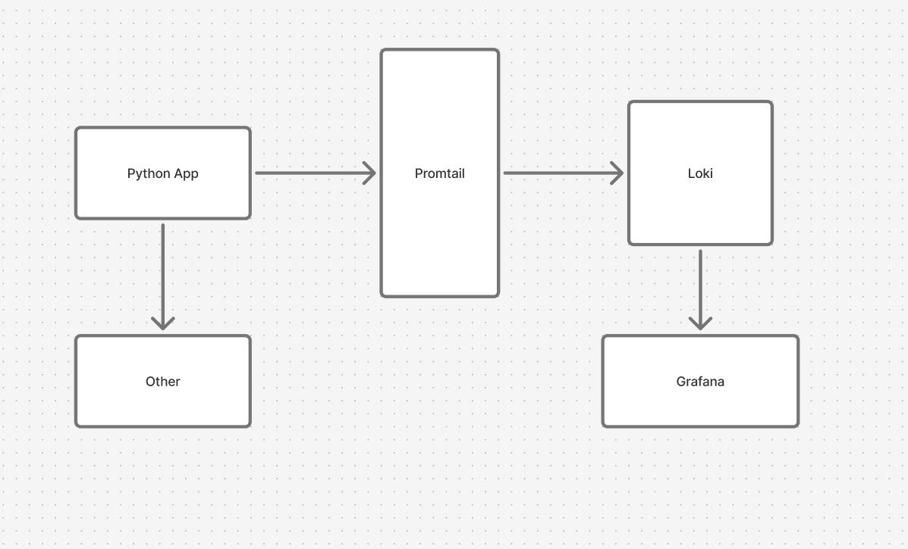
- Promtail collects logs from all containers
- Loki stores logs in TSDB
- Grafana visualizes data

## Setup Guide
Clone the project:
```bash
git clone https://github.com/Daniil20xx/DevOps-Core-Course.git
cd monitoring
```

Create .env:
```bash
GF_SECURITY_ADMIN_USER=admin
GF_SECURITY_ADMIN_PASSWORD=[HIDDEN]
```

Start the stack:
```bash
docker compose up -d --build
```

Check:
```bash
docker compose ps
docker logs app-python
curl http://localhost:3100/ready
curl http://localhost:3000/api/health
```

Open Grafana: `http://localhost:3000`

## Configuration

### Loki
- **auth_enabled: false** - authentication is disabled so that Promtail can send logs without a token.
- **server.http_listen_port: 3100** - standard port for the Loki API.
- **common.storage.filesystem** - data is stored locally on disk; chunks and index are separated.
- **schema_config** - defines the format for storing and indexing logs.
- **limits_config.retention_period:** 168h - logs are stored for 7 days.
- **compactor** - periodic cleanup of old data to save space.

```yml
auth_enabled: false

server:
  http_listen_port: 3100

common:
  path_prefix: /loki
  storage:
    filesystem:
      chunks_directory: /loki/chunks
      rules_directory: /loki/rules
  replication_factor: 1
  ring:
    kvstore:
      store: inmemory

schema_config:
  configs:
    - from: 2024-01-01
      store: tsdb
      object_store: filesystem
      schema: v13
      index:
        prefix: index_
        period: 24h

limits_config:
  retention_period: 168h

compactor:
  working_directory: /loki/compactor
  compaction_interval: 10m
```

### Promtail
- **positions.filename** - tracks how far Promtail has read in the logs.
- **clients.url** - Loki address for sending logs.
- **docker_sd_configs** - automatically finds containers via the Docker API.
- **relabel_configs** - converts Docker metadata to Loki labels.

```yml
server:
  http_listen_port: 9080

positions:
  filename: /tmp/positions.yaml

clients:
  - url: http://loki:3100/loki/api/v1/push

scrape_configs:
  - job_name: docker
    docker_sd_configs:
      - host: unix:///var/run/docker.sock
        refresh_interval: 5s

    relabel_configs:
      - source_labels: ['__meta_docker_container_name']
        regex: '/(.*)'
        target_label: container

      - source_labels: ['__meta_docker_container_label_app']
        target_label: app
```

## Application Logging
- JSON logging is implemeted by `python-json-logger`
- Each event is logged with the following fields: `method`, `path`, `client_ip`, `status_code`.
- Before/After request and error handler log all requests and errors.
- Why? JSON logs are easy to parse in Loki.

Modified parts:
```python
logger = logging.getLogger()
logger.setLevel(logging.DEBUG if DEBUG else logging.INFO)
logHandler = logging.StreamHandler(sys.stdout)
formatter = jsonlogger.JsonFormatter(
    "%(asctime)s %(levelname)s %(message)s %(method)s %(path)s %(client_ip)s %(status_code)s"
)
logHandler.setFormatter(formatter)
logger.addHandler(logHandler)
logging.getLogger("werkzeug").disabled = True
```

```python
@app.before_request
def log_request():
    request.start_time = datetime.now(timezone.utc)
    logger.info(
        "request_started",
        extra={
            "method": request.method,
            "path": request.path,
            "client_ip": request.remote_addr,
        }
    )


@app.after_request
def log_response(response):
    logger.info(
        "request_finished",
        extra={
            "method": request.method,
            "path": request.path,
            "client_ip": request.remote_addr,
            "status_code": response.status_code,
        }
    )
    return response
```

```python
@app.errorhandler(Exception)
def handle_exception(e):
    logger.exception(
        "Unexpected error",
        extra={
            "method": request.method,
            "path": request.path,
            "client_ip": request.remote_addr
        }
    )
    return jsonify({
        "error": "Internal Server Error",
        "message": str(e)
    }), 500
```

## Dashboard
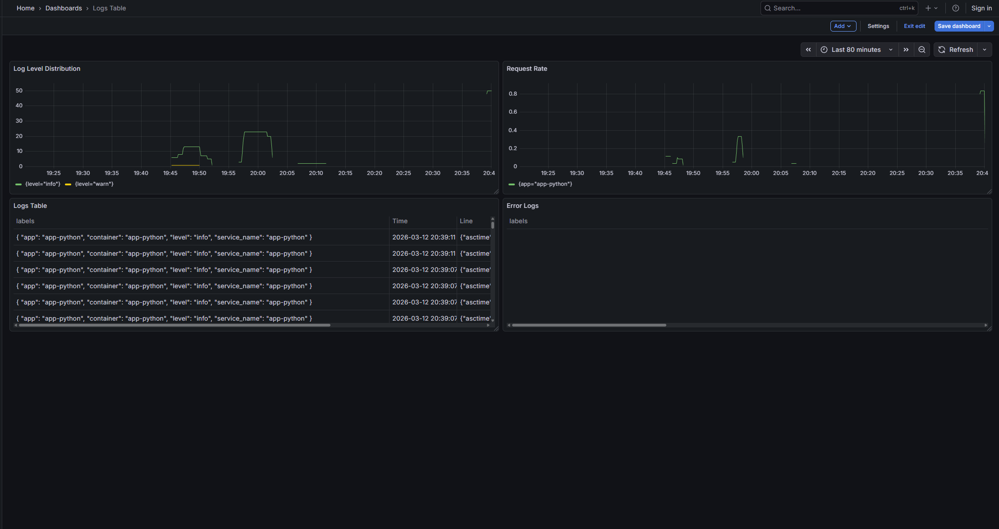
Logs Table (Logs visualization):
- Shows recent logs for all applications.
- Query: `{app=~"app-.*"}` - selects all logs where the app label matches the pattern.
- Why: convenient for quickly viewing events in real time.

Request Rate (Time series graph)
- Visualizes the frequency of requests (logs/sec) by application.
- Query: `sum by (app) (rate({app=~"app-.*"} [1m]))` - counts the log rate per minute, aggregates by app.
- Why: helps track the load on services.

Error Logs (Logs visualization)
- Shows only ERROR events.
- Query: `{app=~"app-.*"} | json | level="ERROR"` - filters by the level field from JSON.
- Why: to quickly find problems and respond to errors.

Log Level Distribution (Stat / Pie chart)
- Counts the number of logs by level (INFO, ERROR, DEBUG).
- Query: `sum by (level) (count_over_time({app=~"app-.*"} | json [5m]))` - aggregates for the last 5 minutes.
- Why: shows the proportion of errors/informational messages, useful for monitoring application stability.


## Production Config
- Resource limits for all services (CPU, RAM)
- Health checks added to Compose
- Grafana password protected (GF_SECURITY_ADMIN_PASSWORD)
- Retention in Loki = 7 days

## Testing
Curl:
**Ready check:**
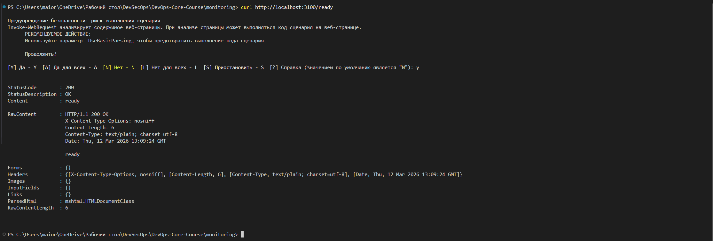

**Target check:**
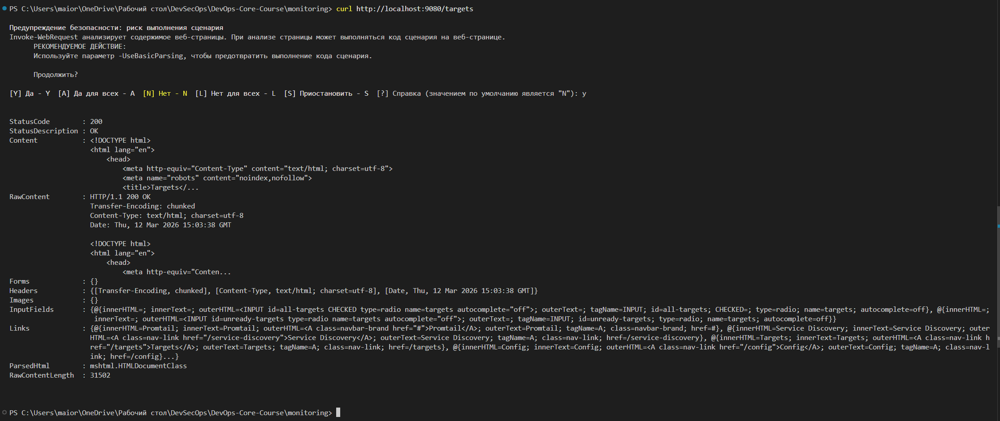

**Grafana check:**
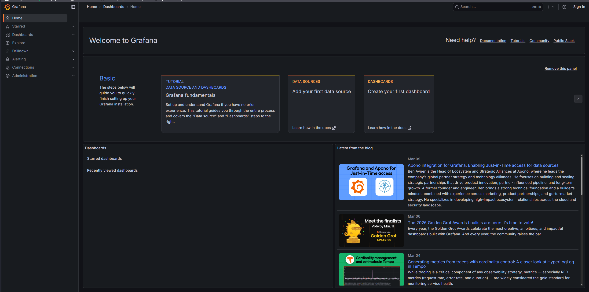

**Simple Query check:**
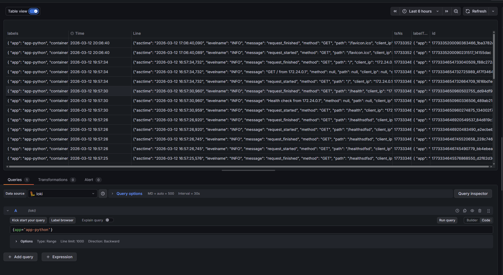


# Challenges
- Flask writes text logs by default, thus had to disable werkzeug and configure JSON logging
- Parsing JSON in Lokim, thus adding extra fields and a correct formatter
- In Dashboard, correctly using `sum by` and `rate` for visualization

## Solution

### Task 1

#### Task 1.1
1) How is Loki different from Elasticsearch?
2) What are log labels and why do they matter?
3) How does Promtail discover containers?

#### Task 1.2
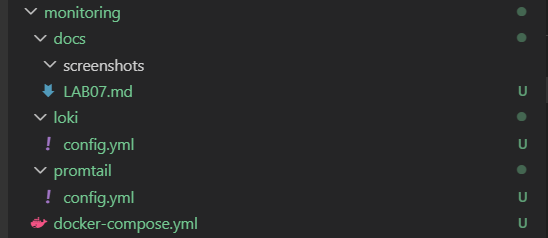

#### Task 1.3
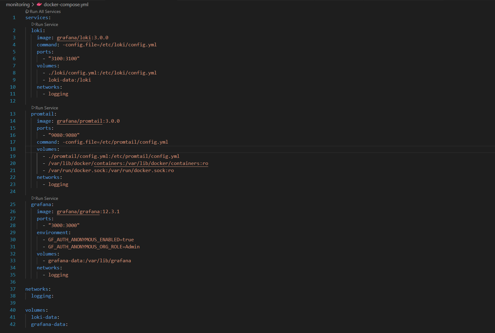

#### Task 1.4
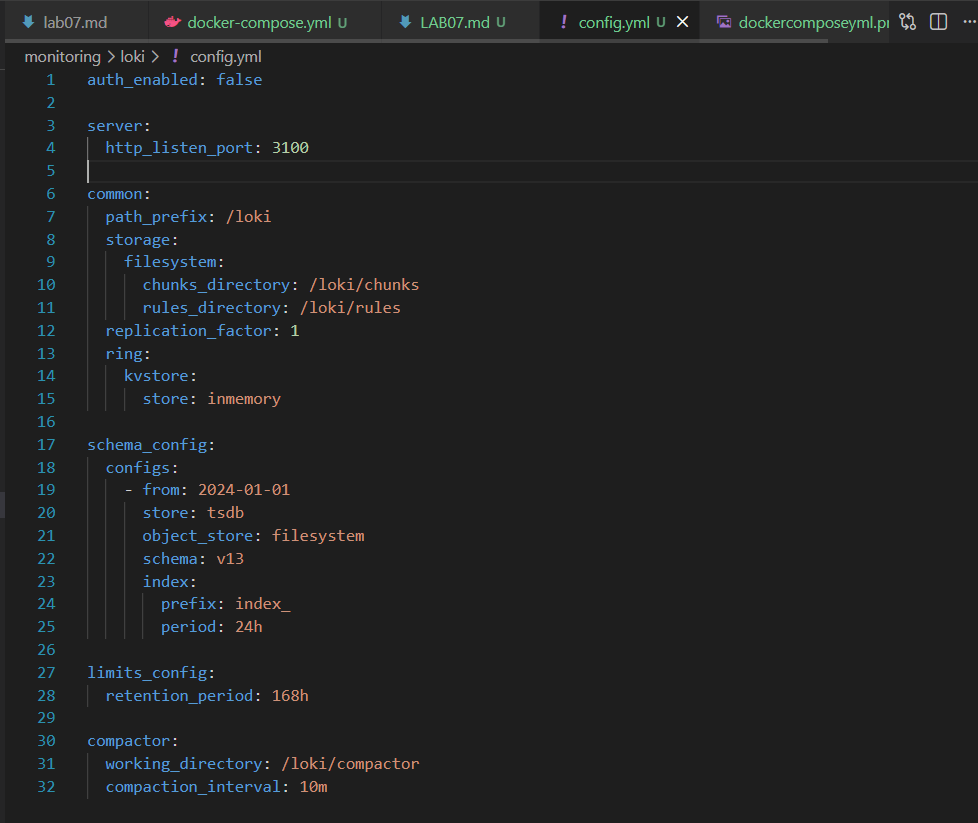

#### Task 1.5
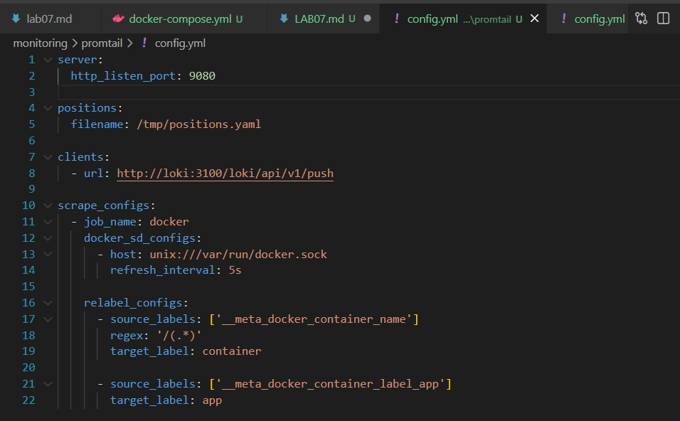

#### Task 1.6
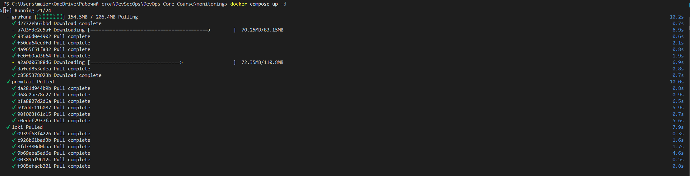
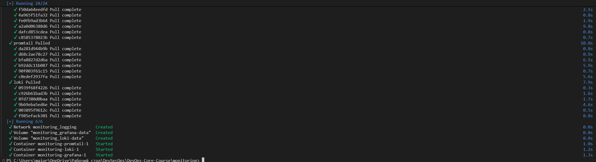
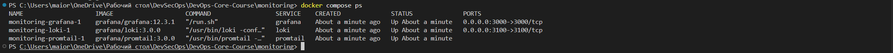

Curl:


In grafana:
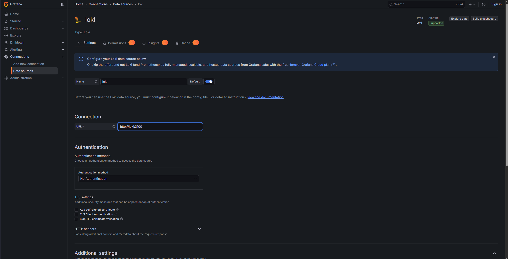
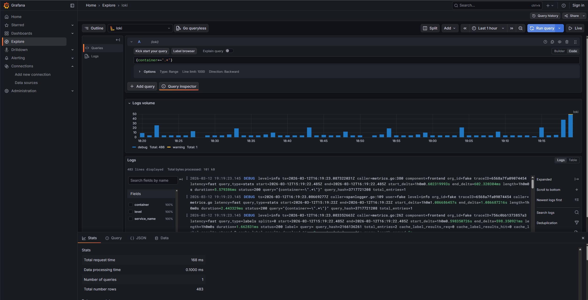

### Task 2

#### Task 2.1

##### Python:
```python
import os
import sys
import socket
from flask import Flask, jsonify, request
import platform

import logging
from pythonjsonlogger import jsonlogger

from datetime import datetime, timezone

HOST = os.getenv('HOST', '0.0.0.0')
PORT = int(os.getenv('PORT', 5000))
DEBUG = os.getenv('DEBUG', 'False').lower() in ('true', '1', 't')

app = Flask(__name__)

logger = logging.getLogger()
logger.setLevel(logging.DEBUG if DEBUG else logging.INFO)
logHandler = logging.StreamHandler(sys.stdout)
formatter = jsonlogger.JsonFormatter(
    "%(asctime)s %(levelname)s %(message)s %(method)s %(path)s %(client_ip)s %(status_code)s"
)
logHandler.setFormatter(formatter)
logger.addHandler(logHandler)
logging.getLogger("werkzeug").disabled = True

START_TIME = datetime.now(timezone.utc)

def get_uptime():
    delta = datetime.now(timezone.utc) - START_TIME
    seconds = int(delta.total_seconds())
    hours = seconds // 3600
    minutes = (seconds % 3600) // 60
    return {
        'seconds': seconds,
        'human': f"{hours} hours, {minutes} minutes"
    }

def get_response():
    uptime = get_uptime()

    response = {
        "service": {
            "name": "devops-info-service",
            "version": "1.0.0",
            "description": "DevOps course info service",
            "framework": "Flask"
        },
        "system": {
            "hostname": socket.gethostname(),
            "platform": platform.system(),
            "platform_version": platform.version(),
            "architecture": platform.machine(),
            "cpu_count": os.cpu_count(),
            "python_version": platform.python_version(),
        },
        "runtime": {
            "uptime_seconds": uptime["seconds"],
            "uptime_human": uptime["human"],
            "current_time": datetime.now(timezone.utc).isoformat(),
            "timezone": "UTC"
        },
        "request": {
            "client_ip": request.remote_addr,
            "user_agent": request.headers.get("User-Agent"),
            "method": request.method,
            "path": request.path
        },
        "endpoints": [
            {"path": "/", "method": "GET", "description": "Service information"},
            {"path": "/health", "method": "GET", "description": "Health check"}
        ]
    }
    return response

@app.before_request
def log_request():
    request.start_time = datetime.now(timezone.utc)
    logger.info(
        "request_started",
        extra={
            "method": request.method,
            "path": request.path,
            "client_ip": request.remote_addr,
        }
    )


@app.after_request
def log_response(response):
    logger.info(
        "request_finished",
        extra={
            "method": request.method,
            "path": request.path,
            "client_ip": request.remote_addr,
            "status_code": response.status_code,
        }
    )
    return response


@app.route('/health')
def health():
    logger.info(f"Health check from {request.remote_addr}")
    return jsonify({
        'status': 'healthy',
        'timestamp': datetime.now(timezone.utc).isoformat(),
        'uptime_seconds': get_uptime()['seconds']
    })

@app.route("/", methods=["GET"])
def index():
    logger.info(f"{request.method} {request.path} from {request.remote_addr}")
    return jsonify(get_response())

@app.errorhandler(404)
def not_found(error):
    return jsonify({
        "error": "Not Found",
        "message": "Endpoint does not exist"
    }), 404

@app.errorhandler(500)
def internal_error(error):
    return jsonify({
        "error": "Internal Server Error",
        "message": "Unexpected server error"
    }), 500

@app.errorhandler(Exception)
def handle_exception(e):
    logger.exception(
        "Unexpected error",
        extra={
            "method": request.method,
            "path": request.path,
            "client_ip": request.remote_addr
        }
    )
    return jsonify({
        "error": "Internal Server Error",
        "message": str(e)
    }), 500

if __name__ == "__main__":
    logger.info("Starting application")
    app.run(host=HOST, port=PORT, debug=DEBUG)
```


### Task 2.2
##### Docker Compose:
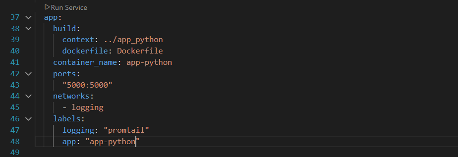


### Task 2.3
##### Grafana:
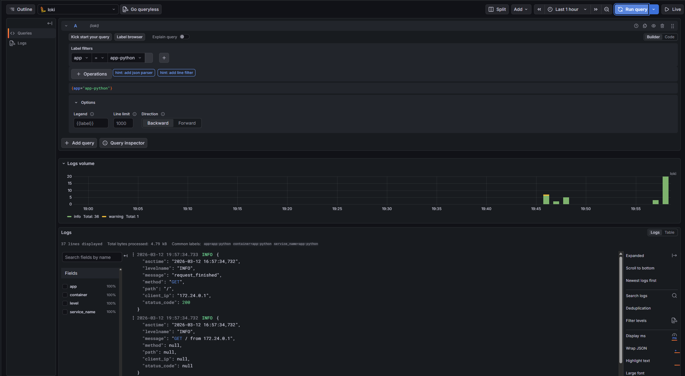


### Task 3
#### Task 3.1
**Stream selectors:**
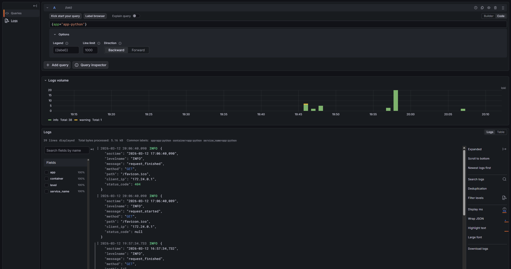

**Line filters:**
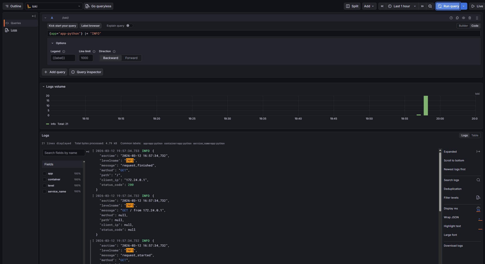

**Parsers:**
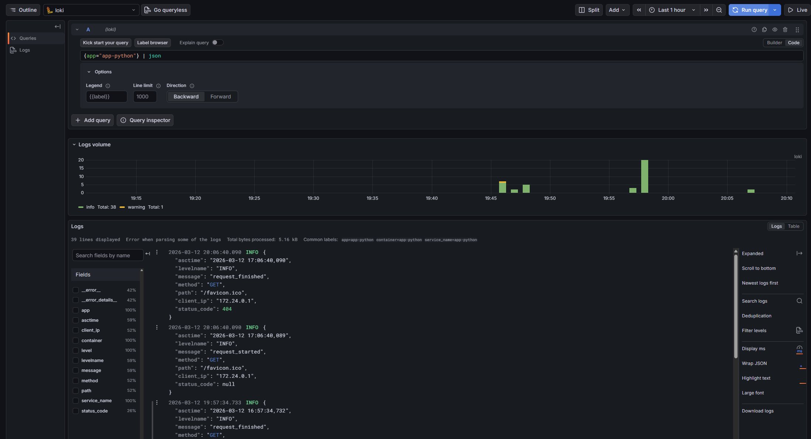

**Aggregations:**
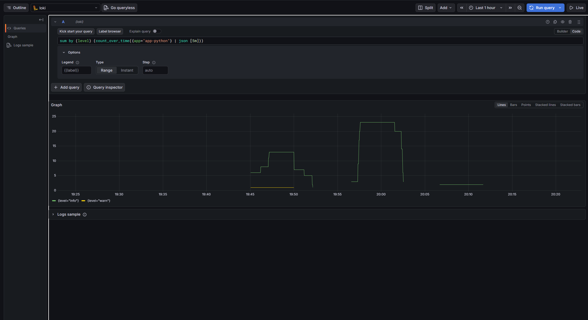

### Task 3.2
