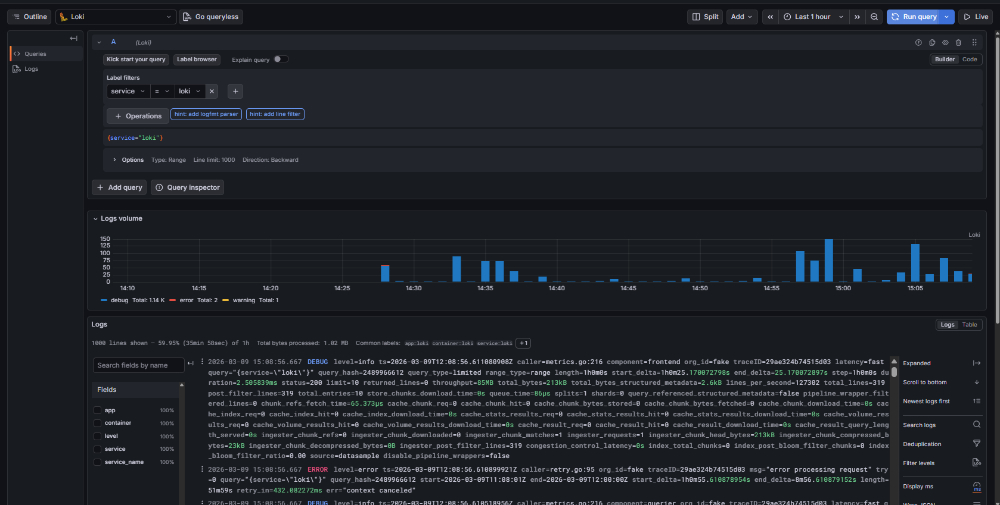
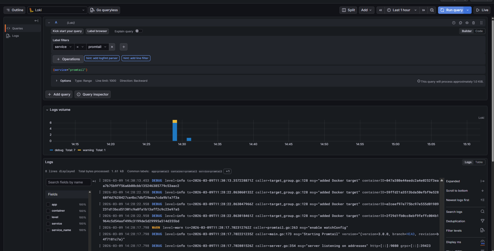
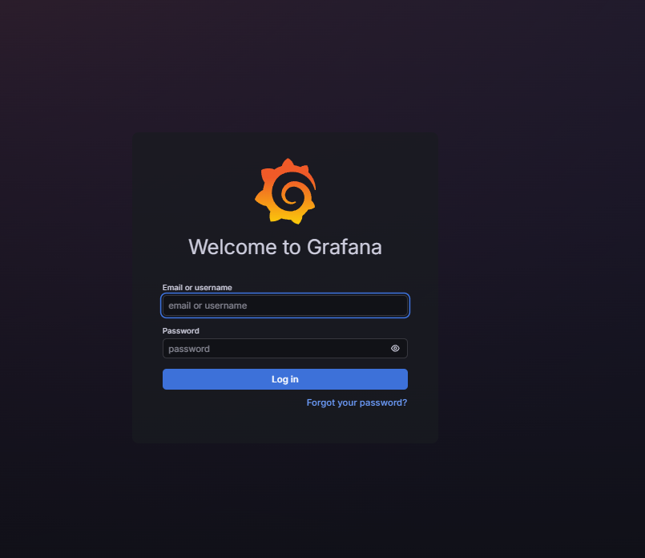
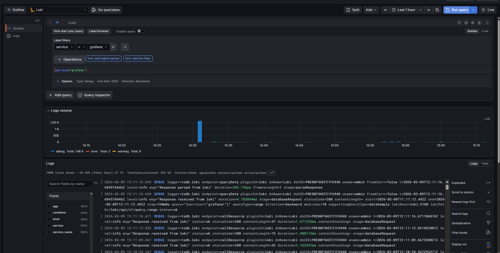

## Architecture 

```
┌──────────────┐     ┌──────────────┐
│  app-python  │     │   Grafana    │◄── :3000 (UI)
│  (FastAPI)   │     │   12.3.1     │
│   :8000      │     └──────┬───────┘
└──────┬───────┘            │
       │ stdout/stderr      │ queries (LogQL)
       ▼                    ▼
┌──────────────┐     ┌──────────────┐
│  Promtail    │────►│    Loki      │◄── :3100 (API)
│  3.0.0       │push │    3.0.0     │
│  (collector) │     │  (TSDB store)│
└──────────────┘     └──────────────┘
       ▲
       │ Docker socket + container logs
       │
┌──────────────┐
│   Docker     │
│   Engine     │
└──────────────┘
```

## Setup Guide

### Prerequisites
- Docker & Docker Compose v2
- Git

### Deployment

```bash
cd monitoring

docker compose up -d

# Verify all services are running
docker compose ps

# Access Grafana
# URL: http://localhost:3000
# Login: <admin_username> / <admin_pass>
```

## Configuration

### Loki (`loki/config.yml`)

Key configuration choices:
- **TSDB storage** (`store: tsdb`) - Loki 3.0 recommended, up to 10x faster queries than boltdb-shipper
- **Schema v13** - latest schema version compatible with Loki 3.0
- **Filesystem storage** - simple single-instance setup, stores chunks in `/loki/chunks`
- **7-day retention** - automatic cleanup via compactor
- **Compactor enabled** - runs every 10 min to clean expired logs

```yaml
schema_config:
  configs:
    - from: "2026-01-01"
      store: tsdb
      object_store: filesystem
      schema: v13
      index:
        prefix: index_
        period: 24h
```

### Promtail (`promtail/config.yml`)

Key configuration choices:
- **Docker service discovery** - auto-discovers containers via Docker socket
- **Label filtering** - only scrapes containers with the label
- **Relabeling** - extracts `container`, `app`, and `service` labels from Docker metadata

```yaml
scrape_configs:
  - job_name: docker
    docker_sd_configs:
      - host: unix:///var/run/docker.sock
        refresh_interval: 5s
        filters:
          - name: label
            values: ["logging=promtail"]
```


## Application Logging

The Python app uses `python-json-logger` to output structured JSON logs:

```python
from pythonjsonlogger.json import JsonFormatter

handler = logging.StreamHandler()
formatter = JsonFormatter(
    fmt="%(asctime)s %(levelname)s %(name)s %(message)s",
    rename_fields={"asctime": "timestamp", "levelname": "level"},
)
handler.setFormatter(formatter)
```

### HTTP Request Logging Middleware

Every request is logged with context:

```python
@app.middleware("http")
async def log_requests(request, call_next):
    response = await call_next(request)
    logging.info("HTTP request", extra={
        "event": "http_request",
        "method": request.method,
        "path": request.url.path,
        "status_code": response.status_code,
        "duration_ms": duration_ms,
        "client_ip": request.client.host,
    })
    return response
```

### Example JSON output

```json
{"timestamp": "2026-03-09 11:32:05,465", "level": "INFO", "name": "root", "message": "HTTP request", "event": "http_request", "method": "GET", "path": "/health", "status_code": 200, "duration_ms": 0.55, "client_ip": "172.20.0.1"}
```


## Dashboard



The Grafana dashboard (`grafana/dashboards/loki-logs.json`) contains 5 panels:

| Panel                  | Type        | LogQL Query                                                         |
|------------------------|-------------|---------------------------------------------------------------------|
| Recent Logs (All Apps) | Logs        | `{app=~"devops-.*"}`                                                |
| Request Rate           | Time Series | `sum by (app) (rate({app=~"devops-.*"} [1m]))`                      |
| Error Logs             | Logs        | `{app=~"devops-.*"} \| json \| level="ERROR"`                       |
| Log Level Distribution | Pie Chart   | `sum by (level) (count_over_time({app=~"devops-.*"} \| json [5m]))` |
| Logs Count by App      | Stat        | `sum by (app) (count_over_time({app=~"devops-.*"} [5m]))`           |

## Production Configuration

### Security measures
- **Anonymous access disabled** - `GF_AUTH_ANONYMOUS_ENABLED=false`
- **Admin credentials** in `.env` file
- **Docker socket** mounted read-only (`:ro`) for Promtail
- **Config files** mounted read-only (`:ro`)

### Resource Limits

| Service    | CPU Limit | Memory Limit |
|------------|-----------|--------------|
| Loki       | 1.0       | 1G           |
| Promtail   | 0.5       | 512M         |
| Grafana    | 1.0       | 512M         |
| app-python | 0.5       | 256M         |

### Health Checks

- **Loki**: `wget --spider http://localhost:3100/ready` (interval: 10s, retries: 5)
- **Grafana**: `wget --spider http://localhost:3000/api/health` (interval: 10s, retries: 5)

### Retention

- Logs retained for **7 days**
- Compactor cleans up expired data every 10 minutes

## LogQL Query Examples

```logql
{app="devops-python"}

2026-03-09 14:32:05.499info{
  "timestamp": "2026-03-09 11:32:05,499",
  "level": "INFO",
  "name": "uvicorn.access",
  "message": "172.20.0.1:42192 - \"GET /health HTTP/1.1\" 200"
}

2026-03-09 14:32:05.499info{
  "timestamp": "2026-03-09 11:32:05,499",
  "level": "INFO",
  "name": "root",
  "message": "HTTP request",
  "event": "http_request",
  "method": "GET",
  "path": "/health",
  "status_code": 200,
  "duration_ms": 0.5,
  "client_ip": "172.20.0.1"
}

2026-03-09 14:32:05.499info{
  "timestamp": "2026-03-09 11:32:05,498",
  "level": "INFO",
  "name": "root",
  "message": "Performing health check"
}
```

```logql
{app="devops-python"} | json | level="ERROR"

No logs found.
```
```logql
{app="devops-python"} | json | method="GET"

2026-03-09 14:32:05.499info{
  "timestamp": "2026-03-09 11:32:05,499",
  "level": "INFO",
  "name": "root",
  "message": "HTTP request",
  "event": "http_request",
  "method": "GET",
  "path": "/health",
  "status_code": 200,
  "duration_ms": 0.5,
  "client_ip": "172.20.0.1"
}

2026-03-09 14:32:05.493info{
  "timestamp": "2026-03-09 11:32:05,492",
  "level": "INFO",
  "name": "root",
  "message": "HTTP request",
  "event": "http_request",
  "method": "GET",
  "path": "/health",
  "status_code": 200,
  "duration_ms": 0.55,
  "client_ip": "172.20.0.1"
}

2026-03-09 14:32:05.486info{
  "timestamp": "2026-03-09 11:32:05,486",
  "level": "INFO",
  "name": "root",
  "message": "HTTP request",
  "event": "http_request",
  "method": "GET",
  "path": "/health",
  "status_code": 200,
  "duration_ms": 0.5,
  "client_ip": "172.20.0.1"
}
```

## Testing

```bash
# 1. Generate test traffic 
for i in $(seq 1 20); do curl -s http://localhost:8000/; done
for i in $(seq 1 20); do curl -s http://localhost:8000/health; done

# 2. Query logs via Loki API
curl -s "http://localhost:3100/loki/api/v1/query?query={app=\"devops-python\"}" | python -m json.tool

# 3. Open Grafana dashboard
```

## 8. Challenges & Solutions

| Challenge                                                                                         | Solution                                         |
|---------------------------------------------------------------------------------------------------|--------------------------------------------------|
| I haven't experience in writing Grafana dashboard. It was difficult to understand how it is works | I read guides and watched some videos about it   |
| I didn't know how to setup docker for production                                                  | I read docker documentaion and found some guides |