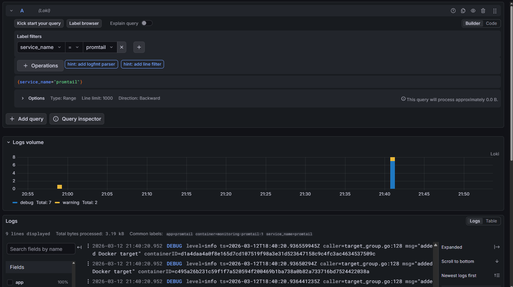
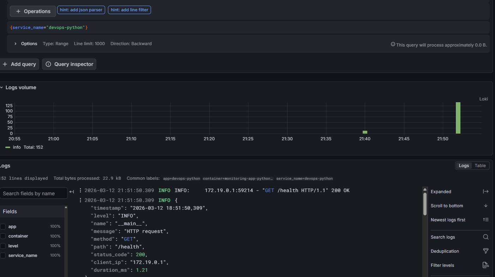
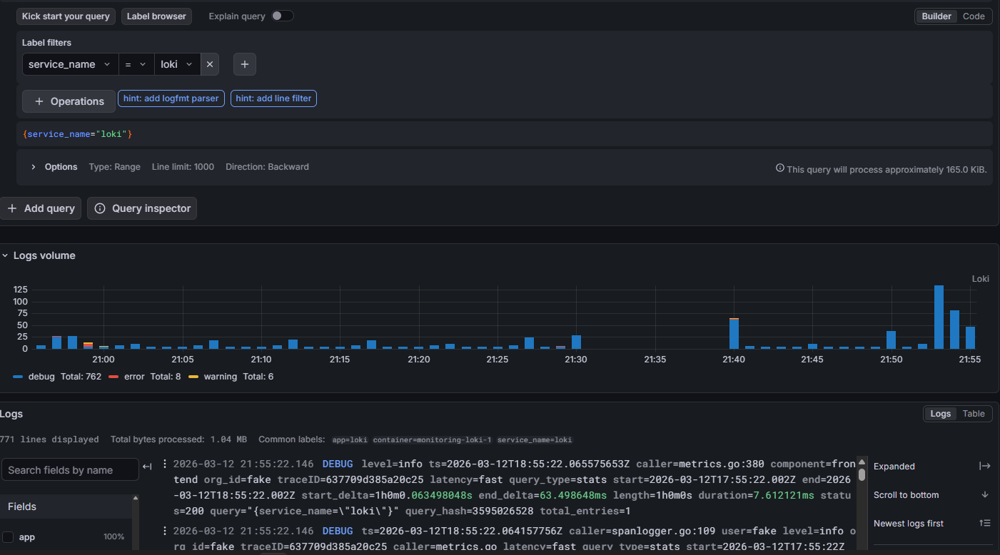
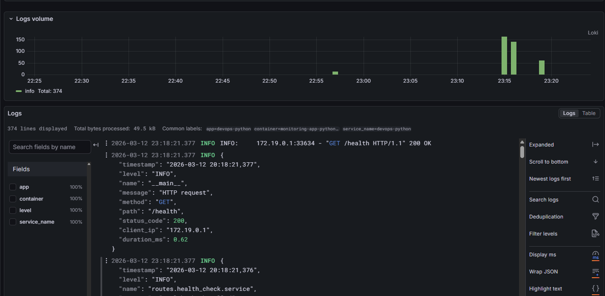
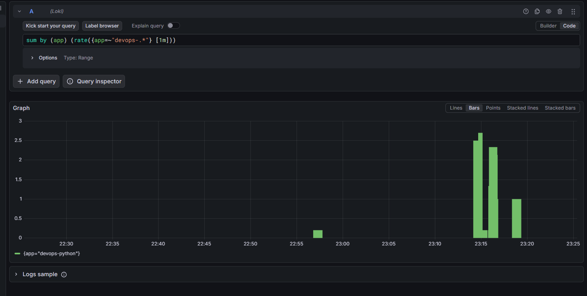
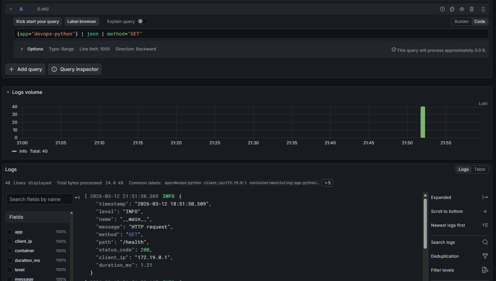
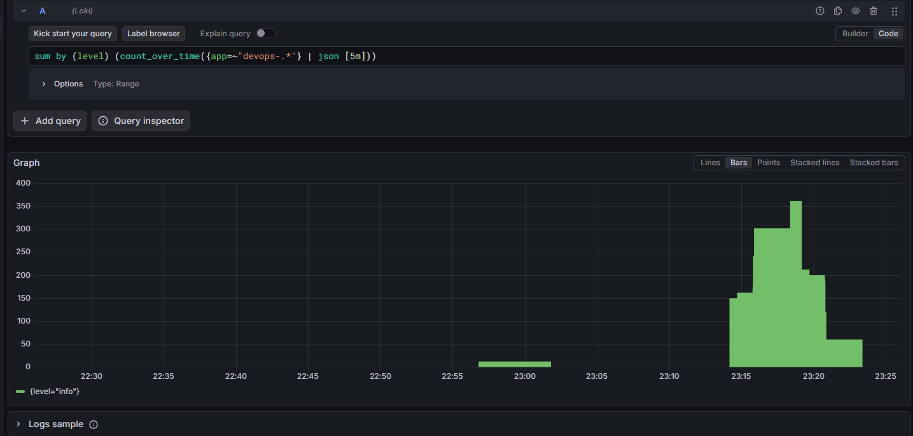
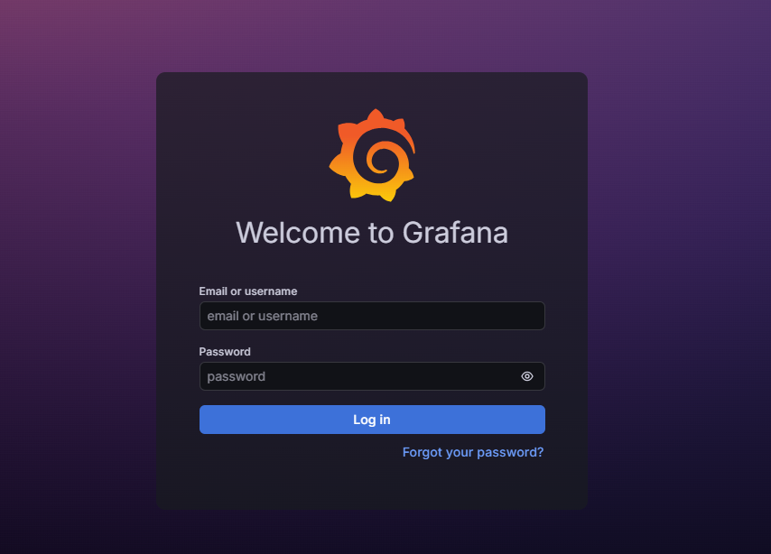

# Lab 7 — Observability & Logging with Loki Stack

## Setup Guide

### Prerequisites
- Docker Engine 24+
- Docker Compose v2

### Deployment

```bash
cd monitoring
docker compose up -d
docker compose ps
```

### Verify services

```bash
# Loki readiness
curl http://localhost:3100/ready

# Grafana health
curl http://localhost:3000/api/health
```

Access Grafana at http://localhost:3000 (login: `admin` / password from `.env` file).

Loki datasource is **auto-provisioned** — no manual setup required.

## Configuration

### Loki (`loki/config.yml`)

Key design choices:
- **TSDB store** (not boltdb-shipper) — up to 10x faster queries in Loki 3.0
- **Schema v13** — latest schema version with structured metadata support
- **Filesystem storage** — suitable for single-instance deployment
- **7-day retention** (`168h`) with compactor for automatic cleanup
- **In-memory ring** — no external KV store needed for single instance

```yaml
schema_config:
  configs:
    - from: "2024-01-01"
      store: tsdb
      object_store: filesystem
      schema: v13
```

### Promtail (`promtail/config.yml`)

- **Docker service discovery** via `/var/run/docker.sock`
- **Label filtering** — only scrapes containers with `logging=promtail` label
- **Relabeling** — extracts container name (strips leading `/`) and `app` label for easy querying

```yaml
scrape_configs:
  - job_name: docker
    docker_sd_configs:
      - host: unix:///var/run/docker.sock
        filters:
          - name: label
            values: ["logging=promtail"]
```

### Grafana

- Datasource provisioned automatically via `grafana/provisioning/datasources/loki.yml`
- Anonymous access disabled — requires admin login
- Admin password stored in `.env` (not committed to git)





## Application Logging

The Python app uses `python-json-logger` for structured JSON output:

```python
from pythonjsonlogger.json import JsonFormatter

LOGGING_CONFIG = {
    "formatters": {
        "json": {
            "()": JsonFormatter,
            "format": "%(asctime)s %(levelname)s %(name)s %(message)s",
        }
    }
}
```

HTTP middleware logs every request with context:

```json
{
  "timestamp": "2026-03-12 00:15:00,123",
  "level": "INFO",
  "name": "app",
  "message": "HTTP request",
  "method": "GET",
  "path": "/",
  "status_code": 200,
  "client_ip": "172.18.0.1",
  "duration_ms": 1.23
}
```

## Dashboard

Four panels built in Grafana:

### 1. Logs Table
Shows recent logs from all apps.
```logql
{app=~"devops-.*"}
```



### 2. Request Rate
Logs per second by application (time series).
```logql
sum by (app) (rate({app=~"devops-.*"} [1m]))
```



### 3. Error Logs
Only ERROR level entries.
```logql
{app=~"devops-.*"} | json | level="ERROR"
```



### 4. Log Level Distribution
Count of logs by level (stat/pie chart).
```logql
sum by (level) (count_over_time({app=~"devops-.*"} | json [5m]))
```



## Production Config

### Security
- Grafana anonymous access disabled (`GF_AUTH_ANONYMOUS_ENABLED=false`)
- Admin password via `.env` file (excluded from git via `.gitignore`)
- Promtail Docker socket access is read-only (`:ro`)



### Resource Limits
All services have CPU and memory limits:

| Service   | CPU Limit | Memory Limit | CPU Reserve | Memory Reserve |
|-----------|-----------|-------------|-------------|----------------|
| Loki      | 1.0       | 1G          | 0.5         | 512M           |
| Promtail  | 0.5       | 512M        | 0.25        | 256M           |
| Grafana   | 1.0       | 1G          | 0.5         | 512M           |
| app-python| 0.5       | 256M        | 0.25        | 128M           |

### Health Checks
- **Loki:** `wget http://localhost:3100/ready` every 10s
- **Grafana:** `wget http://localhost:3000/api/health` every 10s
- Promtail depends on Loki health via `service_healthy` condition

### Retention
- Loki retention: 7 days (168h)
- Compactor runs automatically to delete expired data

## Testing

```bash
# Deploy the stack
cd monitoring
docker compose up -d

# Check all services
docker compose ps

# Verify Loki
curl http://localhost:3100/ready

# Generate traffic
for i in $(seq 1 20); do curl http://localhost:8000/; done
for i in $(seq 1 20); do curl http://localhost:8000/health; done

# Query logs via API
curl -G http://localhost:3100/loki/api/v1/query \
  --data-urlencode 'query={app="devops-python"}'
```

## Ansible Automation (Bonus)

Monitoring stack can be deployed via Ansible:

```bash
ansible-playbook ansible/playbooks/deploy-monitoring.yml
```

Role `monitoring` creates directories, templates configs (Jinja2), deploys with `community.docker.docker_compose_v2`, and waits for service readiness.

All versions, ports, retention, and resource limits are parameterized in `roles/monitoring/defaults/main.yml`.

## Challenges

1. **Loki 3.0 config changes** — TSDB is the recommended store replacing boltdb-shipper. Schema v13 required for structured metadata support
2. **Promtail Docker SD filtering** — using Docker label filters to avoid scraping unrelated containers
3. **JSON logging in FastAPI** — `python-json-logger` v3 uses `pythonjsonlogger.json.JsonFormatter` import path (changed from v2)
4. **Grafana provisioning** — auto-provisioning datasource avoids manual setup steps
